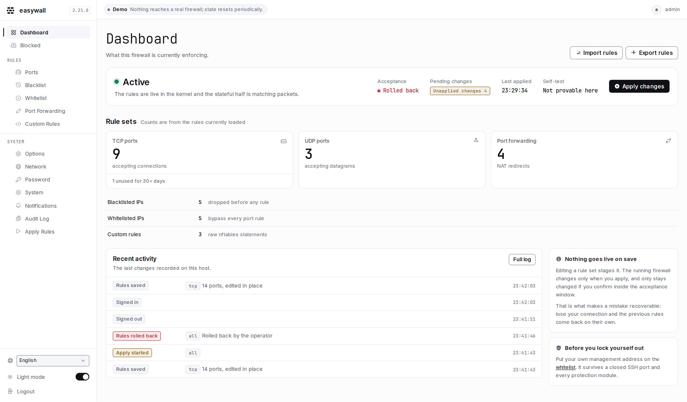

<p align="center">
  
</p>

<h1 align="center">easywall</h1>

<p align="center"><em>Your firewall. Your rules. No surprises.</em></p>

<!-- One badge service, so the set shares a shape, a typeface and a logo
     treatment. The three status badges read from the workflows by name; the
     version, licence and Go badges read from the repository and go.mod, so
     none of them can drift the way a hand-written "Go 1.25+" could. -->
<p align="center">
  <a href="https://github.com/jp1337/easywall/actions/workflows/test.yml"></a>
  <a href="https://github.com/jp1337/easywall/actions/workflows/build.yml"></a>
  <a href="https://github.com/jp1337/easywall/actions/workflows/security.yml"></a>
  <a href="https://codecov.io/gh/jp1337/easywall"></a>
</p>

<p align="center">
  <a href="https://github.com/jp1337/easywall/releases/latest"></a>
  <a href="https://go.dev"></a>
  <a href="https://www.gnu.org/licenses/gpl-3.0"></a>
  <a href="https://discord.gg/3zJMvChvUA"></a>
</p>

<p align="center">
  <a href="https://easywall.wdkro.de"><strong>Live demo</strong></a> ·
  <a href="https://easywall-project.org"><strong>Documentation</strong></a> ·
  <a href="CHANGELOG.md">Changelog</a>
</p>

nftables through a web interface that cannot lock you out: **every apply reverts
itself unless you confirm it.**

<picture>
  <source media="(prefers-color-scheme: dark)" srcset="docs/assets/img/screens/dashboard-dark.png">
  
</picture>

## The idea

Editing a rule changes nothing. Applying it changes everything — for 120 seconds.
If the new rules cut your connection you cannot click Confirm, and *not* confirming
is what brings the old rules back.

<picture>
  <source media="(prefers-color-scheme: dark)" srcset="docs/assets/diagrams/apply-flow-dark.svg">
  
</picture>

## Architecture

Two processes. The one exposed to the network holds no privilege worth stealing.

<picture>
  <source media="(prefers-color-scheme: dark)" srcset="docs/assets/diagrams/architecture-dark.svg">
  
</picture>

A complete rewrite of the original easywall — Python, Flask, `iptables` via
subprocess — which was archived in 2022 after a CVE. Both root causes are gone:
the privileges live in a different process, and the apply path builds Go structs
instead of a command line. [How it works →](https://easywall-project.org/architecture/)

## Install

<picture>
  <source media="(prefers-color-scheme: dark)" srcset="docs/assets/diagrams/install-choice-dark.svg">
  
</picture>

```bash
# Debian / Ubuntu
wget https://github.com/jp1337/easywall/releases/latest/download/easywall_amd64.deb
sudo dpkg -i easywall_amd64.deb && sudo apt-get install -f

# Docker
git clone https://github.com/jp1337/easywall.git && cd easywall && docker compose up -d

# From source — Go 1.25+, nftables
git clone https://github.com/jp1337/easywall.git && cd easywall
make build && sudo make install
sudo systemctl enable --now easywall-core easywall-web
```

Then open `https://localhost:12227`. The first visit runs the setup wizard.

## What you get

| | |
|---|---|
| **Ports** | TCP and UDP, single or range, with per-rule SSH brute-force routing |
| **Blacklist & whitelist** | IPv4, IPv6 and CIDR, evaluated before any port rule |
| **Protection modules** | Twelve, five on by default — floods, scans, bogons, fragments, broadcast/multicast/anycast |
| **Port forwarding** | NAT redirects with protocol selection |
| **Custom rules** | Raw nftables, syntax-checked before it is applied |
| **Export / import** | The whole rule set as JSON |
| **Audit log** | What changed and when, one JSON object per line |
| **Docker coexistence** | Owns `table inet easywall`, touches nothing else |
| **English & German** | Switchable in the interface, including before sign-in |
| **Light & dark** | Follows the OS, with a manual toggle; both contrast-checked |

## Built with

| | |
|---|---|
| Go 1.25, single binary | `go-chi/chi` · `html/template` |
| nftables via `google/nftables` | direct netlink, no `nft` subprocess |
| Argon2id | `golang.org/x/crypto`, 16-byte salt per password |
| CSRF | `net/http.CrossOriginProtection`, Go 1.25 native |
| Design system | [`DESIGN.md`](DESIGN.md) + Tailwind v4 — no third-party UI library |
| Fonts | Inter + JetBrains Mono, self-hosted, ~145 KB — works air-gapped |
| CI | `govulncheck`, `gosec`, CodeQL, `-race`, and an integration suite against a real kernel |

## Roadmap

Correctness first: a firewall that quietly does less than it says is worse than
one that does less and says so.

**2.6 — proof, not counts.** The integration tests assert rule counts. A rule
that dropped where it should accept, or matched the destination where it should
match the source, would pass them. Moving to assertions on meaning is under way;
next is sending real packets through a veth pair in the test namespace.

**2.7 — identity.** The socket protocol carries no user, so every audit entry is
attributed to `web` and logins are not recorded at all. A `user` field comes
first, then login events, then multiple accounts, and only then 2FA/TOTP — a
second factor on a single account in `web.toml` is not worth much.

**2.8 — reach.** A REST API with token authentication for Ansible and scripting,
built on the accounts from 2.7. Let's Encrypt/ACME as a strictly optional
alternative to a reverse proxy; running without any outbound connection stays
the default.

**2.9 — knowing how many machines this runs on.** A critical bug matters
differently at ten installations and at ten thousand, and right now nobody knows
which this is. An **opt-in** count, off unless switched on, sending a random
identifier generated on the machine plus the version — enough to count distinct
installations and to say "the fix reached 80% of them", and not enough to
describe anyone. What it sends will be printed verbatim in the documentation,
and the switch will sit next to the update check rather than buried.

Opt-in and not opt-out, because this page and `security.md` promise that the
update check is the *only* outbound request, and because an administrative
interface quietly reporting to its author is the thing easywall removed Google
Fonts to avoid. A security tool that has to explain a surprising connection has
already lost the argument.

Worth checking first: the update check already reaches `api.github.com` daily
from every installation that has not disabled it, and release assets record
their own download counts. That is a usable lower bound today, for nothing.

Done in 2.5: every rate limit is counted per source address (four modules held
one counter for the whole machine, so an attacker could spend the budget and
lock everyone else out), every switch on the options page reaches the firewall
(17 of 31 did not), port forwarding goes the direction it says, rules that
cannot become rules are refused instead of silently skipped, and the dashboard's
"rules are live" is asked of the kernel rather than assumed.

## Getting help

| | |
|---|---|
| A question, or something not behaving | [Discord](https://discord.gg/3zJMvChvUA) |
| A bug, or a feature you want | [GitHub issues](https://github.com/jp1337/easywall/issues) |
| A security vulnerability | [Security advisory](https://github.com/jp1337/easywall/security/advisories/new) — **not** Discord, and not a public issue |

## Contributing

Setup, commit conventions and the review checklist: [CONTRIBUTING.md](CONTRIBUTING.md).
Anything visual goes through [`DESIGN.md`](DESIGN.md) first.

Security issues: **not** as a public issue — use
[GitHub Security Advisories](https://github.com/jp1337/easywall/security/advisories/new).

## License

GPL-3.0 — see [LICENSE](LICENSE).
