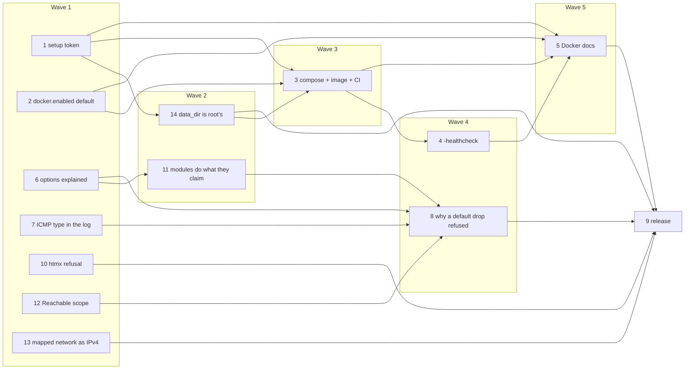

# 2.22 — It is yours, and it says why · Implementation Plan

> **For agentic workers:** REQUIRED SUB-SKILL: Use superpowers:subagent-driven-development (recommended) or superpowers:executing-plans to implement this plan task-by-task. Steps use checkbox (`- [ ]`) syntax for tracking.

**Goal:** Only whoever installed easywall can claim it; `docker compose up -d` works as documented; every switch on /options says what it breaks and does what it says; every default drop on /blocked says why.

**Architecture:** Fourteen tasks in six waves. The web process gains a setup token, a `-healthcheck` flag and an htmx-aware refusal; the core gains an ICMP field in the packet log, a prerouting chain for fragment drop and a reordered ICMP/RST limiter; `internal/shared` gains `DropReason` and two validation fixes; compose and the image change their mounts and ownership. No new dependency, one additive protocol field.

**Tech Stack:** Go 1.x (the `go` directive is left alone — docs-tech/dependencies.md), google/nftables, go-nflog, html/template + htmx 2.0.11, Tailwind CLI, Playwright (check:ui), Docker/compose, Debian packaging.

**Specs** (binding authority; the plan argues from them):
- `docs-tech/specs/2026-09-23-2.22-whoever-installs-it-owns-it.md` (+ `…-2.22-research.md`)
- `docs-tech/specs/2026-09-23-2.23-every-switch-says-what-it-breaks.md` (+ `…-2.23-research.md`) — ships in this release; the file keeps its number

Tasks 10–14 are defects found while this plan was written, each verified at v2.21.1 and none caused by it; they are fixed here rather than carried (`CLAUDE.md`, *A release fixes what it caused* — and the repository's rule to fix what a pass finds). The plan authors' evidence is in [the appendix](2026-09-23-2.22-it-is-yours-and-it-says-why-author-notes.md).

## Global Constraints

- `en` and `de` at exact parity; German quotation marks „…“ (U+201E/U+201C), never ASCII `"`; Sperrliste / Erlaubnisliste. New keys into `en` and `de` only — `fr` falls back, and the PR states how many keys it gained.
- **Locale keys are inserted after the key group each task names** (`firstrun_*` T1, `opt_*` T6, `blocked_rule_*` and `blocked_detail_mark` T8), so parallel tasks do not touch the same lines. Never reserialise a locale file: targeted edits only, `wc -l` and key order unchanged except for the added keys.
- Every CSS class used exists in the **built** `web/static/style.css` (`npm run build:css`, then grep it). A conflict in `style.css` during a merge is resolved by rebuilding, never by hand.
- A test counts only once it has been seen red by breaking the code it covers; every task names its mutations.
- `check:ui` binds fixed internal ports 12229–12233 besides the demo's own, so **two runs must never overlap**: every task runs it as `flock /tmp/claude-1000/-var-home-jpy-projects-easywall/7958a844-c4e7-4729-9a75-c5d07d0b89c0/scratchpad/checkui.lock npm run check:ui`. Each task starts its own demo on its own port (below) with `EASYWALL_DEMO_DIR=$HOME/.local/share/easywall-demo-t<N>`; ports 12227 and 12228 belong to the user's demo and are never touched; the demo is stopped and its port confirmed free before the task reports.
- Integration tests run rootless: `go test -c -tags integration -o <scratch>/core.test ./internal/core/ && (cd internal/core && unshare -rn <scratch>/core.test -test.run '<Name>' -test.count=1)`.
- `~/go/bin/golangci-lint`, never the one on PATH.
- No change to `go.mod`. `internal/shared/protocol.go` gains only Task 7's additive field.
- Commits: conventional subject, then the two trailer lines `Co-Authored-By: Claude Opus 5.5 (1M context) <noreply@anthropic.com>` and `Claude-Session: https://claude.ai/code/session_014AiWEEf1yXG1ahTRL1q6hx`.
- The controller renders every changed page in Chrome — both themes, 1600/900/390 px, `en` and `de` — before the release; implementers state what they rendered with Playwright and do not claim the Chrome check.

## Waves



| Task | Demo port | Touches (for merge planning — each task's own Files list) |
|---|---|---|
| 1 | 12271 | `internal/web/handler_firstrun.go` (import, `firstRunHash`, the check at the top of `handleFirstRunPOST`, `setupTokenMatches`); `internal/web/server.go` (`Server.setupToken`; generation and the log line in `NewServer`); `web/templates/firstrun.html` (the token field, first in step 1); `web/src/app.css` (`.field-help code` joins `.switch-detail code`), rebuild `web/static/style.css`; `locales/en.json`, `locales/de.json` (three keys after `firstrun_notice`); `scripts/ui-check.mjs` (token from the log in `setUpAccount`; from stdout in `takeWizardScreenshots`; `--screenshots firstrun`); `debian/postinst` (one hint line), `.github/workflows/build.yml` job `build-deb` (journal assertion); `docs/_docs/installation/first-run.md`, `demo.md` (X4), `debian.md`, `docker.md` (one table row), `docs/_docs/security.md` (one row), `docs-tech/threat-model.md`; `docs/assets/img/screens/firstrun{,-2fa,-codes}-{light,dark}.png` (re-taken); `internal/web/setuptoken_test.go` (new); `internal/web/testhelpers_test.go`, `handler_firstrun_test.go`, `handler_firstrun_2fa_test.go` |
| 2 | — | `config/easywall.toml` (`[docker]` section, lines 46–49); `internal/shared/config_docker_test.go` (new guard test); `docs/_docs/features/docker.md` (the "Four ways to run them together" table, lines 55 and 58 only — **not** 29–31, Task 5's X5); `docs/_docs/configuration.md` (the `[docker]` key table and a new callout, lines 153–159) |
| 3 | — | `docker-compose.yml:53-54` (the `/etc/easywall` mount); `.gitignore` (after `ssl/`); `.dockerignore` (new); `Dockerfile:49-51` (pinned ids, and the comment at :83-85); `docker/entrypoint.sh` (header, the `test -w` loop); `docker-compose.ci.yml` (new); `.github/workflows/build.yml` job `build-docker` (the HEALTHCHECK step's comment, a new step, the clean-up step); `docs/_docs/installation/docker.md` (lines 41, 44-50, 192, 196; the migration), `docs/_docs/environment.md:148`, `docs-tech/ci-and-release.md:76-86` |
| 4 | — | `internal/web/healthcheck.go`, `internal/web/healthcheck_test.go` (new); `internal/web/handler_health.go` (`healthAllowed`, new `localIP`); `cmd/easywall-web/main.go` (the flag); `Dockerfile` (HEALTHCHECK and its comment), `docker-compose.yml` (`healthcheck.test`); `internal/shared/healthcheck_definition_test.go`; `docker-compose.ci.yml` (one `environment:` line), `.github/workflows/build.yml` (the marker → assertion C); `config/web.toml:55-58`, `docs/_docs/features/health.md` (:100-101, :117-122), `docs-tech/threat-model.md` (§ `/healthz`), `docs-tech/invariants.md:334`, `CLAUDE.md:15` |
| 5 | — | `docs/_docs/installation/docker.md` — E, F, I, J (docker-side), L (docker-side); `docs/_docs/installation/first-run.md` — G, H; `docs/_docs/installation/reverse-proxy.md` — J (proxy-side); `docs/_docs/installation/requirements.md` — L (requirements-side); `docs/_docs/features/docker.md` — X5 only (lines 29–31; Task 2 owns lines 55 and 58 in the same file) |
| 6 | 12272 | `internal/web/options_help.go`, `internal/web/options_help_test.go` (new); `internal/web/server.go:1566` (one `templateFuncs` entry); `web/templates/options.html` (whole file below); `web/templates/blocked.html:171` (the `#logging` link), `internal/web/handler_blocked_test.go:210`; `locales/en.json`, `locales/de.json` (the `opt_*` block, `options_readonly`), `locales/fr.json` (renames and removals only); `web/src/app.css` (two blocks) → rebuild `web/static/style.css`; `docs/_docs/features/filters.md` (F3–F5, P3-1…P3-4, figure alt); `DESIGN.md` (§ Protection modules, § Measure); `docs-tech/invariants.md` (four new guard rows); `scripts/ui-check.mjs` (one new function, one call) |
| 7 | — | `internal/shared/packetlog.go` (the `PacketLogEntry` struct, `:21-51`); `internal/core/packetlog.go` (`decodeTransport`, `:186-189`); `internal/web/democlient.go` (the `icmp_flood` shape in `demoShapes`, `:27`); `docs-tech/protocol.md` (a new section after *The rules payload*); `docs-tech/invariants.md` (one row in *What was refused*); `internal/core/packetlog_test.go`, `internal/web/democlient_packetlog_test.go` |
| 8 | 12273 | `internal/shared/packetlog.go` (after `Remedies`); `internal/web/handler_blocked.go` (`blockedRows`, `handleBlocked`, `handleBlockedRows`, a new map at the end); `internal/web/server.go` (`templateFuncs`, one entry after `serviceName`); `internal/web/democlient.go` (two shapes appended to `demoShapes`); `web/templates/blocked.html` (the Rule `<td>` and one line in the Details `<dl>`); `web/src/app.css` (after `.pkt-actions` rules), rebuild `web/static/style.css`; `locales/en.json`, `locales/de.json`; `scripts/ui-check.mjs` (one new check); `docs/_docs/features/filters.md` (*Always on*), `docs/_docs/features/blocked-traffic.md`, `DESIGN.md` (*Links and badges*), `docs-tech/invariants.md`; `internal/shared/packetlog_dropreason_test.go`, `internal/core/nftables_icmp_accept_test.go`, `internal/web/handler_blocked_why_test.go` (new), `internal/web/handler_blocked_test.go` (one expectation) |
| 10 | 12274 | `internal/web/middleware.go` (both middlewares; one helper); `internal/web/middleware_test.go`; `scripts/ui-check.mjs` (one check) |
| 11 | 12291 | `internal/core/nftables.go` (constants `:39-63`, `Apply :705-775`, `addFragmentDrop :1231-1254`, `addICMPFloodProtection` comment `:1481-1484`, `addTCPRSTFlood` comment `:1628-1631`, `addBlacklistRule`/`addCIDRDrop :2443-2549`); `internal/shared/reach.go` (comment only, before `:153`); `internal/core/protection_modules_integration_test.go` (new); `internal/core/nftables_integration_test.go` (`TestIntegration_Apply_Fragments_AddsRule`, `:449-459`); `internal/core/nftables_log_test.go` (one test appended); `docs/_diagrams/rule-order.mmd` → rebuild `docs/assets/diagrams/rule-order-{light,dark}.svg`; `docs/_docs/features/blacklist.md:22`, `custom-rules.md:63`, `docs/_docs/index.md:35` (alt text); `docs/schemas/easywall.schema.json:265`; `docs-tech/invariants.md` (three rows after `:148`); then Task 6's copy (its last step) |
| 12 | — | `internal/shared/reach.go:217-227`; `internal/shared/reach_test.go` |
| 13 | — | `internal/shared/validate.go` (import block `:3-8`; new func after `ValidateIPOrCIDR`, ends at `:249`); `internal/shared/reach.go:272`, `:285` (one line each); `internal/core/docker.go:145` (one line); `internal/core/nftables.go` (new `parseIPNet` before `ipv4SourceMatch` `:1323`; one line each at `:1340`, `:1996`, `:2384`, `:2493`; the comment at `:2689-2692`); `internal/shared/packetlog.go:208` (`addrOrPrefix`, one line — a different function from Task 8's `DropReason` in the same file, no textual overlap); `internal/core/nftables_mapped_test.go`, `internal/core/nftables_mapped_integration_test.go` (new); `internal/shared/validate_test.go` (import block, two tests appended); `docs-tech/invariants.md` (one row after `:191`) |
| 14 | — | `internal/core/firewall.go` (`readLastApply :198-210`, `setLastApply :230-246`, imports `:3-13`); `internal/core/datadir.go`, `internal/core/datadir_test.go` (new); `internal/core/daemon.go:61-63` (one call); `internal/web/config.go:368-406` (`StateDir`, four paths, two comments); `internal/web/statedir.go`, `internal/web/statedir_test.go` (new); `internal/web/server.go` (one call), `internal/web/testhelpers_test.go` (`newTestServer`, one call), `internal/web/totpreplay.go:81-86`, `internal/web/passkeystore.go:275-278`, `internal/shared/models.go:513` (comments); `internal/shared/systemd_units_test.go` (one test, one import), `systemd/easywall-web.service:34`, `systemd/easywall-core.service:64-65`, `systemd/easywall-selftest.service:10-16`; `debian/postinst:29-39`, `debian/control:20`, `Dockerfile:66-78`, `docker/entrypoint.sh`; `.github/workflows/build.yml` (build-deb layout check + new step, build-docker new step); `config/web.toml:79, :114-117`, `docs/schemas/web.schema.json:41, :69`; `docs/_docs/installation/{manual,debian}.md`, `docs/_docs/features/two-factor.md:136`, `docs/_docs/configuration.md:69, 278, 283, 454`, `docs/_docs/environment.md:56`; `docs-tech/threat-model.md`, `docs-tech/packaging.md`, `docs-tech/invariants.md`, `docs-tech/ci-and-release.md:56-61` |
| 9 | 12275 | `docs/_docs/roadmap.md`, `CHANGELOG.md` (+ `npm run build:changelog`), `debian/changelog`, `internal/shared/version.go`, `docs/_config.yml`, `docs/assets/img/screens/{firstrun,options,blocked}-{light,dark}.png` and any other shot a task's interface change reached, `CLAUDE.md` (the entry-point row, if Task 4 did not already change it) |

## Cross-task seams — read before dispatching the task on either side

| Seam | Rule |
|---|---|
| T6 → T8 | Option cards carry `id="opt-<toml_key>"`; `/options#logging` became `#opt-log_blocked_connections` (T6 changes `blocked.html:171`). T8's chip map is validated against T6's `optionHelps` in a test |
| T6 → T11 | T11's last step changes 15 `en`/`de` values, 3 anchors in `options_help.go` and one `filters.md` section written by T6, with the scripts given in T11. It runs on a branch that already has T6 |
| T11 → T8 | T11 moves the ICMP and RST limiters before the established accept. T8's `DropReason` walks the accept lists; its comment on chain order must describe the order **after** T11, and its core test compares against `addICMPRules` as T11 leaves it |
| T12 → T8 | `DropReason`'s port step applies `rule.FiltersHost()` exactly as `Reachable` does after T12 — a forwarded-only rule never explains a host drop |
| T1 → T14 → T3 | T14 owns the data-directory layout on both paths: T1 adds one `postinst` line, T14 rewrites `postinst`'s directory block and the entrypoint's data block, and T3 is dispatched **after** T14 with the amendments applied to its text (it no longer sets `0770`, its `test -w` loop checks `$DATA/web`, assertion D proves the web user cannot plant a link) |
| T1 → T3, T9 | CI greps the log for the phrase `setup token`; `--screenshots firstrun` shoots the wizard with the token field |
| T1, T6, T8, T10 → `ui-check.mjs` | Four tasks add functions and one call each to `runChecks`; a merge conflict there is resolved by keeping every call |
| T3 → T4 | T3's CI step leaves a marked place for T4's moved-bind health assertion |
| T1–T4 → T5 | T5's text is written against their end state and names the lines it assumes; its reviewer checks them against the merged branch |

## Review Focus

1. **A token pasted the way people paste** — lowercase, with the spaces of the grouped display, with a trailing newline — is accepted; a token from a *previous* start is refused with the message that says a restart prints a new one. (Task 1's tests; the reviewer checks both.)
2. **An existing compose install upgrading** — its files are still in `./config`; after `up -d` the first run appears again, is gated by the token, and the changelog's migration command restores the account. (Task 3's CI step covers the fresh case only; the reviewer walks the upgrade by hand in the scratch compose run.)
3. **Rate-limiting established traffic** — after Task 11 a busy client's second ping and a live connection's reset count against the per-source limit. A normal SSH session, `mtr` at its default interval and an HTTP client that resets idle keep-alives must not trip the defaults. (Task 11's reviewer measures one of them in the netns.)
4. **/blocked with no recorded applied config, or a core that times out on the extra reads** — no reason is shown, the table and its tail still render, nothing logs per poll. (Task 8's tests.)
5. **A session that expires on every htmx endpoint, not only the tail** — `/log/filter`, the list validators, `/custom/validate`, `/system`: each navigates to /login. (Task 10's middleware test covers all of them by construction; the reviewer confirms none of those handlers answers an htmx request with its own redirect.)

---

### Task 1: The first run asks for a setup token (spec B, X1, X4)

**Files:**
- Modify: `internal/web/handler_firstrun.go` (import, `firstRunHash`, the check at the top of `handleFirstRunPOST`, `setupTokenMatches`)
- Modify: `internal/web/server.go` (`Server.setupToken`; generation and the log line in `NewServer`)
- Modify: `web/templates/firstrun.html` (the token field, first in step 1)
- Modify: `web/src/app.css` (`.field-help code` joins `.switch-detail code`), rebuild `web/static/style.css`
- Modify: `locales/en.json`, `locales/de.json` (three keys after `firstrun_notice`)
- Modify: `scripts/ui-check.mjs` (token from the log in `setUpAccount`; from stdout in `takeWizardScreenshots`; `--screenshots firstrun`)
- Modify: `debian/postinst` (one hint line), `.github/workflows/build.yml` job `build-deb` (journal assertion)
- Modify: `docs/_docs/installation/first-run.md`, `demo.md` (X4), `debian.md`, `docker.md` (one table row), `docs/_docs/security.md` (one row), `docs-tech/threat-model.md`
- Modify: `docs/assets/img/screens/firstrun{,-2fa,-codes}-{light,dark}.png` (re-taken)
- Test: `internal/web/setuptoken_test.go` (new); `internal/web/testhelpers_test.go`, `handler_firstrun_test.go`, `handler_firstrun_2fa_test.go` (every step-1 form carries the token)

**Interfaces:**
- Produces: `Server.setupToken string` (formatted with `formatTOTPSecret`, from `newTOTPSecret()`, only while `cfg.IsFirstRun()`); log message `first run: enter this setup token at /firstrun to create the account` with attribute `token`; form field `setup_token`; `func (s *Server) setupTokenMatches(given string) bool`; `var firstRunHash = HashPassword`; locale keys `firstrun_token_label`, `firstrun_token_help`, `firstrun_token_wrong`; test constants `testSetupToken`, `withSetupToken`.
- Consumed by Task 3 (CI greps `setup token`, POSTs `setup_token`) and Task 5 (docs link `first-run/#the-setup-token`).

Decisions the spec left open, taken here:

| | Decision | Why |
|---|---|---|
| Where generated | `NewServer`, right after the `Server` literal | once per process; `NewServer` is the only constructor `main` calls (`cmd/easywall-web/main.go:57`). The test fixtures build `Server` by hand and set the field directly |
| Where logged | the same place, `slog.Warn` | the line and the value cannot drift apart; the JSON handler is already installed (`main.go:41-44`) |
| Answers on a refusal | kept (`firstRunError(…, answers)`); the token is not in `firstRunData` | the rest of the wizard already works that way (`handler_firstrun.go:20-23`) |
| Query string | refused: `PostFormValue`, not `FormValue` | a token in a URL lands in proxy logs and history |
| Rate limit on `POST /firstrun` | none | the check runs before the hash, so X1's cost is gone; 160 bits needs no limiter |
| No token held but `IsFirstRun()` | refuses everything | fail closed; cannot happen through `NewServer` |

- [ ] **Step 1: Fixtures carry the token**

In `internal/web/testhelpers_test.go`, directly above `// newFirstRunTestServer creates a Server in first-run mode`:

```go
// testSetupToken is the setup token every first-run fixture holds, and
// withSetupToken the form field that proves it. 32 base32 characters, the
// 20 bytes newTOTPSecret draws. Every step-1 POST in this package carries it
// unless the test is about the token: without it the request is refused
// before any other field is read, and a test of the username check would go
// green on the token check instead.
const (
	testSetupToken = "ABCDEFGHIJKLMNOPQRSTUVWXYZ234567"
	withSetupToken = "&setup_token=" + testSetupToken
)
```

and in `newFirstRunTestServer`'s `&Server{…}` literal, after `certs: certs,`:

```go
		setupToken:          formatTOTPSecret(testSetupToken),
```

Append `+withSetupToken` to the form string of **every** step-1 `POST /firstrun`:

| File | Where |
|---|---|
| `handler_firstrun_test.go` | `completeWizard` (`form+withSetupToken`, line 24); `EmptyUsername` :73; `PasswordTooShort` :81; `PasswordMismatch` :89; `ValidSubmission` :101; `Password11Chars` :163-164; `Step1DoesNotTouchDisk` :181; `RejectsAnImpossibleSSHPort…` :255-256; `RejectedSubmissionKeepsTheAnswers` :338-340 |
| `handler_firstrun_2fa_test.go` | `beginFirstRun` :20-22; `TestTheWizardHasNoWayPastTheSecondFactor` :444-446 |

This is not cosmetic: without it the five rejection tests (`EmptyUsername`, `PasswordTooShort`, `PasswordMismatch`, `Password11Chars`, `RejectsAnImpossibleSSHPort`) would still redirect to `/firstrun` — refused by the token, passing for the wrong reason.

- [ ] **Step 2: The failing tests**

Create `internal/web/setuptoken_test.go`:

```go
package web

import (
	"bytes"
	"fmt"
	"go/ast"
	"go/parser"
	"go/token"
	"log/slog"
	"net/http"
	"net/http/httptest"
	"net/url"
	"os"
	"strings"
	"testing"
)

// validStepOne is a step-1 form every other check would accept, so a refusal
// can only come from the setup token.
const validStepOne = "username=admin&password=averysecurepass1!&password_confirm=averysecurepass1!&ssh_port=22"

// countHashes replaces firstRunHash for one test and returns the call count.
func countHashes(t *testing.T) *int {
	t.Helper()
	n := 0
	orig := firstRunHash
	firstRunHash = func(p string) (string, error) { n++; return orig(p) }
	t.Cleanup(func() { firstRunHash = orig })
	return &n
}

func pendingCount() int {
	firstRunPending.mu.Lock()
	defer firstRunPending.mu.Unlock()
	return len(firstRunPending.at)
}

// sessionValues decodes the session a response set, the way the next request
// would present it.
func sessionValues(t *testing.T, s *Server, rec *httptest.ResponseRecorder) map[any]any {
	t.Helper()
	req, _ := http.NewRequest("GET", "/firstrun", nil)
	for _, c := range lastCookiePerName(rec.Result().Cookies()) {
		req.AddCookie(c)
	}
	sess, err := s.store.Get(req, SessionName)
	if err != nil {
		t.Fatal(err)
	}
	return sess.Values
}

// Whoever finished /firstrun first owned the firewall (2.22 spec, B), and an
// anonymous POST cost a 64 MiB Argon2id run before anything was proven (X1).
// No token, or the wrong one, must stop the request before either.
func TestFirstRunRefusesAMissingOrWrongSetupToken(t *testing.T) {
	for name, field := range map[string]string{
		"no field":          "",
		"empty":             "&setup_token=",
		"wrong token":       "&setup_token=BBBBBBBBBBBBBBBBBBBBBBBBBBBBBBBB",
		"a prefix of it":    "&setup_token=ABCDEFGH",
		"not base32":        "&setup_token=hunter2",
		"in the query only": "",
	} {
		t.Run(name, func(t *testing.T) {
			var buf bytes.Buffer
			prev := slog.Default()
			slog.SetDefault(slog.New(slog.NewJSONHandler(&buf, nil)))
			t.Cleanup(func() { slog.SetDefault(prev) })

			s := newFirstRunTestServer(t, newFakeCore(t))
			hashes := countHashes(t)
			before := pendingCount()

			path := "/firstrun"
			if name == "in the query only" {
				path += "?setup_token=" + testSetupToken
			}
			rec := doFormRequest(s, "POST", path, validStepOne+field)

			assertRedirect(t, rec, "/firstrun")
			// The refusal line must not match the same grep as the token
			// announcement — otherwise a flood of bad guesses buries the line
			// an operator needs under lines that fail the same "setup token" test.
			if strings.Contains(buf.String(), "setup token") {
				t.Errorf("the refusal log line matches grep 'setup token': %s", buf.String())
			}
			back := doRequest(s, "GET", "/firstrun", nil, lastCookiePerName(rec.Result().Cookies())...)
			if !strings.Contains(back.Body.String(), "That setup token does not match") {
				t.Error("the refused page does not show the message that a restart prints a new one")
			}
			if *hashes != 0 {
				t.Errorf("HashPassword ran %d time(s) for a request without the token", *hashes)
			}
			if got := pendingCount(); got != before {
				t.Errorf("a pending first run was stored: %d entries, was %d", got, before)
			}
			if id, _ := sessionValues(t, s, rec)[firstRunPendingKey].(string); id != "" {
				t.Errorf("the session carries a pending id %q", id)
			}
			if !s.cfg.IsFirstRun() {
				t.Error("an account was created")
			}
		})
	}
}

// Right token → step 2, however it was pasted: the log prints it in groups of
// four, and a copy may lose the spaces or change case.
func TestFirstRunAcceptsTheSetupTokenHoweverItIsPasted(t *testing.T) {
	for name, pasted := range map[string]string{
		"as printed":       formatTOTPSecret(testSetupToken),
		"without spaces":   testSetupToken,
		"lower, with -":    strings.ToLower(strings.ReplaceAll(formatTOTPSecret(testSetupToken), " ", "-")),
		"padded with = ":   testSetupToken + "====",
		"trailing newline": testSetupToken + "\n",
		"with its quotes":  "\"" + formatTOTPSecret(testSetupToken) + "\"",
	} {
		t.Run(name, func(t *testing.T) {
			s := newFirstRunTestServer(t, newFakeCore(t))
			hashes := countHashes(t)

			rec := doFormRequest(s, "POST", "/firstrun",
				validStepOne+"&setup_token="+url.QueryEscape(pasted))

			assertStatus(t, rec, http.StatusOK)
			if !strings.Contains(rec.Body.String(), `class="totp-secret"`) {
				t.Error("the right token did not reach the TOTP step")
			}
			if *hashes != 1 {
				t.Errorf("HashPassword ran %d times, want 1", *hashes)
			}
		})
	}
}

// The token is generated only while no account exists, and printed once with
// the phrase the documentation and CI grep for.
func TestTheSetupTokenExistsOnlyBeforeTheAccount(t *testing.T) {
	for _, withAccount := range []bool{false, true} {
		t.Run(fmt.Sprintf("account=%v", withAccount), func(t *testing.T) {
			var buf bytes.Buffer
			prev := slog.Default()
			slog.SetDefault(slog.New(slog.NewJSONHandler(&buf, nil)))
			t.Cleanup(func() { slog.SetDefault(prev) })

			dir := t.TempDir()
			path := dir + "/web.toml"
			if err := os.WriteFile(path, []byte(`
bind_addr = "127.0.0.1:19877"
socket_path = "`+dir+`/core.sock"
ssl_dir = "`+dir+`/ssl"
data_dir = "`+dir+`"
session_key = "test-session-key-32bytes-padding!"
update_check = false
`), 0600); err != nil {
				t.Fatal(err)
			}
			cfg, err := LoadConfig(path)
			if err != nil {
				t.Fatal(err)
			}
			if withAccount {
				cfg.Password = "$argon2id$v=19$m=65536,t=3,p=4$c2FsdHNhbHRzYWx0c2FsdA$aGFzaGhhc2hoYXNoaGFzaGhhc2hoYXNoaGFzaGhhc2g"
			}
			s, err := NewServer(cfg)
			if err != nil {
				t.Fatalf("NewServer: %v", err)
			}

			logged := strings.Contains(buf.String(), "setup token")
			if withAccount {
				if s.setupToken != "" || logged {
					t.Errorf("an installation with an account generated a setup token (%q, logged=%v)", s.setupToken, logged)
				}
				return
			}
			raw, err := decodeTOTPSecret(s.setupToken)
			if err != nil || len(raw) != totpSecretBytes {
				t.Fatalf("setup token %q: %d bytes, err %v; want %d random bytes", s.setupToken, len(raw), err, totpSecretBytes)
			}
			if !logged || !strings.Contains(buf.String(), s.setupToken) {
				t.Errorf("the token was not printed with the phrase \"setup token\":\n%s", buf.String())
			}
		})
	}
}

// The session cookie is signed, not encrypted (threat-model.md), and a flash
// is rendered into the page: the token must reach neither, on any path back.
func TestTheSetupTokenNeverTravelsInTheSessionOrAFlash(t *testing.T) {
	for name, form := range map[string]string{
		"wrong token":            validStepOne + "&setup_token=BBBBBBBBBBBBBBBBBBBBBBBBBBBBBBBB",
		"right token, bad form":  "username=admin&password=averysecurepass1!&password_confirm=nope" + withSetupToken,
		"right token, good form": validStepOne + withSetupToken,
	} {
		t.Run(name, func(t *testing.T) {
			s := newFirstRunTestServer(t, newFakeCore(t))
			rec := doFormRequest(s, "POST", "/firstrun", form)

			leaks := func(where, text string) {
				for _, spelling := range []string{testSetupToken, formatTOTPSecret(testSetupToken)} {
					if strings.Contains(text, spelling) {
						t.Errorf("the setup token is in %s", where)
					}
				}
			}
			for k, v := range sessionValues(t, s, rec) {
				leaks(fmt.Sprintf("session value %v", k), fmt.Sprint(v))
			}
			leaks("the response body", rec.Body.String())
			back := doRequest(s, "GET", "/firstrun", nil, lastCookiePerName(rec.Result().Cookies())...)
			leaks("the re-rendered wizard", back.Body.String())
		})
	}
}

// A token compared with == leaks, per byte, how much of a guess was right.
// A source guard, because no timing test in CI is stable enough to catch it.
func TestTheSetupTokenIsComparedInConstantTime(t *testing.T) {
	fset := token.NewFileSet()
	f, err := parser.ParseFile(fset, "handler_firstrun.go", nil, 0)
	if err != nil {
		t.Fatal(err)
	}
	var fn *ast.FuncDecl
	for _, d := range f.Decls {
		if fd, ok := d.(*ast.FuncDecl); ok && fd.Name.Name == "setupTokenMatches" {
			fn = fd
		}
	}
	if fn == nil {
		t.Fatal("handler_firstrun.go has no setupTokenMatches")
	}
	literal := func(e ast.Expr) bool {
		if _, ok := e.(*ast.BasicLit); ok {
			return true
		}
		id, ok := e.(*ast.Ident)
		return ok && id.Name == "nil"
	}
	constantTime := false
	ast.Inspect(fn.Body, func(n ast.Node) bool {
		switch n := n.(type) {
		case *ast.CallExpr:
			if sel, ok := n.Fun.(*ast.SelectorExpr); ok {
				if x, ok := sel.X.(*ast.Ident); ok && x.Name == "subtle" && sel.Sel.Name == "ConstantTimeCompare" {
					constantTime = true
				}
				if x, ok := sel.X.(*ast.Ident); ok && x.Name == "bytes" && sel.Sel.Name == "Equal" {
					t.Errorf("%s: bytes.Equal returns at the first differing byte", fset.Position(n.Pos()))
				}
			}
		case *ast.BinaryExpr:
			if (n.Op == token.EQL || n.Op == token.NEQ) && !literal(n.X) && !literal(n.Y) {
				t.Errorf("%s: the token is compared with %s", fset.Position(n.Pos()), n.Op)
			}
		}
		return true
	})
	if !constantTime {
		t.Error("setupTokenMatches does not call subtle.ConstantTimeCompare")
	}
}
```

Run: `go test ./internal/web/ -run 'SetupToken|FirstRunRefuses|FirstRunAccepts'` — FAIL to compile: `unknown field setupToken`, `undefined: firstRunHash`.

- [ ] **Step 3: Implement**

`internal/web/handler_firstrun.go` — add `"crypto/subtle"` to the imports; directly above `// defaultSSHPort is what the wizard offers`:

```go
// firstRunHash is HashPassword, named so a test can count the calls: an
// anonymous POST /firstrun cost a 64 MiB Argon2id run before anything proved
// who was asking, and "the token is checked first" is only true if a refused
// request never reaches this.
var firstRunHash = HashPassword
```

In `handleFirstRunPOST`, between the `answers := &firstRunData{…}` literal and `password := r.FormValue("password")` (line 138):

```go
	// The setup token before any answer is judged and before the password is
	// hashed. Whoever finished this page first used to own the firewall; the
	// token proves the claimant can read this host's log, where easywall-web
	// printed it at start. First, too, because a refused request must not cost
	// an Argon2id run. PostFormValue and not FormValue: a token in the query
	// string would land in proxy logs and browser history.
	if !s.setupTokenMatches(r.PostFormValue("setup_token")) {
		addr, _ := s.clientAddr(r)
		slog.Warn("first run: refused a submission with a missing or wrong token", "client", addr)
		s.firstRunError(w, r, "firstrun_token_wrong", answers)
		return
	}
```

Line 162: `hash, err := HashPassword(password)` → `hash, err := firstRunHash(password)`.

Directly above `// completeFirstRun performs the one write`:

```go
// setupTokenMatches compares what the claimant typed with the token this
// process printed at start. given is trimmed of surrounding quotes, quote
// marks and whitespace first — first-run.md says "paste the value after
// `"token":`", which a careless copy takes literally, quotes and all, and a
// paste can carry a trailing newline or tab. Both sides then go through
// decodeTOTPSecret, so a token pasted with its spaces, in lower case or with
// dashes still matches, and the comparison is on the decoded bytes, in
// constant time. No token held — the process started with an account —
// matches nothing.
func (s *Server) setupTokenMatches(given string) bool {
	if s.setupToken == "" {
		return false
	}
	want, err := decodeTOTPSecret(s.setupToken)
	if err != nil {
		return false
	}
	given = strings.Trim(given, "\"' \t\r\n")
	got, err := decodeTOTPSecret(given)
	if err != nil {
		return false
	}
	return subtle.ConstantTimeCompare(got, want) == 1
}
```

`internal/web/server.go` — last field of `Server`, after `statusAt time.Time` (line 209):

```go

	// setupToken is what /firstrun asks for before it creates the account:
	// proof that the claimant can read this host's log. Set only when the
	// process starts with no account, printed once, held nowhere else — a
	// restart prints a new one, which is also the way back from a lost line.
	setupToken string
```

In `NewServer`, after `s.passkeyCount = func() int { return len(s.passkeys.all()) }` (line 313):

```go

	// Only while no account exists; automation that writes password directly
	// never sees one. Warn, so it survives any log filter an operator sets, and
	// the phrase "setup token" is what docs and CI grep for.
	if cfg.IsFirstRun() {
		raw, err := newTOTPSecret()
		if err != nil {
			return nil, fmt.Errorf("generate the setup token: %w", err)
		}
		s.setupToken = formatTOTPSecret(raw)
		slog.Warn("first run: enter this setup token at /firstrun to create the account", "token", s.setupToken)
	}
```

- [ ] **Step 4: Run — PASS**, then the whole package

Run: `go test ./internal/web/` — `ok`. Every existing firstrun test stays green.

- [ ] **Step 5: Mutate — each must go red, then restore**

| # | Mutation | Red |
|---|---|---|
| M1 | delete the `if !s.setupTokenMatches(…)` block | `TestFirstRunRefusesAMissingOrWrongSetupToken` (pending entry stored, hash ran) |
| M2 | move that block to just before `s.beginFirstRunTOTP(w, r, answers, hash)` | same test — `HashPassword ran 1 time(s)` |
| M3 | `_, _ = got, want; return s.setupToken == given` instead of the compare (bare `return s.setupToken == given` does not compile: `got`/`want` declared and not used) | `TestFirstRunAcceptsTheSetupTokenHoweverItIsPasted` (4 of 6 spellings — "as printed" and "with its quotes" happen to equal `s.setupToken` byte for byte after the trim, so the mutant still passes those two), `TestTheSetupTokenIsComparedInConstantTime` |
| M4 | `return bytes.Equal(got, want)` | `TestTheSetupTokenIsComparedInConstantTime` |
| M5 | `if cfg.IsFirstRun() {` → `if true {` in `NewServer` | `TestTheSetupTokenExistsOnlyBeforeTheAccount/account=true` |
| M6 | add `SetupToken string` to `firstRunData`, fill it from `r.PostFormValue("setup_token")` | `TestTheSetupTokenNeverTravelsInTheSessionOrAFlash/right_token,_bad_form` |
| M7 | `r.PostFormValue` → `r.FormValue` in the check | `TestFirstRunRefusesAMissingOrWrongSetupToken/in_the_query_only` |

Run each with `go test ./internal/web/ -count=1 -run '<test>'`.

- [ ] **Step 6: The form, the strings, the stylesheet**

`web/templates/firstrun.html`, replace lines 48-54 (the account description through the username `<input …autofocus required`):

```html
            <p class="field-help">{{T "firstrun_account_desc"}}</p>

            {{/* First, and never pre-filled: a rejected submission comes back
                 with every other answer, and this one is the proof the claimant
                 can read the host's log. It is not in firstRunData on purpose. */}}
            <div class="field mt-2">
              <label class="field-label" for="setup_token">{{T "firstrun_token_label"}}</label>
              <input id="setup_token" name="setup_token" type="text" autocomplete="off" spellcheck="false"
                     autocapitalize="characters" autofocus required class="input input-data w-full">
              <p class="field-help">{{richText (T "firstrun_token_help")}}</p>
            </div>

            <div class="field">
              <label class="field-label" for="username">{{T "firstrun_username"}}</label>
              <input id="username" name="username" type="text" autocomplete="username" required
```

(`autofocus` moves from username to the token; `mt-2` moves with it.)

Locale keys, directly after `firstrun_notice` (en.json:77, de.json:77):

```json
  {"id": "firstrun_token_label",   "translation": "Setup token"},
  {"id": "firstrun_token_help",    "translation": "Proves you can read this server's log, where easywall printed it at start. Docker: `docker compose logs easywall | grep 'setup token' | tail -1` · Debian: `sudo journalctl -u easywall-web -g 'setup token' | tail -1`. A restart prints a new one."},
  {"id": "firstrun_token_wrong",   "translation": "That setup token does not match. Copy it again from the log — after a restart, only the newest one works."},
```
```json
  {"id": "firstrun_token_label",   "translation": "Einrichtungs-Token"},
  {"id": "firstrun_token_help",    "translation": "Beweist, dass du das Log dieses Servers lesen kannst — dort hat easywall es beim Start ausgegeben. Docker: `docker compose logs easywall | grep 'setup token' | tail -1` · Debian: `sudo journalctl -u easywall-web -g 'setup token' | tail -1`. Ein Neustart gibt ein neues aus."},
  {"id": "firstrun_token_wrong",   "translation": "Dieses Einrichtungs-Token passt nicht. Kopiere es erneut aus dem Log — nach einem Neustart gilt nur das neueste."},
```

The commands stay English in `de`: they are what the operator types, and `'setup token'` is the phrase the log carries. The help key has backticks, so it goes through `richText` (`TestMarkupStringsAreRenderedThroughRichText`). `firstrun_token_wrong` needs no `successKeys`/`warningKeys` entry: the default is `alert-crit` (`server.go:1599-1607` once this task's own edits to `server.go` above have landed).

`web/src/app.css:2535`: `.switch-detail code {` → `.switch-detail code,\n  .field-help code {` (the chip styling, `overflow-wrap: anywhere`, so a long command wraps at 390 px instead of overflowing).

Run: `npm run build:css && grep -o '\.switch-detail code,\.field-help code{[^}]*}' web/static/style.css` — one match. `go test ./internal/web/ -run 'Translated|Parity|RichText|ClassesExist'` — PASS.

- [ ] **Step 7: check:ui reads the token the way an operator does**

Where the token comes from, measured: `scripts/demo-server.sh:65-80` seeds `password`, so against it `setUpAccount` finds no form and skips the wizard (`ui-check.mjs:235-237`). The two first-run instances are CI's `ui` job (`test.yml:283-306`: empty password, output to `/tmp/easywall/web.log`, config `/tmp/easywall/web.toml` — the log sits beside the config) and `takeWizardScreenshots` (`ui-check.mjs:2112`, `stdio: 'inherit'`). So: read `web.log` beside the config in `setUpAccount`, and pipe stdout in `takeWizardScreenshots`. The JSON handler writes to stdout (`main.go:41`).

In `scripts/ui-check.mjs`:

1. Header comment, replace `run starts at the first-run wizard and sets up its own account. Usage:` with:
```js
 * run starts at the first-run wizard and sets up its own account. The wizard
 * asks for the setup token easywall-web printed at start, which this reads out
 * of web.log beside the config (EASYWALL_WEB_LOG overrides) — the file CI's ui
 * job sends the server's output to. Usage:
```
2. `import { join } from 'node:path';` → `import { dirname, join } from 'node:path';`
3. Directly above `/** Polls an HTTPS URL, ignoring certificate errors, …`:
```js
/**
 * The setup token easywall-web printed at start, out of its JSON log. The last
 * line that carries one, because a restart prints a new token and only the
 * newest is valid. Since 2.22 /firstrun refuses step 1 without it, so a run
 * that drives the wizard reads the log the way an operator does.
 */
function setupTokenIn(logText) {
  let token = null;
  for (const line of logText.split('\n')) {
    if (!line.includes('setup token')) continue;
    try {
      token = JSON.parse(line).token || token;
    } catch {
      // not one of easywall-web's JSON lines
    }
  }
  return token;
}

/** Polls read() until it yields a setup token; where names the source in the error. */
async function waitForSetupToken(read, where, timeoutMs = 15000) {
  const deadline = Date.now() + timeoutMs;
  for (;;) {
    const token = setupTokenIn(read());
    if (token) return token;
    if (Date.now() > deadline) {
      throw new Error(`no "setup token" line in ${where} within ${timeoutMs}ms — ` +
        '/firstrun refuses step 1 without it');
    }
    await sleep(250);
  }
}
```
4. In `setUpAccount`, after the `return;` of the "account already exists" branch and before `await page.fill('input[name=username]', USER);`:
```js
  const logPath = process.env.EASYWALL_WEB_LOG || join(dirname(CONFIG_PATH), 'web.log');
  const token = await waitForSetupToken(() => {
    try {
      return readFileSync(logPath, 'utf8');
    } catch {
      return '';
    }
  }, logPath);
  await page.fill('input[name=setup_token]', token);
```
5. In `takeWizardScreenshots`, replace the `spawn(…{ stdio: 'inherit' })` line and the `waitForPort` that follows:
```js
  // stdout piped rather than inherited: the setup token is in it, and the
  // wizard refuses step 1 without it. Still echoed, so the log reads as before.
  const proc = spawn('bin/easywall-web', ['-config', join(dir, 'web.toml')],
    { stdio: ['ignore', 'pipe', 'inherit'] });
  let out = '';
  proc.stdout.on('data', d => { out += d; process.stdout.write(d); });
  try {
    const base = `https://127.0.0.1:${port}`;
    await waitForPort(`${base}/firstrun`);
    const token = await waitForSetupToken(() => out, "the wizard instance's output");
```
and after `await shoot(page, 'firstrun', theme);` (the empty field is what the figure shows):
```js
    await page.fill('input[name=setup_token]', token);
```
6. `--screenshots firstrun` shoots only the three wizard screens. Replace the `if (screenshotMode) { … }` block's body:
```js
  if (screenshotMode) {
    // "firstrun" is not a path a signed-in session can visit: it names the
    // three wizard screens, which takeWizardScreenshots shoots on its own
    // throwaway instance.
    const wizard = screenshotArgs.includes('/firstrun');
    const paths = screenshotArgs.filter(a => a !== '/firstrun');
    if (!screenshotArgs.length) {
      await takeFullScreenshotSet(browser, session);
    } else {
      if (paths.length) await takeScreenshots(browser, session, paths);
      if (wizard) {
        for (const theme of ['light', 'dark']) await takeWizardScreenshots(browser, theme);
      }
    }
  }
```

`node --check scripts/ui-check.mjs` — no output. CI's `ui` job needs no change: its log already sits beside its config.

- [ ] **Step 8: Debian — the hint and the proof**

`debian/postinst`, inside `if [ -d /run/systemd/system ]; then`, after `systemctl start  easywall-core.service easywall-web.service || true`:

```sh

      # The first visitor to /firstrun used to own the firewall. It now asks for
      # a setup token that easywall-web prints when it starts; postinst cannot
      # print the token itself — the web process makes it — so it says where
      # it is. Only while no account exists: an upgrade prints nothing.
      if grep -Eq '^[[:space:]]*password[[:space:]]*=[[:space:]]*""' /etc/easywall/web.toml; then
        echo "easywall: open https://<this host>:12227/firstrun — the setup token it asks for: sudo journalctl -u easywall-web -g 'setup token' | tail -1"
      fi
```

The shipped template's line is `password = ""  # argon2id hash, …` (`config/web.toml:101`) — the pattern matches it and not a written `"$argon2id…"`.

`.github/workflows/build.yml`, job `build-deb`, step "Check the interface answers and the core config stays out of reach", after the `test -s /etc/easywall/ssl/cert.pem` line:

```yaml
          # 2.22: /firstrun refuses a claim without the setup token, so the
          # token has to be where first-run.md and postinst send the operator.
          # journal is captured, not piped straight into grep -q: under
          # set -o pipefail (this step's shell), grep's early exit on the
          # first match can SIGPIPE journalctl before it finishes writing,
          # failing a step whose journal holds the line.
          journal=$(docker exec easywall-test journalctl -u easywall-web --no-pager || true)
          case "$journal" in
            *'setup token'*) ;;
            *) echo "::error::no 'setup token' line in the easywall-web journal — nobody can complete /firstrun"; exit 1 ;;
          esac
```

(A `case` match, not `journalctl -g`, so the CI assertion does not depend on journalctl's PCRE2 build.) The `GET /firstrun → 200` check above it still holds: the page renders for anyone; only the POST is gated.

- [ ] **Step 9: Documentation**

`docs/_docs/installation/first-run.md` (How-to):
- Line 10: `and nothing else. It asks for two things.` → `and nothing else. It asks for a setup token, then two things.`
- The figure's alt (line 14): `The first-run page: an account section with username, …` → `The first-run page: an account section with a setup-token field, username, …`
- New section between the first figure and `## Your account`:

```markdown
## The setup token

The page is open to anyone who can reach port 12227, so it first asks for proof
that you can read this server's log. easywall-web prints a token there each time
it starts without an account:

| Installed with | Fetch it |
|---|---|
| Docker | `docker compose logs easywall \| grep 'setup token' \| tail -1` |
| Debian | `sudo journalctl -u easywall-web -g 'setup token' \| tail -1` |

Paste the value after `"token":` — with or without its spaces.

| | |
|---|---|
| Valid | until the account exists, or easywall-web restarts. A restart prints a new one and the old one stops working |
| Lost it | restart easywall-web and read the new line |
| Stored | nowhere but the running process and that one log line |
```

- Line 131: `Clearing the `password` line reopens this page.` → `Clearing the `password` line reopens this page, and the restart prints a new setup token for it.`
- Troubleshooting table, new first row:
```markdown
| "That setup token does not match" | a typo, or easywall-web restarted after you copied it | fetch the newest line — see [The setup token](#the-setup-token) |
```

`docs/_docs/installation/demo.md` (X4):
- Line 33: `password    = ""      # empty: the first visitor sets it through the wizard` → `password    = ""      # empty: the wizard runs, and asks for the setup token below`
- Replace lines 42-46 (`The startup log confirms it:` and its block) with:

````markdown
The startup log confirms it, and — while no account exists — carries the setup
token the wizard asks for. Without it nobody can finish the first run, you
included:

```
demo mode active — using in-memory mock instead of core socket
first run: enter this setup token at /firstrun to create the account   token="ABCD EFGH …"
```

Finish the wizard yourself, then publish the credentials. A public demo that
leaves the first run to its first visitor is what the token exists to prevent.
````

`docs/_docs/installation/debian.md:29-30`: `Then open `https://<server>:12227` and complete the [setup](…).` → `Then open `https://<server>:12227` and complete the [setup](…). The setup token it asks for is in `sudo journalctl -u easywall-web -g 'setup token'` — the install prints that command too.`

`docs/_docs/installation/docker.md:27`: `Three things to expect on that first page:` → `Four things to expect on that first page:`, and a first row in that table:
```markdown
| A setup token field | `docker compose logs easywall \| grep 'setup token'` — see [First Run]({{ '/docs/installation/first-run/' | relative_url }}#the-setup-token) |
```
(Task 5 rewrites more of this page; this row is the one Task 1 causes.)

`docs/_docs/security.md`, authentication table, after `| Default password | …`:
```markdown
| First run | only with the setup token easywall-web prints to its log at start — [First Run]({{ '/docs/installation/first-run/' | relative_url }}#the-setup-token) |
```

`docs-tech/threat-model.md`, new section between `## Passwords` (and its `### Open question`) and `## Why `X-Forwarded-For` is ignored`:

```markdown
## The first run

Before 2.22 whoever finished `/firstrun` first owned the firewall: the routes
were public, the handler checked only `IsFirstRun`, and `SaveFirstRun`'s lock
picked a winner, not a legitimate one. Of six projects read at pinned tags, only
Jupyter (a token in the log) and Nextcloud (a file on disk) make the claimant
prove host access; easywall now does the former.

| | |
|---|---|
| Token | 160 bits from `newTOTPSecret()`, shown in fours (`formatTOTPSecret`) |
| Made | in `NewServer`, only while `IsFirstRun()`; held in `Server.setupToken`. Never on disk, never in the environment |
| Printed | once, `slog.Warn`, with the phrase `setup token` — the docs and CI grep for it |
| Checked | at the top of `handleFirstRunPOST`, before `HashPassword`: `decodeTOTPSecret` on both sides, then `subtle.ConstantTimeCompare`. `PostFormValue`, so never from a query string |
| Covers | confirm and recover as well: both need step 1's pending entry, which only a checked step 1 mints |
| Never stashed | a refused submission keeps every answer except the passwords and the token — the session cookie is signed, not encrypted |
| Why the web process | account creation is already the web process's alone; in the core it would need a protocol command and an authentication duty the core has none of |

Checking before the hash also removed an unauthenticated 64 MiB Argon2id run
per `POST /firstrun`. `TestFirstRunRefusesAMissingOrWrongSetupToken` counts the
calls through `firstRunHash`.

Not defended, one line each:
- Anyone who can read the journal (`adm`, `systemd-journal`) or `docker logs` (the `docker` group — root-equivalent anyway) can claim.
- A man in the middle on the first visit, against the self-signed certificate, sees the token as it is typed.
```

Run: `npm run check:prose` — 0 new findings against the pre-branch base.

- [ ] **Step 10: Render, re-take the figures**

Standard suite against the task's own demo (it seeds a password, so the wizard is skipped here — that is expected):

```bash
go build -o bin/easywall-web ./cmd/easywall-web
EASYWALL_DEMO_DIR=$HOME/.local/share/easywall-demo-t1 EASYWALL_DEMO_ADDR=127.0.0.1:12271 scripts/demo-server.sh &
EASYWALL_DEMO_DIR=$HOME/.local/share/easywall-demo-t1 npm run check:ui    # 0 FAIL
```

Then the wizard path, CI's shape (empty password, log beside the config), on the same port after stopping the demo:

```bash
D=$HOME/.local/share/easywall-demo-t1-firstrun; rm -rf "$D"; mkdir -p "$D/ssl" "$D/data"
cat > "$D/web.toml" <<EOF
bind_addr    = "127.0.0.1:12271"
ssl_dir      = "$D/ssl"
data_dir     = "$D/data"
demo_mode    = true
update_check = false
session_key  = "0123456789abcdef0123456789abcdef0123456789abcdef0123456789abcdef"
username     = ""
password     = ""
EOF
./bin/easywall-web -config "$D/web.toml" > "$D/web.log" 2>&1 &
curl -sk -o /dev/null -w '%{http_code}\n' -X POST \
  -d 'username=admin&password=averysecurepass1!&password_confirm=averysecurepass1!' \
  https://127.0.0.1:12271/firstrun                       # 303: refused without the token
EASYWALL_URL=https://127.0.0.1:12271 EASYWALL_CONFIG="$D/web.toml" npm run check:ui   # 0 FAIL; setUpAccount reads $D/web.log
```

Re-take the three wizard figures in both themes (`takeWizardScreenshots` runs its own instance on 12229), against a fresh copy of the same first-run config:

```bash
EASYWALL_URL=https://127.0.0.1:12271 EASYWALL_CONFIG="$D/web.toml" node scripts/ui-check.mjs --screenshots firstrun
git status --short docs/assets/img/screens/   # exactly the six firstrun*-{light,dark}.png
```

The controller does the Chrome render check: `/firstrun` at 1600, 900 and 390 px, light and dark, `en` and `de` — the token field, its help with the two commands wrapping inside the column at 390 px, and the `firstrun_token_wrong` alert after a wrong token.

- [ ] **Step 11: Commit**

```bash
git add internal/web/handler_firstrun.go internal/web/server.go internal/web/setuptoken_test.go \
  internal/web/testhelpers_test.go internal/web/handler_firstrun_test.go internal/web/handler_firstrun_2fa_test.go \
  web/templates/firstrun.html web/src/app.css web/static/style.css locales/en.json locales/de.json \
  scripts/ui-check.mjs debian/postinst .github/workflows/build.yml \
  docs/_docs/installation/first-run.md docs/_docs/installation/demo.md docs/_docs/installation/debian.md \
  docs/_docs/installation/docker.md docs/_docs/security.md docs-tech/threat-model.md \
  docs/assets/img/screens/firstrun-light.png docs/assets/img/screens/firstrun-dark.png \
  docs/assets/img/screens/firstrun-2fa-light.png docs/assets/img/screens/firstrun-2fa-dark.png \
  docs/assets/img/screens/firstrun-codes-light.png docs/assets/img/screens/firstrun-codes-dark.png
git commit -m "fix(web): the first run asks for a setup token from the host's log

Co-Authored-By: Claude Opus 5.5 (1M context) <noreply@anthropic.com>
Claude-Session: https://claude.ai/code/session_014AiWEEf1yXG1ahTRL1q6hx"
```

---

---

### Task 2: `docker.enabled` ships `true` (2.22 finding A)

**Spec:** `docs-tech/specs/2026-09-23-2.22-whoever-installs-it-owns-it.md`,
decision **A**. **Research:** `docs-tech/specs/2026-09-23-2.22-research.md` §A
(recommendation A1), and the E–L table's row A is Task 5's, not this one.

**Files:**
- Modify: `config/easywall.toml` (`[docker]` section, lines 46–49)
- Modify: `internal/shared/config_docker_test.go` (new guard test)
- Modify: `docs/_docs/features/docker.md` (the "Four ways to run them
  together" table, lines 55 and 58 only — **not** lines 29–31, which is
  Task 5's X5)
- Modify: `docs/_docs/configuration.md` (the `[docker]` key table and a new
  callout, lines 153–159)

**Interfaces:** none new. No struct, protocol or CLI change — `DockerConfig`
(`internal/shared/models.go:423`) and `CoreConfig` (`:452`) are unchanged;
only the shipped **value** of one key changes. New test name:
`TestTheEmbeddedDefaultDetectsDockerBridges`.

- [ ] **Step 1: Write the failing guard test**

Why the embedded bytes and not a `repoFile` read off disk: `config.Core`
(`config/embed.go:22`) is exactly what `--write-config`, the Debian package
and the container image all ship (`internal/core/writeconfig_embed_test.go`
already proves that round-trip loads and validates) — a test reading the
file from disk would pass against a copy nothing actually ships.

Append to `internal/shared/config_docker_test.go`, after the import block:

```go
package shared

import (
	"strings"
	"testing"

	"github.com/BurntSushi/toml"
	"github.com/jp1337/easywall/config"
)

// 2.22, finding A: with docker.enabled = false, a compose or Debian host
// running Docker gets no exceptions in the forward chain, which then drops
// every container's traffic at the first apply — invisible to the acceptance
// window, because that window proves the operator's own connection on the
// input chain, not the containers'. On a host with no docker*/br-* interface
// this default changes nothing.
//
// Decoded from the embedded bytes, not read off disk, so it is the exact
// default --write-config, the Debian package and the container image all
// ship — the same thing TestWriteConfigProducesSomethingTheCoreCanLoad
// proves loads and validates.
func TestTheEmbeddedDefaultDetectsDockerBridges(t *testing.T) {
	var c CoreConfig
	if _, err := toml.Decode(string(config.Core), &c); err != nil {
		t.Fatalf("the embedded easywall.toml does not parse: %v", err)
	}
	if !c.Docker.Enabled {
		t.Error("the embedded easywall.toml ships docker.enabled = false; a Docker host " +
			"loses every container's network at the first apply (2.22 finding A)")
	}
}
```

(Only the `import` line for `"github.com/jp1337/easywall/config"` and the new
function are additions; the rest of the file is unchanged — insert the
function before the comment block that precedes
`TestDockerConfig_AnAbsentKeyLeavesPublishedPortsOpen`, not between that
comment and the function it explains.)

- [ ] **Step 2: Run it — FAIL**

```
go test ./internal/shared/ -run TestTheEmbeddedDefaultDetectsDockerBridges -v
```

```
=== RUN   TestTheEmbeddedDefaultDetectsDockerBridges
    config_docker_test.go:28: the embedded easywall.toml ships docker.enabled = false; a Docker host loses every container's network at the first apply (2.22 finding A)
--- FAIL: TestTheEmbeddedDefaultDetectsDockerBridges (0.00s)
```

- [ ] **Step 3: Flip the default**

In `config/easywall.toml`, replace:

```toml
[docker]
enabled               = false  # set to true to auto-detect Docker bridge networks
allow_bridge_networks = true
custom_networks       = []
```

with:

```toml
# ─── Docker coexistence ─────────────────────────────────────────────────────
# enabled  detects interfaces named docker* or br-* and trusts their networks
#          — see features/docker.md. On, because a host with no such interface
#          gets no rule change, and a Docker host with it off loses every
#          container's network at the first apply, invisible to the
#          acceptance window (the forward chain has no exceptions to give it).
#          A non-Docker bridge with the same name — OpenWrt's br-lan is one —
#          would be trusted too; set this to false on a host like that.
[docker]
enabled               = true   # auto-detect Docker bridge networks
allow_bridge_networks = true
custom_networks       = []
```

Everything else in the file (`published_ports`'s own comment block
immediately below, `[routing]`, `[firewall]`, …) is untouched.

- [ ] **Step 4: Run — PASS. Mutate: flip back to `false`; the guard must go
  red. Restore.**

```
go test ./internal/shared/ -run TestTheEmbeddedDefaultDetectsDockerBridges -v
--- PASS: TestTheEmbeddedDefaultDetectsDockerBridges (0.00s)
```

Mutating `enabled = true` back to `enabled = false` in `config/easywall.toml`
and re-running reproduces exactly Step 2's failure. Restore `true` before
continuing.

- [ ] **Step 5: Full regression — nothing else assumed the old default**

```
go build ./...
go test ./internal/shared/... ./internal/core/... ./internal/web/...
```

All three packages pass unchanged (checked against the archived `HEAD` tree
plus this diff, nothing else touched): no test in the repository asserts that
the *shipped* `config/easywall.toml` has `docker.enabled = false` — the tests
that construct a `shared.DockerConfig{Enabled: false}` by hand
(`internal/core/dockerreconcile_test.go:43`,
`internal/web/handler_settings_test.go:24`,
`internal/core/daemon_dispatch_test.go:169`,
`internal/shared/audit_detail_test.go:58`) build their own value and never
read the embedded file.

- [ ] **Step 6: `docs/_docs/features/docker.md` — the table states the new
  default**

In the "Four ways to run them together" table, change only rows 1 and 4:

```markdown
| **1** | `enabled = true` — the shipped default | yes, Docker publishes them | works | most hosts |
```
```markdown
| **4** | `enabled = false` — deliberately | no | **no** | a host that runs no containers |
```

(Rows 2 and 3 are unchanged. Lines 29–31 of this same file, the detection
sentence, are Task 5's X5 — leave them for that task.)

- [ ] **Step 7: `docs/_docs/configuration.md` — the key table and a callout**

Replace the `[docker]` key table's `enabled` row and add a callout
immediately after the table (before the existing `published_ports` callout):

```markdown
| Key | Type | Default | Description |
|---|---|---|---|
| `enabled` | bool | `true` | Auto-detect Docker bridge interfaces and whitelist them |
| `allow_bridge_networks` | bool | `true` | Whitelist auto-detected bridge network CIDRs |
| `custom_networks` | list | `[]` | Additional CIDRs to whitelist unconditionally (processed when `enabled = true`) |
| `published_ports` | string | `"open"` | `open` or `filtered`. Under `filtered`, only a port rule with scope `forwarded` lets anything reach a published container port |

> **`enabled` ships `true` since 2.22.** A host with no `docker*`/`br-*`
> interface gets no rule change either way. One that has such an interface
> and shipped `false` lost every container's network at the first apply.
> The acceptance window is blind to that: it proves the operator's own
> connection on the `input` chain, and container traffic crosses the
> `forward` chain instead. Existing files keep whatever they already say;
> only a fresh install or `--write-config` sees the new default. A
> non-Docker `br-*` interface — OpenWrt's `br-lan` is one — is trusted too;
> set `enabled = false` on a host like that.
```

- [ ] **Step 8: Docs gates**

```
node scripts/prose-check.mjs docs/_docs/features/docker.md docs/_docs/configuration.md
```
Result (measured against this exact text): `0 over 30, 0 over 40` for both
files — the callout's four sentences are 24–35 words each after the split
above, all under the 30-word gate. `scripts/docs-build.sh` (per
`docs-tech/local-review.md`'s "The documentation site") builds clean: no
Liquid exception, and `configuration.md`'s new
`<code>enabled</code> ships <code>true</code> since 2.22.` renders as
expected `kramdown` output.

No UI, template or CSS touched — the controller's Chrome check has nothing
new to render for this task.

- [ ] **Step 9: Commit**

```bash
git add config/easywall.toml internal/shared/config_docker_test.go \
  docs/_docs/features/docker.md docs/_docs/configuration.md
git commit -m "$(cat <<'EOF'
fix(config): docker.enabled ships true — a Docker host no longer loses its
network at the first apply

Co-Authored-By: Claude Opus 5.5 (1M context) <noreply@anthropic.com>
Claude-Session: https://claude.ai/code/session_014AiWEEf1yXG1ahTRL1q6hx
EOF
)"
```

---

---

### Task 3: compose, as documented — its own config directory, a writable data directory, and a CI step that runs it (spec K, D)

Depends on Task 1 (the token line and the refusal), Task 2 (`[docker] enabled = true` in `config/easywall.toml`; assertion A reads it), and Task 14 (`DATA`, the 0750/0700 layout; assertion D reads it).

**Files:**
- Modify: `docker-compose.yml:53-54` (the `/etc/easywall` mount)
- Modify: `.gitignore` (after `ssl/`)
- Create: `.dockerignore`
- Modify: `Dockerfile:49-51` (pinned ids, and the comment at :83-85)
- Modify: `docker/entrypoint.sh` (header, the `test -w` loop)
- Create: `docker-compose.ci.yml`
- Modify: `.github/workflows/build.yml` job `build-docker` (the brief calls it `build-image`; its id is `build-docker`, name "Docker Image", line 97): the HEALTHCHECK step's comment, a new step, the clean-up step
- Modify: `docs/_docs/installation/docker.md` (lines 41, 44-50, 192, 196; the migration), `docs/_docs/environment.md:148`, `docs-tech/ci-and-release.md:76-86`

**Interfaces:**
- Produces: the mount `./easywall-config:/etc/easywall`; `/easywall-config/` ignored; uid 100 / gid 101; `$DATA/web` in the entrypoint's `test -w` loop (`DATA` and the layout are Task 14's); `docker-compose.ci.yml` with `EASYWALL_CI_STATE` (required) and the fixed address `172.30.99.10`; build.yml step `compose, as documented` ending in the marker line `# C — the health check at a moved bind_addr: added with easywall-web -healthcheck (Task 4).`
- Consumed by Task 4 (replaces the marker, adds one `environment:` line to the override) and Task 5 (docker.md prose).

- [ ] **Step 1: The mount, the ignore, the ids**

`docker-compose.yml`, replace lines 53-54:

```yaml
      # Your configuration: web.toml, easywall.toml, the certificate. Not
      # ./config — that is the tracked source of the defaults, and mounting it
      # put the password hash and TOTP secret into a git checkout, re-owned to
      # root, where `git pull` could not write and `git checkout .` deleted the
      # account. This directory is gitignored, Docker creates it empty, and the
      # entrypoint seeds it from the defaults inside the image.
      - ./easywall-config:/etc/easywall
```

`.gitignore`, after `ssl/` (line 22):

```gitignore

# docker-compose.yml's /etc/easywall — the account, the session key and the
# certificate live here once the container has started. Never commit it.
/easywall-config/
```

Create `.dockerignore` — `Dockerfile:14`'s builder stage does `COPY . .`, and with
no `.dockerignore` at all, `./easywall-config` (the password hash, the TOTP
secret, the session key, the TLS key) goes into the build context and the
builder layer on every `docker compose build` / `up --build`:

```dockerignore
# The builder stage COPYs the whole build context; none of this belongs in
# an image layer or even in the upload to the daemon.
/easywall-config
/ssl
/data
/backup
```

`Dockerfile`, replace lines 49-51:

```dockerfile
#
# The ids are pinned to what alpine happened to assign when they were not:
# 101 and 100, measured in the v2.21.1 image. Pinned so a bind-mounted
# directory can be handed over with one stable `chown 100:101`, and unchanged
# so no existing volume changes owner on upgrade.
RUN apk add --no-cache nftables supervisor tini tzdata && \
    addgroup -S -g 101 easywall && \
    adduser  -S -u 100 -G easywall easywall
```

and on the line reading "# with the shipped ./config mount work at all — read its header." (line 90 once Task 14 has landed) → `with the shipped ./easywall-config mount work at all`.

- [ ] **Step 2: The entrypoint repairs the data directory**

`docker/entrypoint.sh`:
- Header lines 6-8, from `# installation guide, mounts ./config` up to and
  including `in it at all.`, keeping the rest of line 8 (` easywall-web needs
  to write`) after the new text — replace with:
```sh
# installation guide, mounts ./easywall-config over /etc/easywall — created
# empty and root-owned by Docker, and until 2.22 it was ./config, owned by
# whoever cloned the repository. Either way the easywall user cannot write it
# and there is no ssl/ in it at all. easywall-web needs to write
```
- Before the first `chown` (line 40) — this predates the branch: the
  directory's creator can plant `$CONF/web.toml -> /etc/shadow` (or any host
  file) before the container's first start, and `cp`, `chown` and `chmod` all
  follow a symlink to its target:
```sh
for p in "$CONF/web.toml" "$CONF/easywall.toml" "$CONF/ssl"; do
    if [ -L "$p" ]; then
        warn "$p is a symlink; refusing to change its owner"
        exit 1
    fi
done
```
  and change the four existing `chown` calls (lines 40, 45, 53, 60) to
  `chown -h` — affect the symlink itself, never what it points at (busybox
  `chown --help`). `$DATA`, chowned below, is a mount point and needs no such
  guard.
- Replace the comment and the `test -w` loop (from `# Say so here rather than leaving it to be discovered as a restart loop. The two` to its `done`) with:
```sh
# Say so here rather than leaving it to be discovered as a restart loop or a
# silently lost write. easywall-web cannot start without a writable web.toml
# and ssl directory, and cannot keep its state without a writable web/ — a
# failed replay-store write only warns (totpreplay.go), and root01xvp ran 44
# hours like that and read healthy. /var/log/easywall is left alone: the web
# process never writes it.
for path in "$CONF/web.toml" "$CONF/ssl" "$DATA/web"; do
    if ! su easywall -s /bin/sh -c "test -w '$path'" 2>/dev/null; then
        warn "$path is not writable by the easywall user (uid 100, gid 101)."
        warn "easywall-web cannot start, or keep its state, without it. A read-only"
        warn "mount has to be made writable; for /etc/easywall you can instead set"
        warn "session_key in web.toml and point ssl_dir at a writable directory."
    fi
done
```

Run: `sh -n docker/entrypoint.sh` — no output.

- [ ] **Step 3: The CI override**

Create `docker-compose.ci.yml`:

```yaml
# CI only — build.yml's "compose, as documented" step layers this over
# docker-compose.yml. Nobody runs it on its own.
#
# Three changes and no more, so what is tested is the documented file:
services:
  easywall:
    # 1. The image the job just built, not a pull.
    image: easywall:dev
    # 2. Its own network, not the host's: under network_mode: host the rules
    #    would land on the runner itself, at policy drop (see the HEALTHCHECK
    #    step). A fixed address, so the step can reach the interface from the
    #    runner and move bind_addr onto it.
    network_mode: !reset null
    networks:
      ci:
        ipv4_address: 172.30.99.10
    # 3. Empty bind mounts where docker-compose.yml has named volumes: the shape
    #    a host directory arrives in, root:root 0755 (2.22 finding D).
    #    ./easywall-config is already one and is left exactly as documented.
    volumes:
      - ${EASYWALL_CI_STATE:?set by build.yml}/lib:/var/lib/easywall
      - ${EASYWALL_CI_STATE:?set by build.yml}/log:/var/log/easywall

networks:
  ci:
    ipam:
      config:
        - subnet: 172.30.99.0/24
```

`!reset` needs Compose ≥ 2.24; the `ubuntu-26.04` image carries Docker Compose 5.1.3 (`actions/runner-images` `images/ubuntu/Ubuntu2604-Readme.md` @ `90ebb6f`). Volumes merge by target (`compose-spec/13-merge.md` @ `914ec15`, "Unique resources"), so the two binds replace the named volumes and nothing else.

- [ ] **Step 4: The CI step**

`.github/workflows/build.yml`, job `build-docker`:

In the "The HEALTHCHECK, measured rather than read" comment, replace lines 137-142 (`# block (podman's OCI format … see docs-tech/ci-and-release.md.`) with:

```yaml
      # block (podman's OCI format has no healthcheck field, so `podman build`
      # dropped it silently — see carried-forward.md). This step measures the
      # image's check; the next one, "compose, as documented", runs compose.
```

Insert before `- name: Clean up`:

```yaml
      # ── compose, as documented ────────────────────────────────────────────
      #
      # The step above measures the image under a plain `docker run`. Nothing
      # ran docker-compose.yml — the first command in the installation guide —
      # and every 2.22 finding lived there: B (the first visitor owned the
      # firewall), A (containers lost the network at the first apply), K (the
      # mount put the account into the git checkout), D (a bind-mounted
      # /var/lib/easywall the web user could not write, while healthy) and C
      # (the health check ignored bind_addr). One assertion each, every one
      # verified by breaking the code it covers.
      #
      # docker-compose.ci.yml changes three things and nothing else: the image
      # just built, a bridge network with a fixed address instead of the host's
      # (same reason as the step above), and empty bind mounts where compose has
      # named volumes. ./easywall-config is used exactly as documented.
      - name: compose, as documented
        env:
          EASYWALL_CI_STATE: ${{ runner.temp }}/easywall-compose
        run: |
          set -euo pipefail
          compose() { docker compose -f docker-compose.yml -f docker-compose.ci.yml "$@"; }
          fail() {
            echo "::error::$*"
            compose logs --no-log-prefix easywall 2>&1 | tail -40 || true
            exit 1
          }
          ip=172.30.99.10

          # The documented command, minus the build this job has already done.
          compose up -d --no-build --pull never

          # B — the token is in the log, and /firstrun refuses a claim without it.
          token=""
          for _ in $(seq 1 60); do
            token=$(compose logs --no-log-prefix easywall 2>/dev/null | grep 'setup token' | tail -1 | jq -r '.token // empty' || true)
            [ -n "$token" ] && break
            sleep 1
          done
          [ -n "$token" ] || fail "no 'setup token' line in docker compose logs: nobody can complete /firstrun"
          echo "ok  B: the log carries a setup token"

          for _ in $(seq 1 40); do curl -sk -m 5 -o /dev/null "https://$ip:12227/firstrun" && break; sleep 0.5; done
          form='username=ci&password=averysecurepass1!&password_confirm=averysecurepass1!&ssh_port=22'
          code=$(curl -sk -m 5 -o /dev/null -w '%{http_code}' --data "$form" "https://$ip:12227/firstrun")
          [ "$code" = 303 ] || fail "POST /firstrun without the token answered $code, want 303 back to the form"
          # The other half, or the refusal above could be any rejection at all.
          body=$(curl -sk -m 5 --data "$form" --data-urlencode "setup_token=$token" "https://$ip:12227/firstrun")
          case "$body" in
            *totp-secret*) echo "ok  B: /firstrun refuses a claim without the token and takes one with it" ;;
            *) fail "POST /firstrun with the logged token did not reach the TOTP step" ;;
          esac

          # A — the seeded easywall.toml trusts Docker's bridges.
          compose exec -T easywall sed -n '/^\[docker\]/,/^\[/p' /etc/easywall/easywall.toml \
            | grep -Eq '^enabled[[:space:]]*=[[:space:]]*true' \
            || fail "/etc/easywall/easywall.toml was not seeded with [docker] enabled = true"
          echo "ok  A: [docker] enabled = true"

          # K — ./easywall-config was seeded from the image and stays out of git.
          for f in web.toml easywall.toml; do
            sudo test -s "easywall-config/$f" || fail "the entrypoint did not seed ./easywall-config/$f from the image's defaults"
          done
          git check-ignore -q easywall-config/web.toml || fail "./easywall-config is not gitignored — the account is one 'git add' away"
          dirty=$(sudo git -c safe.directory="$PWD" status --porcelain)
          [ -z "$dirty" ] || fail "the compose run left the checkout dirty — secrets would be one 'git add' away: $dirty"
          echo "ok  K: ./easywall-config seeded, and git sees nothing"

          # D — the pinned ids; the web user writes its own web/ and not the core's directory.
          compose exec -T easywall id easywall | grep -q 'uid=100(easywall) gid=101(easywall)' \
            || fail "the easywall user is not uid 100 / gid 101: $(compose exec -T easywall id easywall)"
          compose exec -T easywall su easywall -s /bin/sh -c 'test -w /var/lib/easywall/web' \
            || fail "the easywall user cannot write its state directory in a bind-mounted /var/lib/easywall"
          if compose exec -T easywall su easywall -s /bin/sh -c 'ln -s /etc/shadow /var/lib/easywall/last_apply' 2>/dev/null; then
            fail "the easywall user can plant a link in the core's /var/lib/easywall"
          fi
          echo "ok  D: uid 100, gid 101, web/ writable by the web user and the core's directory not"

          # C — the health check at a moved bind_addr: added with easywall-web -healthcheck (Task 4).
```

Replace the `Clean up` step:

```yaml
      - name: Clean up
        if: always()
        env:
          EASYWALL_CI_STATE: ${{ runner.temp }}/easywall-compose
        run: |
          docker rm -f easywall-hc || true
          docker compose -f docker-compose.yml -f docker-compose.ci.yml down -v || true
          sudo rm -rf easywall-config "$EASYWALL_CI_STATE"
```

`EASYWALL_CI_STATE` is set per step because `runner.temp` is not available in `jobs.<id>.env`. The state directories live under `runner.temp`, outside the checkout, so assertion K's `git status` sees only what compose itself created in the tree. `.dockerignore` (Step 1) keeps that same directory out of the build context and the builder layer, which `git status` cannot see at all.

Run: `~/go/bin/actionlint .github/workflows/build.yml` — only the findings `main` already has (the `ubuntu-26.04` label, and the one SC2034 at `build.yml:608`'s `for i in` loop in `build-deb`).

- [ ] **Step 5: Verify the step by breaking what it covers**

Locally, the step runs under rootless podman with three substitutions (`docker compose` → `podman compose`; `curl` → `podman unshare --rootless-netns curl`, because a rootless network is not reachable from the host; `sudo` → `podman unshare`) and an extra override adding `:Z` to the three binds, because SELinux denies an unlabelled bind (supervisord: `PermissionError … /var/log/easywall/supervisord.log`). Build with `podman build --format docker -t easywall:dev .` — without `--format docker` there is no HEALTHCHECK (the podman OCI trap the Dockerfile documents).

| Mutation | Result |
|---|---|
| none | `ok B` ×2, `ok A`, `ok K`, `ok D` |
| remove `/easywall-config/` from `.gitignore` (committed) | `::error::the compose run left the checkout dirty … ?? easywall-config/` |
| `chown easywall:easywall "$DATA/web"` → `: "$DATA/web"` in the entrypoint, image rebuilt | `::error::the easywall user cannot write its state directory in a bind-mounted /var/lib/easywall` |
| `chmod 0750 "$DATA"` → `chmod 0770 "$DATA"`, image rebuilt | `::error::the easywall user can plant a link in the core's /var/lib/easywall` |
| Task 1's check deleted | covered by Task 1's M1; the step's second POST (with the token) is what keeps the 303 from being any other rejection |
| `[docker] enabled = false` (Task 2 not applied) | `::error::/etc/easywall/easywall.toml was not seeded with [docker] enabled = true` — measured by accident in this plan's own run |

The uid/gid pin cannot be proven by mutation today: alpine 3.24 assigns 100/101 without it. The `id easywall` assertion guards the drift the pin exists for.

- [ ] **Step 6: Documentation**

`docs/_docs/installation/docker.md`:
- Line 41: `` `docker-compose.yml` can set without editing `./config` at all`` → `` … without editing `./easywall-config` at all``
- Replace the callout at lines 44-50 with:

```markdown
> **`./easywall-config` is yours, and changes owner on first start.** Docker
> creates it empty. The entrypoint fills it from the defaults inside the image,
> in the shape the Debian package installs: `web.toml` and `ssl/` to the
> container's `easywall` user (uid 100, gid 101), `easywall.toml` to root.
> It is gitignored: the account lives there. **Editing those files on the host
> needs `sudo`.** In a bind-mounted `/var/lib/easywall` the entrypoint does the
> same: the directory is root's, and the web process keeps its passkeys and
> TOTP replay store in `web/` inside it.

> **Upgrading a git checkout from 2.21 or earlier?** compose mounted `./config`,
> the tracked defaults. Move your files once, before pulling:
>
> ```bash
> docker compose down
> sudo mv config easywall-config && sudo rm -f easywall-config/embed.go
> git checkout -- config && git pull
> docker compose up -d
> ```
>
> Your existing `easywall.toml` is moved as-is: whatever it already says for
> `docker.enabled` is kept, not replaced by the new default.
> Skip it and the container starts a fresh first run — which the setup token
> keeps anyone else from claiming.
```

- Lines 192 and 196: `./config:/etc/easywall` → `./easywall-config:/etc/easywall`; `# config/web.toml` → `# ./easywall-config/web.toml`.

`docs/_docs/environment.md:148`: `- ./config:/etc/easywall` → `- ./easywall-config:/etc/easywall`.

`docs-tech/ci-and-release.md`, replace the paragraph at lines 76-86 with:

```markdown
The `build-docker` job measures the image twice. "The HEALTHCHECK notices either
half dying" brings it up with a plain `docker run` and reads `.State.Health`
through three transitions — the **image's** check. "compose, as documented" then
runs `docker-compose.yml` itself, layered with `docker-compose.ci.yml` (the image
just built, a bridge network with a fixed address, empty bind mounts) and asserts
one thing per 2.22 finding: the setup token is in the log and `/firstrun` refuses
a claim without it (B), the seeded `easywall.toml` has `[docker] enabled = true`
(A), `./easywall-config` is seeded and git sees nothing (K), the web user is uid
100 / gid 101 and can write its own `web/` in a bind-mounted `/var/lib/easywall`
but not the directory itself (D), and the container reads `healthy` with
`bind_addr` moved to its own address and another port (C). Each was verified by
breaking the code it covers. "The entrypoint takes a 2.21 data directory apart
safely" hands the image an old, planted data directory and asserts nothing in it
is followed. The two healthcheck definitions are additionally held together by
`TestTheContainerHealthCheckHasOneDefinition`.
```

- [ ] **Step 7: Commit**

```bash
git add docker-compose.yml docker-compose.ci.yml .gitignore .dockerignore Dockerfile \
  docker/entrypoint.sh .github/workflows/build.yml docs/_docs/installation/docker.md \
  docs/_docs/environment.md docs-tech/ci-and-release.md
git commit -m "fix(docker): compose keeps the account out of the checkout, and CI runs compose

Co-Authored-By: Claude Opus 5.5 (1M context) <noreply@anthropic.com>
Claude-Session: https://claude.ai/code/session_014AiWEEf1yXG1ahTRL1q6hx"
```

---

---

### Task 4: `easywall-web -healthcheck` follows `bind_addr` (spec C, X2, X3)

Depends on Task 3 (the CI step and override it extends).

**Files:**
- Create: `internal/web/healthcheck.go`, `internal/web/healthcheck_test.go`
- Modify: `internal/web/handler_health.go` (`healthAllowed`, new `localIP`)
- Modify: `cmd/easywall-web/main.go` (the flag)
- Modify: `Dockerfile` (HEALTHCHECK and its comment), `docker-compose.yml` (`healthcheck.test`)
- Modify: `internal/shared/healthcheck_definition_test.go`
- Modify: `docker-compose.ci.yml` (one `environment:` line), `.github/workflows/build.yml` (the marker → assertion C)
- Modify: `config/web.toml:55-58`, `docs/_docs/features/health.md` (:100-101, :117-122), `docs-tech/threat-model.md` (§ `/healthz`), `docs-tech/invariants.md:334`, `CLAUDE.md:15`

**Interfaces:**
- Produces: flag `-healthcheck`; `func HealthCheck(cfg *Config) error`; `func healthTarget(bindAddr string) (url, host string, err error)`; `func localIP(r *http.Request) netip.Addr`. HEALTHCHECK stays shell form: `CMD easywall-web -healthcheck`.

Decisions the spec left open:

| | Decision | Why |
|---|---|---|
| Source address of the probe | dialled **from the target address** (`net.Dialer.LocalAddr`) | measured: a probe to `127.0.0.2` leaves from `127.0.0.1` (the loopback route's `src`), so peer ≠ local and the own-address rule never matched. Dialling from the target makes peer = local by construction, whatever the routing |
| Own-address rule with `health_allow = []` | still refused | an empty list is the operator's only way to switch the endpoint off (`config/web.toml:50-51`, `TestHealthzAnEmptyListClosesItEvenToLoopback`) |
| Unspecified host (`0.0.0.0`, `::`, empty) | asked on `127.0.0.1` | Go's listener on `[::]` is dual-stack |
| Proxy | none, whatever the environment says | the target is this host |
| Config | `LoadConfig` only, never `Validate` | `Validate` writes a session key (`config.go` `ensureSessionKey`); a probe running as root every 10 s writes nothing |

- [ ] **Step 1: The failing tests**

Create `internal/web/healthcheck_test.go`:

```go
package web

import (
	"context"
	"net"
	"net/http"
	"net/http/httptest"
	"strings"
	"testing"

	"github.com/jp1337/easywall/internal/shared"
)

func TestHealthTargetFollowsBindAddr(t *testing.T) {
	for bind, want := range map[string]string{
		"0.0.0.0:12227":       "https://127.0.0.1:12227/healthz",
		":12228":              "https://127.0.0.1:12228/healthz",
		"[::]:12227":          "https://127.0.0.1:12227/healthz",
		"192.0.2.5:12228":     "https://192.0.2.5:12228/healthz",
		"[2001:db8::1]:12227": "https://[2001:db8::1]:12227/healthz",
	} {
		if got, _, err := healthTarget(bind); err != nil || got != want {
			t.Errorf("healthTarget(%q) = %q, %v; want %q", bind, got, err, want)
		}
	}
	if _, _, err := healthTarget("no-port"); err == nil {
		t.Error("a bind_addr with no port produced a target")
	}
}

// The 2.22 finding C, end to end: a bind on one specific address refuses
// 127.0.0.1, and health_allow does not list that address. -healthcheck must
// still read healthy — and read unhealthy when the core says fail.
func TestHealthCheckAsksASpecificBind(t *testing.T) {
	for state, wantOK := range map[shared.HealthState]bool{shared.HealthOK: true, shared.HealthFail: false} {
		t.Run(string(state), func(t *testing.T) {
			fc := newFakeCore(t)
			fc.SetResponse(shared.CmdGetHealth, healthReply(t, shared.HealthResult{State: state}))
			s := newTestServer(t, fc)
			// Loopback is not on it: only the own-address rule can admit 127.0.0.2.
			s.cfg.HealthAllow = []string{"::1/128"}

			ln, err := net.Listen("tcp", "127.0.0.2:0")
			if err != nil {
				t.Skipf("cannot bind 127.0.0.2 here: %v", err)
			}
			srv := httptest.NewUnstartedServer(s.router)
			srv.Listener = ln
			srv.StartTLS()
			t.Cleanup(srv.Close)
			s.cfg.BindAddr = ln.Addr().String()

			err = HealthCheck(s.cfg)
			if wantOK && err != nil {
				t.Fatalf("a healthy installation bound to %s read unhealthy: %v", s.cfg.BindAddr, err)
			}
			if !wantOK && (err == nil || !strings.Contains(err.Error(), "503")) {
				t.Fatalf("a failing firewall read %v, want a 503 error", err)
			}
		})
	}
}

// The own-address rule admits exactly one peer, and not at all when the
// operator has switched the endpoint off with an empty list.
func TestHealthzAdmitsItsOwnAddressAndNoOther(t *testing.T) {
	for _, tc := range []struct {
		name, peer, local string
		allow             []string
		want              int
	}{
		{"own address", "10.0.0.9:40000", "10.0.0.9", []string{"127.0.0.1/8"}, http.StatusOK},
		{"a neighbour", "10.0.0.5:40000", "10.0.0.9", []string{"127.0.0.1/8"}, http.StatusNotFound},
		{"own address, endpoint off", "10.0.0.9:40000", "10.0.0.9", []string{}, http.StatusNotFound},
		// The own-address rule is not scoped to loopback: a same-host process
		// (a reverse proxy relaying remote traffic, say) reaches the bound
		// address as its own peer and is admitted even though the list names
		// neither 127.0.0.1 nor that address. Only [] closes the endpoint.
		{"loopback, list without it", "127.0.0.1:40000", "127.0.0.1", []string{"10.0.0.0/8"}, http.StatusOK},
	} {
		t.Run(tc.name, func(t *testing.T) {
			fc := newFakeCore(t)
			fc.SetResponse(shared.CmdGetHealth, healthReply(t, shared.HealthResult{State: shared.HealthOK}))
			s := newTestServer(t, fc)
			s.cfg.HealthAllow = tc.allow

			req := httptest.NewRequest("GET", "/healthz", nil)
			req.RemoteAddr = tc.peer
			req = req.WithContext(context.WithValue(req.Context(), http.LocalAddrContextKey,
				&net.TCPAddr{IP: net.ParseIP(tc.local), Port: 12227}))
			rec := httptest.NewRecorder()
			s.router.ServeHTTP(rec, req)
			if rec.Code != tc.want {
				t.Errorf("answered %d, want %d", rec.Code, tc.want)
			}
		})
	}
}
```

Run: `go test ./internal/web/ -run 'HealthTarget|HealthCheckAsks|HealthzAdmits'` — FAIL to compile: `undefined: healthTarget`, `undefined: HealthCheck`.

- [ ] **Step 2: Implement**

Create `internal/web/healthcheck.go`:

```go
package web

import (
	"crypto/tls"
	"fmt"
	"net"
	"net/http"
	"net/netip"
	"strings"
	"time"
)

// healthTarget is the URL `easywall-web -healthcheck` asks: /healthz at the
// address this installation binds, with an unspecified host ("0.0.0.0", "::",
// or none) asked on loopback. The container's check used to be a wget fixed at
// 127.0.0.1:12227, which a specific bind refuses and a moved port never
// answers — `unhealthy` for ever on a firewall that was fine.
//
// The host is returned as well: the probe dials from it, see HealthCheck.
func healthTarget(bindAddr string) (url, host string, err error) {
	host, port, err := net.SplitHostPort(bindAddr)
	if err != nil {
		return "", "", fmt.Errorf("bind_addr %q: %w", bindAddr, err)
	}
	if ip, err := netip.ParseAddr(host); host == "" || (err == nil && ip.IsUnspecified()) {
		host = "127.0.0.1"
	}
	// A zoned IPv6 literal ("fe80::1%eth0") needs its "%" percent-escaped in a
	// URL, or the request fails with "invalid URL escape". host itself (used
	// to dial from, below) keeps the zone the way net expects it.
	urlHost := strings.ReplaceAll(host, "%", "%25")
	return "https://" + net.JoinHostPort(urlHost, port) + "/healthz", host, nil
}

// HealthCheck asks this installation's /healthz and returns nil on a 200.
// cfg comes from LoadConfig alone: Validate writes a session key, and a probe
// that runs every ten seconds as root must write nothing.
//
// No proxy, whatever the environment says: the target is this host. The
// certificate is not verified, because it is this process's own and usually
// self-signed; what is being checked is that the process answers, not who it is.
func HealthCheck(cfg *Config) error {
	url, host, err := healthTarget(cfg.BindAddr)
	if err != nil {
		return err
	}
	// Dialled from the target address itself, so /healthz sees its own address
	// as the peer and admits it (healthAllowed). Left to the kernel, the source
	// is whatever the route says: 127.0.0.2 is reached from 127.0.0.1, and a
	// host with policy routing may pick another address entirely.
	dialer := &net.Dialer{}
	if ip := net.ParseIP(host); ip != nil {
		dialer.LocalAddr = &net.TCPAddr{IP: ip}
	}
	client := &http.Client{
		// Under the HEALTHCHECK's own 5s timeout, so a slow answer is reported
		// by this process rather than killed by Docker with no message.
		Timeout: 4 * time.Second,
		Transport: &http.Transport{
			Proxy:       nil,
			DialContext: dialer.DialContext,
			// #nosec G402 -- the peer is this host's own process; see above.
			TLSClientConfig: &tls.Config{InsecureSkipVerify: true}, //nolint:gosec // G402 — see above
		},
	}
	resp, err := client.Get(url)
	if err != nil {
		return fmt.Errorf("health check %s: %w", url, err)
	}
	defer resp.Body.Close()
	if resp.StatusCode != http.StatusOK {
		return fmt.Errorf("health check %s: %s", url, resp.Status)
	}
	return nil
}
```

`internal/web/handler_health.go` — add `"net"` to the imports; replace `healthAllowed` (lines 77-86):

```go
// healthAllowed matches the TCP peer — and only the TCP peer — against the
// list. peerIP is the helper that reads r.RemoteAddr and nothing else;
// resolveClient is the one that must not be used here.
//
// A peer whose address is the connection's own local address is admitted as
// well: a completed handshake from our own address is a process on this host,
// as trusted as loopback. That is what `easywall-web -healthcheck` is when
// bind_addr names a specific address, which refuses loopback outright. Not
// when the list is empty — that is the operator switching the endpoint off.
func healthAllowed(r *http.Request, allow []string) bool {
	addr, err := netip.ParseAddr(peerIP(r))
	if err != nil {
		return false
	}
	addr = addr.Unmap()
	if len(allow) > 0 && addr == localIP(r) {
		return true
	}
	return shared.InAnyEntry(addr, allow)
}

// localIP is the address this connection arrived on, or the zero Addr when
// the server did not record one (a request built by a test, for one).
func localIP(r *http.Request) netip.Addr {
	tcp, ok := r.Context().Value(http.LocalAddrContextKey).(*net.TCPAddr)
	if !ok {
		return netip.Addr{}
	}
	ip, ok := netip.AddrFromSlice(tcp.IP)
	if !ok {
		return netip.Addr{}
	}
	return ip.Unmap()
}
```

`cmd/easywall-web/main.go` — after the `writeConfig` flag (line 24):

```go
	// The container's HEALTHCHECK. It reads bind_addr the way the server does —
	// file, then EASYWALL_WEB_BIND_ADDR — and writes nothing.
	healthcheck := flag.Bool("healthcheck", false,
		"ask /healthz at bind_addr and exit 0 on a 200, 1 otherwise")
```

and after the `if *writeConfig != "" { … }` block, before the logger is built (so the probe prints nothing on success):

```go
	if *healthcheck {
		cfg, err := web.LoadConfig(*configPath)
		if err == nil {
			err = web.HealthCheck(cfg)
		}
		if err != nil {
			fmt.Fprintln(os.Stderr, "easywall-web:", err)
			os.Exit(1)
		}
		return
	}
```

Run: `go test ./internal/web/ -run 'Health'` — PASS, all 27 (24 existing).

- [ ] **Step 3: The image and compose use it**

`Dockerfile`: line 111 `# One wget therefore sees a dead web process,` → `# One request therefore sees a dead web process,`. Replace lines 142-150 (`# The port is the other thing …` through the `#` before `# The self-test needs`) with:

```dockerfile
# `easywall-web -healthcheck` and not a wget, since 2.22. The wget was fixed at
# https://127.0.0.1:12227, and bind_addr is the operator's: a specific address
# refuses loopback and a moved port answers nothing, so the container read
# `unhealthy` for ever on a firewall that was fine. The flag reads bind_addr at
# run time — web.toml, then EASYWALL_WEB_BIND_ADDR — dials from that address,
# and /healthz admits a peer that is its own local address. It writes nothing.
#
# Shell form, deliberately: build.yml runs `.Config.Healthcheck.Test[1]`, which
# is the whole command only under CMD-SHELL.
#
```

Line 157: `  CMD wget -q --no-check-certificate -O /dev/null https://127.0.0.1:12227/healthz` → `  CMD easywall-web -healthcheck`.

`docker-compose.yml:77`:

```yaml
      # Follows bind_addr — see the Dockerfile's HEALTHCHECK for why it is not a wget.
      test: ["CMD-SHELL", "easywall-web -healthcheck"]
```

`internal/shared/healthcheck_definition_test.go`, replace the fragment loop (lines 105-112):

```go
	//
	// Since 2.22 the probe is `easywall-web -healthcheck`, which reads
	// bind_addr at run time. The wget it replaced was fixed at
	// 127.0.0.1:12227 and read `unhealthy` for ever on a specific or moved
	// bind; it must not come back in either file.
	for _, fragment := range []string{"easywall-web -healthcheck"} {
		if !namedOutsideAComment(dockerfile, fragment) {
			t.Errorf("the Dockerfile's probe does not contain %q", fragment)
		}
		if !namedOutsideAComment(compose, fragment) {
			t.Errorf("compose's probe does not contain %q", fragment)
		}
	}
	for _, fixed := range []string{"127.0.0.1:12227/healthz", "wget"} {
		if namedOutsideAComment(dockerfile, fixed) || namedOutsideAComment(compose, fixed) {
			t.Errorf("a probe names %q again — a check fixed to one address cannot follow bind_addr", fixed)
		}
	}
```

Run: `go test ./internal/shared/ -run TestTheContainerHealthCheckHasOneDefinition` — PASS. The existing HEALTHCHECK step (`build.yml:228-230`) runs `sh -c "$probe"` with `$probe = easywall-web -healthcheck` and needs no change.

- [ ] **Step 4: Mutate — each red, then restore**

| Mutation | Red |
|---|---|
| `healthTarget` always returns host `127.0.0.1` | `TestHealthTargetFollowsBindAddr`, `TestHealthCheckAsksASpecificBind` |
| drop `dialer.LocalAddr = …` | `TestHealthCheckAsksASpecificBind` (404: peer 127.0.0.1, local 127.0.0.2) |
| `if len(allow) > 0 && addr == localIP(r)` → `if false` | `TestHealthCheckAsksASpecificBind`, `TestHealthzAdmitsItsOwnAddressAndNoOther` |
| drop `len(allow) > 0 &&` | `TestHealthzAdmitsItsOwnAddressAndNoOther/own_address,_endpoint_off` |
| drop `&& addr == localIP(r)` | `TestHealthzAdmitsItsOwnAddressAndNoOther/a_neighbour` |
| compose `test:` back to the wget | `TestTheContainerHealthCheckHasOneDefinition` |
| Dockerfile `CMD` back to the wget | `TestTheContainerHealthCheckHasOneDefinition` |

- [ ] **Step 5: CI — healthy at a moved bind**

`docker-compose.ci.yml`, after `image: easywall:dev`:

```yaml
    # Empty unless the step sets it: shared/env.go ignores an empty value, so
    #    the first start binds what the seeded web.toml says.
    environment:
      - EASYWALL_WEB_BIND_ADDR=${EASYWALL_CI_WEB_BIND:-}
```

The seeded `web.toml` holds the default `bind_addr`, which counts as not stored (`env.go` `applyEnv`: "Stored is the file value differing from def"), so the variable wins.

`.github/workflows/build.yml`, replace the marker line `# C — the health check at a moved bind_addr: added with easywall-web -healthcheck (Task 4).` in the `compose, as documented` step with (indented 10 spaces like the rest of the `run:` block):

```sh
# C — the health check follows bind_addr. Moved onto the container's own
# address and another port, which refuses 127.0.0.1 and is on no
# health_allow, the container must still read healthy. That needs rules in
# the kernel first — a container that never applied is honestly not
# enforcing (see the HEALTHCHECK step above).
compose exec -T easywall sh -c 'cat > /var/lib/easywall/rules.json' <<'JSON'
{"current":{"tcp":[{"port":"12228","description":"easywall web","ssh":false}],"udp":[],"blacklist":[],"whitelist":[],"forwarding":[],"custom":[]},
 "staged":{"tcp":[{"port":"12228","description":"easywall web","ssh":false}],"udp":[],"blacklist":[],"whitelist":[],"forwarding":[],"custom":[]},
 "backup":{"tcp":[],"udp":[],"blacklist":[],"whitelist":[],"forwarding":[],"custom":[]}}
JSON
EASYWALL_CI_WEB_BIND="$ip:12228" compose up -d --no-build --pull never --force-recreate
health=""
for _ in $(seq 1 30); do
  health=$(docker inspect -f '{{.State.Health.Status}}' easywall 2>/dev/null || echo missing)
  [ "$health" = healthy ] && break
  sleep 3
done
[ "$health" = healthy ] || {
  docker inspect -f '{{json .State.Health}}' easywall || true
  fail "bind_addr moved to $ip:12228: the container reads '$health', want healthy"
}
echo "ok  C: healthy with bind_addr on $ip:12228"
```

Local run (Task 3 Step 5's podman setup):

| Mutation | Result |
|---|---|
| none | `ok C: healthy with bind_addr on 172.30.99.10:12228`; the log says `"easywall-web listening","addr":"172.30.99.10:12228"`; `podman exec easywall easywall-web -healthcheck` → exit 0 |
| compose `test:` back to the wget (override file) | `::error::bind_addr moved to 172.30.99.10:12228: the container reads 'unhealthy', want healthy` |
| own-address rule disabled in `healthAllowed`, image rebuilt | the same `::error::` |

- [ ] **Step 6: Documentation (X2, X3, and the claims C made false)**

`config/web.toml`, replace lines 55-58:

```toml
# The container's HEALTHCHECK is `easywall-web -healthcheck`: it asks /healthz
# at bind_addr, from that address, and the endpoint always admits a peer that
# is its own local address — so moving bind_addr needs no change here. That
# rule is not scoped to loopback: ANY process on this host that connects to
# the bound address is admitted this way, including a same-host reverse proxy
# relaying someone else's traffic. Only an empty list switches it off.
```

`docs/_docs/features/health.md`, the "Docker and systemd" table rows at lines 100-101:

```markdown
| The image | `HEALTHCHECK` runs `easywall-web -healthcheck` every 10s, 15s start period, 3 retries — `/healthz` at the address `bind_addr` names |
| `docker-compose.yml` | carries the same check under `healthcheck:`, because podman's default image format has nowhere to keep the image's; a test keeps the two identical |
```

and replace the callout at lines 117-122 with:

```markdown
> **Moving `bind_addr` needs nothing here.** The container's check asks
> `/healthz` at the bound address and from it, and the endpoint admits a peer
> that is its own local address. Widen the list for a monitoring host, not for
> the check. `health_allow = []` still closes the endpoint to everyone,
> the container's check included.
>
> **This is not a loopback exception.** Any process on this host that
> connects to the bound address — a same-host reverse proxy relaying remote
> traffic included — is admitted the same way; the list is not the complete
> set of admitted peers unless it is `[]`.
```

`docs-tech/threat-model.md`, § "`/healthz` reads the peer", after the paragraph ending `…a header naming someone else.`:

```markdown
2.22 admits one more peer: the connection's own local address
(`http.LocalAddrContextKey`). A completed handshake whose source is our own
address is a process on this host, as trusted as loopback, and it is what
`easywall-web -healthcheck` is on a specific bind — it dials from the target
address so the kernel's source choice cannot change that. Not when the list is
empty. `TestHealthzAdmitsItsOwnAddressAndNoOther` holds both edges.

The rule is not scoped to loopback, and `health_allow` stops being the
complete set of admitted peers once it is non-empty: any process on this
host — including a same-host reverse proxy relaying a remote caller's
traffic — reaches the bound address as its own peer and is admitted, whether
or not it, or loopback, appears in the list. Only `health_allow = []` closes
the endpoint to everyone on this host as well.
```

`docs-tech/invariants.md:334`, the `TestTheContainerHealthCheckHasOneDefinition` row, append to its last cell: ` Since 2.22 the probe is `easywall-web -healthcheck`, and neither file may name `wget` or `127.0.0.1:12227/healthz` outside a comment again.`

`CLAUDE.md:15`: `both take `-config`, `-write-config` and `-version`. `easywall-web` takes nothing else;` → `both take `-config`, `-write-config` and `-version`. `easywall-web` also takes `-healthcheck`, the container's HEALTHCHECK;`.

- [ ] **Step 7: Commit**

```bash
git add internal/web/healthcheck.go internal/web/healthcheck_test.go internal/web/handler_health.go \
  cmd/easywall-web/main.go Dockerfile docker-compose.yml docker-compose.ci.yml \
  internal/shared/healthcheck_definition_test.go .github/workflows/build.yml config/web.toml \
  docs/_docs/features/health.md docs-tech/threat-model.md docs-tech/invariants.md CLAUDE.md
git commit -m "fix(docker): the health check follows bind_addr

Co-Authored-By: Claude Opus 5.5 (1M context) <noreply@anthropic.com>
Claude-Session: https://claude.ai/code/session_014AiWEEf1yXG1ahTRL1q6hx"
```

---

---

### Task 5: Docker docs — E, F, G, H, I, J, L, X5

**Spec:** both 2.22 documents, "Docs E, G–J, L, X2–X5" row. **Research:**
`docs-tech/specs/2026-09-23-2.22-research.md`, the "E–L (docs)" table and the
"Extra findings" table (X5).

**Runs after Tasks 1, 3 and 4 — this section is written against their end
state, not the tree as it reads today:**

| Assumed from | What it changes here |
|---|---|
| **Task 1** (setup token) | `/firstrun` refuses without the token; the log line contains the phrase `setup token`; clearing `password` reopens first run **and prints a fresh token** the same way |
| **Task 1** — docker.md first-page table | heading is already "Four things", with the setup-token row first — this task's own row makes it "Five things" |
| **Task 3** (`./easywall-config`) | the compose mount is `./easywall-config:/etc/easywall`, not `./config` — G's Docker recovery command targets that path |
| **Task 4** (`-healthcheck`) | out of scope for this task entirely: `web.toml`, `features/health.md` and `Dockerfile`'s health text are Task 4's own lines, per the brief's fixed interfaces. Nothing here touches them |

**Do not re-touch what Task 3 owns:** the `./config` → `./easywall-config`
rename in `docker.md`'s "First run" section (the `git clone` walkthrough, the
ownership callout, the `docker run -v` examples) is Task 3's diff. Step 5
below anchors on text Task 3's own upgrade callout adds, so it runs after
Task 3 lands; every other anchor below is on lines Task 3 does not touch.

**Files:**
- Modify: `docs/_docs/installation/docker.md` — E, F, I, J (docker-side), L
  (docker-side)
- Modify: `docs/_docs/installation/first-run.md` — G, H
- Modify: `docs/_docs/installation/reverse-proxy.md` — J (proxy-side)
- Modify: `docs/_docs/installation/requirements.md` — L (requirements-side)
- Modify: `docs/_docs/features/docker.md` — X5 only (lines 29–31; Task 2 owns
  lines 55 and 58 in the same file — different rows, no collision)

**Interfaces:** none. Docs only; no code, no locale key, no template.

- [ ] **Step 1 — E: the first-run page states the default it now has**

`docker.md:179–180` is the *only* place installation/docker.md links
`features/docker.md`, and it says nothing about `docker.enabled` — it is
reached from a sentence about `table inet easywall` three sections later.
Since Task 2 flips the default, the first thing an operator sees should say
so, not stay silent until they scroll to "Why host networking".

Task 1 already turned this into "Four things to expect on that first page",
with a setup-token row first (`docker.md:27–34` after Task 1). Change the
heading to "Five things to expect on that first page:" and add a fifth row:

```markdown
| A setup token field | `docker compose logs easywall \| grep 'setup token' \| tail -1` — see [First Run]({{ '/docs/installation/first-run/' | relative_url }}#the-setup-token) |
| A certificate warning | easywall generates its own on first start. Accept it, or [supply your own](#your-own-certificate) |
| Nothing filtered yet | a fresh container carries no rules, so nothing easywall did is between you and port 12227 |
| The container reads `unhealthy` | correct, and it clears at your first apply — see [Health check](#the-health-check) |
| This host's containers | already trusted on a fresh install — `docker.enabled = true` is the default since 2.22; a file from 2.21 keeps what it says; see [Docker Coexistence]({{ '/docs/features/docker/' | relative_url }}) to turn it off or change what it accepts |
```

- [ ] **Step 2 — F: Watchtower is archived; stop recommending an
  unconfirmed recreate**

`docker.md:215–216` recommended Watchtower "nightly or weekly on `:latest`
for production". `containrrr/watchtower` is `archived: true` with its last
release on 2023-11-11 (`gh api repos/containrrr/watchtower` — research §F).
A recreate calls `RestoreCurrent(RestoreReasonBoot)` with **no acceptance
window** (`internal/core/restore.go:33-52`; `internal/core/daemon.go:231`),
so an unattended update on an unmaintained tool is exactly the "one press,
no undo" shape this project's acceptance window exists to prevent.

Replace the "## Updating" section (`docker.md:209–216`):

```markdown
## Updating

```bash
docker compose pull && docker compose up -d
```

A recreate restores whatever rules were last applied, with **no acceptance
window** — nothing catches a restore that would lock you out, the way an
apply through the interface does. Pull and recreate on purpose, not on a
timer.

For production, pin `:vX.Y.Z` (see [Which tag](#which-tag)) and update the
same way. [Watchtower](https://containrrr.dev/watchtower/), the usual way to
automate this, is archived with no release since 2023 — skip it, or point it
at nothing looser than a pinned tag you bump yourself.
```

- [ ] **Step 3 — G: recovery and troubleshooting stop being systemd-only**

`first-run.md:124–129` is a `sudo sed` + `systemctl restart` block with no
Docker equivalent; `:151–153`'s troubleshooting rows have the same gap
(`systemctl status`, and a certificate link that names only the Debian
page). Per the spec's decision, this becomes a Debian/Docker table.

Replace the "### If you lose the password" section
(`first-run.md:122–132`):

```markdown
### If you lose the password

There is no reset link. Recovery means access to the host that holds
`web.toml`, and it differs by install path:

| | Debian / systemd | Docker |
|---|---|---|
| Edit | `sudo sed -i -E 's/^password[[:space:]]*=.*/password = ""/' /etc/easywall/web.toml` | `sudo sed -i -E 's/^password[[:space:]]*=.*/password = ""/' ./easywall-config/web.toml` |
| Restart | `sudo systemctl restart easywall-web` | `docker compose restart easywall` |

Clearing the `password` line reopens this page — with a fresh setup token,
since clearing the account is exactly what makes the host a first run again.
Read the new one the same way you read the first: `journalctl -u
easywall-web -g 'setup token' | tail -1`, or `docker compose logs easywall |
grep 'setup token' | tail -1`. The rules, the audit log and every other setting are
untouched — only the account is recreated.
```

(The "with a fresh setup token…" sentence and the two `journalctl`/`docker
compose logs` commands are exactly Task 1's mechanism, restated for the
recovery path rather than the original first boot.)

In the "## When it does not work" table, fix the two rows that named only
one path (`first-run.md:152–153`):

```markdown
| "the choices could not be staged" | the core daemon was not reachable | `systemctl status easywall-core` (Debian) or `docker compose logs easywall` (Docker), then set the ports by hand |
| The browser warns about the certificate | it is self-signed on first start | accept it, or configure your own — [Debian]({{ '/docs/installation/debian/' | relative_url }}#your-own-certificate) · [Docker]({{ '/docs/installation/docker/' | relative_url }}#your-own-certificate) |
```

The other three rows in that table are unchanged.

- [ ] **Step 4 — H: `X-Forwarded-For` is trusted since 2.13 — point at the
  page that says so**

`first-run.md:134–143` says easywall "does not trust `X-Forwarded-For`,
deliberately" — superseded by `trusted_proxies` since 2.13
(`docs-tech/threat-model.md:148`; `docs/_docs/installation/reverse-proxy.md`
exists and covers exactly this). Per the spec's decision, one line replaces
the section.

Replace the "## Behind a reverse proxy" section
(`first-run.md:134–143`):

```markdown
## Behind a reverse proxy

Read [Behind a Reverse Proxy]({{ '/docs/installation/reverse-proxy/' | relative_url }}) —
listing the proxy in `trusted_proxies` is what fixes the shared login limiter
and the audit log both recording the proxy's own address.
```

- [ ] **Step 5 — I: reaching it from elsewhere, at last**

No page in `docs/_docs` mentions `ssh -L`, a tunnel, or
`AllowTcpForwarding` (research §I: `grep` over the tree is empty), despite
`docker.md`'s own first-run walkthrough being written for "the server, over
SSH". This section belongs on the page that already sets that context, and
depends on Task 1: it is what makes leaving the port open safe to recommend
at all.

Insert a new section into `docker.md`, after Task 3's upgrade callout and
before "## What must persist" — immediately after the line ending "…keeps
anyone else from claiming." and before the `## What must persist` heading.
This anchor exists only once Task 3 has landed.

```markdown
## Reaching it from elsewhere

Direct access — `https://<server>:12227` from your own machine — is the
intended path. It is safe to leave open: `/firstrun` now needs the setup
token from the container's own log, not merely being first there. Two more
routes, if a firewall or a provider security group closes that port for
everyone but you:

| Route | Command | Watch for |
|---|---|---|
| An SSH tunnel | `ssh -L 12227:127.0.0.1:12227 user@server`, then open `https://127.0.0.1:12227` | `administratively prohibited` names `sshd`'s `AllowTcpForwarding no` — not an easywall fault |
| A reverse proxy | see [Behind a Reverse Proxy]({{ '/docs/installation/reverse-proxy/' | relative_url }}) | a proxy address that is SNAT'd or on an overlay network needs its real address read from the [audit log]({{ '/docs/features/audit-log/' | relative_url }}) and listed in `trusted_proxies` |
```

- [ ] **Step 6 — J: `tls.hostname` for passkeys, on both pages that need it**

`docker.md` has no mention of `hostname` at all, and `reverse-proxy.md:113–
115` offers `tls.acme` as a way around the origin mismatch without saying
the image does not support it (`docker.md:202–203` already says so,
independently — the two pages just never cross-referenced each other).

In `docker.md`'s "## Your own certificate" section, add a callout right
after the `tls.acme` paragraph (after "…mount its output the way shown
above instead.", before "## Updating"):

```markdown
> **Passkeys need `tls.hostname` too.** It is the WebAuthn Relying Party ID,
> set separately from the certificate above — see
> [Configuration → `[tls]`]({{ '/docs/configuration/' | relative_url }}#tls).
```

In `reverse-proxy.md`, fix the paragraph that offers `tls.acme` with no
caveat (`reverse-proxy.md:113–118`):

```markdown
Two ways out, both outside this page's scope. Point a browser at easywall
directly on 443, with no proxy in front. `tls.acme` exists for exactly this,
and removes the reason to run a proxy for the certificate alone. It is
Debian package only, not in the container image — see
[Docker → Your own certificate]({{ '/docs/installation/docker/' | relative_url }}#your-own-certificate).
Or accept that passkeys are one more thing this configuration does not
offer, the way `trusted_proxies` already is for the audit log and the login
limiter. The password-plus-TOTP factor is unaffected either way.
```

(Only the sentence spanning the old lines 114–116 changes; the rest of the
paragraph, before and after, is untouched.)

- [ ] **Step 7 — L: `nfnetlink_log` autoloads from a NET_ADMIN container**

Kernel v6.12 `net/netfilter/nfnetlink.c:232-236` calls
`request_module("nfnetlink-subsys-%d")` for an unregistered NFLOG subsystem,
**after** the caller's `CAP_NET_ADMIN` check at `:659` — so the kernel loads
the module through the host's own `modprobe`, and a container with
`NET_ADMIN` and nothing more triggers it same as a Debian host does.
Neither `requirements.md` nor `docker.md` mentions the module at all, and
`requirements.md:18`'s "init: systemd" is Debian-shaped — Docker needs no
unit, `supervisord` runs both processes in the container.

In `requirements.md`'s host table, split the `init` row and add one
paragraph after the table (`requirements.md:14–22`):

```markdown
| Kernel | 3.13 | when the nftables netlink API arrived |
| nftables | any | `apt install nftables` |
| init | systemd — Debian package | for the service units |
| init | none — Docker | `supervisord` runs both processes inside the container |
| Architecture | amd64 or arm64 | binaries shipped for both |
| RAM | ~32 MB | both processes, idle |
| Disk | ~20 MB | binaries, assets, config |
| Privilege | `CAP_NET_ADMIN` | the core needs it to write rules. The web process does not |

The packet log's NFLOG group needs the `nfnetlink_log` kernel module.
Nothing here loads it by hand — the kernel autoloads it the first time a
process holding `CAP_NET_ADMIN` binds an NFLOG group, the same way it
autoloads `nf_tables`. Only a host with module loading disabled entirely
needs `modprobe nfnetlink_log` itself, and falls back to the kernel log
until it gets it.
```

In `docker.md`'s "## Why host networking" section, add one sentence right
after the existing `nf_tables`/`modprobe` sentence
(`docker.md:172–177`, ending "…a host already running nftables has it."):

```markdown
The packet log's `nfnetlink_log` needs the same kind of load, and gets it the
same way. The kernel requests it by name the first time an NFLOG group
binds, triggered by nothing more than the `NET_ADMIN` this container
already has. Only a host with module loading disabled entirely falls back
to the kernel log instead.
```

- [ ] **Step 8 — X5: bridge detection is not a one-shot**

`features/docker.md:29–31` says detection "runs **when rules are applied**,
not continuously — a network created afterwards needs another apply". False
since `reconcileDockerBridges` (`internal/core/dockerreconcile.go:28-88`):
it polls for up to `reconcileWait` = 90 s after `easywall-core` starts
(`internal/core/firewall.go:190`) and restores once, on its own, if no
bridge existed at boot and one appears. It is not truly continuous either —
bounded to that window, and only once — so the fix states the real shape
rather than either extreme.

Replace the detection paragraph (`features/docker.md:29–31`):

```markdown
Detection reads the interfaces named `docker*` or `br-*` and takes the CIDR of
each. It runs at every apply. It also runs once more on its own, for up to 90
seconds after `easywall-core` starts. That covers the ordinary case: no such
bridge existed at boot, and Docker started after the daemon. Past that
window, or for a bridge added later still, apply again, or add an entry to
`custom_networks`.
```

- [ ] **Step 9: Docs gates**

```
node scripts/prose-check.mjs \
  docs/_docs/features/docker.md docs/_docs/configuration.md \
  docs/_docs/installation/docker.md docs/_docs/installation/first-run.md \
  docs/_docs/installation/reverse-proxy.md docs/_docs/installation/requirements.md
```

Measured against this exact text: `6 pages · 395 prose sentences · average
14.7 words · 0 over 30 · 0 over 40`. (Every sentence introduced above that
first measured over 30 words — the X5 paragraph, the configuration.md
callout, the "Reaching it from elsewhere" intro, the `nfnetlink_log`
sentence in `docker.md`, and the `reverse-proxy.md` `tls.acme` sentence —
was split in two to clear the gate; the versions quoted in the steps above
are the split, passing ones.) The pre-existing advisory findings — six
over-30-word table cells and two over-30-word `alt=""` descriptions, none of
them in text this task added — are unchanged and do not gate.

`scripts/docs-build.sh` (`docs-tech/local-review.md`, "The documentation
site") builds clean against this diff: no Liquid exception, and every new
link resolves to a real anchor —
`/docs/installation/docker/#your-own-certificate`,
`/docs/installation/reverse-proxy/`, `/docs/features/docker/`,
`/docs/configuration/#tls`, `/docs/features/audit-log/`. The `{{ raw }}`
blocks already in `docker.md` (the `docker inspect --format` examples) are
untouched and still emit literal `{{ }}` in the rendered HTML, as intended —
confirmed by re-rendering and grepping for stray `{{`/`{%` outside those two
blocks.

No template, CSS or locale file is touched by this task — the controller's
Chrome check has nothing new to render; note in the PR that this task's
gate is prose + render only.

- [ ] **Step 10: Commit**

```bash
git add docs/_docs/installation/docker.md docs/_docs/installation/first-run.md \
  docs/_docs/installation/reverse-proxy.md docs/_docs/installation/requirements.md \
  docs/_docs/features/docker.md
git commit -m "$(cat <<'EOF'
docs(install): Docker gets the pages Debian always had — recovery, remote
access, passkeys, module loading, and a default that no longer needs a
warning

Co-Authored-By: Claude Opus 5.5 (1M context) <noreply@anthropic.com>
Claude-Session: https://claude.ai/code/session_014AiWEEf1yXG1ahTRL1q6hx
EOF
)"
```

---

---

### Task 6: Every switch says what it breaks (2.23 F1–F7)

**Spec:** `docs-tech/specs/2026-09-23-2.23-every-switch-says-what-it-breaks.md` — Findings F1–F7 and the first Decisions table. Research: `docs-tech/specs/2026-09-23-2.23-research.md`.

**Wave 1, no dependencies.** Task 8 (wave 2) links to the card ids this task adds and edits `blocked.html`; this task touches `blocked.html` at one line (171) only.

**Four things this task found that the spec did not know — the copy below states them, because the rule is "no copy that claims something the code does not do":**

| # | Finding | Evidence |
|---|---|---|
| P3-1 | **Fragment drop matches nothing, ever.** Linux reassembles IPv4 fragments in `ip_local_deliver` *before* the `LOCAL_IN` hook the input chain hangs on; conntrack's defrag at `PRE_ROUTING` −400 would do it even earlier. Worse than F5 ("IPv4-only") | `net/ipv4/ip_input.c:249-254` @ v6.12; `net/netfilter/nf_conntrack_proto.c:451` (`nf_defrag_ipv4_enable`) reached from `nft_ct.c:505` @ v6.12. **Measured** on 7.2.3 in a user namespace: 3 pings of 3000 B over `lo` at MTU 1280 — a `prerouting` −500 rule `ip frag-off & 0x3fff != 0` counted **18** packets, the same rule in an `input` priority 0 chain counted **0** |
| P3-2 | **ICMP flood never sees an IPv6 ping.** `addICMPRules` accepts ICMPv6 type 128 at `nftables.go:1187` (filter mode), called at `:721`, before the module at `:754-756`; passthrough/block decide IPv6 at `:713-718`, earlier still. IPv4 type 8 is not in the accept list (`:1159`), so the module only acts on pings a whitelist, Docker-network or custom-rule accept would otherwise let in | `internal/core/nftables.go:713-721, 754-756, 1157-1204, 2379-2441, 2551-2598` |
| P3-3 | **TCP RST flood sees almost nothing while *Invalid packets* is on.** A reset for a tracked connection is `ct state established`, accepted at `:720`; a reset for no connection is `ct state invalid` (conntrack's `tcp_new` maps RST from `NONE` to `sIV`), dropped by the invalid module at `:745-747`, before `:760-762` | `nf_conntrack_proto_tcp.c:200, 848-853, 986-987` and `nf_conntrack_core.c:2058-2062` @ v6.12. **Measured**: 10 raw RST / RST+ACK to a closed port over `lo` → `ct state invalid` counter 10, `new` 0, `established` 0 |
| P3-4 | `log_blacklist_connections` logs single-address entries only. A CIDR entry goes to `addCIDRDrop`, which takes no log spec | `nftables.go:2447-2451` (the CIDR branch returns before `lg` is built at `:2455-2459`), `:2492-2549` |

None of the four is fixed here — the spec names ICMP type as "the single core change in this release" (Task 7). Each is a **controller decision**: fix now in a separate core task, or record in `docs-tech/carried-forward.md` as *found* (all four predate the branch: every cited line is at `HEAD` = v2.21.1). If P3-1 is fixed (a prerouting chain below −400), the four `opt_drop_fragments_*` strings, `options_which_server_body`, and the fragment rows of `filters.md` change; nothing else in this task does.

**Files:**
- Create: `internal/web/options_help.go`
- Create: `internal/web/options_help_test.go`
- Modify: `internal/web/server.go:1566` (one `templateFuncs` entry)
- Modify: `web/templates/options.html` (whole file below)
- Modify: `web/templates/blocked.html:171` (the `#logging` link), `internal/web/handler_blocked_test.go:210`
- Modify: `locales/en.json`, `locales/de.json` (the `opt_*` block, `options_readonly`), `locales/fr.json` (renames and removals only)
- Modify: `web/src/app.css` (two blocks) → rebuild `web/static/style.css`
- Modify: `docs/_docs/features/filters.md` (F3–F5, P3-1…P3-4, figure alt)
- Modify: `DESIGN.md` (§ Protection modules, § Measure)
- Modify: `docs-tech/invariants.md` (four new guard rows)
- Modify: `scripts/ui-check.mjs` (one new function, one call)
- Re-take: `docs/assets/img/screens/options-light.png`, `options-dark.png`

**Interfaces:**
- Produces: `type optionHelp struct{ Key, Anchor string }` with methods `DescKey() ProtectsKey() BreaksKey() WhenKey() DocsURL()`; `var optionHelps []optionHelp` (14 entries, template order); `func optionHelpFor(key string) (optionHelp, error)`, registered in `templateFuncs()` as `optHelp`.
- Produces: every card on `/options` is `<div class="module" id="opt-<toml_key>">` — the 14 toml keys of `[firewall]`'s switches, exactly `optionHelps[i].Key`. Task 8 links `/options#opt-<toml_key>`.
- Produces: the card formerly `id="logging"` is now `id="opt-log_blocked_connections"`; `/options#logging` is gone (its one user, `blocked.html:171`, is updated here).
- Locale keys, all inside the `opt_*` block (en/de `:429-456` today), which this task rewrites in place:
  - **renamed** to the toml stem, label and one-liner: `opt_<toml_key>`, `opt_<toml_key>_desc` — eight stems change (`ssh_brute`→`ssh_brute_force`, `invalid_packets`→`drop_invalid_packets`, `fragments`→`drop_fragments`, `bogons`→`bogon_filter`, `conn_limit`→`connection_limit_per_ip`, `tcp_rst`→`tcp_rst_flood`, `log_blocked`→`log_blocked_connections`, `log_blacklist`→`log_blacklist_connections`); six already match;
  - **new**: `opt_<toml_key>_protects`, `_breaks`, `_when` (42); `options_help_summary`, `options_help_protects`, `options_help_breaks`, `options_help_when`, `options_help_docs`; `options_which_title`, `options_which_server`, `options_which_server_body`, `options_which_nat`, `options_which_nat_body`, `options_which_containers`, `options_which_containers_body`, `options_which_more`, `options_which_more_link` (56 new ids in all);
  - **removed**: `options_readonly` (F7).
- Consumes: nothing from other tasks.

**Decisions this task makes that the spec did not:**

| Question | Decision | Why |
|---|---|---|
| Key names | Label and one-liner keys are **renamed** to `opt_<toml_key>` | The fixed interface derives `opt_<key>_desc` from the toml key; eight of fourteen stems differ today. One naming scheme, not two |
| "The template ranges over the table" | It does **not range**; each hand-written card calls `{{template "opt_help" (optHelp "<key>")}}` | Cards differ in their parameters (0–3 fields, 29 form fields in all). Ranging would move the form into Go and change the form mechanics the task keeps. The facts still live in one table; `TestOptionsPageExplainsEveryModule` pins each card to its own entry |
| Default state | **Closed.** No JavaScript, no remembered state | DESIGN.md § Protection modules: fourteen as a list took 1700px. The one-liner carries the decision (spec), the disclosure the reasoning |
| Where in the card | **Last child**, after `module-params`, outside the header `<label>` | Inside the label, the label's text is the switch's accessible name — **measured** with the disclosure moved inside: the checkbox was announced as "Bogon filter Drops private … first. What does this change?". And `<details>` is not phrasing content, which is all a `<label>` may hold. (It does *not* flip the switch — `<details>` is interactive content, so the label ignores the click; measured too.) Last, so `.module-head { flex: 1 }` keeps every summary on the card's bottom edge |
| CSS | Reuse `.pkt-detail` for the summary and the `dt`/`dd` grid; add `.module-help` for the band (padding, hairline) only | `.pkt-detail` already has the 12px muted summary, its focus ring and `grid-template-columns: auto 1fr` (`app.css:3294-3307`). It has no padding or border because on /blocked it sits in a table cell |
| Docs link | A standalone `<a class="link">`, not `richText` | The rule is for links *inside prose*; this link is its own line. The which-card link sits in a sentence and uses `richText` |
| Anchors | Existing headings, plus one new `### What three modules never see` for P3-1–P3-3 | 14 new headings would restructure the page (spec: existing pages are not restructured) |
| `fr` | Labels renamed (their meaning is unchanged); all 14 `_desc` removed; `options_readonly` removed | Every English one-liner was rewritten; a French line that still says the old thing is worse than English. Two of them were already false (`opt_log_blocked_desc` "journal système", since 2.21). fr goes from 213 to **283** missing keys — the PR says so |
| Screenshot state | Disclosures **closed** | The figure documents the page as a reader meets it. The controller's Chrome check renders one open |
| A `#logging` redirect | None | Its only reference is `blocked.html:171`; no doc links it |

---

- [ ] **Step 1: Write the failing guard tests**

Create `internal/web/options_help_test.go`:

```go
package web

import (
	"net/http"
	"os"
	"path/filepath"
	"regexp"
	"strconv"
	"strings"
	"testing"
	"unicode"

	"github.com/jp1337/easywall/internal/shared"
)

// Every option's four sentences exist in both strict languages. The template
// asks for them through optionHelp's methods, which TestTemplatesOnlyUseTranslatedKeys
// cannot see — its regex reads only T "literal" — so a key missing here would
// render as "opt_drop_multicast_breaks" to the operator and fail nothing else.
//
// They are rendered with plain T, so a markup marker would reach the page as
// a literal backtick or asterisk; TestMarkupStringsAreRenderedThroughRichText
// cannot see these calls either.
func TestOptionHelpsAreComplete(t *testing.T) {
	seen := map[string]bool{}
	for _, lang := range StrictLangs {
		strs := localeStrings(t, lang)
		for _, h := range optionHelps {
			for _, id := range []string{h.DescKey(), h.ProtectsKey(), h.BreaksKey(), h.WhenKey()} {
				text, ok := strs[id]
				if !ok {
					t.Errorf("locales/%s.json has no %q for option %s", lang, id, h.Key)
					continue
				}
				if strings.ContainsAny(text, "`*") || strings.Contains(text, "{}") {
					t.Errorf("locales/%s.json %q carries markup, but the disclosure renders it with plain T: %q", lang, id, text)
				}
			}
		}
	}
	for _, h := range optionHelps {
		if seen[h.Key] {
			t.Errorf("optionHelps lists %s twice", h.Key)
		}
		seen[h.Key] = true
	}
}

// gfmHeadingID is the id kramdown-parser-gfm 1.1.0 gives a heading — the parser
// docs/_config.yml selects (input: GFM) at the version docs/Gemfile.lock pins.
// lib/kramdown/parser/gfm.rb, generate_gfm_header_id: downcase, delete every
// character that is not \p{Word}, '-', space or tab, turn each space and tab
// into '-', and suffix -1, -2 … on a repeat. The raw text it starts from is the
// heading's text with inline markup removed (update_raw_text), so a code span
// keeps its content and loses its backticks.
func gfmHeadingID(heading string, seen map[string]int) string {
	text := strings.NewReplacer("`", "", "*", "").Replace(heading)
	var b strings.Builder
	for _, r := range strings.ToLower(text) {
		switch {
		case r == ' ' || r == '\t':
			b.WriteRune('-')
		case r == '-' || r == '_' || unicode.IsLetter(r) || unicode.IsDigit(r) ||
			unicode.Is(unicode.Mn, r) || unicode.Is(unicode.Pc, r):
			b.WriteRune(r)
		}
	}
	id := b.String()
	if n := seen[id]; n > 0 {
		seen[id] = n + 1
		return id + "-" + strconv.Itoa(n)
	}
	seen[id] = 1
	return id
}

// Measured, not derived: both ids are what docs/_site/ contains after
// scripts/docs-build.sh. The second is the case the rule exists for — a code
// span, brackets and an em dash, leaving two hyphens.
func TestGFMHeadingIDMatchesTheBuiltSite(t *testing.T) {
	for heading, want := range map[string]string{
		"Which to turn on":                  "which-to-turn-on",
		"`[firewall]` — Protection Modules": "firewall--protection-modules",
	} {
		if got := gfmHeadingID(heading, map[string]int{}); got != want {
			t.Errorf("gfmHeadingID(%q) = %q, the site generates %q", heading, got, want)
		}
	}
	// A repeat takes -1, -2 … (gfm.rb: @id_counter = Hash.new(-1), suffix when > 0).
	seen := map[string]int{}
	if a, b := gfmHeadingID("Logging", seen), gfmHeadingID("Logging", seen); a != "logging" || b != "logging-1" {
		t.Errorf("a repeated heading got %q then %q, want logging then logging-1", a, b)
	}
}

// filtersHeadingIDs is every ATX heading's id in docs/_docs/features/filters.md.
// A "# ..." line inside a fenced block is counted too, which kramdown would not
// do. It adds an id no option links to, and would shift a repeat's suffix only
// if a fenced line repeated a heading, which none on this page does.
func filtersHeadingIDs(t *testing.T) map[string]bool {
	t.Helper()
	path := filepath.Join(filepath.Dir(localesDir(t)), "docs", "_docs", "features", "filters.md")
	raw, err := os.ReadFile(path) // #nosec G304 -- a fixed path in this repository
	if err != nil {
		t.Fatal(err)
	}
	ids, seen := map[string]bool{}, map[string]int{}
	for _, m := range regexp.MustCompile(`(?m)^#{1,6}[ \t]+(.*?)[ \t#]*$`).FindAllStringSubmatch(string(raw), -1) {
		ids[gfmHeadingID(m[1], seen)] = true
	}
	return ids
}

// Every disclosure links to a heading the published page really has. A
// renamed heading leaves a link that opens the page at the top, which looks
// like it worked.
func TestOptionHelpAnchorsAreFiltersHeadings(t *testing.T) {
	ids := filtersHeadingIDs(t)
	if !ids["which-to-turn-on"] {
		t.Fatal("filters.md has no #which-to-turn-on — the parser above or the page changed shape, and options.html links there too")
	}
	for _, h := range optionHelps {
		if !ids[h.Anchor] {
			t.Errorf("option %s links to #%s, which is not a heading in docs/_docs/features/filters.md", h.Key, h.Anchor)
		}
	}
}

var (
	toggleRe = regexp.MustCompile(`name="([a-z_]+)" class="toggle"`)
	cardIDRe = regexp.MustCompile(`^id="opt-([a-z_]+)">`)
	helpRe   = regexp.MustCompile(`\{\{template "opt_help" \(optHelp "([a-z_]+)"\)\}\}`)
)

// Every card on the page is in the table, every entry in the table is a card,
// and each card carries its own id and its own disclosure — not its
// neighbour's, which is what a copy-pasted card would do.
func TestOptionsPageExplainsEveryModule(t *testing.T) {
	path := filepath.Join(filepath.Dir(localesDir(t)), "web", "templates", "options.html")
	raw, err := os.ReadFile(path) // #nosec G304 -- a fixed path in this repository
	if err != nil {
		t.Fatal(err)
	}
	cards := strings.Split(string(raw), `<div class="module" `)[1:]
	if len(cards) != len(optionHelps) {
		t.Errorf("options.html has %d module cards, optionHelps %d", len(cards), len(optionHelps))
	}
	onPage := map[string]bool{}
	for _, card := range cards {
		id, toggle, help := cardIDRe.FindStringSubmatch(card), toggleRe.FindStringSubmatch(card), helpRe.FindStringSubmatch(card)
		if toggle == nil {
			t.Errorf("a module card has no toggle: %.60q", card)
			continue
		}
		key := toggle[1]
		onPage[key] = true
		if id == nil || id[1] != key {
			t.Errorf("the %s card is not id=\"opt-%s\" — /blocked links to that id", key, key)
		}
		if help == nil || help[1] != key {
			t.Errorf("the %s card does not render optHelp %q", key, key)
		} else if strings.Index(card, help[0]) < strings.Index(card, "</label>") {
			t.Errorf("the %s card's disclosure is inside its header <label> — its summary would become part of the switch's name", key)
		}
	}
	for _, h := range optionHelps {
		if !onPage[h.Key] {
			t.Errorf("optionHelps has %s, which no card on /options renders", h.Key)
		}
	}
}

// The page as served, in both strict languages: every card id is there, every
// disclosure rendered, and no raw message id reached the operator.
func TestOptionsPageRendersEveryDisclosure(t *testing.T) {
	for _, lang := range StrictLangs {
		fc := newFakeCore(t)
		s := newTestServer(t, fc)
		enrollFactor(t, s)
		fc.SetResponse(shared.CmdGetOptions, successResp(shared.FirewallOptions{}))

		rec := doRequest(s, http.MethodGet, "/options", nil,
			makeAuthCookie(t, s), &http.Cookie{Name: LangCookie, Value: lang})
		assertStatus(t, rec, http.StatusOK)
		body := rec.Body.String()

		if n := strings.Count(body, `<details class="pkt-detail module-help">`); n != len(optionHelps) {
			t.Errorf("[%s] %d disclosures rendered, want %d", lang, n, len(optionHelps))
		}
		for _, h := range optionHelps {
			if !strings.Contains(body, `id="opt-`+h.Key+`"`) {
				t.Errorf("[%s] no id=\"opt-%s\" on the page", lang, h.Key)
			}
			if !strings.Contains(body, `href="`+h.DocsURL()+`"`) {
				t.Errorf("[%s] the %s card does not link to %s", lang, h.Key, h.DocsURL())
			}
		}
		if raw := regexp.MustCompile(`>\s*(opt|options)_[a-z_]+\s*<`).FindString(body); raw != "" {
			t.Errorf("[%s] a message id reached the page: %s", lang, raw)
		}
	}
}
```

- [ ] **Step 2: Run them — FAIL to compile**

Run: `go test ./internal/web/ -run 'OptionHelp|GFMHeading|OptionsPage' -count=1`
Expected: build failure, `undefined: optionHelps` (and `optionHelp`). `gfmHeadingID` lives in the test file.

- [ ] **Step 3: The table**

Create `internal/web/options_help.go`:

```go
package web

import "fmt"

// filtersDocsURL is the published page every option's disclosure links into.
// Absolute, as password.html's is: buildRouter serves no /docs, so a relative
// link would 404 on a live instance.
const filtersDocsURL = "https://easywall-project.org/docs/features/filters/"

// optionHelp is what /options says about one protection module beyond its name:
// the one-liner, and the three lines of its disclosure. Key is the module's toml
// key — the form field, the key in [firewall], and the card's id="opt-<key>".
// Anchor is a heading id in docs/_docs/features/filters.md.
//
// The sentences live in the locale files; this table only says which ones
// belong to which card, so the fourteen cards cannot drift into fourteen
// hand-copied blocks. TestOptionHelpsAreComplete reads it.
type optionHelp struct {
	Key, Anchor string
}

func (o optionHelp) DescKey() string     { return "opt_" + o.Key + "_desc" }
func (o optionHelp) ProtectsKey() string { return "opt_" + o.Key + "_protects" }
func (o optionHelp) BreaksKey() string   { return "opt_" + o.Key + "_breaks" }
func (o optionHelp) WhenKey() string     { return "opt_" + o.Key + "_when" }
func (o optionHelp) DocsURL() string     { return filtersDocsURL + "#" + o.Anchor }

// optionHelps is in the order options.html renders the cards.
var optionHelps = []optionHelp{
	{"ssh_brute_force", "attack-protection"},
	{"icmp_flood", "what-three-modules-never-see"},
	{"syn_flood", "attack-protection"},
	{"port_scan", "attack-protection"},
	{"drop_invalid_packets", "attack-protection"},
	{"drop_fragments", "what-three-modules-never-see"},
	{"bogon_filter", "what-the-bogon-filter-drops"},
	{"connection_limit_per_ip", "attack-protection"},
	{"tcp_rst_flood", "what-three-modules-never-see"},
	{"drop_broadcast", "traffic-filtering"},
	{"drop_multicast", "traffic-filtering"},
	{"drop_anycast", "traffic-filtering"},
	{"log_blocked_connections", "logging"},
	{"log_blacklist_connections", "logging"},
}

// optionHelpFor is the template's lookup. An unknown key is an error, not an
// empty disclosure: render() buffers, so the page fails whole and
// TestOptionsPageExplainsEveryModule sees it, instead of a card that
// silently says nothing.
func optionHelpFor(key string) (optionHelp, error) {
	for _, h := range optionHelps {
		if h.Key == key {
			return h, nil
		}
	}
	return optionHelp{}, fmt.Errorf("optHelp: no entry for option %q in optionHelps", key)
}
```

In `internal/web/server.go`, `templateFuncs()`, directly after `"richText":   richText,` (line 1566), add one line — gofmt leaves the alignment as is:

```go
		"optHelp":    optionHelpFor, // the disclosure under each /options card; options_help.go
```

Run: `go build ./... && go test ./internal/web/ -run 'OptionHelp|GFMHeading|OptionsPage' -count=1`
Expected: FAIL — `TestOptionHelpsAreComplete` (no `opt_ssh_brute_force_desc` …), `TestOptionHelpAnchorsAreFiltersHeadings` (`#what-three-modules-never-see`), `TestOptionsPageExplainsEveryModule` (no `id="opt-…"`), `TestOptionsPageRendersEveryDisclosure` (0 disclosures). `TestGFMHeadingIDMatchesTheBuiltSite` passes already.

- [ ] **Step 4: The copy — `locales/en.json`**

Replace the whole `opt_*` block — from `{"id": "opt_ssh_brute", …}` (line 429) through `{"id": "opt_log_blacklist_desc", …}` (line 456) — with the block below. Then delete the line `{"id": "options_readonly", …}` (line 186).

```json
  {"id": "opt_ssh_brute_force", "translation": "SSH brute-force"},
  {"id": "opt_ssh_brute_force_desc", "translation": "Slows password guessing: each address may open only a few new SSH connections a minute."},
  {"id": "opt_ssh_brute_force_protects", "translation": "Password guessing on the ports marked SSH on the Ports page, or on 22 if none is. Beyond 5 new connections a minute from one address (or the limit below), further ones are dropped."},
  {"id": "opt_ssh_brute_force_breaks", "translation": "Tools that open many SSH connections in a row from one address, such as a deploy or backup script. Whitelisted addresses count too. A session already open is never cut."},
  {"id": "opt_ssh_brute_force_when", "translation": "SSH can be reached from the internet. On by default."},
  {"id": "opt_icmp_flood", "translation": "ICMP flood"},
  {"id": "opt_icmp_flood_desc", "translation": "Caps how fast one address may ping this host. IPv4 only: IPv6 pings never reach it."},
  {"id": "opt_icmp_flood_protects", "translation": "IPv4 ping floods from addresses that may otherwise ping — the whitelist, a Docker network, a custom rule. Above 10 a second from one address (or the limit below), they are dropped."},
  {"id": "opt_icmp_flood_breaks", "translation": "Nothing. Every other IPv4 ping is refused anyway, and IPv6 pings never reach this rule."},
  {"id": "opt_icmp_flood_when", "translation": "Some addresses may ping this host over IPv4. On by default; harmless either way."},
  {"id": "opt_syn_flood", "translation": "SYN flood"},
  {"id": "opt_syn_flood_desc", "translation": "Caps how fast one address may open new TCP connections."},
  {"id": "opt_syn_flood_protects", "translation": "SYN floods: above 100 new TCP connections a second from one address (or the limit below, with bursts to twice that), they are dropped. Every port counts."},
  {"id": "opt_syn_flood_breaks", "translation": "A single client that really opens that many, such as a load test or a proxy that funnels many users through one address. Whitelisted addresses count too."},
  {"id": "opt_syn_flood_when", "translation": "Nearly always. On by default."},
  {"id": "opt_port_scan", "translation": "Port scan detection"},
  {"id": "opt_port_scan_desc", "translation": "Drops TCP packets with flag combinations no real client sends."},
  {"id": "opt_port_scan_protects", "translation": "Stealth scans: NULL, FIN, XMAS and four more impossible flag sets that probe for open ports without connecting."},
  {"id": "opt_port_scan_breaks", "translation": "Nothing a working TCP stack sends."},
  {"id": "opt_port_scan_when", "translation": "Always. On by default."},
  {"id": "opt_drop_invalid_packets", "translation": "Invalid packets"},
  {"id": "opt_drop_invalid_packets_desc", "translation": "Drops packets that belong to no connection the host can follow."},
  {"id": "opt_drop_invalid_packets_protects", "translation": "Stray and forged packets, such as a reset for a connection that does not exist."},
  {"id": "opt_drop_invalid_packets_breaks", "translation": "Nothing in normal use. Replies to connections the host made are accepted before this rule."},
  {"id": "opt_drop_invalid_packets_when", "translation": "Always. On by default."},
  {"id": "opt_drop_fragments", "translation": "Fragment drop"},
  {"id": "opt_drop_fragments_desc", "translation": "Has no effect: Linux reassembles fragments before this rule sees them."},
  {"id": "opt_drop_fragments_protects", "translation": "Nothing in practice. It matches fragmented IPv4 packets, and none reaches it: the kernel reassembles them before the input chain runs."},
  {"id": "opt_drop_fragments_breaks", "translation": "Nothing, for the same reason."},
  {"id": "opt_drop_fragments_when", "translation": "Never: on or off, the firewall behaves the same."},
  {"id": "opt_bogon_filter", "translation": "Bogon filter"},
  {"id": "opt_bogon_filter_desc", "translation": "Drops private and reserved IPv4 sources. On a LAN, whitelist your own network first."},
  {"id": "opt_bogon_filter_protects", "translation": "Spoofed sources: 11 ranges nothing on the public internet sends from — private networks, carrier NAT, loopback, link-local, documentation, reserved."},
  {"id": "opt_bogon_filter_breaks", "translation": "Every device on a private network that is not whitelisted, on any interface but loopback, VPNs included. A DHCP server, whose clients ask from 0.0.0.0. The Docker networks allowed on the Network page are exempt."},
  {"id": "opt_bogon_filter_when", "translation": "The host is a public server with a static address. Behind NAT, only once your own network is on the whitelist."},
  {"id": "opt_connection_limit_per_ip", "translation": "Connection limit"},
  {"id": "opt_connection_limit_per_ip_desc", "translation": "Caps how many connections one address may hold open at once."},
  {"id": "opt_connection_limit_per_ip_protects", "translation": "One address tying the host up with open connections: past 100 at once (or the limit below), its next new one is dropped. Every protocol counts."},
  {"id": "opt_connection_limit_per_ip_breaks", "translation": "Many users behind one address — an office or carrier NAT, a reverse proxy or CDN in front of this host. Whitelisted addresses count too."},
  {"id": "opt_connection_limit_per_ip_when", "translation": "No single client of this host needs that many connections at once. Off by default."},
  {"id": "opt_tcp_rst_flood", "translation": "TCP RST flood"},
  {"id": "opt_tcp_rst_flood_desc", "translation": "Caps stray TCP resets — which Invalid packets already drops while it is on."},
  {"id": "opt_tcp_rst_flood_protects", "translation": "Reset floods: above 100 a second from one address (or the limit below), they are dropped. A reset that belongs to a connection is accepted earlier; almost every other one is invalid."},
  {"id": "opt_tcp_rst_flood_breaks", "translation": "Nothing in normal use."},
  {"id": "opt_tcp_rst_flood_when", "translation": "Invalid packets is off; otherwise that module drops these first. Off by default."},
  {"id": "opt_drop_broadcast", "translation": "Drop broadcast"},
  {"id": "opt_drop_broadcast_desc", "translation": "Drops LAN broadcasts, which some DHCP replies use. Leave off on a LAN."},
  {"id": "opt_drop_broadcast_protects", "translation": "Nothing hostile. It removes broadcast traffic, which a host with no LAN does not need."},
  {"id": "opt_drop_broadcast_breaks", "translation": "A DHCP reply sent as a broadcast to a renewing client, and anything else sent to the broadcast address. A first lease on systemd-networkd still arrives; other DHCP clients are unmeasured."},
  {"id": "opt_drop_broadcast_when", "translation": "The host is a public server with a static address and no LAN."},
  {"id": "opt_drop_multicast", "translation": "Drop multicast"},
  {"id": "opt_drop_multicast_desc", "translation": "Blocks local discovery (mDNS, DLNA). Leave off on a home network."},
  {"id": "opt_drop_multicast_protects", "translation": "Nothing hostile. It removes multicast traffic, which a host with no LAN does not need."},
  {"id": "opt_drop_multicast_breaks", "translation": "mDNS (Avahi, .local names), SSDP and DLNA, and every other multicast. IPv6 neighbour discovery is not affected by this switch: it is decided before this rule."},
  {"id": "opt_drop_multicast_when", "translation": "The host is a public server with a static address and no LAN."},
  {"id": "opt_drop_anycast", "translation": "Drop anycast"},
  {"id": "opt_drop_anycast_desc", "translation": "Drops traffic to anycast addresses. Most hosts have none, and then it does nothing."},
  {"id": "opt_drop_anycast_protects", "translation": "Traffic to an address the kernel classifies as anycast, where this host should not answer."},
  {"id": "opt_drop_anycast_breaks", "translation": "Only a service deliberately answering on an anycast address."},
  {"id": "opt_drop_anycast_when", "translation": "You know this host holds an anycast address it must not answer on."},
  {"id": "opt_log_blocked_connections", "translation": "Log blocked"},
  {"id": "opt_log_blocked_connections_desc", "translation": "Lists on the Blocked page what no rule let in."},
  {"id": "opt_log_blocked_connections_protects", "translation": "Nothing — it records, it does not block."},
  {"id": "opt_log_blocked_connections_breaks", "translation": "Nothing. At most 60 lines a minute are kept (or the limit below); with easywall-core stopped, nothing is recorded."},
  {"id": "opt_log_blocked_connections_when", "translation": "You want to see what is refused, for instance to find a port you forgot to open."},
  {"id": "opt_log_blacklist_connections", "translation": "Log blacklist"},
  {"id": "opt_log_blacklist_connections_desc", "translation": "Lists on the Blocked page what the blacklist refuses — single addresses only."},
  {"id": "opt_log_blacklist_connections_protects", "translation": "Nothing — it records, it does not block."},
  {"id": "opt_log_blacklist_connections_breaks", "translation": "Nothing. An entry written as a network, with a slash, is dropped without a line. At most 60 lines a minute (or the limit below)."},
  {"id": "opt_log_blacklist_connections_when", "translation": "You want to see whether a blacklisted address is still trying."},
  {"id": "options_help_summary", "translation": "What does this change?"},
  {"id": "options_help_protects", "translation": "Protects against"},
  {"id": "options_help_breaks", "translation": "Can break"},
  {"id": "options_help_when", "translation": "Turn it on if"},
  {"id": "options_help_docs", "translation": "The section in the documentation"},
  {"id": "options_which_title", "translation": "Which to turn on"},
  {"id": "options_which_server", "translation": "Public server, static address."},
  {"id": "options_which_server_body", "translation": "Everything under Attack protection, plus the bogon filter. Fragment drop makes no difference."},
  {"id": "options_which_nat", "translation": "Behind NAT, or on a LAN."},
  {"id": "options_which_nat_body", "translation": "SSH brute-force, SYN flood, port scan detection, invalid packets. The bogon filter too, once your own network is whitelisted. Leave broadcast, multicast and anycast off."},
  {"id": "options_which_containers", "translation": "Container host."},
  {"id": "options_which_containers_body", "translation": "The defaults. The bogon filter is safe with Docker coexistence on: bridge networks are exempt."},
  {"id": "options_which_more", "translation": "The reasoning is in {}."},
  {"id": "options_which_more_link", "translation": "the documentation"},
```

Every fact in the English lines, and where it comes from (all `internal/core/nftables.go` unless named; verified by reading the function in full):

| Option | Fact in the copy | Source |
|---|---|---|
| all modules | run after loopback, IPv6 mode, established/related, ICMP accepts; before Docker, blacklist, whitelist, ports | `Apply` `:706-790` |
| all modules | "Whitelisted addresses count too" / "a session already open is never cut" | modules `:738-775` before whitelist `:787-790`; `addEstablishedAccept` `:720` |
| `ssh_brute_force` | ports marked SSH, else 22; 5/min default, burst 5; new connections only; over-rate dropped, under-rate `return`s | `sshMeteredPorts` `:1530-1543`; `addSSHBruteForce` `:1545-1626` (limit `:1546-1549`, rate `:1568-1576`, `return` `:1594`, `ct state new` `:1613-1622`); `config/easywall.toml:84` |
| `icmp_flood` | IPv4 type 8 / v6 128 matched, 10/s default; IPv6 128 accepted earlier; IPv4 8 not in the accept list; whitelist/Docker/custom accept any protocol | `addICMPFloodProtection` `:1475-1515`; P3-2; `addCIDRAccept` `:2379-2441`; `addWhitelistRule` `:2551-2598`; custom rules appended after `:826-832` |
| `syn_flood` | SYN without ACK/RST/FIN, every port, 100/s default, burst `limit*2` | `:1435-1473` (`Mask 0x17`, `Data 0x02`, `burst: uint32(limit * 2)`) |
| `port_scan` | seven flag combinations | `:1394-1405` |
| `drop_invalid_packets` | `ct state invalid`; a reset for no connection is invalid | `:1215-1229`; P3-3 measurement |
| `drop_fragments` | matches nothing | P3-1 |
| `bogon_filter` | 11 ranges, IPv4 only, any interface but `lo`, exempt whitelist + allowed Docker networks; DHCP clients send from 0.0.0.0 | `shared.BogonRanges` `internal/shared/reach.go:78-90`; `:1278-1324` (`lo` at `:1316-1318`); Docker only when `docker.Enabled` `:726-732`; `filters.md:149` |
| `connection_limit_per_ip` | per-source `ct count over`, both families, no protocol match, 100 default | `addConnectionLimit` `:1849-1884` (`Flags: nftConnlimitInvert`) |
| `tcp_rst_flood` | RST bit, 100/s default, burst = limit; invalid module earlier | `addTCPRSTFlood` `:1632-1671`; order `:745` vs `:760`; P3-3 |
| `drop_broadcast` | `pkttype broadcast`, no exception | `:1911-1921`; DHCP facts are spec F4 (`sd-dhcp-client.c:1408, 1857` v257; `net/core/dev.c:5512-5630`, `ip_input.c:254, 569` v6.12) |
| `drop_multicast` | `pkttype multicast`, no exception; ND decided before | `addMulticastDrop` `:1923-1933`; `:721` before `:770`; ND types `:1187-1193` |
| `drop_anycast` | `fib daddr type anycast`; matches nothing on a host with none | `addAnycastDrop` `:1680-1698` (its comment `:1674-1679` states it) |
| `log_blocked_connections` | last rule, 60/min default, a limit on the log line not the verdict; nothing without a listener | `addFinalLog` `:2764-2776`, `logExprs` `:947-979`, after custom rules `:834-848`; `filters.md:197-198` |
| `log_blacklist_connections` | single addresses only; 60/min | P3-4; `:2455-2459` |
| which card | the three host rows | `filters.md:22-26`, with the fragment cell changed by this task (P3-1) |

- [ ] **Step 5: The copy — `locales/de.json`**

Same two edits: replace lines 429–456 with the block below, delete `options_readonly` (line 186). German quotation marks are „…“ (U+201E/U+201C); *Erlaubnisliste*, *Sperrliste*; page names as the navigation spells them (`nav_settings` = „Netzwerk“, `nav_ports` = „Ports“, `nav_blocked` = „Blockiert“). The `_when` lines complete „Einschalten, wenn …“, so they are subordinate clauses with the verb last; the `_protects` lines complete „Schützt vor …“ and take the dative.

```json
  {"id": "opt_ssh_brute_force", "translation": "SSH-Brute-Force"},
  {"id": "opt_ssh_brute_force_desc", "translation": "Bremst Passwort-Raten: jede Adresse darf pro Minute nur wenige neue SSH-Verbindungen öffnen."},
  {"id": "opt_ssh_brute_force_protects", "translation": "Passwort-Raten auf den Ports, die auf der Seite „Ports“ als SSH markiert sind, sonst auf 22. Über 5 neue Verbindungen pro Minute von einer Adresse (oder das Limit darunter) werden weitere verworfen."},
  {"id": "opt_ssh_brute_force_breaks", "translation": "Werkzeuge, die von einer Adresse viele SSH-Verbindungen nacheinander öffnen, etwa ein Deploy- oder Backup-Skript. Adressen auf der Erlaubnisliste zählen mit. Eine offene Sitzung wird nie getrennt."},
  {"id": "opt_ssh_brute_force_when", "translation": "SSH aus dem Internet erreichbar ist. Standardmäßig an."},
  {"id": "opt_icmp_flood", "translation": "ICMP-Flut"},
  {"id": "opt_icmp_flood_desc", "translation": "Begrenzt, wie schnell eine Adresse diesen Host anpingen darf. Nur IPv4: IPv6-Pings erreichen die Regel nie."},
  {"id": "opt_icmp_flood_protects", "translation": "IPv4-Ping-Fluten von Adressen, die sonst pingen dürfen — Erlaubnisliste, ein Docker-Netz, eine eigene Regel. Über 10 pro Sekunde von einer Adresse (oder das Limit darunter) werden sie verworfen."},
  {"id": "opt_icmp_flood_breaks", "translation": "Nichts. Jeder andere IPv4-Ping wird ohnehin abgewiesen, und IPv6-Pings erreichen diese Regel nie."},
  {"id": "opt_icmp_flood_when", "translation": "Manche Adressen diesen Host über IPv4 anpingen dürfen. Standardmäßig an; schadet in keinem Fall."},
  {"id": "opt_syn_flood", "translation": "SYN-Flut"},
  {"id": "opt_syn_flood_desc", "translation": "Deckelt, wie schnell eine Adresse neue TCP-Verbindungen öffnen darf."},
  {"id": "opt_syn_flood_protects", "translation": "SYN-Fluten: über 100 neue TCP-Verbindungen pro Sekunde von einer Adresse (oder das Limit darunter, kurzzeitig das Doppelte) werden verworfen. Jeder Port zählt."},
  {"id": "opt_syn_flood_breaks", "translation": "Einen einzelnen Client, der wirklich so viele öffnet, etwa einen Lasttest oder einen Proxy, der viele Nutzer über eine Adresse bündelt. Adressen auf der Erlaubnisliste zählen mit."},
  {"id": "opt_syn_flood_when", "translation": "Fast immer. Standardmäßig an."},
  {"id": "opt_port_scan", "translation": "Portscan-Erkennung"},
  {"id": "opt_port_scan_desc", "translation": "Verwirft TCP-Pakete mit Flag-Kombinationen, die kein echter Client sendet."},
  {"id": "opt_port_scan_protects", "translation": "Verdeckten Scans: NULL, FIN, XMAS und vier weitere unmögliche Flag-Kombinationen, mit denen offene Ports ohne Verbindung ertastet werden."},
  {"id": "opt_port_scan_breaks", "translation": "Nichts, was ein funktionierender TCP-Stack sendet."},
  {"id": "opt_port_scan_when", "translation": "Immer. Standardmäßig an."},
  {"id": "opt_drop_invalid_packets", "translation": "Ungültige Pakete"},
  {"id": "opt_drop_invalid_packets_desc", "translation": "Verwirft Pakete, die zu keiner Verbindung gehören, der der Host folgen kann."},
  {"id": "opt_drop_invalid_packets_protects", "translation": "Verirrten und gefälschten Paketen, etwa einem Reset für eine Verbindung, die es nicht gibt."},
  {"id": "opt_drop_invalid_packets_breaks", "translation": "Nichts im normalen Betrieb. Antworten auf Verbindungen des Hosts werden vor dieser Regel angenommen."},
  {"id": "opt_drop_invalid_packets_when", "translation": "Immer. Standardmäßig an."},
  {"id": "opt_drop_fragments", "translation": "Fragmente verwerfen"},
  {"id": "opt_drop_fragments_desc", "translation": "Wirkungslos: Linux setzt Fragmente zusammen, bevor diese Regel sie sieht."},
  {"id": "opt_drop_fragments_protects", "translation": "In der Praxis nichts. Sie passt auf fragmentierte IPv4-Pakete, doch keines erreicht sie: der Kernel setzt sie zusammen, bevor die Input-Chain läuft."},
  {"id": "opt_drop_fragments_breaks", "translation": "Nichts, aus demselben Grund."},
  {"id": "opt_drop_fragments_when", "translation": "Nie: an oder aus, die Firewall verhält sich gleich."},
  {"id": "opt_bogon_filter", "translation": "Bogon-Filter"},
  {"id": "opt_bogon_filter_desc", "translation": "Verwirft private und reservierte IPv4-Quellen. Im LAN zuerst das eigene Netz auf die Erlaubnisliste setzen."},
  {"id": "opt_bogon_filter_protects", "translation": "Gefälschten Quellen: 11 Bereiche, aus denen im öffentlichen Internet niemand sendet — private Netze, Carrier-NAT, Loopback, Link-Local, Dokumentation, reserviert."},
  {"id": "opt_bogon_filter_breaks", "translation": "Jedes Gerät in einem privaten Netz, das nicht auf der Erlaubnisliste steht, an jeder Schnittstelle außer Loopback, VPNs eingeschlossen. Einen DHCP-Server, dessen Clients von 0.0.0.0 anfragen. Die auf der Seite „Netzwerk“ erlaubten Docker-Netze sind ausgenommen."},
  {"id": "opt_bogon_filter_when", "translation": "Der Host ein öffentlicher Server mit fester Adresse ist. Hinter NAT erst, wenn das eigene Netz auf der Erlaubnisliste steht."},
  {"id": "opt_connection_limit_per_ip", "translation": "Verbindungsgrenze"},
  {"id": "opt_connection_limit_per_ip_desc", "translation": "Deckelt, wie viele Verbindungen eine Adresse gleichzeitig offen halten darf."},
  {"id": "opt_connection_limit_per_ip_protects", "translation": "Einer Adresse, die den Host mit offenen Verbindungen blockiert: über 100 gleichzeitig (oder dem Limit darunter) wird ihre nächste neue verworfen. Jedes Protokoll zählt."},
  {"id": "opt_connection_limit_per_ip_breaks", "translation": "Viele Nutzer hinter einer Adresse — NAT im Büro oder beim Provider, einen Reverse-Proxy oder ein CDN vor diesem Host. Adressen auf der Erlaubnisliste zählen mit."},
  {"id": "opt_connection_limit_per_ip_when", "translation": "Kein einzelner Client dieses Hosts so viele Verbindungen gleichzeitig braucht. Standardmäßig aus."},
  {"id": "opt_tcp_rst_flood", "translation": "TCP-RST-Flut"},
  {"id": "opt_tcp_rst_flood_desc", "translation": "Begrenzt verirrte TCP-Resets — die „Ungültige Pakete“ bereits verwirft, solange es an ist."},
  {"id": "opt_tcp_rst_flood_protects", "translation": "Reset-Fluten: über 100 pro Sekunde von einer Adresse (oder das Limit darunter) werden verworfen. Ein Reset, der zu einer Verbindung gehört, wird vorher angenommen; fast jeder andere ist ungültig."},
  {"id": "opt_tcp_rst_flood_breaks", "translation": "Nichts im normalen Betrieb."},
  {"id": "opt_tcp_rst_flood_when", "translation": "„Ungültige Pakete“ aus ist — sonst verwirft jenes Modul diese zuerst. Standardmäßig aus."},
  {"id": "opt_drop_broadcast", "translation": "Broadcast verwerfen"},
  {"id": "opt_drop_broadcast_desc", "translation": "Verwirft LAN-Broadcasts, die manche DHCP-Antworten nutzen. Im LAN aus lassen."},
  {"id": "opt_drop_broadcast_protects", "translation": "Nichts Feindlichem. Es entfernt Broadcast-Verkehr, den ein Host ohne LAN nicht braucht."},
  {"id": "opt_drop_broadcast_breaks", "translation": "Eine DHCP-Antwort, die als Broadcast an einen verlängernden Client geht, und alles andere an die Broadcast-Adresse. Die erste Lease unter systemd-networkd kommt trotzdem an; andere DHCP-Clients sind nicht gemessen."},
  {"id": "opt_drop_broadcast_when", "translation": "Der Host ein öffentlicher Server mit fester Adresse und ohne LAN ist."},
  {"id": "opt_drop_multicast", "translation": "Multicast verwerfen"},
  {"id": "opt_drop_multicast_desc", "translation": "Blockiert lokale Erkennung (mDNS, DLNA). Im Heimnetz aus lassen."},
  {"id": "opt_drop_multicast_protects", "translation": "Nichts Feindlichem. Es entfernt Multicast-Verkehr, den ein Host ohne LAN nicht braucht."},
  {"id": "opt_drop_multicast_breaks", "translation": "mDNS (Avahi, .local-Namen), SSDP und DLNA und jeden anderen Multicast. Die IPv6-Nachbarerkennung betrifft der Schalter nicht: sie wird vor dieser Regel entschieden."},
  {"id": "opt_drop_multicast_when", "translation": "Der Host ein öffentlicher Server mit fester Adresse und ohne LAN ist."},
  {"id": "opt_drop_anycast", "translation": "Anycast verwerfen"},
  {"id": "opt_drop_anycast_desc", "translation": "Verwirft Verkehr an Anycast-Adressen. Die meisten Hosts haben keine, dann wirkt es nicht."},
  {"id": "opt_drop_anycast_protects", "translation": "Verkehr an eine Adresse, die der Kernel als Anycast einstuft, wo dieser Host nicht antworten soll."},
  {"id": "opt_drop_anycast_breaks", "translation": "Nur einen Dienst, der absichtlich auf einer Anycast-Adresse antwortet."},
  {"id": "opt_drop_anycast_when", "translation": "Dieser Host bekanntermaßen eine Anycast-Adresse hält, auf der er nicht antworten darf."},
  {"id": "opt_log_blocked_connections", "translation": "Blockiertes protokollieren"},
  {"id": "opt_log_blocked_connections_desc", "translation": "Zeigt auf der Seite „Blockiert“, was keine Regel hereingelassen hat."},
  {"id": "opt_log_blocked_connections_protects", "translation": "Nichts — es zeichnet auf, es blockiert nicht."},
  {"id": "opt_log_blocked_connections_breaks", "translation": "Nichts. Höchstens 60 Zeilen pro Minute (oder das Limit darunter); ist easywall-core gestoppt, wird nichts aufgezeichnet."},
  {"id": "opt_log_blocked_connections_when", "translation": "Sichtbar werden soll, was abgewiesen wird, etwa um einen vergessenen Port zu finden."},
  {"id": "opt_log_blacklist_connections", "translation": "Sperrliste protokollieren"},
  {"id": "opt_log_blacklist_connections_desc", "translation": "Zeigt auf der Seite „Blockiert“, was die Sperrliste abweist — nur einzelne Adressen."},
  {"id": "opt_log_blacklist_connections_protects", "translation": "Nichts — es zeichnet auf, es blockiert nicht."},
  {"id": "opt_log_blacklist_connections_breaks", "translation": "Nichts. Ein Eintrag als Netz, mit Schrägstrich, wird ohne Zeile verworfen. Höchstens 60 Zeilen pro Minute (oder das Limit darunter)."},
  {"id": "opt_log_blacklist_connections_when", "translation": "Sichtbar werden soll, ob eine gesperrte Adresse es weiter versucht."},
  {"id": "options_help_summary", "translation": "Was ändert das?"},
  {"id": "options_help_protects", "translation": "Schützt vor"},
  {"id": "options_help_breaks", "translation": "Kann stören"},
  {"id": "options_help_when", "translation": "Einschalten, wenn"},
  {"id": "options_help_docs", "translation": "Der Abschnitt in der Dokumentation"},
  {"id": "options_which_title", "translation": "Was einschalten?"},
  {"id": "options_which_server", "translation": "Öffentlicher Server, feste Adresse."},
  {"id": "options_which_server_body", "translation": "Alles unter „Angriffsschutz“, dazu den Bogon-Filter. „Fragmente verwerfen“ macht keinen Unterschied."},
  {"id": "options_which_nat", "translation": "Hinter NAT oder im LAN."},
  {"id": "options_which_nat_body", "translation": "SSH-Brute-Force, SYN-Flut, Portscan-Erkennung, ungültige Pakete. Den Bogon-Filter auch, sobald das eigene Netz auf der Erlaubnisliste steht. Broadcast, Multicast und Anycast nicht verwerfen."},
  {"id": "options_which_containers", "translation": "Container-Host."},
  {"id": "options_which_containers_body", "translation": "Die Voreinstellungen. Der Bogon-Filter ist sicher, solange die Docker-Koexistenz an ist: Bridge-Netze sind ausgenommen."},
  {"id": "options_which_more", "translation": "Die Begründung steht in {}."},
  {"id": "options_which_more_link", "translation": "der Dokumentation"},
```

- [ ] **Step 6: `locales/fr.json` — renames and removals, no new keys**

```bash
sed -i -e '/"id": "opt_[a-z_]*_desc"/d' -e '/"id": "options_readonly"/d' \
  -e 's/"id": "opt_ssh_brute"/"id": "opt_ssh_brute_force"/' \
  -e 's/"id": "opt_invalid_packets"/"id": "opt_drop_invalid_packets"/' \
  -e 's/"id": "opt_fragments"/"id": "opt_drop_fragments"/' \
  -e 's/"id": "opt_bogons"/"id": "opt_bogon_filter"/' \
  -e 's/"id": "opt_conn_limit"/"id": "opt_connection_limit_per_ip"/' \
  -e 's/"id": "opt_tcp_rst"/"id": "opt_tcp_rst_flood"/' \
  -e 's/"id": "opt_log_blocked"/"id": "opt_log_blocked_connections"/' \
  -e 's/"id": "opt_log_blacklist"/"id": "opt_log_blacklist_connections"/' locales/fr.json
```

The closing `"` in each pattern is what keeps `opt_ssh_brute` from matching `opt_ssh_brute_desc`. The `_desc` deletion runs first and removes exactly 14 lines.

Verify:

```bash
python3 -c "
import json
ids={l:{e['id'] for e in json.load(open(f'locales/{l}.json'))} for l in ['en','de','fr']}
print({l:len(v) for l,v in ids.items()}, 'fr-not-in-en', sorted(ids['fr']-ids['en']), 'fr missing', len(ids['en']-ids['fr']))"
```

Expected: `{'en': 739, 'de': 739, 'fr': 456} fr-not-in-en [] fr missing 283`.

- [ ] **Step 7: The template**

Replace `web/templates/options.html` with the file below. What changed against v2.21.1, so the diff can be read against it: the which-card (`<section class="aside-card options-which">`) before the `<form>`; each of the 14 `<div class="module">` gains `id="opt-<toml_key>"` (the `id="logging"` card becomes `opt-log_blocked_connections`) and, as its last child, `{{template "opt_help" (optHelp "<toml_key>")}}`; the eight renamed label/desc keys; the `opt_help` definition at the end. Every `<input>`, `name`, `value`, `min`/`max`, the `<form>` and the save bar are byte-identical.

```html
{{define "options.html"}}
{{template "head" .}}
{{template "sidebar" .}}
<div class="main">
  {{template "topbar" .}}
  <div class="content">
    {{template "flash" .}}

    <div class="page-header">
      <div class="page-header-text">
        <h1 class="page-title">{{T "options_title"}}</h1>
        <p class="page-subtitle">{{T "options_subtitle"}}</p>
      </div>
    </div>

    {{with .Data}}
    {{if .CoreErr}}
    <div role="alert" class="alert alert-crit mb-4">
      <svg class="size-4" viewBox="0 0 20 20" fill="currentColor"><path fill-rule="evenodd" d="M10 18a8 8 0 100-16 8 8 0 000 16zM8.28 7.22a.75.75 0 00-1.06 1.06L8.94 10l-1.72 1.72a.75.75 0 101.06 1.06L10 11.06l1.72 1.72a.75.75 0 101.06-1.06L11.06 10l1.72-1.72a.75.75 0 00-1.06-1.06L10 8.94 8.28 7.22z" clip-rule="evenodd"/></svg>
      <span>{{.CoreErr}}</span>
    </div>
    {{end}}

    {{if .Options}}
    {{$o := .Options}}
    <section class="aside-card options-which" aria-labelledby="options-which-title">
      <h2 class="aside-title" id="options-which-title">
        <svg viewBox="0 0 20 20" fill="currentColor" aria-hidden="true"><path fill-rule="evenodd" d="M18 10a8 8 0 11-16 0 8 8 0 0116 0zm-7-4a1 1 0 11-2 0 1 1 0 012 0zM9 9a1 1 0 000 2v3a1 1 0 001 1h1a1 1 0 100-2v-3a1 1 0 00-1-1H9z" clip-rule="evenodd"/></svg>
        {{T "options_which_title"}}
      </h2>
      <div class="options-which-hosts">
        <p><strong>{{T "options_which_server"}}</strong> {{T "options_which_server_body"}}</p>
        <p><strong>{{T "options_which_nat"}}</strong> {{T "options_which_nat_body"}}</p>
        <p><strong>{{T "options_which_containers"}}</strong> {{T "options_which_containers_body"}}</p>
      </div>
      <p>{{richText (T "options_which_more") "https://easywall-project.org/docs/features/filters/#which-to-turn-on" (T "options_which_more_link")}}</p>
    </section>

    <form method="POST" action="/options"
          hx-post="/options"
          hx-swap="none">

    <div class="group-head">
      <h2 class="group-title">{{T "options_group_attack"}}</h2>
      <span class="group-note">{{T "options_group_attack_note"}}</span>
    </div>

    <div class="module-grid">

      <div class="module" id="opt-ssh_brute_force">
        <label class="module-head">
          <span class="module-text">
            <span class="module-name">{{T "opt_ssh_brute_force"}}</span>
            <span class="module-desc">{{T "opt_ssh_brute_force_desc"}}</span>
          </span>
          <input type="checkbox" name="ssh_brute_force" class="toggle" {{if $o.SSHBruteForce}}checked{{end}}>
        </label>
        <div class="module-params">
          <label class="field-inline">
            <input type="checkbox" name="ssh_brute_force_log" class="checkbox" {{if $o.SSHBruteForceLog}}checked{{end}}>
            <span>{{T "param_log"}}</span>
          </label>
          <label class="field-inline">
            <span>{{T "param_max_conn"}}</span>
            <input type="number" name="ssh_brute_force_connection_limit" value="{{$o.SSHBruteForceConnectionLimit}}" min="1" max="100" class="input input-sm input-data">
          </label>
          <label class="field-inline">
            <span>{{T "param_log_limit"}}</span>
            <input type="number" name="ssh_brute_force_log_limit" value="{{$o.SSHBruteForceLogLimit}}" min="1" max="10000" class="input input-sm input-data">
          </label>
        </div>
        {{template "opt_help" (optHelp "ssh_brute_force")}}
      </div>

      <div class="module" id="opt-icmp_flood">
        <label class="module-head">
          <span class="module-text">
            <span class="module-name">{{T "opt_icmp_flood"}}</span>
            <span class="module-desc">{{T "opt_icmp_flood_desc"}}</span>
          </span>
          <input type="checkbox" name="icmp_flood" class="toggle" {{if $o.ICMPFlood}}checked{{end}}>
        </label>
        <div class="module-params">
          <label class="field-inline">
            <input type="checkbox" name="icmp_flood_log" class="checkbox" {{if $o.ICMPFloodLog}}checked{{end}}>
            <span>{{T "param_log"}}</span>
          </label>
          <label class="field-inline">
            <span>{{T "param_max_rate"}}</span>
            <input type="number" name="icmp_flood_connection_limit" value="{{$o.ICMPFloodConnectionLimit}}" min="1" max="1000" class="input input-sm input-data">
          </label>
          <label class="field-inline">
            <span>{{T "param_log_limit"}}</span>
            <input type="number" name="icmp_flood_log_limit" value="{{$o.ICMPFloodLogLimit}}" min="1" max="10000" class="input input-sm input-data">
          </label>
        </div>
        {{template "opt_help" (optHelp "icmp_flood")}}
      </div>

      <div class="module" id="opt-syn_flood">
        <label class="module-head">
          <span class="module-text">
            <span class="module-name">{{T "opt_syn_flood"}}</span>
            <span class="module-desc">{{T "opt_syn_flood_desc"}}</span>
          </span>
          <input type="checkbox" name="syn_flood" class="toggle" {{if $o.SYNFlood}}checked{{end}}>
        </label>
        <div class="module-params">
          <label class="field-inline">
            <input type="checkbox" name="syn_flood_log" class="checkbox" {{if $o.SYNFloodLog}}checked{{end}}>
            <span>{{T "param_log"}}</span>
          </label>
          <label class="field-inline">
            <span>{{T "param_limit_per_s"}}</span>
            <input type="number" name="syn_flood_limit" value="{{$o.SYNFloodLimit}}" min="1" max="10000" class="input input-sm input-data">
          </label>
        </div>
        {{template "opt_help" (optHelp "syn_flood")}}
      </div>

      <div class="module" id="opt-port_scan">
        <label class="module-head">
          <span class="module-text">
            <span class="module-name">{{T "opt_port_scan"}}</span>
            <span class="module-desc">{{T "opt_port_scan_desc"}}</span>
          </span>
          <input type="checkbox" name="port_scan" class="toggle" {{if $o.PortScan}}checked{{end}}>
        </label>
        <div class="module-params">
          <label class="field-inline">
            <input type="checkbox" name="port_scan_log" class="checkbox" {{if $o.PortScanLog}}checked{{end}}>
            <span>{{T "param_log"}}</span>
          </label>
        </div>
        {{template "opt_help" (optHelp "port_scan")}}
      </div>

      <div class="module" id="opt-drop_invalid_packets">
        <label class="module-head">
          <span class="module-text">
            <span class="module-name">{{T "opt_drop_invalid_packets"}}</span>
            <span class="module-desc">{{T "opt_drop_invalid_packets_desc"}}</span>
          </span>
          <input type="checkbox" name="drop_invalid_packets" class="toggle" {{if $o.InvalidPackets}}checked{{end}}>
        </label>
        <div class="module-params">
          <label class="field-inline">
            <input type="checkbox" name="drop_invalid_packets_log" class="checkbox" {{if $o.InvalidPacketsLog}}checked{{end}}>
            <span>{{T "param_log"}}</span>
          </label>
        </div>
        {{template "opt_help" (optHelp "drop_invalid_packets")}}
      </div>

      <div class="module" id="opt-drop_fragments">
        <label class="module-head">
          <span class="module-text">
            <span class="module-name">{{T "opt_drop_fragments"}}</span>
            <span class="module-desc">{{T "opt_drop_fragments_desc"}}</span>
          </span>
          <input type="checkbox" name="drop_fragments" class="toggle" {{if $o.Fragments}}checked{{end}}>
        </label>
        <div class="module-params">
          <label class="field-inline">
            <input type="checkbox" name="drop_fragments_log" class="checkbox" {{if $o.FragmentsLog}}checked{{end}}>
            <span>{{T "param_log"}}</span>
          </label>
        </div>
        {{template "opt_help" (optHelp "drop_fragments")}}
      </div>

      <div class="module" id="opt-bogon_filter">
        <label class="module-head">
          <span class="module-text">
            <span class="module-name">{{T "opt_bogon_filter"}}</span>
            <span class="module-desc">{{T "opt_bogon_filter_desc"}}</span>
          </span>
          <input type="checkbox" name="bogon_filter" class="toggle" {{if $o.Bogons}}checked{{end}}>
        </label>
        <div class="module-params">
          <label class="field-inline">
            <input type="checkbox" name="bogon_filter_log" class="checkbox" {{if $o.BogonsLog}}checked{{end}}>
            <span>{{T "param_log"}}</span>
          </label>
        </div>
        {{template "opt_help" (optHelp "bogon_filter")}}
      </div>

      <div class="module" id="opt-connection_limit_per_ip">
        <label class="module-head">
          <span class="module-text">
            <span class="module-name">{{T "opt_connection_limit_per_ip"}}</span>
            <span class="module-desc">{{T "opt_connection_limit_per_ip_desc"}}</span>
          </span>
          <input type="checkbox" name="connection_limit_per_ip" class="toggle" {{if $o.ConnectionLimit}}checked{{end}}>
        </label>
        <div class="module-params">
          <label class="field-inline">
            <span>{{T "param_max_connections"}}</span>
            <input type="number" name="connection_limit_max" value="{{$o.ConnectionLimitMax}}" min="1" max="100000" class="input input-sm input-data">
          </label>
        </div>
        {{template "opt_help" (optHelp "connection_limit_per_ip")}}
      </div>

      <div class="module" id="opt-tcp_rst_flood">
        <label class="module-head">
          <span class="module-text">
            <span class="module-name">{{T "opt_tcp_rst_flood"}}</span>
            <span class="module-desc">{{T "opt_tcp_rst_flood_desc"}}</span>
          </span>
          <input type="checkbox" name="tcp_rst_flood" class="toggle" {{if $o.TCPRSTFlood}}checked{{end}}>
        </label>
        <div class="module-params">
          <label class="field-inline">
            <input type="checkbox" name="tcp_rst_flood_log" class="checkbox" {{if $o.TCPRSTFloodLog}}checked{{end}}>
            <span>{{T "param_log"}}</span>
          </label>
          <label class="field-inline">
            <span>{{T "param_limit_per_s"}}</span>
            <input type="number" name="tcp_rst_flood_limit" value="{{$o.TCPRSTFloodLimit}}" min="1" max="10000" class="input input-sm input-data">
          </label>
        </div>
        {{template "opt_help" (optHelp "tcp_rst_flood")}}
      </div>

    </div>

    <div class="group-head">
      <h2 class="group-title">{{T "options_group_filter"}}</h2>
      <span class="group-note">{{T "options_group_filter_note"}}</span>
    </div>

    <div class="module-grid">

      <div class="module" id="opt-drop_broadcast">
        <label class="module-head">
          <span class="module-text">
            <span class="module-name">{{T "opt_drop_broadcast"}}</span>
            <span class="module-desc">{{T "opt_drop_broadcast_desc"}}</span>
          </span>
          <input type="checkbox" name="drop_broadcast" class="toggle" {{if $o.DropBroadcast}}checked{{end}}>
        </label>
        {{template "opt_help" (optHelp "drop_broadcast")}}
      </div>

      <div class="module" id="opt-drop_multicast">
        <label class="module-head">
          <span class="module-text">
            <span class="module-name">{{T "opt_drop_multicast"}}</span>
            <span class="module-desc">{{T "opt_drop_multicast_desc"}}</span>
          </span>
          <input type="checkbox" name="drop_multicast" class="toggle" {{if $o.DropMulticast}}checked{{end}}>
        </label>
        {{template "opt_help" (optHelp "drop_multicast")}}
      </div>

      <div class="module" id="opt-drop_anycast">
        <label class="module-head">
          <span class="module-text">
            <span class="module-name">{{T "opt_drop_anycast"}}</span>
            <span class="module-desc">{{T "opt_drop_anycast_desc"}}</span>
          </span>
          <input type="checkbox" name="drop_anycast" class="toggle" {{if $o.DropAnycast}}checked{{end}}>
        </label>
        {{template "opt_help" (optHelp "drop_anycast")}}
      </div>

      <div class="module" id="opt-log_blocked_connections">
        <label class="module-head">
          <span class="module-text">
            <span class="module-name">{{T "opt_log_blocked_connections"}}</span>
            <span class="module-desc">{{T "opt_log_blocked_connections_desc"}}</span>
          </span>
          <input type="checkbox" name="log_blocked_connections" class="toggle" {{if $o.LogBlocked}}checked{{end}}>
        </label>
        <div class="module-params">
          <label class="field-inline">
            <span>{{T "param_log_limit"}}</span>
            <input type="number" name="log_blocked_connections_limit" value="{{$o.LogBlockedLimit}}" min="1" max="10000" class="input input-sm input-data">
          </label>
        </div>
        {{template "opt_help" (optHelp "log_blocked_connections")}}
      </div>

      <div class="module" id="opt-log_blacklist_connections">
        <label class="module-head">
          <span class="module-text">
            <span class="module-name">{{T "opt_log_blacklist_connections"}}</span>
            <span class="module-desc">{{T "opt_log_blacklist_connections_desc"}}</span>
          </span>
          <input type="checkbox" name="log_blacklist_connections" class="toggle" {{if $o.LogBlacklist}}checked{{end}}>
        </label>
        <div class="module-params">
          <label class="field-inline">
            <span>{{T "param_log_limit"}}</span>
            <input type="number" name="log_blacklist_connections_limit" value="{{$o.LogBlacklistLimit}}" min="1" max="10000" class="input input-sm input-data">
          </label>
        </div>
        {{template "opt_help" (optHelp "log_blacklist_connections")}}
      </div>

    </div>

    <div class="save-bar">
      <button type="submit" class="btn btn-primary">
        <svg class="size-4" viewBox="0 0 20 20" fill="currentColor"><path fill-rule="evenodd" d="M10 18a8 8 0 100-16 8 8 0 000 16zm3.857-9.809a.75.75 0 00-1.214-.882l-3.483 4.79-1.88-1.88a.75.75 0 10-1.06 1.061l2.5 2.5a.75.75 0 001.137-.089l4-5.5z" clip-rule="evenodd"/></svg>
        {{T "options_save"}}
      </button>
      <span class="save-bar-note">{{richText (T "options_saved_note") "/apply" (T "link_apply_rules")}}</span>
    </div>

    </form>
    {{end}}
    {{end}}
  </div>
</div>
{{template "foot" .}}
{{end}}

{{define "opt_help"}}
{{/* One module's disclosure: what it protects against, what it can break, when
     to want it, and the section of filters.md that explains it. The sentences
     are optionHelps' (internal/web/options_help.go); this only lays them out.
     After the header's </label>, never inside it: a label's text is its
     switch's accessible name, and "What does this change?" would join it
     (measured), and <details> is not phrasing content a label may hold. Closed by
     default: fourteen open cards would be the 1700px list DESIGN.md's
     "Protection modules" replaced. */}}
<details class="pkt-detail module-help">
  <summary>{{T "options_help_summary"}}</summary>
  <dl>
    <dt>{{T "options_help_protects"}}</dt><dd>{{T .ProtectsKey}}</dd>
    <dt>{{T "options_help_breaks"}}</dt><dd>{{T .BreaksKey}}</dd>
    <dt>{{T "options_help_when"}}</dt><dd>{{T .WhenKey}}</dd>
  </dl>
  <a class="link" href="{{.DocsURL}}">{{T "options_help_docs"}}</a>
</details>
{{end}}
```

In `web/templates/blocked.html:171` and `internal/web/handler_blocked_test.go:210`:

```bash
sed -i 's|/options#logging|/options#opt-log_blocked_connections|' web/templates/blocked.html internal/web/handler_blocked_test.go
grep -rn 'options#logging' web internal docs --include=*.html --include=*.go --include=*.md   # expected: nothing
```

- [ ] **Step 8: `filters.md` — F3–F5 and what this task found**

Apply these replacements to `docs/_docs/features/filters.md` (each `old` occurs once):

```diff
@@ -23,3 +23,3 @@ The question most people arrive with. Details for each module are below.
 |---|---|---|
-| Public server, static address | Everything under Attack protection, plus the bogon filter | Fragment drop, unless you know your traffic |
+| Public server, static address | Everything under Attack protection, plus the bogon filter | Fragment drop — it has no effect, [see below](#what-three-modules-never-see) |
 | Behind NAT, or on a LAN | SSH brute-force, SYN flood, port scan, invalid packets. The bogon filter too, once your own network is whitelisted | Broadcast/multicast/anycast |
@@ -91,3 +91,3 @@ Two things cross that chain:
 | **SSH brute-force** | New SSH connections from one source above its rate. Applies to ports marked *SSH protection* on the [ports page]({{ '/docs/features/ports/' | relative_url }}), and to 22 if none is marked | `ssh_brute_force_connection_limit` — 5/min | **on** |
-| **ICMP flood** | Echo requests from one source above its rate — ICMP type 8 and ICMPv6 type 128 | `icmp_flood_connection_limit` — 10/s | **on** |
+| **ICMP flood** | IPv4 echo requests (type 8) from one source above its rate. IPv6 pings never reach it | `icmp_flood_connection_limit` — 10/s | **on** |
 | **SYN flood** | New TCP connections from one source above its rate | `syn_flood_limit` — 100/s | **on** |
@@ -95,6 +95,6 @@ Two things cross that chain:
 | **Invalid packets** | Packets conntrack cannot match to a connection | — | **on** |
-| **Fragment drop** | Fragmented **IPv4** packets | — | off |
+| **Fragment drop** | Fragmented **IPv4** packets — none arrive, see below | — | off |
 | **Bogon filter** | Impossible **IPv4** source addresses on a non-loopback interface | — | off |
 | **Connection limit** | Simultaneous connections from one source above its cap | `connection_limit_max` — 100 | off |
-| **TCP RST flood** | Inbound RST packets from one source above its rate | `tcp_rst_flood_limit` — 100/s | off |
+| **TCP RST flood** | Inbound RST packets from one source above its rate, that no connection claims | `tcp_rst_flood_limit` — 100/s | off |
 
@@ -107,2 +107,13 @@ Two things cross that chain:
 
+Every module runs before the whitelist, so it applies to a whitelisted address like
+any other. Only the bogon filter exempts one.
+
+### What three modules never see
+
+| Module | Never sees | Because |
+|---|---|---|
+| **Fragment drop** | A fragment | Linux reassembles IPv4 fragments before the input chain runs (`ip_local_deliver`). The rule matches nothing |
+| **ICMP flood** | An IPv6 ping | ICMPv6 echo requests are accepted under [Always on](#always-on), before any module |
+| **TCP RST flood** | Most resets | A reset that belongs to a connection is accepted as return traffic. Nearly every other one is *invalid*, and **Invalid packets**, on by default, drops it first |
+
 ### What the bogon filter drops
@@ -158,4 +169,15 @@ ip saddr 192.168.0.0/16 drop        ← the rest of the range, still dropped
 
-> **Not on a LAN.** These carry DHCP, mDNS and IPv6 neighbour discovery. Safe to drop
-> on a public-facing host with a static address; disruptive nearly everywhere else.
+> **Not on a LAN.** Safe to drop on a public-facing host with a static address;
+> disruptive nearly everywhere else.
+
+What each one breaks:
+
+- **Broadcast** — a DHCP reply sent as a broadcast to a renewing client. A first lease
+  on `systemd-networkd` still arrives: it is read from a packet socket, before the
+  firewall sees it. Other DHCP clients are unmeasured.
+- **Multicast** — mDNS (Avahi, `.local` names), SSDP and DLNA, and every other
+  multicast. IPv6 neighbour discovery is not affected: it is decided earlier, under
+  [Always on](#always-on).
+- **Anycast** — only traffic to an address the kernel classifies as anycast. Most hosts
+  have none, and for them the switch changes nothing.
 
@@ -177,3 +199,3 @@ flood must not be able to fill the disk.
 | `bogon_filter_log` | Bogon sources | `easywall bogon:` |
-| `log_blacklist_connections` | Blacklist hits, before the drop | `easywall blacklist:` |
+| `log_blacklist_connections` | Blacklist hits on a single address, before the drop. A network entry is dropped unlogged | `easywall blacklist:` |
 | `log_blocked_connections` | Everything the final policy drops | `easywall drop:` |
```

And the figure's `alt` (line 30), since the figure changes in Step 14:

```diff
-     alt="The firewall options page: a grid of protection module cards under Attack protection and Traffic filtering, each with a toggle and its own parameters. A module that is switched on carries an edge down its left side." %}
+     alt="The firewall options page: a card naming which switches three kinds of host want, then a grid of protection module cards under Attack protection and Traffic filtering, each with a toggle, its own parameters and a closed What does this change? disclosure. A module that is switched on carries an edge down its left side." %}
```

The heading `### What three modules never see` gets the id `what-three-modules-never-see` — what `TestOptionHelpAnchorsAreFiltersHeadings` computes, by the rule `TestGFMHeadingIDMatchesTheBuiltSite` pins to two ids read out of a real `docs/_site` build (`which-to-turn-on`, `firewall--protection-modules`).

Run: `npm run check:prose` — Expected: `0 over 30`, exit 0 (measured: 32 pages, average 14.5).

- [ ] **Step 9: Guard tests green**

Run: `go test ./internal/web/ -run 'OptionHelp|GFMHeading|OptionsPage|TemplatesOnlyUse|LocaleFilesAreAtParity|TranslationsAreNotCopied|MarkupStrings|Blocked_EmptyStates|HandleOptions|ReviewList' -count=1 -v 2>&1 | grep -E '^(--- |ok|FAIL)'`
Expected: every line `--- PASS`, then `ok`.

- [ ] **Step 10: Mutation — each guard goes red, then restore**

Run each line, read the red line, then `git checkout -- <file>` (or `git stash` the one file) before the next:

| # | Mutation | Expected red |
|---|---|---|
| M1 | `sed -i '/"opt_drop_multicast_breaks"/d' locales/de.json` | `locales/de.json has no "opt_drop_multicast_breaks" for option drop_multicast` and `[de] a message id reached the page: >opt_drop_multicast_breaks<` |
| M2 | `sed -i 's/### What three modules never see/### What three modules do not see/' docs/_docs/features/filters.md` | three × `links to #what-three-modules-never-see, which is not a heading` |
| M3 | `sed -i 's/id="opt-drop_multicast"/id="opt-drop_multicas"/' web/templates/options.html` | `the drop_multicast card is not id="opt-drop_multicast"`, `[en] no id="opt-drop_multicast"` |
| M4 | `sed -i 's/(optHelp "drop_anycast")/(optHelp "drop_multicast")/' web/templates/options.html` | `the drop_anycast card does not render optHelp "drop_anycast"` |
| M5 | `sed -i '/(optHelp "port_scan")/d' web/templates/options.html` | `the port_scan card does not render optHelp`, `[en] 13 disclosures rendered, want 14` |
| M6 | `sed -i '/{"drop_anycast", "traffic-filtering"},/d' internal/web/options_help.go` | `options.html has 14 module cards, optionHelps 13`, `expected status 200, got 500` |
| M7 | `sed -i "s/b.WriteRune('-')/b.WriteRune(r)/" internal/web/options_help_test.go` | `gfmHeadingID("Which to turn on") = "which to turn on"` |
| M8 | `sed -i 's/if n := seen\[id\]; n > 0 {/if n := seen[id]; n > 99 {/' internal/web/options_help_test.go` | `a repeated heading got "logging" then "logging"` |
| M9 | `sed -i 's/Nothing, for the same reason./Nothing, for the \`same\` reason./' locales/en.json` | `"opt_drop_fragments_breaks" carries markup` |
| M10 | move `{{template "opt_help" (optHelp "bogon_filter")}}` to just before that card's first `</label>` | `the bogon_filter card's disclosure is inside its header <label>` |

Each measured red in the scratch run (Author notes).

- [ ] **Step 11: CSS**

In `web/src/app.css`, directly after `.module-params .input { width: 5.5rem; }` (line 2424):

```css
  /* The disclosure at the foot of every card: what the switch protects
     against, what it can break, when to want it. Closed by default — fourteen
     open cards would be the 1700px list this grid replaced. Last in the card,
     so with .module-head absorbing the row's spare height every summary sits on
     its card's bottom edge and a row reads as one line. Summary type and the
     dt/dd grid are .pkt-detail's, shared with /blocked; this adds only the band. */
  .module-help {
    padding: 9px 15px 11px;
    border-top: 1px solid var(--color-rule);
  }

  .module-help dd { max-width: 60ch; }

  .module-help .link { display: inline-block; margin-top: 8px; font-size: 12px; }
```

And directly after the `.aside-card code { … }` block (ends line 2612) — **after** it, because `.aside-card p` has the same specificity and must lose:

```css
  /* "Which to turn on" above the /options grid: an aside-card that is not in
     an aside. The three host types sit side by side where there is room and
     stack on a phone; after .aside-card p so the margin reset wins. */
  .options-which { margin-bottom: 26px; }

  .options-which-hosts {
    display: grid;
    grid-template-columns: repeat(auto-fit, minmax(240px, 1fr));
    gap: 8px 20px;
    margin-bottom: 8px;
  }

  .options-which-hosts p { margin: 0; max-width: 60ch; }

  .options-which strong { font-weight: 600; color: var(--color-ink); }
```

`margin-bottom: 26px` is `.group-head`'s top margin (`app.css:2326`), which the first group head loses as `:first-child` of the form.

Run:

```bash
npm run build:css
for c in module-help options-which options-which-hosts; do grep -o "\.$c[^{]*{[^}]*}" web/static/style.css; done
```

Expected (measured):

```
.module-help{border-top:1px solid var(--color-rule);padding:9px 15px 11px}
.module-help dd{max-width:60ch}
.module-help .link{margin-top:8px;font-size:12px;display:inline-block}
.options-which{margin-bottom:26px}
.options-which-hosts{grid-template-columns:repeat(auto-fit,minmax(240px,1fr));gap:8px 20px;margin-bottom:8px;display:grid}
.options-which-hosts p{max-width:60ch;margin:0}
.options-which strong{color:var(--color-ink);font-weight:600}
```

(the `options-which-hosts` pair appears twice, once per loop iteration). Then `go test ./internal/web/ -run TestTemplateClassesExistInStylesheet -count=1` → `ok`.

- [ ] **Step 12: DESIGN.md, invariants.md**

`DESIGN.md` § Protection modules (lines 1200-1201): in "Name and switch in the header, one line saying what the module does," change *what the module does* to *what the module does — leading with what it breaks, where it breaks something*. After the paragraph ending "…so the whole card top is the hit area." (line 1205) add:

```markdown
**What a switch breaks is in the card, closed.** Every card ends in a native `<details>`
— *What does this change?* — with three lines, *protects against*, *can break*, *turn it
on if*, and a link to that module's section of the published filters page. Closed by
default: the one-liner carries the decision and the disclosure the reasoning, and
fourteen open cards would be the 1700px list again. It is the card's last child and sits
outside the header's `<label>`: inside it, the summary would become part of the switch's
accessible name.
Its type and grid are `.pkt-detail`'s, the disclosure /blocked already ships. Above the
grid, one `aside-card` names the switches each of three host types wants — text, not a
preset, so there is no state to fall out of step with the table it copies. *Added
2026-09-23 (2.22).*
```

`DESIGN.md` § Measure, the cap table (after the `.page-subtitle` row, line 934):

```markdown
| `.module-help dd`, `.options-which-hosts p` | 60ch | A module's protects / breaks / turn-on lines, and the three host types above the /options grid. Translated |
```

`docs-tech/invariants.md` § What the interface promises, after the `TestMarkupStringsAreRenderedThroughRichText` row:

```markdown
| `TestOptionHelpsAreComplete` | every option in `optionHelps` has its `_desc`, `_protects`, `_breaks`, `_when` in `en` and `de`, and none carries markup. The disclosure asks for its keys through methods, which `TestTemplatesOnlyUseTranslatedKeys`' `T "literal"` regex cannot see |
| `TestOptionHelpAnchorsAreFiltersHeadings`, `TestGFMHeadingIDMatchesTheBuiltSite` | every card's docs link lands on a heading `filters.md` has, by kramdown-parser-gfm 1.1.0's id rule, pinned to two ids read out of a real `docs/_site`. A renamed heading opens the page at the top, which looks like it worked |
| `TestOptionsPageExplainsEveryModule`, `TestOptionsPageRendersEveryDisclosure` | every `/options` card is in the table and the table has no card missing; each card carries its own `id="opt-<key>"` — /blocked links there — and its own disclosure, not a neighbour's; the page as served in both languages shows no raw message id |
```

- [ ] **Step 13: ui-check — one disclosure open at 390 px in German**

In `scripts/ui-check.mjs`, directly before the `/**` comment of `addPortRule` ("Adds one port rule via #add-rule-btn"), add:

```js
/**
 * An open /options disclosure fits its card at 390px in German. The bogon
 * filter's, because its German "Kann stören" line is the longest of the
 * fourteen. .module is overflow: hidden, so a line running past the card is
 * clipped in place — the page does not widen and no scroll container
 * overflows, so neither check above can see it.
 */
async function checkOptionsDisclosureFits(browser, session) {
  const ctx = await browser.newContext({ ignoreHTTPSErrors: true, storageState: session });
  await ctx.addCookies([{ name: 'easywall_lang', value: 'de', url: BASE }]);
  const page = await ctx.newPage();
  await page.setViewportSize({ width: 390, height: 1000 });
  await page.goto(`${BASE}/options`, { waitUntil: 'networkidle' });
  const card = page.locator('#opt-bogon_filter');
  await card.locator('.module-help summary').click();
  const bad = await card.evaluate(el => {
    const out = [];
    const details = el.querySelector('.module-help');
    if (!details.open) out.push('the disclosure did not open');
    const lines = n => {
      const r = document.createRange();
      r.selectNodeContents(n);
      return new Set([...r.getClientRects()].map(q => Math.round(q.top))).size;
    };
    if (lines(details.querySelector('summary')) > 1) out.push('the summary wraps');
    const box = el.getBoundingClientRect();
    for (const n of details.querySelectorAll('summary, dt, dd, a')) {
      const what = `<${n.tagName.toLowerCase()}> "${n.textContent.trim().slice(0, 32)}"`;
      const r = n.getBoundingClientRect();
      if (r.width === 0) out.push(`${what} is not laid out`);
      if (r.left < box.left - 0.5 || r.right > box.right + 0.5) out.push(`${what} runs past the card`);
      if (n.scrollWidth > n.clientWidth + 1) out.push(`${what} is clipped`);
    }
    return out;
  });
  const overflow = await page.evaluate(
    () => document.documentElement.scrollWidth - document.documentElement.clientWidth);
  if (overflow > 0) bad.push(`the page scrolls ${overflow}px sideways`);
  await checkContainersDoNotOverflow(page, 'de 390px, disclosure open', '/options');
  await ctx.close();
  if (bad.length) { fail('options disclosure at 390px [de]', bad.join('; ')); return; }
  console.log('  ok   an open /options disclosure fits its card at 390px in German');
}
```

In `runChecks`, directly after `await checkBlockedCardsKeepValuesWhole(browser, session);` add:

```js
  await checkOptionsDisclosureFits(browser, session);
```

It reuses `checkContainersDoNotOverflow` and the Range line-count from `checkBlockedCardsKeepValuesWhole`. The bogon card is chosen because its German `_breaks` line is the longest of the new strings (261 characters; next is `opt_drop_broadcast_breaks`, 214).

Run, against this task's own demo:

```bash
go build -o bin/easywall-web ./cmd/easywall-web   # demo-server.sh only builds when bin/ is empty — a stale binary serves the old template
EASYWALL_DEMO_DIR=$HOME/.local/share/easywall-demo-t6 EASYWALL_DEMO_ADDR=127.0.0.1:12272 scripts/demo-server.sh &
EASYWALL_URL=https://127.0.0.1:12272 EASYWALL_CONFIG=$HOME/.local/share/easywall-demo-t6/web.toml npm run check:ui
```

Expected: `ok   an open /options disclosure fits its card at 390px in German`, `ok   15 pages fit German at 390px`, and 0 `FAIL` lines.

**Mutation of the ui check** (then restore the file and restart the demo): append `.module-help dd{white-space:nowrap}` to `web/static/style.css`, restart the demo, rerun. Expected (measured):

```
  FAIL options disclosure at 390px [de]
       <dd> "Gefälschten Quellen: 11 Bereiche" runs past the card; <dd> "Gefälschten Quellen: 11 Bereiche" is clipped; <dd> "Jedes Gerät in einem privaten Ne" runs past the card; …
```

Unmutated, the full `npm run check:ui` passed in the scratch run: `UI checks passed`, 0 FAIL.

- [ ] **Step 14: Screenshots**

```bash
EASYWALL_URL=https://127.0.0.1:12272 EASYWALL_CONFIG=$HOME/.local/share/easywall-demo-t6/web.toml node scripts/ui-check.mjs --screenshots options
```

Expected: `wrote docs/assets/img/screens/options-light.png`, `wrote docs/assets/img/screens/options-dark.png`. Open both (Read tool) and confirm: the which-card above the grid, all 14 cards with a closed *What does this change?* line on their bottom edge, no card clipped. Disclosures closed — see Decisions.

- [ ] **Step 15: Everything CI runs first**

```bash
go build ./... && go vet ./... && go test ./internal/... -count=1
~/go/bin/golangci-lint run ./...
npm run check:prose
```

Expected: all green; golangci-lint `0 issues`.

- [ ] **Step 16: Controller render check (not the implementer)**

The controller renders `/options` in Chrome (the extension, not Playwright) at 1600, 900 and 390 px, light and dark, `en` and `de`, with at least one disclosure open, and follows one docs link to the right heading on easywall-project.org — once the docs deploy, or against a local `scripts/docs-build.sh` build under `docs/_site/docs/`.

- [ ] **Step 17: Commit**

```bash
git add internal/web/options_help.go internal/web/options_help_test.go internal/web/server.go \
  internal/web/handler_blocked_test.go web/templates/options.html web/templates/blocked.html \
  locales/en.json locales/de.json locales/fr.json web/src/app.css web/static/style.css \
  docs/_docs/features/filters.md DESIGN.md docs-tech/invariants.md scripts/ui-check.mjs \
  docs/assets/img/screens/options-light.png docs/assets/img/screens/options-dark.png
git commit -m "$(cat <<'EOF'
feat(web): every switch on /options says what it breaks

Each of the fourteen module cards keeps its one line — rewritten to lead
with the consequence — and ends in a closed disclosure: protects against,
can break, turn it on if, and a link to its section of filters.md. A card
above the grid names the switches a public server, a NAT/LAN host and a
container host want. One Go table maps each option to its locale keys and
its heading; four guard tests pin keys, anchors and cards to it.

Measured while writing the copy, and said on the page rather than hidden:
fragment drop matches nothing (the kernel reassembles before the input
chain), ICMP flood never sees an IPv6 ping, TCP RST flood sees almost
nothing while invalid packets is on, and the blacklist log skips network
entries. filters.md gains these and F3-F5. options_readonly is removed.

Cards carry id="opt-<toml_key>"; /options#logging becomes
#opt-log_blocked_connections. fr: 14 stale one-liners removed, 283 keys
now fall back to English.

Co-Authored-By: Claude Opus 5.5 (1M context) <noreply@anthropic.com>
Claude-Session: https://claude.ai/code/session_014AiWEEf1yXG1ahTRL1q6hx
EOF
)"
```

---

---

### Task 7: The ICMP type and code in the packet log (2.23 G3)

**Files:**
- Modify: `internal/shared/packetlog.go` (the `PacketLogEntry` struct, `:21-51`)
- Modify: `internal/core/packetlog.go` (`decodeTransport`, `:186-189`)
- Modify: `internal/web/democlient.go` (the `icmp_flood` shape in `demoShapes`, `:27`)
- Modify: `docs-tech/protocol.md` (a new section after *The rules payload*)
- Modify: `docs-tech/invariants.md` (one row in *What was refused*)
- Test: `internal/core/packetlog_test.go`, `internal/web/democlient_packetlog_test.go`

**Interfaces:**
- Produces: `type PacketICMP struct { Type uint8 \`json:"type"\`; Code uint8 \`json:"code"\` }`; on `PacketLogEntry` the field `ICMP *PacketICMP \`json:"icmp,omitempty"\``, set by the core's decoder for an ICMP packet in an IPv4 header and an ICMPv6 packet in an IPv6 header, nil otherwise.
- Consumed by: Task 8 (`DropReason`, the Details drill-down).

Why a pointer (the interface is fixed, the reason goes in the comment): type 0 code 0 is an echo reply; a value field would read as "not recorded". `PacketLogEntry` stays comparable — `TestDecode_IPv4TCP` compares with `!=` (`packetlog_test.go:77`) and both sides carry nil.

Spill compatibility needs no code: `Persist` replays each line with `json.Unmarshal` into a fresh entry (`internal/core/packetlog.go:359-360`), so a 2.21 line decodes with `ICMP == nil`; `omitempty` keeps a non-ICMP line byte-identical to 2.21's. The test below proves both, and that a new line carries the key.

- [ ] **Step 1: Write the failing core tests**

Append to `internal/core/packetlog_test.go`:

```go
// 2.23 G3: an ICMP row can say it was a ping only if the entry carries the
// type. Read from the first two bytes of the ICMP header, for both families,
// and only when the protocol belongs to the family.
func TestDecode_ICMPRecordsTypeAndCode(t *testing.T) {
	for _, tc := range []struct {
		name    string
		payload []byte
		want    *shared.PacketICMP
	}{
		{"IPv4 echo request", ipv4(1, "203.0.113.9", "198.51.100.1", 0, []byte{8, 0, 0, 0}), &shared.PacketICMP{Type: 8}},
		{"IPv4 unreachable, host", ipv4(1, "203.0.113.9", "198.51.100.1", 0, []byte{3, 1, 0, 0}), &shared.PacketICMP{Type: 3, Code: 1}},
		{"IPv4 echo reply is type 0, not absent", ipv4(1, "203.0.113.9", "198.51.100.1", 0, []byte{0, 0, 0, 0}), &shared.PacketICMP{}},
		{"ICMPv6 echo request", ipv6(58, "2001:db8::9", "2001:db8::1", []byte{128, 0, 0, 0}), &shared.PacketICMP{Type: 128}},
		{"ICMPv6 router solicitation", ipv6(58, "2001:db8::9", "ff02::2", []byte{133, 0, 0, 0}), &shared.PacketICMP{Type: 133}},
		{"TCP carries none", ipv4(6, "203.0.113.9", "198.51.100.1", 0, tcp(1, 22, 0x02)), nil},
		{"ICMPv6 inside IPv4 is not read", ipv4(58, "203.0.113.9", "198.51.100.1", 0, []byte{128, 0, 0, 0}), nil},
		{"a later fragment carries none", ipv4(1, "203.0.113.9", "198.51.100.1", 185, []byte{8, 0, 0, 0}), nil},
	} {
		e, ok := entryFromAttribute(attr("easywall drop: ", tc.payload), noNames, time.Now())
		if !ok {
			t.Errorf("%s: discarded", tc.name)
			continue
		}
		switch {
		case tc.want == nil && e.ICMP != nil:
			t.Errorf("%s: ICMP = %+v, want none", tc.name, *e.ICMP)
		case tc.want != nil && (e.ICMP == nil || *e.ICMP != *tc.want):
			t.Errorf("%s: ICMP = %+v, want %+v", tc.name, e.ICMP, *tc.want)
		}
	}
}

// The spill file outlives an upgrade. A line a 2.21 core wrote has no icmp
// field and must replay as "not recorded", and an entry without one must not
// grow the key — a jq filter written against 2.21's lines keeps matching.
func TestReplayReadsLinesWithoutTheICMPField(t *testing.T) {
	path := filepath.Join(t.TempDir(), "packets.log")
	old := `{"seq":3,"time":"2026-09-20T10:00:00Z","rule":"drop","family":4,"src":"203.0.113.9","dst":"198.51.100.1","proto":"icmp","ttl":57,"len":84}`
	if err := os.WriteFile(path, []byte(old+"\n"), 0o600); err != nil {
		t.Fatal(err)
	}
	p := NewPacketLog(10)
	if err := p.Persist(path); err != nil {
		t.Fatal(err)
	}
	p.Add(shared.PacketLogEntry{Rule: "drop", Family: 4, Proto: "icmp",
		Src: netip.MustParseAddr("203.0.113.9"), ICMP: &shared.PacketICMP{Type: 13}})
	res, _ := p.Query(shared.PacketLogFilter{})
	if res.Discarded != 0 || len(res.Entries) != 2 {
		t.Fatalf("held %d, discarded %d — the 2.21 line must replay", len(res.Entries), res.Discarded)
	}
	if res.Entries[1].ICMP != nil {
		t.Errorf("the 2.21 line replayed with ICMP %+v; it recorded none", *res.Entries[1].ICMP)
	}
	if got := res.Entries[0].ICMP; got == nil || got.Type != 13 {
		t.Errorf("the new entry lost its type across the spill file: %+v", got)
	}
	raw, _ := os.ReadFile(path)
	lines := strings.Split(strings.TrimSpace(string(raw)), "\n")
	if strings.Contains(lines[0], `"icmp":`) {
		t.Errorf("an entry with no ICMP header was written with the key: %s", lines[0])
	}
	if !strings.Contains(lines[len(lines)-1], `"icmp":{"type":13,"code":0}`) {
		t.Errorf("the ICMP type is not in the file: %s", lines[len(lines)-1])
	}
}
```

(`lines[0]` is the 2.21 entry as `Persist` re-encoded it — `Persist` rewrites the file from the ring, `:379` — so it is the proof that `omitempty` holds, not a copy of the input. The match is on `"icmp":`, because `"proto":"icmp"` contains `"icmp"`.)

- [ ] **Step 2: Run — FAIL**, `undefined: shared.PacketICMP`.

Run: `go test ./internal/core/ -run 'TestDecode_ICMPRecords|TestReplayReadsLines' -v`

- [ ] **Step 3: Implement**

`internal/shared/packetlog.go`, the last field of `PacketLogEntry` and a new type right after the struct:

```go
	Mark uint32 `json:"mark,omitempty"`
	// ICMP is the type and code of an ICMP or ICMPv6 packet, the first two
	// bytes of its header. Nil for every other protocol, for a later fragment,
	// and for every line a core before 2.22 wrote into the spill file — those
	// replay without it, and nil is the honest reading of "not recorded". A
	// pointer, because type 0 code 0 is an echo reply and must not read as
	// absent.
	ICMP *PacketICMP `json:"icmp,omitempty"`
}

// PacketICMP is an ICMP header's first two bytes. Since 2.22.
type PacketICMP struct {
	Type uint8 `json:"type"`
	Code uint8 `json:"code"`
}
```

`internal/core/packetlog.go`, `decodeTransport`, the ICMP case becomes:

```go
	case unix.IPPROTO_ICMP, unix.IPPROTO_ICMPV6:
		if len(b) < 2 {
			return false
		}
		// Only when the protocol belongs to the family: ICMPv6 inside IPv4 is
		// named by its number above, and its bytes are not a type this page
		// can read.
		if e.Proto == "icmp" || e.Proto == "icmpv6" {
			e.ICMP = &shared.PacketICMP{Type: b[0], Code: b[1]}
		}
```

The `len(b) < 2` bound already exists (`:187`) and is exactly the two bytes read. A later fragment never reaches `decodeTransport` (`decodeIPv4 :123-126`, `decodeIPv6 :153-162`), so it stays nil without a branch.

- [ ] **Step 4: Run — PASS.** Then mutate, one at a time, and watch each go red; restore:

| Mutation | Goes red |
|---|---|
| delete the `e.ICMP = …` line | `TestDecode_ICMPRecordsTypeAndCode` |
| `Code: b[0]` instead of `b[1]` | the same (the *unreachable, host* row: `{3,3}` ≠ `{3,1}`) |
| `if true {` instead of the family condition | the same (*ICMPv6 inside IPv4*) |
| `json:"icmp"` without `omitempty` | `TestReplayReadsLinesWithoutTheICMPField` |

- [ ] **Step 5: The demo sets it**

`internal/web/democlient.go`, the `icmp_flood` shape (`:27`):

```go
	{Rule: "icmp_flood", Proto: "icmp", ICMP: &shared.PacketICMP{Type: 8}, CtState: "new", Src: netip.MustParseAddr("192.0.2.99")},
```

`demoPacketLog` copies the shape by value (`:48`); the pointer is shared across copies and never written, which is safe. Append to `internal/web/democlient_packetlog_test.go`:

```go
// The real core records an ICMP packet's type since 2.22; a demo row without
// one would show the public page a gap the product does not have. Asked
// through GET_PACKET_LOG, so the field is proven to survive the JSON too.
func TestDemoICMPRowsCarryTheirType(t *testing.T) {
	// icmp only: the demo has no ICMPv6 shape (grep icmpv6 democlient.go is
	// empty), so a loop over both protocols passes the icmpv6 half vacuously
	// — no entries, so the body under it never runs.
	d := newDemoState()
	payload, _ := json.Marshal(shared.PacketLogFilter{Proto: "icmp"})
	var res shared.PacketLogResult
	if resp := d.Send(shared.Command{Type: shared.CmdGetPacketLog, Payload: payload}); !resp.Success ||
		json.Unmarshal(resp.Data, &res) != nil {
		t.Fatalf("%+v", resp)
	}
	if len(res.Entries) == 0 {
		t.Fatal("no demo icmp rows — the checks below would pass vacuously")
	}
	for _, e := range res.Entries {
		if e.ICMP == nil {
			t.Errorf("a demo icmp row (%s from %s) has no ICMP type", e.Rule, e.Src)
		} else if e.Rule == "icmp_flood" && e.ICMP.Type != 8 {
			t.Errorf("an ICMP-flood row is type %d; the module only meters echo requests", e.ICMP.Type)
		}
	}
}
```

Run `go test ./internal/web/ -run TestDemo` — PASS. Mutate: remove `ICMP: …` from the shape → red; set `Type: 0` → red. Restore.

- [ ] **Step 6: The protocol page**

`docs-tech/protocol.md`, a new section after *The rules payload* (after `:59`):

```markdown
## The packet log entry

`GET_PACKET_LOG` returns `shared.PacketLogEntry`, and the same JSON is one line
of `packets.log`. Fields are added, never renamed:

| Field | Since | Absent means |
|---|---|---|
| `icmp` — `{"type": N, "code": N}` | 2.22 | not an ICMP/ICMPv6 packet, a later fragment, or a line a 2.21 core wrote. A replayed old line keeps it absent; `TestReplayReadsLinesWithoutTheICMPField` |
```

And one row in `docs-tech/invariants.md` *What was refused*, after `TestLogsAnythingCountsEverySwitch`:

```markdown
| `TestReplayReadsLinesWithoutTheICMPField` | a `packets.log` line without `icmp` replays as "not recorded", and a non-ICMP entry is written without the key | the spill file outlives the upgrade that added the field; a replay that refused old lines would empty /blocked at every update |
```

- [ ] **Step 7: Full suites**

```bash
go test ./internal/core/ ./internal/shared/ ./internal/web/
~/go/bin/golangci-lint run ./...
```

Expected: `ok` ×3, `0 issues.`

- [ ] **Step 8: Commit**

```bash
git add internal/shared/packetlog.go internal/core/packetlog.go internal/core/packetlog_test.go \
  internal/web/democlient.go internal/web/democlient_packetlog_test.go \
  docs-tech/protocol.md docs-tech/invariants.md
git commit -m "feat(core): the packet log records an ICMP packet's type and code

Co-Authored-By: Claude Opus 5.5 (1M context) <noreply@anthropic.com>
Claude-Session: https://claude.ai/code/session_014AiWEEf1yXG1ahTRL1q6hx"
```

No UI change in this task: the field is rendered by Task 8 (the drill-down line and the reasons).

---

---

### Task 8: A default drop says why, and a module's chip leads to its option (2.23 G1, G2, G4)

**Depends on:** Task 7 (`PacketLogEntry.ICMP`), Task 6 (`id="opt-<toml_key>"` on every module card of `/options`).

**Files:**
- Modify: `internal/shared/packetlog.go` (after `Remedies`)
- Modify: `internal/web/handler_blocked.go` (`blockedRows`, `handleBlocked`, `handleBlockedRows`, a new map at the end)
- Modify: `internal/web/server.go` (`templateFuncs`, one entry after `serviceName`)
- Modify: `internal/web/democlient.go` (two shapes appended to `demoShapes`)
- Modify: `web/templates/blocked.html` (the Rule `<td>` and one line in the Details `<dl>`)
- Modify: `web/src/app.css` (after `.pkt-actions` rules), rebuild `web/static/style.css`
- Modify: `locales/en.json`, `locales/de.json`
- Modify: `scripts/ui-check.mjs` (one new check)
- Modify: `docs/_docs/features/filters.md` (*Always on*), `docs/_docs/features/blocked-traffic.md`, `DESIGN.md` (*Links and badges*), `docs-tech/invariants.md`
- Test: `internal/shared/packetlog_dropreason_test.go` (new), `internal/core/nftables_icmp_accept_test.go` (new), `internal/web/handler_blocked_why_test.go` (new), `internal/web/handler_blocked_test.go` (one expectation)

**Interfaces:**
- Produces (shared): `type DropReason string`, thirteen `Drop*` constants, `var AllDropReasons []DropReason`, `type DropWhy struct { Code DropReason; Params map[string]any }`, `type ParsedRules struct{…}`, `type ParsedPortRule struct{…}`, `func ParseRules(Rules) ParsedRules`, `func (e PacketLogEntry) DropReason(r Rules, n NetworkSettings) DropWhy` (thin wrapper, tests only), `func (e PacketLogEntry) DropReasonParsed(pr ParsedRules, n NetworkSettings) DropWhy` (what the handler calls), `var ICMPv4Accepted []uint8`, `func ICMPv6Accepted(IPv6Config) []uint8`.
- Produces (web): `var blockedRuleOption map[string]string`; template func `blockedOption`; `blockedRows.Rules` (`shared.ParsedRules`, parsed once per request by `rulesNow`), `.Net`, `.WhyKnown`; locale keys `blocked_why_<code>` ×13 after `blocked_rule_other`, `blocked_detail_icmp` after `blocked_detail_mark`; CSS `.pkt-rule`, `.pkt-why`, `a.log-action`.
- Consumes: Task 7's `ICMP`; Task 6's card ids.

**Decisions the brief left open** (stated, not asked):

| Question | Decision | Why |
|---|---|---|
| Signature | `DropReason(r Rules, n NetworkSettings) DropWhy`, not `(DropReason, map[string]any)` | the IPv6 mode and the ICMPv6 discovery switches decide two steps, so `Rules` alone cannot answer; and a template can call only a method with one result (or one plus `error`), so two results would force the call into Go for every row |
| Which rules are "now" | `GetRules().Current` + `GetAppliedConfig().Config.Network` | Current is what the kernel holds (Staged is not applied); network settings reach the kernel at the next apply (`CmdSaveSettings` only writes the config, `daemon.go:696-705`), so `GetSettings` would describe a kernel that does not exist yet |
| Not recorded | no reason at all (`WhyKnown` false) | the page's own rule for an unread fact (`handler_blocked.go:33-36`): unreadable is not false. `readAppliedConfig` returns `Recorded:false` only when the file is missing (`appliedconfig.go:31-33`); every apply, rollback and boot restore writes it |
| Cost per `/blocked/rows` poll | +2 socket round trips (GET_RULES reads `rules.json`, `rules.go:108`; GET_APPLIED_CONFIG reads `applied-config.json`, `appliedconfig.go:30`), **only when a default-drop row is on screen**; 0 otherwise. `rulesNow` parses the blacklist, the whitelist and every port rule's `Sources` once, with `shared.ParseRules`, not once per row: `DropReasonParsed` reads the parsed form, and `InAnyEntry`'s own per-call parsing is not on this path at all | today the poll makes 2 (`GetPacketLog`, `GetOptions`). Two small file reads on a local socket every 5 s is noise; skipping them for module-only views costs one `slices.ContainsFunc`. Reparsing the lists for 200 on-screen rows measured 197ms per poll at a 10,000-entry blacklist and whitelist (about what `/import`'s 512 KiB limit, `handler_export.go:33`, holds) and 1.02s at 50,000; parsed once, both are unmeasurable (`TestParseRulesOnceHoldsA10000EntryList`) |
| Whitelisted source on a drop row | `whitelisted_now`: *This source is on the whitelist now — this arrived before it was.* | the whitelist accepts every port (`addWhitelistRule :2551`), so the row can only predate the entry — the common path: *Whitelist* on this very row, then Apply |
| Blacklisted source | `blacklisted_now`, same shape | the blacklist drops before the whitelist (`:783`); after *Blacklist* + Apply the next one logs as `blacklist`, and the old row should say so |
| IPv6 `block` | `ipv6_blocked`, *IPv6 is dropped outright now, before any rule and without a log line — this arrived before that.* | `addFamilyVerdict` (`:1009-1019`) carries no log expression, so **no rule logs an IPv6 packet in block mode**: a default-drop IPv6 row can only have been logged under `filter`. `passthrough` accepts (`:714-715`), so it gets the same treatment: `ipv6_passthrough` |
| IPv6 test | `e.Family == 6`, not `src.Is6()` | the kernel rule matches `NFPROTO_IPV6`; an IPv4-mapped source in an IPv6 header is still an IPv6 packet |
| Port rule scope (2.19) | `FiltersHost()` only; a matching `forwarded` rule gives `port_forwarded` | the input chain skips `!FiltersHost()` rules (`:804-815`); "not open" beside a /ports row for the same number would read as a contradiction |
| Family of a source | handled by `InAnyEntry` on `netip` — an IPv4 prefix never contains an IPv6 address | `cidrMatch` builds a family test into every source rule (`portAcceptRules :2685`); the test pins both directions (port 25) |
| Comment-only source list | `port_closed` | `portAcceptRules` builds **no** rule for it (`:2697-2703`) |
| Ranges | `PortInRule` (`reach.go:299`) | the same function the core uses for published ports |
| UDP vs TCP | `r.UDP` for udp, `r.TCP` for tcp; a TCP 22 rule does not open UDP 22 (test row) | `portAcceptRules` matches `l4proto` (`:2656-2659`) |
| A protocol without ports, or port 0 | `no_port` | nothing but the whitelist or a custom rule can admit it |
| An ICMP type that is accepted now | `icmp_accepted_now` | only reachable via the ICMPv6 discovery switches (the v4 list is constant), but the step is real and costs one case |
| ICMP row logged by 2.21 (no type) | `icmp_untyped` | Task 7's spill compatibility; the sentence says why the type is missing |
| Docker networks, custom rules | not asked | auto-detected bridges cannot be listed from the web process (`reach.go:186-191`); custom rules are not parsed (`reach.go:230-240`). Both leave the port fact true |
| The blacklist and drop chips | stay a `<span>`: `blockedRuleOption` maps both to `""` | neither is a switch — nothing on /options refused them. The blacklist row already has *Edit the blacklist* |
| ICMP lists written twice | exported from `shared` and pinned to the kernel rules by a **core test**, not by changing `addICMPRules` | the spec calls the decoder "the single core change in this release"; a test file is not a code change, and it reads the lists out of the rules `addICMPRules` actually builds |

- [ ] **Step 1: The failing shared test**

Create `internal/shared/packetlog_dropreason_test.go`:

```go
package shared

import (
	"fmt"
	"net/netip"
	"reflect"
	"testing"
	"time"
)

// The rules a default-drop row is read against. Each entry is here for one
// case below; the comment says which.
var whyRules = Rules{
	TCP: []PortRule{
		{Port: "22"},
		{Port: "8443", Sources: []string{"10.0.0.0/8", "# the office"}}, // open only for others; a comment is not a source
		{Port: "5432", Sources: []string{"# not finished"}},             // comments only: no rule at all
		{Port: "9000", Scope: ScopeForwarded},                           // reaches the forward chain only
		{Port: "6000:6010"},                                             // a range
		{Port: "25", Sources: []string{"2001:db8:1::/48"}},              // an IPv6 source opens nothing to IPv4
	},
	UDP:       []PortRule{{Port: "53"}},
	Blacklist: []string{"192.0.2.66"},
	Whitelist: []string{"# admins", "198.51.100.7"},
}

func whyTCP(src string, port uint16) PacketLogEntry {
	a := netip.MustParseAddr(src)
	fam := uint8(4)
	if a.Is6() {
		fam = 6
	}
	return PacketLogEntry{Rule: "drop", Hook: "input", Family: fam, Proto: "tcp", Src: a, DstPort: port}
}

func whyICMP(proto string, typ uint8) PacketLogEntry {
	e := whyTCP("203.0.113.9", 0)
	e.Proto, e.ICMP = proto, &PacketICMP{Type: typ}
	if proto == "icmpv6" {
		e.Family, e.Src = 6, netip.MustParseAddr("2001:db8::9")
	}
	return e
}

func edited(e PacketLogEntry, f func(*PacketLogEntry)) PacketLogEntry { f(&e); return e }

var (
	v6Filter      = NetworkSettings{IPv6: IPv6Config{Mode: IPv6Filter}}
	v6FilterRA    = NetworkSettings{IPv6: IPv6Config{Mode: IPv6Filter, ICMPAllowRouterAdvertisement: true}}
	v6Block       = NetworkSettings{IPv6: IPv6Config{Mode: IPv6Block}}
	v6Passthrough = NetworkSettings{IPv6: IPv6Config{Mode: IPv6Passthrough}}
)

var dropReasonCases = []struct {
	name string
	e    PacketLogEntry
	n    NetworkSettings
	want DropWhy
}{
	{"no rule for the port", whyTCP("203.0.113.9", 993), v6Filter,
		DropWhy{DropPortClosed, map[string]any{"Port": uint16(993), "Proto": "tcp"}}},
	{"a TCP rule opens nothing for UDP", edited(whyTCP("203.0.113.9", 22), func(e *PacketLogEntry) { e.Proto = "udp" }), v6Filter,
		DropWhy{DropPortClosed, map[string]any{"Port": uint16(22), "Proto": "udp"}}},
	{"open now", whyTCP("203.0.113.9", 22), v6Filter,
		DropWhy{DropPortOpenNow, map[string]any{"Port": uint16(22), "Proto": "tcp"}}},
	{"open now, inside a range", whyTCP("203.0.113.9", 6005), v6Filter,
		DropWhy{DropPortOpenNow, map[string]any{"Port": uint16(6005), "Proto": "tcp"}}},
	{"open only for other sources", whyTCP("203.0.113.9", 8443), v6Filter,
		DropWhy{DropPortSources, map[string]any{"Port": uint16(8443), "Proto": "tcp", "Sources": "10.0.0.0/8"}}},
	{"open now for this source", whyTCP("10.1.2.3", 8443), v6Filter,
		DropWhy{DropPortOpenNow, map[string]any{"Port": uint16(8443), "Proto": "tcp"}}},
	{"a source list of comments opens nothing", whyTCP("203.0.113.9", 5432), v6Filter,
		DropWhy{DropPortClosed, map[string]any{"Port": uint16(5432), "Proto": "tcp"}}},
	{"forwarded only", whyTCP("203.0.113.9", 9000), v6Filter,
		DropWhy{DropPortForwarded, map[string]any{"Port": uint16(9000), "Proto": "tcp"}}},
	{"an IPv6 source does not open the port to IPv4", whyTCP("203.0.113.9", 25), v6Filter,
		DropWhy{DropPortSources, map[string]any{"Port": uint16(25), "Proto": "tcp", "Sources": "2001:db8:1::/48"}}},
	{"the same rule, from its IPv6 network", whyTCP("2001:db8:1::5", 25), v6Filter,
		DropWhy{DropPortOpenNow, map[string]any{"Port": uint16(25), "Proto": "tcp"}}},
	{"blacklisted since", whyTCP("192.0.2.66", 22), v6Filter, DropWhy{Code: DropBlacklistedNow}},
	{"whitelisted since", whyTCP("198.51.100.7", 993), v6Filter, DropWhy{Code: DropWhitelistedNow}},
	{"an IPv4 ping", whyICMP("icmp", 8), v6Filter, DropWhy{Code: DropIPv4Ping}},
	{"an ICMP type nothing accepts", whyICMP("icmp", 13), v6Filter,
		DropWhy{DropICMPType, map[string]any{"Proto": "ICMP", "Type": uint8(13)}}},
	{"an accepted ICMP type", whyICMP("icmp", 3), v6Filter,
		DropWhy{DropICMPAcceptedNow, map[string]any{"Proto": "ICMP", "Type": uint8(3)}}},
	{"a 2.21 ICMP line, no type", edited(whyICMP("icmp", 8), func(e *PacketLogEntry) { e.ICMP = nil }), v6Filter,
		DropWhy{DropICMPUntyped, map[string]any{"Proto": "ICMP"}}},
	{"router advertisement, discovery off", whyICMP("icmpv6", 134), v6Filter,
		DropWhy{DropICMPType, map[string]any{"Proto": "ICMPv6", "Type": uint8(134)}}},
	{"router advertisement, discovery on now", whyICMP("icmpv6", 134), v6FilterRA,
		DropWhy{DropICMPAcceptedNow, map[string]any{"Proto": "ICMPv6", "Type": uint8(134)}}},
	{"an IPv6 ping is accepted", whyICMP("icmpv6", 128), v6Filter,
		DropWhy{DropICMPAcceptedNow, map[string]any{"Proto": "ICMPv6", "Type": uint8(128)}}},
	{"a ping from a whitelisted source: the whitelist is the step", edited(whyICMP("icmp", 8), func(e *PacketLogEntry) {
		e.Src = netip.MustParseAddr("198.51.100.7")
	}), v6Filter, DropWhy{Code: DropWhitelistedNow}},
	{"a protocol without ports", edited(whyTCP("203.0.113.9", 0), func(e *PacketLogEntry) { e.Proto = "47" }), v6Filter,
		DropWhy{Code: DropNoPort}},
	{"a later fragment: no port was read", whyTCP("203.0.113.9", 0), v6Filter, DropWhy{Code: DropNoPort}},
	{"IPv6 is blocked now", whyTCP("2001:db8::9", 22), v6Block, DropWhy{Code: DropIPv6Blocked}},
	{"IPv6 is blocked now, before any ICMP accept", whyICMP("icmpv6", 128), v6Block, DropWhy{Code: DropIPv6Blocked}},
	{"IPv6 is passed through now", whyTCP("2001:db8::9", 993), v6Passthrough, DropWhy{Code: DropIPv6Passthrough}},
	{"the IPv6 mode does not touch IPv4", whyTCP("203.0.113.9", 993), v6Block,
		DropWhy{DropPortClosed, map[string]any{"Port": uint16(993), "Proto": "tcp"}}},
	{"a module row names itself", edited(whyTCP("203.0.113.9", 22), func(e *PacketLogEntry) { e.Rule = "ssh" }), v6Filter, DropWhy{}},
	{"no easywall rule logs in the forward chain", edited(whyTCP("203.0.113.9", 993), func(e *PacketLogEntry) { e.Hook = "forward" }), v6Filter, DropWhy{}},
}

func TestDropReasonWalksTheChainInOrder(t *testing.T) {
	for _, tc := range dropReasonCases {
		if got := tc.e.DropReason(whyRules, tc.n); !reflect.DeepEqual(got, tc.want) {
			t.Errorf("%s: %+v, want %+v", tc.name, got, tc.want)
		}
	}
}

// Every code is reachable, and every code reached is in AllDropReasons — the
// list the locale guard hangs off.
func TestDropReasonReachesEveryCode(t *testing.T) {
	seen := map[DropReason]bool{}
	for _, tc := range dropReasonCases {
		seen[tc.e.DropReason(whyRules, tc.n).Code] = true
	}
	delete(seen, "")
	for _, c := range AllDropReasons {
		if !seen[c] {
			t.Errorf("%q is in AllDropReasons and no case reaches it", c)
		}
		delete(seen, c)
	}
	for c := range seen {
		t.Errorf("%q is produced but missing from AllDropReasons, so no locale guard covers it", c)
	}
}

// The realistic upper bound: /import accepts 512 KiB (handler_export.go:33),
// which holds about 10,000 short entries. Before ParseRules existed,
// DropReason reparsed a list this size on every InAnyEntry call — up to three
// times per row — and /blocked/rows asks that of every on-screen row, every
// five-second poll; measured at 197ms for 200 rows at 10,000 entries and 1.02s
// at 50,000. Parsed once and read with DropReasonParsed, the same 200 rows
// must stay well under a second even at this size.
func TestParseRulesOnceHoldsA10000EntryList(t *testing.T) {
	entries := make([]string, 10000)
	for i := range entries {
		entries[i] = fmt.Sprintf("10.%d.%d.%d/32", i/65536%256, i/256%256, i%256)
	}
	big := whyRules
	big.Blacklist = entries
	parsed := ParseRules(big)
	row := whyTCP("203.0.113.9", 993)

	start := time.Now()
	for i := 0; i < 200; i++ { // a realistic on-screen row count
		row.DropReasonParsed(parsed, v6Filter)
	}
	if elapsed := time.Since(start); elapsed > time.Second {
		t.Errorf("200 rows against a 10,000-entry blacklist took %s parsed once; want well under 1s", elapsed)
	}
}
```

Run: `go test ./internal/shared/ -run DropReason` — FAIL, `undefined: DropWhy`.

- [ ] **Step 2: Implement**

`internal/shared/packetlog.go`, directly after `Remedies` (before `PacketLogRules`). The file already imports `slices` and `strings`.

```go
// DropReason says why the final drop refused a packet. A default-drop row means
// no option refused it — nothing accepted it — so its reason is what was
// missing, read off the rules the kernel holds now. A closed enum with a locale
// key per value (blocked_why_<code>), for the reason ReachReason is one: a
// sentence assembled in Go cannot be translated.
type DropReason string

const (
	DropIPv6Blocked     DropReason = "ipv6_blocked"      // IPv6 is set to block now; it drops unlogged
	DropIPv6Passthrough DropReason = "ipv6_passthrough"  // IPv6 is passed through now
	DropICMPAcceptedNow DropReason = "icmp_accepted_now" // {Proto, Type}: the type is accepted now
	DropBlacklistedNow  DropReason = "blacklisted_now"   // the source is on the blacklist now
	DropWhitelistedNow  DropReason = "whitelisted_now"   // the source is on the whitelist now
	DropIPv4Ping        DropReason = "ipv4_ping"         // an IPv4 echo request
	DropICMPType        DropReason = "icmp_type"         // {Proto, Type}: not an accepted type
	DropICMPUntyped     DropReason = "icmp_untyped"      // {Proto}: logged before 2.22 recorded the type
	DropNoPort          DropReason = "no_port"           // no port a rule could match
	DropPortClosed      DropReason = "port_closed"       // {Port, Proto}
	DropPortForwarded   DropReason = "port_forwarded"    // {Port, Proto}: the rule is scope = "forwarded"
	DropPortSources     DropReason = "port_sources"      // {Port, Proto, Sources}
	DropPortOpenNow     DropReason = "port_open_now"     // {Port, Proto}: a rule accepts it now
)

// AllDropReasons is the complete list; the interface's guard pins every one to
// both strict locales.
var AllDropReasons = []DropReason{
	DropIPv6Blocked, DropIPv6Passthrough, DropICMPAcceptedNow, DropBlacklistedNow,
	DropWhitelistedNow, DropIPv4Ping, DropICMPType, DropICMPUntyped, DropNoPort,
	DropPortClosed, DropPortForwarded, DropPortSources, DropPortOpenNow,
}

// DropWhy is a reason and the values its sentence names. Code is empty when
// the row has no reason to give: not a default drop, or a forwarded packet.
type DropWhy struct {
	Code   DropReason
	Params map[string]any
}

// ICMPv4Accepted and ICMPv6Accepted are the types addICMPRules accepts
// (internal/core/nftables.go). Written twice, once here and once as kernel
// rules; core's TestICMPAcceptsAreTheListsDropReasonReads builds the rules and
// compares them with these, so the two cannot drift.
var ICMPv4Accepted = []uint8{0, 3, 11, 12}

// ICMPv6Accepted depends on the two discovery settings. Consulted only in
// filter mode — the other two decide IPv6 before any ICMP rule.
func ICMPv6Accepted(v6 IPv6Config) []uint8 {
	t := []uint8{1, 2, 3, 4, 128, 129}
	if v6.ICMPAllowRouterAdvertisement {
		t = append(t, 133, 134)
	}
	if v6.ICMPAllowNeighborAdvertisement {
		t = append(t, 135, 136)
	}
	return t
}

// ParsedRules is Rules with the blacklist, the whitelist and every port
// rule's Sources already decoded into netip.Prefix. InAnyEntry reparses its
// []string argument on every call; DropReason used to call it up to three
// times per row, and /blocked/rows asks it of every on-screen row, every
// five-second poll. At the realistic upper bound — /import accepts 512 KiB
// (handler_export.go:33), about 10,000 short entries — reparsing that list
// for 200 on-screen rows measured 197ms per poll, and 1.02s at 50,000
// entries (packetlog_dropreason_test.go's TestParseRulesOnceHoldsA10000EntryList);
// parsed once per request, both are unmeasurable. Use ParseRules to build
// one; DropReasonParsed reads it.
type ParsedRules struct {
	Blacklist []netip.Prefix
	Whitelist []netip.Prefix
	TCP       []ParsedPortRule
	UDP       []ParsedPortRule
}

// ParsedPortRule is a PortRule with Sources already decoded. The original
// strings stay embedded — DropReasonParsed still needs them, verbatim, for
// the sentence a port_sources row shows.
type ParsedPortRule struct {
	PortRule
	ParsedSources []netip.Prefix
}

// ParseRules decodes every address list in r once. A comment or a blank
// line is dropped here rather than carried into ParsedSources, the same way
// the rule builders and InAnyEntry skip them, so a later membership test
// needs no second pass to find that out.
func ParseRules(r Rules) ParsedRules {
	tcp := make([]ParsedPortRule, len(r.TCP))
	for i, pr := range r.TCP {
		tcp[i] = ParsedPortRule{PortRule: pr, ParsedSources: parseEntryList(pr.Sources)}
	}
	udp := make([]ParsedPortRule, len(r.UDP))
	for i, pr := range r.UDP {
		udp[i] = ParsedPortRule{PortRule: pr, ParsedSources: parseEntryList(pr.Sources)}
	}
	return ParsedRules{
		Blacklist: parseEntryList(r.Blacklist),
		Whitelist: parseEntryList(r.Whitelist),
		TCP:       tcp,
		UDP:       udp,
	}
}

// parseEntryList is InAnyEntry's own parsing step, run once instead of once
// per call. A bare address becomes a single-host prefix, so a later Contains
// alone decides both shapes — exactly InAnyEntry's two branches, without its
// per-call cost.
func parseEntryList(entries []string) []netip.Prefix {
	var out []netip.Prefix
	for _, entry := range entries {
		if IsListComment(entry) {
			continue
		}
		e := strings.TrimSpace(entry)
		if addr, err := netip.ParseAddr(e); err == nil {
			addr = addr.Unmap()
			out = append(out, netip.PrefixFrom(addr, addr.BitLen()))
			continue
		}
		if pfx, err := netip.ParsePrefix(e); err == nil {
			out = append(out, pfx)
		}
	}
	return out
}

// inAnyParsedEntry is InAnyEntry against a list parseEntryList already
// decoded: both a bare address and a network are prefixes by then, so one
// Contains test covers what InAnyEntry needed two branches for.
func inAnyParsedEntry(src netip.Addr, entries []netip.Prefix) bool {
	for _, pfx := range entries {
		if pfx.Contains(src) {
			return true
		}
	}
	return false
}

// DropReason is DropReasonParsed for a caller holding unparsed Rules — every
// test in this package, and no production caller since ParseRules exists:
// parsing the blacklist, the whitelist and every port rule's Sources afresh
// for each of a few hundred on-screen rows, every poll, is the cost
// ParsedRules exists to avoid.
func (e PacketLogEntry) DropReason(r Rules, n NetworkSettings) DropWhy {
	return e.DropReasonParsed(ParseRules(r), n)
}

// DropReasonParsed walks the input chain in nft.Apply's order — the fragment
// drop (prerouting, IPv4 fragments only), loopback, the IPv6 mode, the ping
// and reset meters, established, the ICMP accepts, the other modules, the
// Docker networks, the blacklist, the whitelist, the port rules, the custom
// rules, the final log — and names the first step that would decide this
// packet differently now, or the step that was missing. pr is the rule set
// the kernel holds (Current), already parsed once by ParseRules; n the
// network settings it was applied with.
//
// Steps it does not ask about: the fragment drop, loopback, the meters and
// established cannot reach the final drop; a module that refuses logs under
// its own name; the custom rules are not parsed here (see Reachable); and
// the Docker networks are left out, because the auto-detected bridges cannot
// be listed from the web process.
func (e PacketLogEntry) DropReasonParsed(pr ParsedRules, n NetworkSettings) DropWhy {
	// The final log is in the input chain only; no easywall rule logs in the
	// forward chain, so a forwarded "drop" row has no step here to name.
	if e.Rule != "drop" || e.Hook == "forward" {
		return DropWhy{}
	}
	// Unmapped and unzoned for the list lookups, as Reachable does.
	src := e.Src.Unmap().WithZone("")
	icmp := e.Proto == "icmp" || e.Proto == "icmpv6"
	label := "ICMP"
	if e.Proto == "icmpv6" {
		label = "ICMPv6"
	}

	// The IPv6 mode sits right after loopback. Neither verdict logs, so a
	// default-drop IPv6 row under either mode arrived while the mode was filter.
	// The packet's family, not the address's: the kernel rule matches
	// NFPROTO_IPV6, and an IPv4-mapped source is still an IPv6 packet.
	if e.Family == 6 {
		switch n.IPv6.Mode {
		case IPv6Block:
			return DropWhy{Code: DropIPv6Blocked}
		case IPv6Passthrough:
			return DropWhy{Code: DropIPv6Passthrough}
		}
	}

	// The ICMP accepts, before every module.
	if icmp && e.ICMP != nil {
		accepted := ICMPv4Accepted
		if e.Proto == "icmpv6" {
			accepted = ICMPv6Accepted(n.IPv6)
		}
		if slices.Contains(accepted, e.ICMP.Type) {
			return DropWhy{Code: DropICMPAcceptedNow, Params: map[string]any{"Proto": label, "Type": e.ICMP.Type}}
		}
	}

	// The blacklist drops before the whitelist accepts; either one, now,
	// decides this packet before any port rule.
	if inAnyParsedEntry(src, pr.Blacklist) {
		return DropWhy{Code: DropBlacklistedNow}
	}
	if inAnyParsedEntry(src, pr.Whitelist) {
		return DropWhy{Code: DropWhitelistedNow}
	}

	switch {
	case icmp && e.ICMP == nil:
		return DropWhy{Code: DropICMPUntyped, Params: map[string]any{"Proto": label}}
	case icmp && e.Proto == "icmp" && e.ICMP.Type == 8:
		// Not in ICMPv4Accepted, and ICMP flood only rate-limits: it jumps
		// when a source is over its rate and accepts nothing under it.
		return DropWhy{Code: DropIPv4Ping}
	case icmp:
		return DropWhy{Code: DropICMPType, Params: map[string]any{"Proto": label, "Type": e.ICMP.Type}}
	case (e.Proto != "tcp" && e.Proto != "udp") || e.DstPort == 0:
		return DropWhy{Code: DropNoPort}
	}

	rules := pr.TCP
	if e.Proto == "udp" {
		rules = pr.UDP
	}
	p := map[string]any{"Port": e.DstPort, "Proto": e.Proto}
	var others []string
	forwarded := false
	for _, rule := range rules {
		if !PortInRule(rule.Port, e.DstPort) {
			continue
		}
		if !rule.FiltersHost() {
			forwarded = true
			continue
		}
		switch {
		case len(rule.Sources) == 0:
			return DropWhy{Code: DropPortOpenNow, Params: p}
		case len(rule.ParsedSources) == 0:
			// Only comments: portAcceptRules builds no rule rather than
			// opening the port to everyone.
		case inAnyParsedEntry(src, rule.ParsedSources):
			return DropWhy{Code: DropPortOpenNow, Params: p}
		default:
			for _, s := range rule.Sources {
				if !IsListComment(s) {
					others = append(others, strings.TrimSpace(s))
				}
			}
		}
	}
	switch {
	case len(others) > 0:
		p["Sources"] = strings.Join(others, ", ")
		return DropWhy{Code: DropPortSources, Params: p}
	case forwarded:
		return DropWhy{Code: DropPortForwarded, Params: p}
	}
	return DropWhy{Code: DropPortClosed, Params: p}
}
```

The ICMP-flood claim is from source: `addICMPFloodProtection` (`nftables.go:1475-1513`) calls `addPerSourceRateLimit`, whose rule jumps to the over-rate chain with `Limit{Over: true}` (`:1821`) and has no accept.

- [ ] **Step 3: Run — PASS.** Mutate each, watch it go red, restore:

| Mutation | Goes red |
|---|---|
| delete the whitelist `if` | *whitelisted since*, *a ping from a whitelisted source* |
| `if false {` for `!pr.FiltersHost()` | *forwarded only* |
| `srcs := pr.Sources` | *open only for other sources* (the comment is listed), *a source list of comments* |
| `case false:` for the ping case | *an IPv4 ping* |
| `if e.Rule != "drop" {` (forward check gone) | *no easywall rule logs in the forward chain* |
| `if false {` for `ICMPAllowRouterAdvertisement` | *discovery on now* |
| drop `DropPortOpenNow` from `AllDropReasons` | `TestDropReasonReachesEveryCode` |

- [ ] **Step 4: Pin the ICMP lists to the kernel rules**

Create `internal/core/nftables_icmp_accept_test.go` (it reuses `recordingConn`, `easywallInetTableForTest` and `inputChainForTest` from `nftables_reserved_id_test.go:21-38`):

```go
package core

import (
	"slices"
	"testing"

	"github.com/google/nftables/expr"
	"github.com/jp1337/easywall/internal/shared"
	"golang.org/x/sys/unix"
)

// /blocked says "ICMP type N is not accepted" from shared.ICMPv4Accepted and
// shared.ICMPv6Accepted; addICMPRules writes the kernel's own list. This builds
// the rules and reads the types back out of them, so the sentence and the
// kernel cannot come to disagree.
func TestICMPAcceptsAreTheListsDropReasonReads(t *testing.T) {
	for _, v6 := range []shared.IPv6Config{
		{Mode: shared.IPv6Filter},
		{Mode: shared.IPv6Filter, ICMPAllowRouterAdvertisement: true},
		{Mode: shared.IPv6Filter, ICMPAllowNeighborAdvertisement: true},
		{Mode: shared.IPv6Filter, ICMPAllowRouterAdvertisement: true, ICMPAllowNeighborAdvertisement: true},
		{Mode: shared.IPv6Block},
	} {
		rec := &recordingConn{}
		m := &NftablesManager{adder: rec}
		tbl := easywallInetTableForTest()
		m.addICMPRules(tbl, inputChainForTest(tbl), v6)
		got := map[byte][]uint8{}
		for _, r := range rec.rules {
			var cmps []*expr.Cmp
			for _, e := range r.Exprs {
				if c, ok := e.(*expr.Cmp); ok {
					cmps = append(cmps, c)
				}
			}
			if len(cmps) != 2 {
				t.Fatalf("an ICMP rule with %d comparisons; want protocol, then type", len(cmps))
			}
			got[cmps[0].Data[0]] = append(got[cmps[0].Data[0]], cmps[1].Data[0])
		}
		var want6 []uint8
		if v6.Mode == shared.IPv6Filter {
			want6 = shared.ICMPv6Accepted(v6)
		}
		if !slices.Equal(got[unix.IPPROTO_ICMP], shared.ICMPv4Accepted) {
			t.Errorf("%+v: the kernel accepts ICMPv4 %v, /blocked reads %v", v6, got[unix.IPPROTO_ICMP], shared.ICMPv4Accepted)
		}
		if !slices.Equal(got[unix.IPPROTO_ICMPV6], want6) {
			t.Errorf("%+v: the kernel accepts ICMPv6 %v, /blocked reads %v", v6, got[unix.IPPROTO_ICMPV6], want6)
		}
	}
}
```

Run `go test ./internal/core/ -run TestICMPAccepts` — PASS. Mutate: add `8` to `icmpv4Types` in `nftables.go` (line numbers here are HEAD's; this task runs after Task 11 moves the ICMP rules, so find `icmpv4Types` and the NA append by name, not by line) → red; drop `136` from the NA append → red; drop `12` from `shared.ICMPv4Accepted` → red. Restore.

- [ ] **Step 5: The handler**

`internal/web/handler_blocked.go`. Append to `blockedRows`, after `Since`:

```go
	Since        time.Time // when the ring began

	// What a default-drop row's reason is read against: the rules the kernel
	// holds (Current), parsed once here rather than once per row (DropReason's
	// InAnyEntry calls used to reparse the blacklist, the whitelist and every
	// port rule's Sources for each on-screen row, every poll — see Task 8's
	// "Cost per poll"), and the network settings they were applied with.
	// WhyKnown is false when either could not be read, and then no row carries
	// a reason — none is better than one computed from a guess.
	Rules    shared.ParsedRules
	Net      shared.NetworkSettings
	WhyKnown bool
}

// rulesNow fills rows' reason inputs, and asks only when a default-drop row is
// on screen. The cost is two more socket round trips per five-second poll —
// GET_RULES and GET_APPLIED_CONFIG, each one small file the core reads from
// disk — on top of the two the tail already makes. The applied settings rather
// than GET_SETTINGS: a saved setting reaches the kernel at the next apply,
// and "now" means what the kernel holds. shared.ParseRules runs once here, not
// once per row: DropReasonParsed reads the parsed form.
func (s *Server) rulesNow(rows *blockedRows) {
	if !slices.ContainsFunc(rows.Entries, func(e shared.PacketLogEntry) bool { return e.Rule == "drop" }) {
		return
	}
	state, err := s.client.GetRules()
	if err != nil {
		slog.Debug("no drop reasons: the rules could not be read", "error", err)
		return
	}
	applied, err := s.client.GetAppliedConfig()
	if err != nil || !applied.Recorded {
		slog.Debug("no drop reasons: the applied settings are not known", "error", err)
		return
	}
	rows.Rules, rows.Net, rows.WhyKnown = shared.ParseRules(state.Current), applied.Config.Network, true
}
```

In `handleBlocked`, inside the `else` after `data.Rows.Since = res.Since`, add `s.rulesNow(&data.Rows)`. In `handleBlockedRows`, after `rows.Since = res.Since`, add `s.rulesNow(&rows)`. (`slices` and `slog` are already imported.) `handleBlocked` also reads both through `buildPreview` (`:173`); that is one page load, not the poll, and `buildPreview` does not expose them — left as is.

At the end of the file:

```go
// blockedRuleOption is the /options card behind each rule a /blocked row can
// name, by the card's toml key — its anchor is opt-<key> (options.html). Every
// rule in shared.PacketLogRules has an entry, and an empty one is a decision:
// the blacklist and the final drop are not switches, so no card refused those
// packets. TestEveryBlockedRuleLeadsToItsOption holds both halves.
var blockedRuleOption = map[string]string{
	"ssh":        "ssh_brute_force",
	"icmp_flood": "icmp_flood",
	"syn_flood":  "syn_flood",
	"tcp_rst":    "tcp_rst_flood",
	"portscan":   "port_scan",
	"invalid":    "drop_invalid_packets",
	"fragment":   "drop_fragments",
	"bogon":      "bogon_filter",
	"blacklist":  "",
	"drop":       "",
}
```

The keys are the toggles' `name=` attributes in `options.html` — the toml keys Task 6 anchors. Line numbers there move once Task 6 has landed; find each `name="…"` by the key itself, not by line.

`internal/web/server.go`, `templateFuncs`, after the `serviceName` entry (or after whatever Task 6 appended last there):

```go
		// The /options card a /blocked rule chip leads to, or nothing.
		"blockedOption": func(rule string) string { return blockedRuleOption[rule] },
```

It needs no per-request rebinding, so `render`/`renderPartial` are untouched.

- [ ] **Step 6: The template**

`web/templates/blocked.html`, replace the Rule cell (`:112`) and keep the `.log-action` comment above it (`:106-111`):

```html
  {{/* A module's chip leads to its card on /options (blockedOption); the
       blacklist and the final drop are not switches and stay a span. A
       default drop says why under the chip, read off the rules the kernel
       holds now (shared.PacketLogEntry.DropReasonParsed). One .pkt-rule item, the
       .pkt-act pattern: on a card the td is a flex row, and two children would
       sit side by side. */}}
  <td data-label="{{T "blocked_col_rule"}}"><div class="pkt-rule">
    {{$label := T (printf "blocked_rule_%s" .Rule)}}
    {{with blockedOption .Rule}}<a class="log-action" href="/options#opt-{{.}}">{{$label}}</a>{{else}}<span class="log-action">{{$label}}</span>{{end}}
    {{if $.WhyKnown}}{{with .DropReasonParsed $.Rules $.Net}}{{if .Code}}<span class="pkt-why">{{T (printf "blocked_why_%s" .Code) .Params}}</span>{{end}}{{end}}{{end}}
  </div></td>
```

`$` is the `blockedRows` both callers pass (`blocked.html:84`, `renderPartial` at `handler_blocked.go:196`). `.Params` is a `map[string]any`, which is what `T` hands to go-i18n as template data (`i18n.go:112-115`).

In the Details `<dl>`, after the TCP-flags line (`:157`):

```html
        {{with .ICMP}}<dt>{{T "blocked_detail_icmp"}}</dt><dd class="pkt-flow">{{.Type}}/{{.Code}}</dd>{{end}}
```

- [ ] **Step 7: The CSS**

`web/src/app.css`, after `.table tbody tr:focus-within .pkt-actions .btn { … }` (Task 6 also edits this file; find the rule by its selector, not by line):

```css
  /* The rule cell: a chip, and under a default drop the reason. One flex item
     on a card, as .pkt-act is. The reason is a sentence — the UI face, and it
     wraps; max-width keeps a long one from widening the Rule column at the
     expense of the data columns, which do not wrap. */
  .pkt-rule { flex: 1; min-width: 0; }
  .pkt-why {
    display: block;
    max-width: 18rem;
    margin-top: 3px;
    font-size: 12px;
    color: var(--color-ink-muted);
    white-space: normal;
  }
  /* A chip that leads to its option carries the link's permanent underline
     (DESIGN.md § Links and badges): the underline is the affordance. */
  a.log-action { text-decoration: underline; text-underline-offset: 2px; text-decoration-color: var(--color-ink-subtle); }
  a.log-action:hover { color: var(--color-ink); text-decoration-color: currentColor; }
  a.log-action:focus-visible {
    outline: 2px solid var(--color-focus-ring);
    outline-offset: 2px;
  }
```

`npm run build:css`, then:

```bash
grep -o '\.pkt-rule{[^}]*}\|\.pkt-why{[^}]*}\|a\.log-action[^{]*{[^}]*}' web/static/style.css
```

Expected: five rules, `.pkt-rule{flex:1;min-width:0}` first. The card-mode `.table-reflow .log-action { white-space: normal; }` (`:3572`) already covers the `<a>`.

`DESIGN.md` § *Links and badges* (after `:1422`), openly:

```markdown
**Amended in 2.22.** A chip can lead somewhere: on `/blocked` a module's rule
chip is an `<a class="log-action">` to its card on `/options`. It keeps the chip's
shape and takes the link's permanent underline, because the underline is what
says it is a control. The blacklist and default-drop chips stay plain — no
switch refused those packets.
```

- [ ] **Step 8: The words**

Both files, directly after `blocked_rule_other` (line numbers here are HEAD's; Task 6 lands first and inserts its own `opt_*` keys elsewhere in the file, so find `blocked_rule_other` by name, not by line):

```json
  {"id": "blocked_why_ipv6_blocked", "translation": "IPv6 is dropped outright now, before any rule and without a log line — this arrived before that."},
  {"id": "blocked_why_ipv6_passthrough", "translation": "IPv6 is accepted outright now, before any rule — this arrived before that."},
  {"id": "blocked_why_icmp_accepted_now", "translation": "{{.Proto}} type {{.Type}} is accepted now — this arrived before it was."},
  {"id": "blocked_why_blacklisted_now", "translation": "This source is on the blacklist now — this arrived before it was."},
  {"id": "blocked_why_whitelisted_now", "translation": "This source is on the whitelist now — this arrived before it was."},
  {"id": "blocked_why_ipv4_ping", "translation": "IPv4 pings are not answered."},
  {"id": "blocked_why_icmp_type", "translation": "{{.Proto}} type {{.Type}} is not accepted."},
  {"id": "blocked_why_icmp_untyped", "translation": "This {{.Proto}} type is not accepted; it was logged before easywall recorded the type."},
  {"id": "blocked_why_no_port", "translation": "It carries no port a rule could open — only the whitelist or a custom rule lets it in."},
  {"id": "blocked_why_port_closed", "translation": "Port {{.Port}}/{{.Proto}} is not open."},
  {"id": "blocked_why_port_forwarded", "translation": "{{.Port}}/{{.Proto}} is open only for traffic forwarded to a container, not for this host."},
  {"id": "blocked_why_port_sources", "translation": "{{.Port}}/{{.Proto}} is open only for {{.Sources}}."},
  {"id": "blocked_why_port_open_now", "translation": "{{.Port}}/{{.Proto}} is open now — this arrived before it was."},
```

```json
  {"id": "blocked_why_ipv6_blocked", "translation": "IPv6 wird jetzt vor jeder Regel verworfen, ohne Protokolleintrag — dieses Paket kam davor an."},
  {"id": "blocked_why_ipv6_passthrough", "translation": "IPv6 wird jetzt vor jeder Regel angenommen — dieses Paket kam davor an."},
  {"id": "blocked_why_icmp_accepted_now", "translation": "{{.Proto}}-Typ {{.Type}} wird jetzt angenommen — dieses Paket kam davor an."},
  {"id": "blocked_why_blacklisted_now", "translation": "Diese Quelle steht jetzt auf der Sperrliste — dieses Paket kam davor an."},
  {"id": "blocked_why_whitelisted_now", "translation": "Diese Quelle steht jetzt auf der Erlaubnisliste — dieses Paket kam davor an."},
  {"id": "blocked_why_ipv4_ping", "translation": "IPv4-Pings werden nicht beantwortet."},
  {"id": "blocked_why_icmp_type", "translation": "{{.Proto}}-Typ {{.Type}} wird nicht angenommen."},
  {"id": "blocked_why_icmp_untyped", "translation": "Dieser {{.Proto}}-Typ wird nicht angenommen; protokolliert, bevor easywall den Typ festhielt."},
  {"id": "blocked_why_no_port", "translation": "Es trägt keinen Port, den eine Regel öffnen könnte — nur die Erlaubnisliste oder eine eigene Regel lässt es herein."},
  {"id": "blocked_why_port_closed", "translation": "Port {{.Port}}/{{.Proto}} ist nicht offen."},
  {"id": "blocked_why_port_forwarded", "translation": "{{.Port}}/{{.Proto}} ist nur für an einen Container weitergeleiteten Verkehr offen, nicht für diesen Host."},
  {"id": "blocked_why_port_sources", "translation": "{{.Port}}/{{.Proto}} ist nur für {{.Sources}} offen."},
  {"id": "blocked_why_port_open_now", "translation": "{{.Port}}/{{.Proto}} ist jetzt offen — dieses Paket kam davor an."},
```

And after `blocked_detail_mark` (find it by name, for the same reason): en `{"id": "blocked_detail_icmp", "translation": "ICMP type/code"},`, de `{"id": "blocked_detail_icmp", "translation": "ICMP-Typ/-Code"},`.

Params per code, as `DropReason` fills them: `Port` (uint16) + `Proto` (`tcp`/`udp`) for the four `port_*`; `Sources` (joined with `, `) for `port_sources` only; `Proto` (`ICMP`/`ICMPv6`) + `Type` (uint8) for `icmp_type`, `icmp_accepted_now`; `Proto` alone for `icmp_untyped`; none for the rest. `fr` gains 14 fallbacks; the PR says so.

- [ ] **Step 9: The demo shows the reasons that are not "closed"**

`internal/web/democlient.go`, append to `demoShapes` (after the `2001:db8:5::17` shape):

```go
	// Two default drops whose reason is not "the port is closed": an IPv4 ping,
	// which nothing accepts (2.23 G2), and the seeded 8443 rule, which is open
	// only for 203.0.113.0/24.
	{Rule: "drop", Proto: "icmp", ICMP: &shared.PacketICMP{Type: 8}, CtState: "new", Src: netip.MustParseAddr("192.0.2.61")},
	{Rule: "drop", Proto: "tcp", DstPort: 8443, TCPFlags: "SYN", CtState: "new", Src: netip.MustParseAddr("192.0.2.88")},
```

Both sources are outside the demo's blacklist and whitelist (`:180-199`), which `TestDemoPacketSourcesAgreeWithTheDemoLists` checks; the demo's applied config is `Recorded: true` with IPv6 `filter` (`:420-423`, `:293-304`), so every demo drop row gets a reason: 8080/tcp, 161/udp and IPv6 23/tcp read *not open*, 8443 reads *open only for 203.0.113.0/24*, the ping reads *IPv4 pings are not answered.*

- [ ] **Step 10: The web tests**

In `internal/web/handler_blocked_test.go`, `TestBlocked_RendersARow` (`:57`) — the SSH chip is a link now:

```go
		`<a class="log-action" href="/options#opt-ssh_brute_force">SSH brute force</a>`, // the row's own rule label, not the filter's <select>, which lists every label regardless of whether a row exists
```

That replacement line is longer than its neighbours; run `gofmt -w internal/web/handler_blocked_test.go` so Step 13's `gofmt -l internal/` stays empty.

Create `internal/web/handler_blocked_why_test.go`:

```go
package web

import (
	"net/http"
	"net/http/httptest"
	"net/netip"
	"strings"
	"testing"

	"github.com/jp1337/easywall/internal/shared"
)

// Every reason has a sentence in every strict locale. The template asks for it
// through printf, which the template-key guard cannot see.
func TestEveryDropReasonHasALabel(t *testing.T) {
	for lang := range strictLangSet() {
		ids := localeIDs(t, lang)
		for _, c := range shared.AllDropReasons {
			if !ids["blocked_why_"+string(c)] {
				t.Errorf("locales/%s.json has no blocked_why_%s", lang, c)
			}
		}
	}
}

// Each sentence names only what DropReason hands it. A placeholder the code
// does not fill renders as "<no value>" on the page, in one language only.
func TestEveryDropReasonSentenceIsFilled(t *testing.T) {
	rules := shared.Rules{
		TCP:       []shared.PortRule{{Port: "22"}, {Port: "8443", Sources: []string{"10.0.0.0/8"}}, {Port: "9000", Scope: shared.ScopeForwarded}},
		Blacklist: []string{"192.0.2.66"}, Whitelist: []string{"198.51.100.7"},
	}
	filter := shared.NetworkSettings{IPv6: shared.IPv6Config{Mode: shared.IPv6Filter}}
	tcp := func(src string, port uint16) shared.PacketLogEntry {
		a := netip.MustParseAddr(src)
		fam := uint8(4)
		if a.Is6() {
			fam = 6
		}
		return shared.PacketLogEntry{Rule: "drop", Family: fam, Proto: "tcp", Src: a, DstPort: port}
	}
	icmp := func(typ uint8, set bool) shared.PacketLogEntry {
		e := tcp("203.0.113.9", 0)
		e.Proto = "icmp"
		if set {
			e.ICMP = &shared.PacketICMP{Type: typ}
		}
		return e
	}
	gre := tcp("203.0.113.9", 0)
	gre.Proto = "47"
	whys := []shared.DropWhy{
		tcp("203.0.113.9", 993).DropReason(rules, filter),
		tcp("203.0.113.9", 22).DropReason(rules, filter),
		tcp("203.0.113.9", 8443).DropReason(rules, filter),
		tcp("203.0.113.9", 9000).DropReason(rules, filter),
		tcp("192.0.2.66", 22).DropReason(rules, filter),
		tcp("198.51.100.7", 22).DropReason(rules, filter),
		tcp("2001:db8::9", 22).DropReason(rules, shared.NetworkSettings{IPv6: shared.IPv6Config{Mode: shared.IPv6Block}}),
		tcp("2001:db8::9", 22).DropReason(rules, shared.NetworkSettings{IPv6: shared.IPv6Config{Mode: shared.IPv6Passthrough}}),
		icmp(8, true).DropReason(rules, filter),
		icmp(13, true).DropReason(rules, filter),
		icmp(3, true).DropReason(rules, filter),
		icmp(0, false).DropReason(rules, filter),
		gre.DropReason(rules, filter),
	}
	covered := map[shared.DropReason]bool{}
	for lang := range strictLangSet() {
		req := httptest.NewRequest("GET", "/", nil)
		req.Header.Set("Accept-Language", lang)
		loc := NewLocalizer(testBundle(t), req, lang)
		for _, w := range whys {
			covered[w.Code] = true
			got := T(loc, "blocked_why_"+string(w.Code), w.Params)
			if strings.Contains(got, "<no value>") || strings.HasPrefix(got, "blocked_why_") {
				t.Errorf("%s %s: %q", lang, w.Code, got)
			}
		}
	}
	for _, c := range shared.AllDropReasons {
		if !covered[c] {
			t.Errorf("no case here renders %s — add one", c)
		}
	}
}

func whyCore(t *testing.T, e shared.PacketLogEntry, rules shared.Rules, recorded bool) string {
	t.Helper()
	fc, s := blockedCore(t, shared.PacketLogResult{Listening: true, Entries: []shared.PacketLogEntry{e}},
		shared.FirewallOptions{LogBlocked: true})
	fc.SetResponse(shared.CmdGetRules, successResp(shared.RulesState{Current: rules}))
	fc.SetResponse(shared.CmdGetAppliedConfig, successResp(shared.AppliedConfigResult{Recorded: recorded,
		Config: shared.AppliedConfig{Network: shared.NetworkSettings{IPv6: shared.IPv6Config{Mode: shared.IPv6Filter}}}}))
	return doAuthRequest(t, s, "GET", "/blocked/rows", nil).Body.String()
}

// 2.23 G1: a default-drop row says why, from the rules applied now.
func TestBlockedDefaultDropSaysWhy(t *testing.T) {
	drop := samplePacket()
	drop.Rule, drop.DstPort = "drop", 993
	rules := shared.Rules{TCP: []shared.PortRule{{Port: "22"}}}
	if body := whyCore(t, drop, rules, true); !strings.Contains(body, `<span class="pkt-why">Port 993/tcp is not open.</span>`) {
		t.Errorf("a default drop to a closed port does not say so:\n%s", body)
	}
	// The Staged set is not what the kernel holds: a port staged open is still
	// closed until it is applied.
	fc, s := blockedCore(t, shared.PacketLogResult{Listening: true, Entries: []shared.PacketLogEntry{drop}},
		shared.FirewallOptions{LogBlocked: true})
	fc.SetResponse(shared.CmdGetRules, successResp(shared.RulesState{Staged: shared.Rules{TCP: []shared.PortRule{{Port: "993"}}}}))
	fc.SetResponse(shared.CmdGetAppliedConfig, successResp(shared.AppliedConfigResult{Recorded: true}))
	if body := doAuthRequest(t, s, "GET", "/blocked/rows", nil).Body.String(); !strings.Contains(body, "Port 993/tcp is not open.") {
		t.Errorf("the reason was read from the staged rules, not the applied ones:\n%s", body)
	}
	// Unknown is not a reason: no applied snapshot, no sentence.
	if body := whyCore(t, drop, rules, false); strings.Contains(body, "pkt-why") {
		t.Errorf("a reason was given without knowing the applied settings:\n%s", body)
	}
	// A module row names itself; it gets no reason.
	ssh := samplePacket()
	if body := whyCore(t, ssh, rules, true); strings.Contains(body, "pkt-why") {
		t.Errorf("an SSH brute-force row was given a default-drop reason:\n%s", body)
	}
	// Review Focus 4: a core that times out on the extra reads. No reason is
	// shown, but the row and the tail still render — GetRules failing must not
	// take the page down with it.
	fc, s = blockedCore(t, shared.PacketLogResult{Listening: true, Entries: []shared.PacketLogEntry{drop}},
		shared.FirewallOptions{LogBlocked: true})
	fc.SetResponse(shared.CmdGetRules, shared.Response{Success: false, Error: "timeout"})
	rec := doAuthRequest(t, s, "GET", "/blocked/rows", nil)
	if rec.Code != http.StatusOK {
		t.Errorf("a core that times out on the extra reads answered %d, want 200", rec.Code)
	}
	if body := rec.Body.String(); !strings.Contains(body, "993") {
		t.Errorf("the row itself is missing when the extra reads time out:\n%s", body)
	} else if strings.Contains(body, "pkt-why") {
		t.Errorf("a reason was given although the rules could not be read:\n%s", body)
	}
}

// The reason is only asked for when a default-drop row is on screen: two more
// socket round trips per five-second poll are spent only when they buy
// something.
func TestBlockedRowsAskForTheRulesOnlyForADefaultDrop(t *testing.T) {
	fc, s := blockedCore(t, shared.PacketLogResult{Listening: true, Entries: []shared.PacketLogEntry{samplePacket()}},
		shared.FirewallOptions{LogBlocked: true})
	asked := 0
	fc.OnCommand(shared.CmdGetRules, func(shared.Command) { asked++ })
	doAuthRequest(t, s, "GET", "/blocked/rows", nil)
	if asked != 0 {
		t.Errorf("the tail read the rules %d times for a page with no default-drop row", asked)
	}
}

// 2.23 G4: a module's chip leads to its card. Every rule the page can name has
// an entry, empty only on purpose, and every card named is one /options
// renders with that id.
func TestEveryBlockedRuleLeadsToItsOption(t *testing.T) {
	for _, r := range shared.PacketLogRules {
		if _, ok := blockedRuleOption[r]; !ok {
			t.Errorf("rule %q has no entry in blockedRuleOption — name its /options card, or \"\" if no switch refuses it", r)
		}
	}
	for r := range blockedRuleOption {
		if r != "drop" && r != "blacklist" && blockedRuleOption[r] == "" {
			t.Errorf("rule %q is a module but leads nowhere", r)
		}
	}
	fc := newFakeCore(t)
	s := newTestServer(t, fc)
	enrollFactor(t, s)
	fc.SetResponse(shared.CmdGetOptions, successResp(shared.FirewallOptions{}))
	opts := doAuthRequest(t, s, "GET", "/options", nil).Body.String()
	for r, key := range blockedRuleOption {
		if key != "" && !strings.Contains(opts, `id="opt-`+key+`"`) {
			t.Errorf("rule %q leads to /options#opt-%s, which /options does not render", r, key)
		}
	}

	scan := samplePacket()
	scan.Rule = "portscan"
	if body := whyCore(t, scan, shared.Rules{}, true); !strings.Contains(body, `<a class="log-action" href="/options#opt-port_scan">Port scan</a>`) {
		t.Errorf("a port-scan row's chip does not lead to its card:\n%s", body)
	}
	drop := samplePacket()
	drop.Rule = "drop"
	if body := whyCore(t, drop, shared.Rules{}, true); !strings.Contains(body, `<span class="log-action">Default drop</span>`) {
		t.Errorf("the default-drop chip is not a plain chip:\n%s", body)
	}
}

func TestBlockedDetailsNameTheICMPType(t *testing.T) {
	ping := samplePacket()
	ping.Rule, ping.Proto, ping.DstPort, ping.SrcPort, ping.TCPFlags = "icmp_flood", "icmp", 0, 0, ""
	ping.ICMP = &shared.PacketICMP{Type: 8}
	if body := whyCore(t, ping, shared.Rules{}, true); !strings.Contains(body, `<dt>ICMP type/code</dt><dd class="pkt-flow">8/0</dd>`) {
		t.Errorf("the drill-down does not name the ICMP type:\n%s", body)
	}
}
```

`TestEveryBlockedRuleLeadsToItsOption` reads the **rendered** `/options`, so it holds whether Task 6 writes the ids literally or ranges over its `optionHelps` table.

Run: `go test ./internal/web/ -run 'DropReason|DefaultDrop|LeadsToItsOption|ICMPType|AskForTheRules|TestBlocked|TestDemo'` — PASS, then `go test ./internal/web/` whole (the class guard `TestTemplateClassesExistInStylesheet` needs Step 7's rebuilt CSS; it is red on `pkt-rule`/`pkt-why` until then). Mutate, one at a time, restore:

| Mutation | Goes red |
|---|---|
| delete `blocked_why_port_sources` from `de.json` | `TestEveryDropReasonHasALabel`, `…SentenceIsFilled` |
| `{{.Quellen}}` for `{{.Sources}}` in `de.json` | `TestEveryDropReasonSentenceIsFilled` |
| delete the `<span class="pkt-why">…</span>` from the template | `TestBlockedDefaultDropSaysWhy` |
| `state.Staged` for `state.Current` in `rulesNow` | the same (staged half) |
| `if err != nil {` without `|| !applied.Recorded` | the same (unknown half) |
| `if false {` for the `ContainsFunc` guard | `TestBlockedRowsAskForTheRulesOnlyForADefaultDrop` |
| delete the `"bogon"` entry from `blockedRuleOption` | `TestEveryBlockedRuleLeadsToItsOption` |
| delete the `{{with .ICMP}}` line | `TestBlockedDetailsNameTheICMPType` |
| run it on a tree without Task 6's ids | `TestEveryBlockedRuleLeadsToItsOption`, eight rules named |

- [ ] **Step 11: The docs**

`docs/_docs/features/filters.md`, *Always on*, directly under the table (after `:57`):

```markdown
**IPv4 pings are not answered, IPv6 pings are:** type 8 is not in the ICMPv4 list, and *ICMP flood* only limits the rate, it accepts nothing.
```

`docs/_docs/features/blocked-traffic.md`:

- the *Rule* row of the column table (`:37`) becomes
  `| Rule | Which of the ten switches refused it, or *Another rule*. A module's name links to its switch on Options; a *Default drop* says why underneath |`
- the Details sentence (`:39-40`): insert `ICMP type and code, ` after `TCP flags, `.
- a new section between *Read a row* and *Narrow it down*:

```markdown
## Why a default drop refused it

*Default drop* means no switch refused the packet — nothing let it in. The line
under it names what was missing, read from the rules applied **now**:

| The line reads | Because |
|---|---|
| *Port 993/tcp is not open.* | no port rule covers it |
| *993/tcp is open only for 10.0.0.0/8.* | a rule covers it, for other sources |
| *… open only for traffic forwarded to a container* | the rule's scope is `forwarded` |
| *IPv4 pings are not answered.* | echo request is not on the [always-on list]({{ '/docs/features/filters/' | relative_url }}#always-on) |
| *ICMP type 13 is not accepted.* | nor is any other type off that list |
| *… now — this arrived before it was.* | the rules changed since: the port, the whitelist, the blacklist, an ICMP type or the IPv6 mode |

No line appears while the applied rules cannot be read.
```

`docs-tech/invariants.md`, *What was refused*, after Task 7's row:

```markdown
| `TestDropReasonReachesEveryCode` / `TestEveryDropReasonHasALabel` / `TestEveryDropReasonSentenceIsFilled` | every reason code is reachable, listed in `AllDropReasons`, labelled in `en` and `de`, and every placeholder its sentence names is one `DropReason` fills | the reasons are read through `printf`; a code outside the list renders `blocked_why_newthing`, and a placeholder the code does not fill renders `<no value>` in one language only |
| `TestICMPAcceptsAreTheListsDropReasonReads` | `shared.ICMPv4Accepted`/`ICMPv6Accepted` equal the types `addICMPRules` builds, in every IPv6 configuration | the list exists twice by necessity; drift would make /blocked call an accepted type refused, or the reverse |
| `TestEveryBlockedRuleLeadsToItsOption` | every `PacketLogRules` entry has a card key (or `""` on purpose), and every key is an `id` the rendered `/options` carries | a chip that leads to an anchor nobody renders scrolls nowhere, silently |
```

Run `npm run check:prose` — 0 breaches (the new sentences are 21, 15 and 7 words).

- [ ] **Step 12: Prove it in a browser**

In `scripts/ui-check.mjs`, before `checkBlockedCardsKeepValuesWhole`:

```js
/**
 * A default-drop row says why, and a module's chip leads to its card
 * (2.23 G1, G4). The demo's shapes include a closed port, a port open only
 * for other sources and an IPv4 ping, so every default-drop row on the page
 * has a reason to give; one without is the defect, as is a sentence still
 * carrying its message id or an unfilled placeholder.
 */
async function checkBlockedSaysWhy(page) {
  await page.goto(`${BASE}/blocked?rule=drop`, { waitUntil: 'networkidle' });
  const r = await page.evaluate(() => {
    const rows = [...document.querySelectorAll('#blocked-rows tr')].filter(tr => tr.querySelector('.log-action'));
    const whys = rows.map(tr => (tr.querySelector('.pkt-why') || {}).textContent || '');
    return { n: rows.length, missing: whys.filter(w => !w.trim()).length,
      raw: whys.filter(w => w.includes('blocked_why_') || w.includes('<no value>')) };
  });
  if (r.n === 0) { fail('blocked reasons', 'no default-drop rows — the demo produced none'); return; }
  if (r.missing) { fail('blocked reasons', `${r.missing} of ${r.n} default-drop rows give no reason`); return; }
  if (r.raw.length) { fail('blocked reasons', `unrendered: ${r.raw[0]}`); return; }

  await page.goto(`${BASE}/blocked?rule=portscan`, { waitUntil: 'networkidle' });
  const href = await page.getAttribute('#blocked-rows a.log-action', 'href').catch(() => null);
  if (!href || !href.startsWith('/options#opt-')) { fail('blocked reasons', `a port-scan chip leads to ${href}`); return; }
  await page.goto(`${BASE}${href}`, { waitUntil: 'networkidle' });
  if (await page.locator(`#${href.split('#')[1]}`).count() !== 1) {
    fail('blocked reasons', `${href} names no card on /options`);
    return;
  }
  console.log(`  ok   ${r.n} default-drop rows each say why; a module chip reaches its card`);
}
```

and in `runChecks`, after `await checkBlockedTailHoldsStill(p);`:

```js
  await checkBlockedSaysWhy(p);
```

Then, against this task's own demo on port **12273**:

```bash
go build -o bin/easywall-web ./cmd/easywall-web     # demo-server.sh only builds when bin/ is empty — rebuild, or it serves the old template
EASYWALL_DEMO_DIR=$HOME/.local/share/easywall-demo-t8 EASYWALL_DEMO_ADDR=127.0.0.1:12273 scripts/demo-server.sh &
EASYWALL_DEMO_DIR=$HOME/.local/share/easywall-demo-t8 npm run check:ui
```

Expected: `check:ui → https://127.0.0.1:12273`, an `ok   N default-drop rows each say why; a module chip reaches its card` line, 0 FAIL. Mutate: delete the `.pkt-why` span from `blocked.html`, rebuild the binary, restart the demo — the check must print `FAIL blocked reasons … give no reason`. Restore, rebuild, restart.

**The controller does the Chrome render check**: `/blocked` at 1600 / 900 / 390, both themes, `en` and `de`, a default-drop row and a module row in view (the reason line under the chip; in card mode at 390 the chip and reason stack inside the Rule card row; the German `no_port` sentence is the longest). `blocked-{light,dark}.png` are re-taken in Task 9 with the rest; this change alters the row they show.

- [ ] **Step 13: Full suites**

```bash
go test ./...
~/go/bin/golangci-lint run ./...
gofmt -l internal/
```

Expected: `ok` for every package, `0 issues.`, no files listed.

- [ ] **Step 14: Commit**

```bash
git add internal/shared/packetlog.go internal/shared/packetlog_dropreason_test.go \
  internal/core/nftables_icmp_accept_test.go \
  internal/web/handler_blocked.go internal/web/handler_blocked_test.go internal/web/handler_blocked_why_test.go \
  internal/web/server.go internal/web/democlient.go \
  web/templates/blocked.html web/src/app.css web/static/style.css locales/en.json locales/de.json \
  scripts/ui-check.mjs docs/_docs/features/filters.md docs/_docs/features/blocked-traffic.md \
  DESIGN.md docs-tech/invariants.md
git commit -m "feat(web): a default drop on /blocked says why, and a module's chip leads to its option

Co-Authored-By: Claude Opus 5.5 (1M context) <noreply@anthropic.com>
Claude-Session: https://claude.ai/code/session_014AiWEEf1yXG1ahTRL1q6hx"
```

---

---

### Task 9: Roadmap, screenshots, release 2.22.0

Runs last, on the release branch, after every other task is merged there. The
controller does this one; nothing in it is new code.

**Files:** `docs/_docs/roadmap.md`, `CHANGELOG.md` (+ `npm run build:changelog`),
`debian/changelog`, `internal/shared/version.go`, `docs/_config.yml`,
`docs/assets/img/screens/{firstrun,options,blocked}-{light,dark}.png` and any
other shot a task's interface change reached, `CLAUDE.md` (the entry-point row,
if Task 4 did not already change it).

- [ ] **Step 1: The roadmap takes one insertion.** In `docs/_docs/roadmap.md`:
  - in the theme block, under *Understand what you do*, add `2.22  It is yours, and it says why` above the metrics line and renumber every later line by one (`2.22 What it counts can be asked for` → `2.23`, … `2.32 Eight languages` → `2.33`; `3.0` stays);
  - add an `> **Amended in 2.22.**` paragraph above the 2.21 one, in the same shape: one release inserted, everything from the old 2.22 down moved one place, *the ordering principle is exposure — a firewall anyone can claim, and switches that do not do what they say, outrank every feature below them*, and its own was/is table (2.22→2.23 … 2.32→2.33);
  - in the version table, insert a `**2.22**` row — **It is yours, and it says why** — *the first run asks for a setup token only the installer can read; compose runs as documented; every switch on /options says what it breaks; a default drop on /blocked says why* | *Why now:* *a public host could be claimed by whoever loaded the page first, and four protection switches did not do what their name said* — and renumber the rows below it.
  Check: `grep -c '^| \*\*2\.' docs/_docs/roadmap.md` is one higher than before.

- [ ] **Step 2: Screenshots.** `make build VERSION=2.22.0`, own demo on port 12275,
`EASYWALL_URL=https://127.0.0.1:12275 node scripts/ui-check.mjs --screenshots firstrun options blocked`
(Task 1 made `firstrun` shoot the wizard with the token field). Look at every
PNG in both themes. Commit only what changed for a reason this release gave;
a shot whose only change is demo-data jitter stays as it was.

- [ ] **Step 3: Release commit.**
  - `CHANGELOG.md`: `## [2.22.0] — <the day the tag is cut>`, the headline **It is yours, and it says why.**, then *Security* (Task 1: the setup token, and X1), *Added* (Tasks 4, 6, 7, 8), *Changed* (Task 2's default; Task 3's compose mount **with the one-time migration command** from Task 3), *Fixed* (Tasks 10, 11, 12, 13, and Task 5's documentation corrections in one line each). Link definition `[2.22.0]` and `[Unreleased]` repointed.
  - `debian/changelog`: `easywall (2.22.0) unstable; urgency=medium` with `* Security:`, `* New:`, `* Change:`, `* Fix:` bullets in the existing terse style; weekday from `LC_TIME=C date -d <day>`.
  - `CurrentVersion = "2.22.0"`; `docs/_config.yml` `version: "2.22.0"`.
  - `npm run build:changelog && npm run check:changelog`;
    `go test ./internal/shared/ -run 'Version|Changelog|Package' -count=1`.
  - Commit: `chore(release): 2.22.0`.

- [ ] **Step 4: Gates**, all on the release branch after the last merge:
  - `make test` and `~/go/bin/golangci-lint run ./...` (never PATH's `golangci-lint`: its Go version error means the wrong binary);
  - `go test ./internal/... -race -count=1`;
  - the integration suite rootless: `go test -c -tags integration -o <scratch>/core.test ./internal/core/ && (cd internal/core && unshare -rn <scratch>/core.test -test.count=1)` → `PASS`;
  - `npm run check:ui` against the release build (0 FAIL), `npm run check:prose`, `npm run check:diagrams`;
  - `npm run build:css && git diff --exit-code web/static/style.css`;
  - `git diff v2.21.1 -- go.mod` empty (no new dependency).

---

### Task 10: A signed-out htmx request navigates to /login instead of swapping it in

Reported 2026-09-23 on root01xvp: signed out while /blocked was open, the login
page rendered inside the table's Time column. Cause, in one place:
`RequireAuth` (`internal/web/middleware.go:85-96`) and `RequireSecondFactor`
(`:114-160`) answer every refused request with `303`. A browser XHR follows a
303 transparently, so htmx receives `/login`'s HTML with a 200 and swaps it into
its target — `#blocked-rows` every 5 s, and equally `/log/filter`, the list
validators, `/custom/validate` and `/system`. htmx reads `HX-Redirect` at the
top of `handleAjaxResponse`, before it looks at the status
(`htmx.js:4884`, 2.0.11), and navigates the whole window.

Predates 2.21 (the validators and `/log/filter` had the same path); 2.21's
five-second tail is what made it visible. Fixed where every caller routes
through, not per handler.

**Files:**
- Modify: `internal/web/middleware.go` (both middlewares; one helper)
- Test: `internal/web/middleware_test.go`
- Modify: `scripts/ui-check.mjs` (one check)

**Interfaces:**
- Produces: `func redirectRefused(w http.ResponseWriter, r *http.Request, to string)` in `internal/web/middleware.go`
- Consumes: `isHTMX(r *http.Request) bool` (`internal/web/server.go:868`)

- [ ] **Step 1: Write the failing tests** — append to `internal/web/middleware_test.go`:

```go
// An htmx request that has lost its session must not be answered with a 303:
// the browser's XHR follows it and htmx swaps the login page into whatever it
// was polling. HX-Redirect navigates the window instead.
func TestRequireAuth_AnHTMXRequestIsSentToLoginNotSwapped(t *testing.T) {
	store := sessions.NewCookieStore([]byte("test-key-32bytes-padding-padding!"))
	handler := RequireAuth(store, nil)(http.HandlerFunc(func(w http.ResponseWriter, r *http.Request) {
		t.Error("next handler must not be called for an unauthenticated request")
	}))

	req := httptest.NewRequest("GET", "/blocked/rows", nil)
	req.Header.Set("HX-Request", "true")
	rec := httptest.NewRecorder()
	handler.ServeHTTP(rec, req)

	if rec.Code != http.StatusUnauthorized {
		t.Errorf("status = %d, want 401 — a 3xx is followed by the XHR and swapped in", rec.Code)
	}
	if got := rec.Header().Get("HX-Redirect"); got != "/login" {
		t.Errorf("HX-Redirect = %q, want /login", got)
	}
	if loc := rec.Header().Get("Location"); loc != "" {
		t.Errorf("Location = %q, want none on an htmx answer", loc)
	}
}

func TestRequireSecondFactor_AnHTMXRequestIsSentToPasswordNotSwapped(t *testing.T) {
	handler := RequireSecondFactor(func() bool { return false }, func() bool { return false })(
		http.HandlerFunc(func(w http.ResponseWriter, r *http.Request) {
			t.Error("next handler must not be called without a second factor")
		}))

	req := httptest.NewRequest("GET", "/blocked/rows", nil)
	req.Header.Set("HX-Request", "true")
	rec := httptest.NewRecorder()
	handler.ServeHTTP(rec, req)

	if rec.Code != http.StatusUnauthorized || rec.Header().Get("HX-Redirect") != "/password" {
		t.Errorf("got %d HX-Redirect=%q, want 401 and /password", rec.Code, rec.Header().Get("HX-Redirect"))
	}
	if rec.Header().Get("X-Easywall-Gate") != "second-factor-required" {
		t.Error("the gate header is how TestTheGateCannotBeWalkedPast tells the gate from a handler; keep it on the htmx path too")
	}
}
```

`TestRequireAuth_Unauthenticated` (`:119`) stays as it is and keeps the plain
navigation on 303.

- [ ] **Step 2: Run them — expect FAIL**

Run: `go test ./internal/web/ -run 'AnHTMXRequestIsSentTo' -count=1`
Expected: both fail with `status = 303, want 401`.

- [ ] **Step 3: Implement** — in `internal/web/middleware.go`, add above `RequireAuth`:

```go
// redirectRefused sends a refused request to `to`. A plain navigation gets a
// 303. An htmx request gets a 401 with HX-Redirect instead: its XHR would
// follow a 303 without htmx seeing it and swap the target page into the
// element it was updating — /login inside /blocked's table, every five
// seconds, after a session expired. htmx reads HX-Redirect before it looks at
// the status and navigates the whole window.
func redirectRefused(w http.ResponseWriter, r *http.Request, to string) {
	if isHTMX(r) {
		w.Header().Set("HX-Redirect", to)
		w.WriteHeader(http.StatusUnauthorized)
		return
	}
	http.Redirect(w, r, to, http.StatusSeeOther)
}
```

In `RequireAuth`, replace `http.Redirect(w, r, "/login", http.StatusSeeOther)`
with `redirectRefused(w, r, "/login")`. In `RequireSecondFactor`, replace
`http.Redirect(w, r, "/password", http.StatusSeeOther)` with
`redirectRefused(w, r, "/password")` — the `X-Easywall-Gate` header line above
it stays where it is, so it is set on both paths.

- [ ] **Step 4: Run — expect PASS, and nothing else moved**

Run: `go test ./internal/web/ -count=1`
Expected: `ok`. `TestRequireAuth_Unauthenticated`, `TestTheGateCannotBeWalkedPast`
and `TestTheGateAllowlistIsExactAndNotAPrefix` still pass: none of them sends
`HX-Request`.

- [ ] **Step 5: Mutate**
  1. In `redirectRefused`, change `if isHTMX(r)` to `if false` → both new tests red.
  2. Restore; in `RequireSecondFactor` put the old `http.Redirect(... "/password" ...)` back → the second test red, the first green.
  Restore.

- [ ] **Step 6: The browser check** — add to `scripts/ui-check.mjs`, above
`checkBlockedTailHoldsStill`, and call it from `runChecks` right after
`await checkBlockedTailHoldsStill(p);` as
`await checkASignedOutTailNavigates(browser, session);`:

```js
/**
 * A tail that loses its session navigates to /login rather than swapping the
 * login page into the table. The middleware answered htmx with a 303, which
 * the XHR followed, and /login rendered inside /blocked's Time column.
 */
async function checkASignedOutTailNavigates(browser, session) {
  const ctx = await browser.newContext({ ignoreHTTPSErrors: true, storageState: session });
  const page = await ctx.newPage();
  await page.goto(`${BASE}/blocked`, { waitUntil: 'networkidle' });
  await page.mouse.move(1, 1);            // the tail pauses under the pointer
  await ctx.clearCookies();               // the session is gone, as after a timeout
  await page.waitForURL(/\/login$/, { timeout: 12000 }).catch(() => {});
  const url = page.url();
  const swapped = await page.locator('#blocked-rows form[action="/login"]').count();
  await ctx.close();
  if (swapped > 0) { fail('signed-out tail', 'the login form was swapped into #blocked-rows'); return; }
  if (!url.endsWith('/login')) { fail('signed-out tail', `still at ${url} after the session ended`); return; }
  console.log('  ok   a signed-out tail navigates to /login');
}
```

Run it against the task's own demo (port 12274):
`EASYWALL_DEMO_DIR=$HOME/.local/share/easywall-demo-t10 EASYWALL_DEMO_ADDR=127.0.0.1:12274 scripts/demo-server.sh &`
then `EASYWALL_URL=https://127.0.0.1:12274 npm run check:ui` — expect
`ok   a signed-out tail navigates to /login` and `UI checks passed`. Mutate with
Step 5's first change, rebuild and restart the demo → the check fails with
`the login form was swapped into #blocked-rows`. Restore. Stop the demo and
confirm the port is free.

- [ ] **Step 7: Commit**

```bash
git add internal/web/middleware.go internal/web/middleware_test.go scripts/ui-check.mjs
git commit -m "fix(web): a signed-out htmx request navigates to /login instead of swapping it in

RequireAuth and RequireSecondFactor answered every refused request with a 303,
which an XHR follows, so htmx rendered /login inside /blocked's table after a
session expired. An htmx request now gets 401 with HX-Redirect.

Co-Authored-By: Claude Opus 5.5 (1M context) <noreply@anthropic.com>
Claude-Session: https://claude.ai/code/session_014AiWEEf1yXG1ahTRL1q6hx"
```

---

### Task 11: The protection modules do what they claim

**Origin:** Task 6's findings P3-1 … P3-4 (`plan-P3.md`), all four present at `HEAD` = v2.21.1. This task fixes them and makes Task 6's copy say the fixed behaviour.

**Wave 2.** Steps 1–8 (core, tests, diagrams, guard rows; commit A) depend on nothing and may start in wave 1. Step 9 onward (copy; commit B) edits strings Task 6 creates, so it runs after Task 6 is merged. Checked: Task 7 does not touch `internal/core/nftables.go` — its files are `shared/packetlog.go :21-51`, `core/packetlog.go :186-189`, `web/democlient.go`, `protocol.md`, `invariants.md` (`plan-P4.md:18-22`). Task 8 does not touch `nftables.go` either; see *Coordination* for the one comment of its that goes stale.

| # | v2.21.1 | Measured | After this task |
|---|---|---|---|
| P3-1 | Fragment drop in `input` | 3000-byte ping at MTU 1280: 2 of 2 answered with the switch on | own chain `fragments`, prerouting, priority −450: 0 of 2 |
| P3-2 | ICMP flood below the established and ICMPv6 accepts | 20 pings/s under a 1/s limit: **20 of 20** answered, IPv4 (whitelisted) and IPv6 | meter ahead of both: ≤ 4 of 20 |
| P3-3 | TCP RST flood below the established accept and the invalid drop | 5 resets for this host's refused connections under 1/s: 5 of 5 through | meter ahead of both: ≤ 3 of 5 |
| P3-4 | `log_blacklist_connections` skips a network entry | `198.51.100.0/24`: drop rule, no log rule | log rule, then drop |

**Decisions the brief left open:**

| Question | Decision | Why |
|---|---|---|
| Fix or remove fragment drop | **Fix** | 30 lines. Removing is a config-key deprecation (schema, docs, three locales, a key existing configs carry) and takes a working knob from hosts that never receive fragments |
| Hook, priority | `prerouting`, **−450** (`NF_IP_PRI_RAW_BEFORE_DEFRAG`) | ahead of `NF_IP_PRI_CONNTRACK_DEFRAG` −400 (`netfilter_ipv4.h:32-33` @ v6.12; same values in `netfilter_ipv6.h:36-37`). `ip_local_deliver` reassembles before `LOCAL_IN` (`ip_input.c:249-254`); nf_defrag registers at `PRE_ROUTING`/−400 (`nf_defrag_ipv4.c:95-99`). `filter` chains are allowed at prerouting in `inet` (`nft_chain_filter.c:199-210`) |
| Chain name | `fragments`, created **only while `drop_fragments` is on** | `prerouting` is taken by the NAT chain (`nftables.go:2720`). A host with it off keeps a byte-identical table |
| Policy | `accept`, explicit | a base chain's policy is its verdict; drop there drops every received packet |
| IPv6 fragments | **Not covered** | RFC 8900 §3.9: ≥ 28 % of paths already drop IPv6 fragments, 37 % of resolvers cannot receive fragmented IPv6 answers; §6.5: operators SHOULD NOT filter fragments to/from a DNS server. The switch has always said IPv4 (F5, `filters.md:96`, `configuration.md:226`); widening it would break DNS on a second family for someone who never asked |
| Scope | `iifname != "lo"` and `fib daddr type local` | loopback is accepted first in `input`; prerouting also sees routed traffic, which `input` never did. `fib … addrtype` without iif/oif is valid at prerouting (`nft_fib.c:50-55`) |
| ICMP flood placement | **before** the established accept | every echo request after a source's first is `ct state established`: the tuple carries the echo id (`nf_conntrack_proto_icmp.c:37-39`, `…icmpv6.c:42-44`), and a tuple that has seen a reply is established (`nf_conntrack_core.c:1903-1905`). Measured over `lo`: 20 pings → 1 new, 19 established, both families. Before the ICMPv6 accepts too, since 128 is in that list (`nftables.go:1187`) |
| RST flood placement | **before** the established accept, not a copy change | a reset for no connection is `invalid` (`nf_conntrack_proto_tcp.c:200`: rst row, sNO → sIV; `tcp_new` refuses it, `:848-853`); a stale or out-of-window one too (`:1196-1202`, `:1259-1262`). Only a reset for a live connection tears anything down, and that one is `established`. Behind the accept the module could never see the reset its doc comment exists for |
| Echo request / reset only | yes, matches unchanged | an echo request is never return traffic for this host; neither meter accepts anything (under-rate falls through, `addPerSourceRateLimit :1812-1827`) |
| Blacklist network log | `addCIDRDrop` becomes `cidrDropMatch`, same bytes, verdict moved to `addFiltered` | cidrMatch would change behaviour for an IPv4-mapped CIDR (it returns nil → entry silently unenforced); keeping the bytes keeps today's behaviour here; the mapped case itself is fixed by Task 13 |
| NFLOG hook for fragment rows | left `""` | `hookName` (`core/packetlog.go:68-76`) names input/forward only; the row's rule name already says *fragment*, `Remedies` handles `""` like input (blacklist only, `shared/packetlog.go:72-89`), and Task 7 edits that file |

**Chain-order invariants this task touches:**

| Invariant | Where | Effect |
|---|---|---|
| Input chain order | `Apply` | loopback → IPv6 mode → **ICMP flood, RST flood** → established → ICMP accepts → other modules → Docker → blacklist → whitelist → ports → custom → final log. New guard `TestIntegration_TheMetersPrecedeTheEstablishedAccept` |
| `shared.Reachable` mirrors it | `reach.go:153-155` | verdicts unchanged (meters are rate limits and match no SYN; a SYN is never fragmented in practice). Comment gains the two new positions. `TestIntegration_ReachableAgreesWithTheKernel` re-run green |
| `Remedies` mirrors it | `shared/packetlog.go:63-90` | unchanged: every module still precedes blacklist, whitelist, ports. `TestRemediesFollowTheChainOrder` green, no edit |
| `DropReasonParsed` (Task 8) walks it | Task 8 Step 2 | logic unchanged (meters log as `icmp_flood`/`tcp_rst`, never `drop`; accept lists unchanged, so `TestICMPAcceptsAreTheListsDropReasonReads` holds); Task 8 Step 2's doc comment is already written against this task's order — see *Coordination* |
| The rule-order diagram and its 4 alt texts | `docs/_diagrams/rule-order.mmd`; `filters.md:44`, `blacklist.md:22`, `custom-rules.md:63`, `index.md:35` | redrawn |
| `filters.md` *Where the modules sit* | `:36-41` | one paragraph added |
| Base chains | `Enforcing` (`:365-409`, reads `input` only), `Snapshot` (lists every chain of the table), `RuleCounters` (`input`/`forward` only), `reset`/`Panic` (delete the table, and the new chain with it), `CheckRules` (no jump into `fragments`) | no change needed; the whole integration suite, including `TestIntegration_TheBuiltTableHasNoFindings` with `allProtectionModulesOn()` (Fragments included), ran green |
| Count test | `TestIntegration_Apply_Fragments_AddsRule` | now asserts input +0 and `fragments` = 1 rule |

**Files:**
- Modify: `internal/core/nftables.go` (constants `:39-63`, `Apply :705-775`, `addFragmentDrop :1231-1254`, `addICMPFloodProtection` comment `:1481-1484`, `addTCPRSTFlood` comment `:1628-1631`, `addBlacklistRule`/`addCIDRDrop :2443-2549`)
- Modify: `internal/shared/reach.go` (comment only, before `:153`)
- Create: `internal/core/protection_modules_integration_test.go`
- Modify: `internal/core/nftables_integration_test.go` (`TestIntegration_Apply_Fragments_AddsRule`, `:449-459`)
- Modify: `internal/core/nftables_log_test.go` (one test appended)
- Modify: `docs/_diagrams/rule-order.mmd` → rebuild `docs/assets/diagrams/rule-order-{light,dark}.svg`
- Modify: `docs/_docs/features/blacklist.md:22`, `custom-rules.md:63`, `docs/_docs/index.md:35` (alt text)
- Modify: `docs/schemas/easywall.schema.json:265`
- Modify: `docs-tech/invariants.md` (three rows after `:148`)
- Modify (step 9, after Task 6): `locales/en.json`, `locales/de.json` (15 values each), `internal/web/options_help.go` (3 anchors), `docs/_docs/features/filters.md`
- Re-take: `docs/assets/img/screens/options-light.png`, `options-dark.png`

**Interfaces:**
- Produces: `const fragmentChainName = "fragments"`, `const prioBeforeDefrag = -450` (package `core`); `func cidrDropMatch(cidr string) []expr.Any` replaces `(*NftablesManager).addCIDRDrop` (its only caller was `addBlacklistRule`).
- Produces: `table inet easywall` gains `chain fragments { type filter hook prerouting priority -450; policy accept; }` while `drop_fragments = true`.
- Produces: `filters.md` heading `### What fragment drop breaks` (id `what-fragment-drop-breaks`); removes Task 6's `### What three modules never see`.
- Consumes: Task 6's locale keys `opt_icmp_flood_*`, `opt_drop_fragments_*`, `opt_tcp_rst_flood_*`, `opt_log_blacklist_connections_{desc,breaks}`, `options_which_server_body`; `optionHelps` in `internal/web/options_help.go`; its `filters.md` text. **No new locale keys.**

---

- [ ] **Step 1: The failing tests**

Create `internal/core/protection_modules_integration_test.go`:

```go
//go:build integration

package core

import (
	"errors"
	"net"
	"os/exec"
	"regexp"
	"strconv"
	"strings"
	"syscall"
	"testing"
	"time"

	"github.com/jp1337/easywall/internal/shared"
)

// Three modules that reported themselves on in v2.21.1 and did next to nothing,
// measured with real packets over the router harness's veth: 10.77.1.2 in the
// namespace on side A reaches this host at 10.77.1.1.
//
// Every case runs a control first — the same traffic with the module off — so a
// harness that does not route cannot pass for a module that drops.

// pingReceived pings to from the namespace on side A and returns how many
// replies came back. The exit status is ignored: ping exits 1 when any reply is
// lost, which is what half of these cases are about.
func pingReceived(t *testing.T, r *router, args ...string) int {
	t.Helper()
	cmd := exec.Command("nsenter", append([]string{"-t", r.pidA, "-n", "ping", "-q"}, args...)...)
	out, _ := cmd.CombinedOutput()
	m := regexp.MustCompile(`(\d+) received`).FindSubmatch(out)
	if m == nil {
		t.Fatalf("ping %v printed no summary:\n%s", args, out)
	}
	n, _ := strconv.Atoi(string(m[1]))
	return n
}

// ndAllowed is filter mode with neighbour discovery accepted, which is what the
// shipped configuration has: without it this host never learns side A's link
// address, and no IPv6 ping is answered with or without a module.
var ndAllowed = shared.NetworkSettings{IPv6: shared.IPv6Config{
	Mode: shared.IPv6Filter, ICMPAllowNeighborAdvertisement: true,
}}

func applyRules(t *testing.T, m *NftablesManager, rules shared.Rules, opts shared.FirewallOptions) {
	t.Helper()
	state := shared.RulesState{Current: rules, Staged: rules, Backup: rules}
	if err := m.Apply(state, opts, ndAllowed); err != nil {
		t.Fatalf("Apply: %v", err)
	}
}

// The input chain never sees a fragment: ip_local_deliver reassembles before
// LOCAL_IN. So the rule has to sit at prerouting, ahead of conntrack's own
// reassembly at -400 — and this is the test that fails when it does not.
func TestIntegration_FragmentDropDropsFragments(t *testing.T) {
	m := newIntegrationManager(t)
	r := newRouter(t)
	// Both ends: a veth drops a frame longer than the receiving end's MTU, so
	// lowering one side alone loses the host's 1500-byte reply fragments.
	r.inNS(r.pidA, "ip", "link", "set", "va", "mtu", "1280")
	r.run("ip", "link", "set", "va-r", "mtu", "1280")

	// The whitelist, so an IPv4 echo request is accepted at all: type 8 is
	// not in the ICMP accept list.
	rules := shared.Rules{Whitelist: []string{"10.77.1.0/24"}}
	big := []string{"-c", "2", "-W", "1", "-M", "dont", "-s", "3000", "10.77.1.1"}
	small := []string{"-c", "2", "-W", "1", "10.77.1.1"}

	applyRules(t, m, rules, shared.FirewallOptions{})
	if got := pingReceived(t, r, big...); got != 2 {
		t.Fatalf("control: a 3000-byte ping over a 1280 MTU got %d of 2 replies with the "+
			"switch off; the harness is not delivering fragments, so nothing below means anything", got)
	}

	applyRules(t, m, rules, shared.FirewallOptions{Fragments: true})
	if got := pingReceived(t, r, big...); got != 0 {
		t.Errorf("a fragmented ping got %d of 2 replies with drop_fragments on\n"+
			"fragments chain:\n  %s", got, strings.Join(chainText(t, fragmentChainName), "\n  "))
	}
	if got := pingReceived(t, r, small...); got != 2 {
		t.Errorf("an unfragmented ping got %d of 2 replies with drop_fragments on; "+
			"the rule drops more than fragments", got)
	}

	// Only what is addressed to this host. With routing open the host passes
	// side A's fragments on to side B, and the switch must not start dropping
	// them: the input chain it used to sit in never saw routed traffic.
	r.inNS(r.pidB, "ip", "link", "set", "vb", "mtu", "1280")
	r.run("ip", "link", "set", "vb-r", "mtu", "1280")
	routed := shared.NetworkSettings{Routing: shared.RoutingConfig{Mode: shared.RoutingOpen}}
	state := shared.RulesState{Current: rules, Staged: rules, Backup: rules}
	if err := m.Apply(state, shared.FirewallOptions{Fragments: true}, routed); err != nil {
		t.Fatalf("Apply: %v", err)
	}
	if got := pingReceived(t, r, "-c", "2", "-W", "1", "-M", "dont", "-s", "3000", r.addrB); got != 2 {
		t.Errorf("a fragmented ping routed through this host got %d of 2 replies with "+
			"drop_fragments on; the switch reaches traffic that is not addressed here", got)
	}

	// Nor on loopback, which the input chain accepts before anything else.
	// Loopback's MTU is 65536 and in this namespace it starts down, so this
	// takes changing both, and putting them back for the tests that share it.
	wasUp := false
	if out, err := exec.Command("ip", "-o", "link", "show", "lo").Output(); err == nil {
		wasUp = strings.Contains(string(out), ",UP")
	}
	if out, err := exec.Command("ip", "link", "set", "lo", "up", "mtu", "1280").CombinedOutput(); err != nil {
		t.Fatalf("lower lo's MTU: %v: %s", err, out)
	}
	t.Cleanup(func() {
		_ = exec.Command("ip", "link", "set", "lo", "mtu", "65536").Run()
		if !wasUp {
			_ = exec.Command("ip", "link", "set", "lo", "down").Run()
		}
	})
	out, err := exec.Command("ping", "-q", "-c", "2", "-W", "1", "-M", "dont", "-s", "3000", "127.0.0.1").CombinedOutput()
	if err != nil || !strings.Contains(string(out), " 2 received") {
		t.Errorf("a fragmented ping over loopback was dropped with drop_fragments on:\n%s", out)
	}

	// Where it sits, in the kernel's own words, so a red run says why.
	out, err = exec.Command("nft", "list", "chain", "inet", tableName, fragmentChainName).CombinedOutput()
	if err != nil {
		t.Fatalf("nft list chain %s: %v\n%s", fragmentChainName, err, out)
	}
	for _, want := range []string{"hook prerouting priority -450", "policy accept"} {
		if !strings.Contains(string(out), want) {
			t.Errorf("the fragments chain is not %q:\n%s", want, out)
		}
	}
}

// Both meters sit ahead of the established accept. Behind it they metered one
// packet per ping process — every echo request after the first is established —
// and one reset per nothing: a reset for a connection is established, and one
// for no connection is invalid.
func TestIntegration_ICMPFloodMetersEveryEchoRequest(t *testing.T) {
	m := newIntegrationManager(t)
	r := newRouter(t)
	r.run("ip", "-6", "addr", "add", "fd77:1::1/64", "dev", "va-r", "nodad")
	r.inNS(r.pidA, "ip", "-6", "addr", "add", "fd77:1::2/64", "dev", "va", "nodad")

	rules := shared.Rules{Whitelist: []string{"10.77.1.0/24"}}
	// Twenty in one second from one source, against a limit of one a second
	// with a burst of one: two get through at most.
	flood := func(to string) []string { return []string{"-c", "20", "-i", "0.05", "-W", "1", to} }

	applyRules(t, m, rules, shared.FirewallOptions{})
	for _, to := range []string{"10.77.1.1", "fd77:1::1"} {
		if got := pingReceived(t, r, flood(to)...); got < 18 {
			t.Fatalf("control: %d of 20 pings to %s answered with the module off; "+
				"the harness is dropping on its own", got, to)
		}
	}

	applyRules(t, m, rules, shared.FirewallOptions{ICMPFlood: true, ICMPFloodConnectionLimit: 1})
	for _, to := range []string{"10.77.1.1", "fd77:1::1"} {
		if got := pingReceived(t, r, flood(to)...); got > 4 {
			t.Errorf("%d of 20 pings to %s answered under a limit of 1/s\n"+
				"input chain:\n  %s", got, to, strings.Join(chainText(t, "input"), "\n  "))
		}
	}
}

// A reset this host receives for its own refused connection is the everyday
// case of a tracked reset, and the one a test can make: dial a closed port on
// side A, and side A's kernel answers with RST+ACK.
func TestIntegration_TCPRSTFloodMetersTrackedResets(t *testing.T) {
	m := newIntegrationManager(t)
	_ = newRouter(t)

	// How many of n dials to a closed port were refused, rather than timing out
	// because the reset never arrived. Half a second each: under the kernel's
	// one-second SYN retransmit, so a dropped reset is not rescued by a second
	// SYN.
	refused := func(n int) int {
		got := 0
		for i := 0; i < n; i++ {
			c, err := net.DialTimeout("tcp", "10.77.1.2:9", 500*time.Millisecond)
			if c != nil {
				_ = c.Close()
			}
			if errors.Is(err, syscall.ECONNREFUSED) {
				got++
			}
		}
		return got
	}

	applyRules(t, m, shared.Rules{}, shared.FirewallOptions{})
	if got := refused(5); got != 5 {
		t.Fatalf("control: %d of 5 dials to a closed port were refused with the module off; "+
			"the harness is not routing, so nothing below can be trusted", got)
	}

	applyRules(t, m, shared.Rules{}, shared.FirewallOptions{TCPRSTFlood: true, TCPRSTFloodLimit: 1})
	if got := refused(5); got > 3 {
		t.Errorf("%d of 5 resets reached the socket under a limit of 1/s: the meter "+
			"did not see them\ninput chain:\n  %s", got, strings.Join(chainText(t, "input"), "\n  "))
	}
}

// The order the two tests above depend on, read off the kernel's copy of the
// chain: both meters before the established accept, and so before the ICMP
// accepts that follow it. A red run here names the move that broke them.
func TestIntegration_TheMetersPrecedeTheEstablishedAccept(t *testing.T) {
	m := newIntegrationManager(t)
	applyRules(t, m, shared.Rules{}, shared.FirewallOptions{ICMPFlood: true, TCPRSTFlood: true, InvalidPackets: true})

	input := chainText(t, "input")
	est := indexOfRule(input, "ct state established,related")
	for _, meter := range []string{"@icmpflood-v4", "@icmpflood-v6", "@tcprst-v4", "@tcprst-v6"} {
		at := indexOfRule(input, meter)
		if at < 0 || est < 0 || at > est {
			t.Errorf("%s is rule %d, the established accept %d; the meter must come first\n  %s",
				meter, at, est, strings.Join(input, "\n  "))
		}
	}
}

// log_blacklist_connections logged single addresses only: a network went to a
// builder that took no log spec.
func TestIntegration_LogBlacklist_LabelsANetworkToo(t *testing.T) {
	m := newIntegrationManager(t)
	applyRules(t, m, shared.Rules{Blacklist: []string{"198.51.100.0/24", "2001:db8::/32"}},
		shared.FirewallOptions{LogBlacklist: true})

	input := chainText(t, "input")
	for _, entry := range []string{"198.51.100.0/24", "2001:db8::/32"} {
		logAt := indexOfRule(input, entry, `log prefix "`+logPrefixBlacklist+`"`)
		dropAt := indexOfRule(input, entry, "drop")
		if logAt < 0 || dropAt < 0 || logAt > dropAt {
			t.Errorf("%s: log rule %d, drop %d; a network entry must be logged before it is dropped\n  %s",
				entry, logAt, dropAt, strings.Join(input, "\n  "))
		}
	}
}
```

Append to `internal/core/nftables_log_test.go`:

```go
// A blacklisted network is logged like a blacklisted address. It went to a
// builder that took no log spec until 2.22, so log_blacklist_connections said
// nothing about 10.0.0.0/8 while logging 10.0.0.1.
func TestBlacklistLogsANetworkEntry(t *testing.T) {
	for _, entry := range []string{"192.0.2.1", "198.51.100.0/24", "2001:db8::1", "2001:db8::/32"} {
		rec := &recordingConn{}
		m := &NftablesManager{adder: rec}
		tbl := easywallInetTableForTest()
		m.addBlacklistRule(tbl, inputChainForTest(tbl), entry, shared.FirewallOptions{LogBlacklist: true})

		if len(rec.rules) != 2 {
			t.Errorf("%s: %d rules, want a log rule and a drop", entry, len(rec.rules))
			continue
		}
		l := logOf(t, rec.rules[0].Exprs)
		if string(l.Data) != logPrefixBlacklist {
			t.Errorf("%s: the first rule logs %q, want %q", entry, l.Data, logPrefixBlacklist)
		}
		last := rec.rules[1].Exprs[len(rec.rules[1].Exprs)-1]
		if v, ok := last.(*expr.Verdict); !ok || v.Kind != expr.VerdictDrop {
			t.Errorf("%s: the second rule ends in %#v, want a drop", entry, last)
		}
	}
}
```

In `internal/core/nftables_integration_test.go`, the fragment count test moves with the rule:

```diff
--- a/internal/core/nftables_integration_test.go
+++ b/internal/core/nftables_integration_test.go
@@ -446,15 +446,23 @@
 	}
 }
 
+// The fragment drop is the one module outside the input chain, which never sees
+// a fragment (TestIntegration_FragmentDropDropsFragments). Its chain exists
+// only while the switch is on, so a host with it off keeps the table it had.
 func TestIntegration_Apply_Fragments_AddsRule(t *testing.T) {
 	m := newIntegrationManager(t)
 	base := baseInputRules(t, m)
+	if hasChainName(t, m, fragmentChainName) {
+		t.Errorf("the %s chain exists with drop_fragments off", fragmentChainName)
+	}
 
 	applyEmpty(t, m, shared.FirewallOptions{Fragments: true})
-	count := ruleCount(t, m, "input")
-
-	if count != base+1 {
-		t.Errorf("Fragments: expected %d rules, got %d", base+1, count)
+	if count := ruleCount(t, m, "input"); count != base {
+		t.Errorf("Fragments: the input chain went from %d rules to %d; the drop belongs in %s",
+			base, count, fragmentChainName)
+	}
+	if count := ruleCount(t, m, fragmentChainName); count != 1 {
+		t.Errorf("Fragments: expected 1 rule in %s, got %d", fragmentChainName, count)
 	}
 }
```

The hunk header's counts are hand-typed and do not survive re-wrapping reliably; apply it with `git apply --recount` (or `patch -p1`), not plain `git apply`, which rejects a header whose counts are off by even one line as a corrupt patch.

- [ ] **Step 2: Run — red**

```bash
go test ./internal/core/ -run TestBlacklistLogsANetworkEntry -count=1
unshare -rn go test -tags integration ./internal/core/ -run 'FragmentDrop|ICMPFloodMeters|TCPRSTFloodMeters|TheMetersPrecede|LabelsANetworkToo|Apply_Fragments' -count=1
```

Expected: the unit test FAILs with `198.51.100.0/24: 1 rules, want a log rule and a drop` and the same for `2001:db8::/32`; the integration build fails with `undefined: fragmentChainName`. (The behavioural red of each integration test against v2.21.1's rule placement is what Step 6's mutations M2, M5, M6 reproduce — measured there.)

`unshare -rn` runs the integration suite rootless: `TestMain` re-execs into `CLONE_NEWNET`, which a user namespace permits, and the router harness's `unshare -n`, `nsenter`, `ip` and `ping` all work inside it (measured on 7.2.3). CI runs the same suite as root (`test.yml:143`).

- [ ] **Step 3: The core fix**

Apply this to `internal/core/nftables.go` (`git apply` takes it as is; it applies to `HEAD` = v2.21.1 cleanly — checked with `git apply --check`):

```diff
--- a/internal/core/nftables.go
+++ b/internal/core/nftables.go
@@ -51,10 +51,22 @@
 	// renders here and nowhere else must still have its counter read somewhere.
 	forwardChainName = "forward"
 
+	// fragmentChainName is the prerouting chain the fragment drop lives in, and
+	// the only easywall chain at that hook besides the NAT one ("prerouting"). It
+	// exists only while drop_fragments is on.
+	fragmentChainName = "fragments"
+
 	// nftables chain priorities
 	prioFilter = 0
 	prioNAT    = -100
 
+	// prioBeforeDefrag is NF_IP_PRI_RAW_BEFORE_DEFRAG, and NF_IP6_PRI_ has the
+	// same value (include/uapi/linux/netfilter_ipv4.h:32, netfilter_ipv6.h:36 @
+	// v6.12): ahead of conntrack's reassembly at NF_IP_PRI_CONNTRACK_DEFRAG,
+	// -400. A chain at any later priority, or at any later hook, sees a fragment
+	// only once it has been put back together — see addFragmentDrop.
+	prioBeforeDefrag = -450
+
 	// nftConnlimitInvert makes a connlimit match when the count is *over* the
 	// configured value rather than under it — `ct count over N`. golang.org/x/sys
 	// does not export it; it is NFT_CONNLIMIT_F_INV from
@@ -717,6 +729,31 @@
 		m.addFamilyVerdict(table, inputChain, unix.NFPROTO_IPV6, expr.VerdictDrop)
 	}
 
+	// The two meters whose packets the next two rules would otherwise accept
+	// unmetered, so they come first. Until 2.22 they sat with the other modules,
+	// below both, and saw next to nothing:
+	//
+	//   - Every echo request after a source's first is `ct state established`:
+	//     conntrack keys an echo on its identifier (icmp_pkt_to_tuple,
+	//     nf_conntrack_proto_icmp.c:37-39 @ v6.12, and its ICMPv6 twin), one ping
+	//     process keeps one, and a tuple that has seen a reply is established
+	//     (nf_conntrack_core.c:1903-1905). Measured: 20 pings, 1 new and 19
+	//     established, in both families. ICMPv6 128 is in the accept list below
+	//     as well, so an IPv6 ping never reached the meter at all.
+	//   - A reset for a tracked connection is `established` too; one for no
+	//     connection is `invalid` (nf_conntrack_proto_tcp.c:200, the rst row maps
+	//     sNO to sIV), which Invalid packets drops first.
+	//
+	// Neither admits anything: under its rate a packet falls through to the
+	// rules that follow, as it always did. And neither matches a reply to this
+	// host's own traffic except a reset: an echo request is never one.
+	if opts.ICMPFlood {
+		m.addICMPFloodProtection(table, inputChain, opts)
+	}
+	if opts.TCPRSTFlood {
+		m.addTCPRSTFlood(table, inputChain, opts)
+	}
+
 	m.addEstablishedAccept(table, inputChain)
 	m.addICMPRules(table, inputChain, ipv6)
 
@@ -746,21 +783,27 @@
 		m.addInvalidPacketDrop(table, inputChain, opts)
 	}
 	if opts.Fragments {
-		m.addFragmentDrop(table, inputChain, opts)
+		// Its own base chain, and only while the switch is on: the input chain
+		// never sees a fragment. See addFragmentDrop.
+		fragChain := m.conn.AddChain(&nftables.Chain{
+			Name:     fragmentChainName,
+			Table:    table,
+			Type:     nftables.ChainTypeFilter,
+			Hooknum:  nftables.ChainHookPrerouting,
+			Priority: nftables.ChainPriorityRef(prioBeforeDefrag),
+			// Accept, and it is not a formality: this is a base chain, and a
+			// drop policy here would drop every packet the host receives.
+			Policy: policyAccept(),
+		})
+		m.addFragmentDrop(table, fragChain, opts)
 	}
 	if opts.Bogons {
 		m.addBogonFilter(table, inputChain, opts,
 			append(append([]string(nil), state.Current.Whitelist...), dockerCIDRs...))
 	}
-	if opts.ICMPFlood {
-		m.addICMPFloodProtection(table, inputChain, opts)
-	}
 	if opts.SSHBruteForce {
 		m.addSSHBruteForce(table, inputChain, state.Current, opts)
 	}
-	if opts.TCPRSTFlood {
-		m.addTCPRSTFlood(table, inputChain, opts)
-	}
 	if opts.ConnectionLimit {
 		m.addConnectionLimit(table, inputChain, opts)
 	}
@@ -1228,18 +1271,45 @@
 		logSpec{enabled: opts.InvalidPacketsLog, prefix: logPrefixInvalid})
 }
 
+// addFragmentDrop drops IPv4 fragments addressed to this host, in c — the
+// fragments chain, a prerouting base chain at prioBeforeDefrag.
+//
+// Until 2.22 this rule sat in the input chain and matched nothing, ever. Linux
+// reassembles an IPv4 datagram in ip_local_deliver before the LOCAL_IN hook
+// runs (net/ipv4/ip_input.c:249-254 @ v6.12), and conntrack does it earlier
+// still, at PRE_ROUTING -400 (nf_defrag_ipv4.c:95-99). Measured over a veth at
+// MTU 1280: a 3000-byte ping passed with the switch on, because the input
+// chain only ever held the reassembled packet. Hence the hook and the priority.
+//
+// Three tests narrow it to what the switch has always meant:
+//
+//   - IPv4 only. An IPv6 fragment is left to the kernel: RFC 8900 §3.9 measured
+//     28 % of IPv6 paths already dropping them, and §6.5 asks operators not to
+//     filter fragments to or from a DNS server — which every host's resolver
+//     is. Adding IPv6 to a switch that has only ever said IPv4 would break the
+//     same thing on a second family for somebody who never asked.
+//   - Not on loopback, which the input chain accepts before anything else.
+//   - Only to an address this host holds. Prerouting also sees what the host
+//     routes and has not yet routed; the input chain never did, and a module
+//     that silently started dropping a router's transit fragments would be a
+//     new behaviour behind an old switch.
+//
+// What it breaks, and it is why the switch is off by default: any reply too
+// large for one packet, most visibly a DNS answer over UDP with DNSSEC.
 func (m *NftablesManager) addFragmentDrop(t *nftables.Table, c *nftables.Chain, opts shared.FirewallOptions) {
-	// Drop fragmented IPv4 packets (offset > 0 or MF flag set)
 	match := []expr.Any{
 		&expr.Meta{Key: expr.MetaKeyNFPROTO, Register: 1},
 		&expr.Cmp{Op: expr.CmpOpEq, Register: 1, Data: []byte{unix.NFPROTO_IPV4}},
+		&expr.Meta{Key: expr.MetaKeyIIFNAME, Register: 1},
+		&expr.Cmp{Op: expr.CmpOpNeq, Register: 1, Data: []byte("lo\x00")},
+		// More-fragments or a non-zero offset: the first fragment, and every
+		// one after it.
 		&expr.Payload{
 			DestRegister: 1,
 			Base:         expr.PayloadBaseNetworkHeader,
-			Offset:       6, // fragment offset field
+			Offset:       6, // flags and fragment offset
 			Len:          2,
 		},
-		// Check if fragment offset bits are non-zero (fragmented packet)
 		&expr.Bitwise{
 			SourceRegister: 1,
 			DestRegister:   1,
@@ -1248,6 +1318,8 @@
 			Xor:            []byte{0x00, 0x00},
 		},
 		&expr.Cmp{Op: expr.CmpOpNeq, Register: 1, Data: []byte{0x00, 0x00}},
+		&expr.Fib{Register: 1, ResultADDRTYPE: true, FlagDADDR: true},
+		&expr.Cmp{Op: expr.CmpOpEq, Register: 1, Data: binaryutil.NativeEndian.PutUint32(unix.RTN_LOCAL)},
 	}
 	m.addFiltered(t, c, match, &expr.Verdict{Kind: expr.VerdictDrop},
 		logSpec{enabled: opts.FragmentsLog, prefix: logPrefixFragment})
@@ -1481,7 +1553,8 @@
 	// Rate-limit echo requests. The protocol number and the echo-request type
 	// both differ by family: ICMP type 8 on IPv4, ICMPv6 type 128 on IPv6. The
 	// rule used to be written for IPv4 only, so a ping flood over IPv6 passed
-	// the module entirely.
+	// the module entirely — and then, until 2.22, it sat behind the established
+	// and ICMPv6 accepts and passed it anyway. Apply adds it ahead of both.
 	match := func(f addrFamily) []expr.Any {
 		proto, echo := byte(unix.IPPROTO_ICMP), byte(8)
 		if f.nfproto == unix.NFPROTO_IPV6 {
@@ -1628,7 +1701,12 @@
 // addTCPRSTFlood rate-limits inbound TCP RST packets per second.
 //
 // A reset flood is cheap to send and forces the receiver to tear down state,
-// so the cap is on the packet rate rather than on connections.
+// so the cap is on the packet rate rather than on connections. The only reset
+// that tears anything down belongs to a connection, and conntrack calls that
+// one established — so Apply adds this ahead of the established accept, where
+// it meters every reset, tracked or not. Behind it, until 2.22, it could only
+// ever see the resets conntrack calls invalid, and Invalid packets, on by
+// default, dropped those first.
 func (m *NftablesManager) addTCPRSTFlood(t *nftables.Table, c *nftables.Chain, opts shared.FirewallOptions) {
 	limit := opts.TCPRSTFloodLimit
 	if limit <= 0 {
@@ -2444,15 +2522,11 @@
 	if shared.IsListComment(ip) {
 		return // a note or a spacer, not an address
 	}
-	parsed := net.ParseIP(ip)
-	if parsed == nil {
-		// Try CIDR
-		m.addCIDRDrop(t, c, ip)
-		return
-	}
 
 	// opts was accepted and ignored here until 2.5.0, which is why the
-	// log_blacklist_connections switch produced nothing.
+	// log_blacklist_connections switch produced nothing — and until 2.22 a
+	// network entry still returned before this line, into a builder that took
+	// no log spec, so 10.0.0.0/8 was dropped without one.
 	lg := logSpec{
 		enabled:   opts.LogBlacklist,
 		prefix:    logPrefixBlacklist,
@@ -2460,7 +2534,13 @@
 	}
 
 	var match []expr.Any
-	if ip4 := parsed.To4(); ip4 != nil {
+	parsed := net.ParseIP(ip)
+	switch {
+	case parsed == nil:
+		if match = cidrDropMatch(ip); match == nil {
+			return
+		}
+	case parsed.To4() != nil:
 		match = []expr.Any{
 			&expr.Meta{Key: expr.MetaKeyNFPROTO, Register: 1},
 			&expr.Cmp{Op: expr.CmpOpEq, Register: 1, Data: []byte{unix.NFPROTO_IPV4}},
@@ -2470,9 +2550,9 @@
 				Offset:       12, // src IP in IPv4 header
 				Len:          4,
 			},
-			&expr.Cmp{Op: expr.CmpOpEq, Register: 1, Data: ip4},
+			&expr.Cmp{Op: expr.CmpOpEq, Register: 1, Data: parsed.To4()},
 		}
-	} else {
+	default:
 		match = []expr.Any{
 			&expr.Meta{Key: expr.MetaKeyNFPROTO, Register: 1},
 			&expr.Cmp{Op: expr.CmpOpEq, Register: 1, Data: []byte{unix.NFPROTO_IPV6}},
@@ -2489,63 +2569,53 @@
 	m.addFiltered(t, c, match, &expr.Verdict{Kind: expr.VerdictDrop}, lg)
 }
 
-func (m *NftablesManager) addCIDRDrop(t *nftables.Table, c *nftables.Chain, cidr string) {
+// cidrDropMatch is the source match for a blacklisted network, or nil when cidr
+// does not parse. The expressions are byte for byte what addCIDRDrop wrote
+// before 2.22; only the verdict moved out, so addFiltered can put a log rule in
+// front of it.
+func cidrDropMatch(cidr string) []expr.Any {
 	_, ipNet, err := net.ParseCIDR(cidr)
 	if err != nil {
-		return
-	}
-	ip4 := ipNet.IP.To4()
-	if ip4 != nil {
-		m.adder.AddRule(&nftables.Rule{
-			Table: t,
-			Chain: c,
-			Exprs: []expr.Any{
-				&expr.Meta{Key: expr.MetaKeyNFPROTO, Register: 1},
-				&expr.Cmp{Op: expr.CmpOpEq, Register: 1, Data: []byte{unix.NFPROTO_IPV4}},
-				&expr.Payload{
-					DestRegister: 1,
-					Base:         expr.PayloadBaseNetworkHeader,
-					Offset:       12,
-					Len:          4,
-				},
-				&expr.Bitwise{
-					SourceRegister: 1,
-					DestRegister:   1,
-					Len:            4,
-					Mask:           []byte(ipNet.Mask),
-					Xor:            []byte{0, 0, 0, 0},
-				},
-				&expr.Cmp{Op: expr.CmpOpEq, Register: 1, Data: ip4},
-				&expr.Verdict{Kind: expr.VerdictDrop},
-			},
-		})
-		return
+		return nil
 	}
-	// IPv6 CIDR
-	ip6 := ipNet.IP.To16()
-	m.adder.AddRule(&nftables.Rule{
-		Table: t,
-		Chain: c,
-		Exprs: []expr.Any{
+	if ip4 := ipNet.IP.To4(); ip4 != nil {
+		return []expr.Any{
 			&expr.Meta{Key: expr.MetaKeyNFPROTO, Register: 1},
-			&expr.Cmp{Op: expr.CmpOpEq, Register: 1, Data: []byte{unix.NFPROTO_IPV6}},
+			&expr.Cmp{Op: expr.CmpOpEq, Register: 1, Data: []byte{unix.NFPROTO_IPV4}},
 			&expr.Payload{
 				DestRegister: 1,
 				Base:         expr.PayloadBaseNetworkHeader,
-				Offset:       8, // src IP in IPv6 header
-				Len:          16,
+				Offset:       12,
+				Len:          4,
 			},
 			&expr.Bitwise{
 				SourceRegister: 1,
 				DestRegister:   1,
-				Len:            16,
+				Len:            4,
 				Mask:           []byte(ipNet.Mask),
-				Xor:            make([]byte, 16),
+				Xor:            []byte{0, 0, 0, 0},
 			},
-			&expr.Cmp{Op: expr.CmpOpEq, Register: 1, Data: ip6},
-			&expr.Verdict{Kind: expr.VerdictDrop},
+			&expr.Cmp{Op: expr.CmpOpEq, Register: 1, Data: ip4},
+		}
+	}
+	return []expr.Any{
+		&expr.Meta{Key: expr.MetaKeyNFPROTO, Register: 1},
+		&expr.Cmp{Op: expr.CmpOpEq, Register: 1, Data: []byte{unix.NFPROTO_IPV6}},
+		&expr.Payload{
+			DestRegister: 1,
+			Base:         expr.PayloadBaseNetworkHeader,
+			Offset:       8, // src IP in IPv6 header
+			Len:          16,
 		},
-	})
+		&expr.Bitwise{
+			SourceRegister: 1,
+			DestRegister:   1,
+			Len:            16,
+			Mask:           []byte(ipNet.Mask),
+			Xor:            make([]byte, 16),
+		},
+		&expr.Cmp{Op: expr.CmpOpEq, Register: 1, Data: ipNet.IP.To16()},
+	}
 }
 
 func (m *NftablesManager) addWhitelistRule(t *nftables.Table, c *nftables.Chain, ip string) {
```

Four things the diff does, in order: the two constants; the ICMP-flood and RST-flood calls move from the module list to just before `addEstablishedAccept`; the fragment drop gets its own base chain and three more tests in its match; the blacklist builds a network's match with `cidrDropMatch` and sends it through `addFiltered` like a single address.

- [ ] **Step 4: `Reachable`'s mirror of the order**

```diff
--- a/internal/shared/reach.go
+++ b/internal/shared/reach.go
@@ -150,6 +150,10 @@
 		}
 	}
 
+	// Ahead of step 3 since 2.22 sit the ping and reset meters, which are rate
+	// limits and match no SYN; and ahead of the whole chain the fragment drop,
+	// in a prerouting chain of its own. A connection's SYN arrives in one piece.
+	//
 	// 3. established/related is not consulted: a new connection is not
 	// established, and that is the whole distinction this function is built on.
 	// 4. ICMP is irrelevant to a TCP connection.
```

- [ ] **Step 5: Run — green**

```bash
go build ./... && go vet ./internal/core ./internal/shared && gofmt -l internal/
go test ./internal/core/ ./internal/shared/ -count=1
unshare -rn go test -tags integration ./internal/core/ -count=1
```

Expected: `gofmt` prints nothing; `ok` for both packages; the whole integration suite `ok` (measured: 75.7 s rootless). Run the six new or changed tests `-count=3` once: measured 18/18 PASS, no flake (the ICMP test takes 4.1 s, the fragment test 6.2 s).

- [ ] **Step 6: Mutations — each goes red, then restore**

Each against the fixed `nftables.go`; restore it (`git checkout -- internal/core/nftables.go` then re-apply Step 3, or keep a copy) before the next. Run with the same command as Step 5 narrowed to the named tests. Measured output:

| # | Mutation | Red |
|---|---|---|
| M1 | `prioBeforeDefrag = -450` → `0` | `a fragmented ping got 2 of 2 replies with drop_fragments on`; `the fragments chain is not "hook prerouting priority -450"` |
| M2 | the chain's `Hooknum: nftables.ChainHookPrerouting` → `ChainHookInput` (v2.21.1's placement) | the same two lines |
| M3 | delete the `expr.Fib` line and the `RTN_LOCAL` compare from `addFragmentDrop` | `a fragmented ping routed through this host got 0 of 2 replies with drop_fragments on; the switch reaches traffic that is not addressed here` |
| M4 | delete the `MetaKeyIIFNAME` line and the `"lo\x00"` compare from `addFragmentDrop` (not the bogon jump's) | `a fragmented ping over loopback was dropped with drop_fragments on` |
| M5 | move the `if opts.ICMPFlood {…}` block back below `m.addICMPRules(...)` (v2.21.1's order, relative to the accepts) | `20 of 20 pings to 10.77.1.1 answered under a limit of 1/s`, `20 of 20 pings to fd77:1::1 …`; `@icmpflood-v4 is rule 16, the established accept 3; the meter must come first` (and `-v6`) |
| M6 | the same for `if opts.TCPRSTFlood {…}` | `5 of 5 resets reached the socket under a limit of 1/s: the meter did not see them`; `@tcprst-v4 is rule 16, the established accept 3 …` (and `-v6`) |
| M7 | in `addBlacklistRule`, add `lg.enabled = false` as the first line of `case parsed == nil:` | `198.51.100.0/24: 1 rules, want a log rule and a drop` (and IPv6); `198.51.100.0/24: log rule -1, drop 14; a network entry must be logged before it is dropped` |

M5 is also the measurement behind P3-2 for IPv4: with the meter where it was, even a *whitelisted* IPv4 pinger was never limited — 19 of every 20 echo requests are established.

- [ ] **Step 7: Diagram, schema, alt texts, guard rows**

The diagram:

```diff
--- a/docs/_diagrams/rule-order.mmd
+++ b/docs/_diagrams/rule-order.mmd
@@ -1,10 +1,12 @@
 flowchart TD
   P(["Incoming packet"]) --> L["Loopback"]
-  L --> V{"IPv6 mode"}
+  L --> F["Fragment drop, if on —<br/>IPv4, before reassembly"]
+  F --> V{"IPv6 mode"}
   V -->|"IPv6, passthrough"| A1(["ACCEPT — all IPv6"])
   V -->|"IPv6, block"| X0(["DROP — all IPv6"])
-  V -->|"IPv4, or IPv6 filtered"| H["Established connections<br/>and the ICMP policy"]
-  H --> M["Protection modules<br/>scans · floods · bogons · fragments"]
+  V -->|"IPv4, or IPv6 filtered"| R["Ping and reset rate limits"]
+  R --> H["Established connections<br/>and the ICMP policy"]
+  H --> M["Protection modules<br/>scans · SYN flood · bogons"]
   M --> D["Docker bridge networks"]
   D --> B{"On the blacklist?"}
   B -->|yes| X1(["DROP"])
```

In `docs/schemas/easywall.schema.json:265`, `drop_fragments`' description becomes:

```json
          "description": "Drop fragmented IPv4 packets addressed to this host, before the kernel reassembles them. Breaks any reply too large for one packet — a DNS answer over UDP with DNSSEC, for one.",
```

The alt text on the three pages Task 6 does not edit, and the three rows in `docs-tech/invariants.md` (section *A rule that is present in the table and matches nothing*, after `TestIntegration_NoCtStateRendersAsARawMask`) — run from the repository root:

```python
# Task 11, Step 7: the rule-order figure's alt text on the three pages Task 6
# does not edit, and the guard rows in docs-tech/invariants.md.
ALTS = {
    "docs/_docs/features/blacklist.md": [
        ("alt=\"Decision flow for an incoming packet: loopback first, then the IPv6 mode,",
         "alt=\"Decision flow for an incoming packet: loopback first; then the fragment drop, when it is on; then the IPv6 mode,"),
        ("then established connections and ICMP, then protection modules,",
         "then the ping and reset rate limits, then established connections and ICMP, then the other protection modules,"),
    ],
    "docs/_docs/features/custom-rules.md": [
        ("loopback first, then the IPv6 mode, then established connections and ICMP, then protection modules,",
         "loopback first, then the fragment drop when it is on, then the IPv6 mode, then the ping and reset rate limits, "
         "then established connections and ICMP, then the other protection modules,"),
    ],
    "docs/_docs/index.md": [
        ("loopback first, the IPv6 mode, established connections and ICMP, protection modules,",
         "loopback first, fragment drop, the IPv6 mode, ping and reset rate limits, established connections and ICMP, "
         "the other protection modules,"),
    ],
}
for path, pairs in ALTS.items():
    text = open(path, encoding="utf-8").read()
    for old, new in pairs:
        assert text.count(old) == 1, (path, old)
        text = text.replace(old, new)
    open(path, "w", encoding="utf-8").write(text)

ROWS = """| `TestIntegration_FragmentDropDropsFragments` | with `drop_fragments` on, a fragmented IPv4 ping to this host is dropped, and an unfragmented one, a routed one and one over loopback are not; the chain is `hook prerouting priority -450` | the rule sat in the input chain for its whole life and matched nothing: `ip_local_deliver` reassembles before `LOCAL_IN`. Every count-based test was green, because the rule was there |
| `TestIntegration_ICMPFloodMetersEveryEchoRequest`, `TestIntegration_TCPRSTFloodMetersTrackedResets`, `TestIntegration_TheMetersPrecedeTheEstablishedAccept` | the ping and reset meters sit ahead of the established accept, and limit real traffic: 20 pings a second in both families, and the resets for this host's own refused connections | behind it, every ping after a source's first and every tracked reset was accepted as return traffic — 20 of 20 pings answered under a limit of 1/s, 5 of 5 resets through. An IPv6 ping never reached the meter at all |
| `TestBlacklistLogsANetworkEntry`, `TestIntegration_LogBlacklist_LabelsANetworkToo` | a blacklisted network is logged before its drop, like a single address | a network entry went to a builder that took no log spec, so `log_blacklist_connections` said nothing about `10.0.0.0/8` |
"""
path = "docs-tech/invariants.md"
text = open(path, encoding="utf-8").read()
anchor = "| `TestIntegration_NoCtStateRendersAsARawMask` |"
start = text.index(anchor)
end = text.index("\n", start) + 1
assert text.count(anchor) == 1
text = text[:end] + ROWS + text[end:]
open(path, "w", encoding="utf-8").write(text)
print("alts on", len(ALTS), "pages; 3 invariant rows")
```

```bash
npm run build:diagrams && npm run check:diagrams
# Not `grep -c`: Mermaid writes each word in its own <tspan>, so a plain grep
# for the phrase prints 0 against a correctly rendered diagram. Strip tags
# first and collapse the whitespace the split left behind.
for f in docs/assets/diagrams/rule-order-{light,dark}.svg; do
  sed 's/<[^>]*>/ /g' "$f" | tr -s ' \n' ' ' | grep -o 'Ping and reset rate limits' | wc -l
done
# Mermaid jitters its bezier control points on every run, so the build also
# rewrites the two diagrams whose sources did not change; keep only the two
# this step actually touched (CLAUDE.md: check:diagrams is the staleness
# test for that, never a diff).
git checkout -- docs/assets/diagrams/architecture-*.svg docs/assets/diagrams/forwarding-path-*.svg
npm run check:prose
python3 -c "import json; json.load(open('docs/schemas/easywall.schema.json'))"
```

Expected: `9 diagram(s), all current`; both greps ≥ 1 (a diff of the SVGs proves nothing — Mermaid jitters, CLAUDE.md); `0 over 30`, exit 0 (measured: 32 pages, average 14.5); the schema parses.

- [ ] **Step 8: Everything CI runs first, and commit A**

```bash
go build ./... && go vet ./... && go test ./internal/... -count=1
~/go/bin/golangci-lint run ./... && ~/go/bin/golangci-lint run --build-tags integration ./internal/core/...
```

Expected: all `ok`; both lint runs `0 issues` (measured).

```bash
git add internal/core/nftables.go internal/shared/reach.go \
  internal/core/protection_modules_integration_test.go internal/core/nftables_integration_test.go \
  internal/core/nftables_log_test.go docs/_diagrams/rule-order.mmd \
  docs/assets/diagrams/rule-order-light.svg docs/assets/diagrams/rule-order-dark.svg \
  docs/_docs/features/blacklist.md docs/_docs/features/custom-rules.md docs/_docs/index.md \
  docs/schemas/easywall.schema.json docs-tech/invariants.md
git commit -m "$(cat <<'MSG'
fix(core): fragment drop, ICMP flood and TCP RST flood act on real traffic

Three protection modules reported themselves on and did next to nothing.

Fragment drop sat in the input chain, which never sees a fragment:
ip_local_deliver reassembles before LOCAL_IN, and conntrack earlier still,
at prerouting -400. A 3000-byte ping over a 1280 MTU passed with it on. It
now has its own chain, prerouting at -450, for IPv4 fragments addressed
to this host — not loopback, not routed traffic, not IPv6.

ICMP flood and TCP RST flood sat behind the established accept. Every
ping after a source's first is established, and so is a reset for a live
connection: 20 of 20 pings passed a limit of one a second, whitelisted
IPv4 and IPv6 alike, and IPv6 pings were accepted before the meter even
without it. Both meters now run ahead of the accept.

log_blacklist_connections skipped network entries: they went to a
builder that took no log spec.

Co-Authored-By: Claude Opus 5.5 (1M context) <noreply@anthropic.com>
Claude-Session: https://claude.ai/code/session_014AiWEEf1yXG1ahTRL1q6hx
MSG
)"
```

- [ ] **Step 9: The copy — after Task 6 has merged**

Task 6 wrote its copy against v2.21.1's behaviour and said so (`plan-P3.md:16`). Fifteen values per locale change; no key is added or removed, so parity and every Task 6 guard stay as they are. Run from the repository root; each key must match exactly once, or the script stops and says which:

```python
import json, re

NEW = {
    "en": {
        "opt_icmp_flood_desc": "Caps how fast one address may ping this host, over IPv4 and IPv6.",
        "opt_icmp_flood_protects": "Ping floods: above 10 echo requests a second from one address (or the limit below), they are dropped — over IPv6, where pings are answered, and over IPv4 from addresses that may ping: the whitelist, a Docker network, a custom rule.",
        "opt_icmp_flood_breaks": "Monitoring that pings this host more than 10 times a second from one address. Whitelisted addresses count too.",
        "opt_icmp_flood_when": "Nearly always. On by default.",
        "opt_drop_fragments_desc": "Drops IPv4 fragments before they are reassembled. Breaks large UDP replies, DNSSEC answers among them.",
        "opt_drop_fragments_protects": "Floods of fragments that never complete and tie up the kernel's reassembly memory (RFC 8900 §3.7). The rest of the firewall only ever sees the reassembled packet.",
        "opt_drop_fragments_breaks": "Every IPv4 packet too large to arrive in one piece: a DNS answer over UDP with DNSSEC, some tunnels (GRE, IP-in-IP). Only traffic to this host; loopback and routed traffic are left alone.",
        "opt_drop_fragments_when": "You know nothing this host relies on arrives fragmented. Off by default.",
        "opt_tcp_rst_flood_desc": "Caps how many TCP resets one address may send this host, for live connections too.",
        "opt_tcp_rst_flood_protects": "Reset floods, forged resets aimed at live connections among them: above 100 a second from one address (or the limit below), they are dropped.",
        "opt_tcp_rst_flood_breaks": "A peer that resets more than 100 of this host's connections a second: the rest wait for a timeout instead of closing. Whitelisted addresses count too.",
        "opt_tcp_rst_flood_when": "The host holds long-lived connections worth protecting. Off by default.",
        "opt_log_blacklist_connections_desc": "Lists on the Blocked page what the blacklist refuses.",
        "opt_log_blacklist_connections_breaks": "Nothing. At most 60 lines a minute (or the limit below).",
        "options_which_server_body": "Everything under Attack protection except fragment drop, plus the bogon filter.",
    },
    "de": {
        "opt_icmp_flood_desc": "Begrenzt, wie schnell eine Adresse diesen Host anpingen darf, über IPv4 und IPv6.",
        "opt_icmp_flood_protects": "Ping-Fluten: über 10 Echo-Anfragen pro Sekunde von einer Adresse (oder das Limit darunter) werden verworfen — über IPv6, wo Pings beantwortet werden, und über IPv4 von Adressen, die pingen dürfen: Erlaubnisliste, ein Docker-Netz, eine eigene Regel.",
        "opt_icmp_flood_breaks": "Ein Monitoring, das diesen Host von einer Adresse öfter als 10-mal pro Sekunde anpingt. Adressen auf der Erlaubnisliste zählen mit.",
        "opt_icmp_flood_when": "Fast immer. Standardmäßig an.",
        "opt_drop_fragments_desc": "Verwirft IPv4-Fragmente, bevor sie zusammengesetzt werden. Bricht große UDP-Antworten, darunter DNSSEC.",
        "opt_drop_fragments_protects": "Fluten von Fragmenten, die nie vollständig werden und den Speicher des Kernels für das Zusammensetzen binden (RFC 8900 §3.7). Der Rest der Firewall sieht ohnehin nur das zusammengesetzte Paket.",
        "opt_drop_fragments_breaks": "Jedes IPv4-Paket, das nicht in einem Stück ankommt: eine DNS-Antwort über UDP mit DNSSEC, manche Tunnel (GRE, IP-in-IP). Nur Verkehr an diesen Host; Loopback und weitergeleiteter Verkehr bleiben unberührt.",
        "opt_drop_fragments_when": "Sicher ist, dass nichts, worauf dieser Host angewiesen ist, fragmentiert ankommt. Standardmäßig aus.",
        "opt_tcp_rst_flood_desc": "Begrenzt, wie viele TCP-Resets eine Adresse diesem Host schicken darf, auch für offene Verbindungen.",
        "opt_tcp_rst_flood_protects": "Reset-Fluten, auch gefälschten Resets gegen offene Verbindungen: über 100 pro Sekunde von einer Adresse (oder das Limit darunter) werden verworfen.",
        "opt_tcp_rst_flood_breaks": "Eine Gegenstelle, die mehr als 100 Verbindungen dieses Hosts pro Sekunde zurücksetzt: die übrigen warten auf einen Timeout, statt sich zu schließen. Adressen auf der Erlaubnisliste zählen mit.",
        "opt_tcp_rst_flood_when": "Der Host langlebige Verbindungen hält, die Schutz verdienen. Standardmäßig aus.",
        "opt_log_blacklist_connections_desc": "Zeigt auf der Seite „Blockiert“, was die Sperrliste abweist.",
        "opt_log_blacklist_connections_breaks": "Nichts. Höchstens 60 Zeilen pro Minute (oder das Limit darunter).",
        "options_which_server_body": "Alles unter „Angriffsschutz“ außer „Fragmente verwerfen“, dazu den Bogon-Filter.",
    },
}

assert NEW["en"].keys() == NEW["de"].keys()
for lang, values in NEW.items():
    path = f"locales/{lang}.json"
    text = open(path, encoding="utf-8").read()
    for key, value in values.items():
        pattern = re.compile(r'(\{"id": "' + re.escape(key) + r'", "translation": )"(?:[^"\\]|\\.)*"')
        text, n = pattern.subn(lambda m: m.group(1) + json.dumps(value, ensure_ascii=False), text)
        assert n == 1, f"{path}: {key} matched {n} times — Task 6 has not landed, or renamed it"
    open(path, "w", encoding="utf-8").write(text)
    json.loads(text)
print("replaced", len(NEW["en"]), "values in en and de")
```

The three anchors in `internal/web/options_help.go` (Task 6's table) that pointed at the section this step removes:

```bash
sed -i -e 's|{"icmp_flood", "what-three-modules-never-see"}|{"icmp_flood", "attack-protection"}|' \
       -e 's|{"drop_fragments", "what-three-modules-never-see"}|{"drop_fragments", "what-fragment-drop-breaks"}|' \
       -e 's|{"tcp_rst_flood", "what-three-modules-never-see"}|{"tcp_rst_flood", "attack-protection"}|' \
       internal/web/options_help.go
grep -c 'what-three-modules-never-see' internal/web/options_help.go   # expected: 0
```

`docs/_docs/features/filters.md`, against Task 6's text (its Step 8 diff). Two of the three rows in Task 6's *What three modules never see* are no longer true, so the section is replaced by the one that is; the ICMP-flood, RST-flood and blacklist-log cells go back to what v2.21.1 said, which is now correct:

```python
# Task 11, Step 10: filters.md as Task 6 left it -> what the fixed modules do.
path = "docs/_docs/features/filters.md"
text = open(path, encoding="utf-8").read()

REPLACE = [
    # Which to turn on
    ("| Public server, static address | Everything under Attack protection, plus the bogon filter | Fragment drop — it has no effect, [see below](#what-three-modules-never-see) |",
     "| Public server, static address | Everything under Attack protection but fragment drop, plus the bogon filter | Fragment drop — it breaks large DNS answers, [see below](#what-fragment-drop-breaks) |"),
    # Where the modules sit
    ("`block`, IPv6 is decided before any module sees it.\n",
     "`block`, IPv6 is decided before any module sees it.\n"
     "\n"
     "Two modules come right after the IPv6 mode, ahead of return traffic: **ICMP flood** and\n"
     "**TCP RST flood**. To conntrack, every ping after a source's first and every reset for\n"
     "a live connection *is* return traffic, and the accept would let them through unmetered.\n"
     "**Fragment drop** runs before all of it, in a chain of its own — see\n"
     "[what it breaks](#what-fragment-drop-breaks).\n"),
    # Attack protection rows
    ("| **ICMP flood** | IPv4 echo requests (type 8) from one source above its rate. IPv6 pings never reach it |",
     "| **ICMP flood** | Echo requests from one source above its rate — ICMP type 8 and ICMPv6 type 128 |"),
    ("| **Fragment drop** | Fragmented **IPv4** packets — none arrive, see below |",
     "| **Fragment drop** | Fragmented **IPv4** packets to this host, before reassembly — [what it breaks](#what-fragment-drop-breaks) |"),
    ("| **TCP RST flood** | Inbound RST packets from one source above its rate, that no connection claims |",
     "| **TCP RST flood** | Inbound RST packets from one source above its rate, for a live connection or none |"),
    # Task 6's section, replaced: two of its three rows are no longer true
    ("### What three modules never see\n"
     "\n"
     "| Module | Never sees | Because |\n"
     "|---|---|---|\n"
     "| **Fragment drop** | A fragment | Linux reassembles IPv4 fragments before the input chain runs (`ip_local_deliver`). The rule matches nothing |\n"
     "| **ICMP flood** | An IPv6 ping | ICMPv6 echo requests are accepted under [Always on](#always-on), before any module |\n"
     "| **TCP RST flood** | Most resets | A reset that belongs to a connection is accepted as return traffic. Nearly every other one is *invalid*, and **Invalid packets**, on by default, drops it first |\n",
     "### What fragment drop breaks\n"
     "\n"
     "The kernel reassembles a fragmented packet before the `input` chain sees it. So this\n"
     "module has a chain of its own, `fragments`, at the prerouting hook, ahead of the\n"
     "reassembly. It drops IPv4 fragments addressed to this host. IPv6, loopback and traffic\n"
     "the host routes are left alone.\n"
     "\n"
     "That breaks every reply too large for one packet. The one most hosts meet is a DNS\n"
     "answer over UDP carrying DNSSEC, and\n"
     "[RFC 8900](https://www.rfc-editor.org/rfc/rfc8900#section-6.5) asks operators not to\n"
     "filter fragments to or from a DNS server. Until 2.22 the rule sat in `input` and\n"
     "matched nothing.\n"),
    # Logging
    ("| `log_blacklist_connections` | Blacklist hits on a single address, before the drop. A network entry is dropped unlogged |",
     "| `log_blacklist_connections` | Blacklist hits, before the drop |"),
    # The rule-order figure's alt
    ("then established connections and ICMP, then protection modules,",
     "then the ping and reset rate limits, then established connections and ICMP, then the other protection modules,"),
    ("alt=\"Decision flow for an incoming packet: loopback first, then the IPv6 mode,",
     "alt=\"Decision flow for an incoming packet: loopback first; then the fragment drop, when it is on; then the IPv6 mode,"),
]
for old, new in REPLACE:
    n = text.count(old)
    assert n == 1, f"{n} × {old[:70]!r} — Task 6's text is not what this step expects"
    text = text.replace(old, new)
open(path, "w", encoding="utf-8").write(text)
print("filters.md:", len(REPLACE), "replacements")
```

```bash
go test ./internal/web/ -run 'OptionHelp|GFMHeading|OptionsPage|TemplatesOnlyUse|LocaleFilesAreAtParity|TranslationsAreNotCopied|MarkupStrings' -count=1 -v 2>&1 | grep -E '^(--- |ok|FAIL)'
go test ./internal/core/ -run TestLogPrefixesAreDocumented -count=1
npm run check:prose
```

Expected: every line `--- PASS`, then `ok`; `check:prose` `0 over 30`, exit 0 (measured with this step's paragraphs added to `filters.md`: 32 pages, average 14.5).

**Mutation:** skip the `sed` on `options_help.go` → `TestOptionHelpAnchorsAreFiltersHeadings` red, three times: `option icmp_flood links to #what-three-modules-never-see, which is not a heading in docs/_docs/features/filters.md` (and `drop_fragments`, `tcp_rst_flood`). Restore.

The facts in the new copy, each from source:

| Copy | Source |
|---|---|
| ICMP flood: both families, 10/s default, whitelisted addresses count, IPv4 pings only answered from whitelist/Docker/custom accepts | meter before the whitelist (`Apply`); `ICMPFloodConnectionLimit` default 10 (`:1476-1479`); IPv4 type 8 not in `icmpv4Types` (`:1159`); M5 |
| Fragment drop: IPv4, to this host, not loopback, not routed; reassembly memory | Step 3's match; M3, M4; RFC 8900 §3.7 (“resource exhaustion attacks … one fragment missing from each packet”) |
| Fragment drop breaks DNSSEC over UDP, tunnels | RFC 8900 §5.1 (DNS), §5.3 (IP-in-IP, GRE), §6.5 |
| TCP RST flood: every reset, 100/s default, a peer's connections past the limit time out | meter before established (`Apply`); `TCPRSTFloodLimit` default 100 (`:1633-1636`); M6 (dropped resets → dial timeout, not refusal) |
| Blacklist log: networks too, 60/min | M7; `LogBlacklistLimit` → `logExprs` default 60 (`:948-950`) |

- [ ] **Step 10: Render checks and screenshots**

The one-liners of four cards and the which-card changed, so the `/options` screenshots are stale. This task's own demo (port **12291** — no port was assigned in the brief; any free one in 12250–12299 other than Task 6's 12272 will do):

```bash
go build -o bin/easywall-web ./cmd/easywall-web   # demo-server.sh builds only when bin/ is empty
EASYWALL_DEMO_DIR=$HOME/.local/share/easywall-demo-t11 EASYWALL_DEMO_ADDR=127.0.0.1:12291 scripts/demo-server.sh &
EASYWALL_URL=https://127.0.0.1:12291 EASYWALL_CONFIG=$HOME/.local/share/easywall-demo-t11/web.toml npm run check:ui
EASYWALL_URL=https://127.0.0.1:12291 EASYWALL_CONFIG=$HOME/.local/share/easywall-demo-t11/web.toml node scripts/ui-check.mjs --screenshots options
```

Expected: `UI checks passed`, 0 `FAIL` (German lines here are shorter than the bogon card's 261 characters that Task 6's disclosure check measures: the longest new one, `opt_icmp_flood_protects` in `de`, is 248); `wrote docs/assets/img/screens/options-light.png` and `-dark.png`. Open both and confirm the ICMP-flood, fragment-drop and RST-flood one-liners read the new text. No CSS changes, so no rebuild.

- [ ] **Step 11: Controller render check (not the implementer)**

The controller renders, in Chrome (the extension, not Playwright), at 1600/900/390 px, light and dark: `/options` in `en` and `de` with the ICMP-flood, fragment-drop and RST-flood disclosures open; and the rule-order diagram on `filters.md` and `blacklist.md` from a local `scripts/docs-build.sh` under `docs/_site/docs/`, following the fragment-drop card's docs link to `#what-fragment-drop-breaks`.

- [ ] **Step 12: Commit B**

```bash
git add locales/en.json locales/de.json internal/web/options_help.go docs/_docs/features/filters.md \
  docs/assets/img/screens/options-light.png docs/assets/img/screens/options-dark.png
git commit -m "$(cat <<'MSG'
docs: the options copy says what the fixed modules do

Task 6 wrote the fragment-drop, ICMP-flood, RST-flood and blacklist-log
copy against 2.21.1, and said so: no effect, IPv4 only, almost nothing,
single addresses only. None of that is true since the core fix, so the
four cards, the which-card and filters.md now say what the rules do —
and what fragment drop breaks, which until now was nothing.

filters.md's "What three modules never see" gives way to "What fragment
drop breaks"; the three option anchors follow.

Co-Authored-By: Claude Opus 5.5 (1M context) <noreply@anthropic.com>
Claude-Session: https://claude.ai/code/session_014AiWEEf1yXG1ahTRL1q6hx
MSG
)"
```

---

**Coordination:**
- **Task 6** (already merged when Step 9 runs): its heading `### What three modules never see` and its three anchors are replaced here; its M2 mutation line in `plan-P3.md` names that heading and is history by then. If the controller prefers to fold Step 9 into Task 6 instead, the values and replacements above are the whole of it, and Task 6's own commit message's second paragraph should then describe the fixes rather than the defects.
- **Task 8**: runs after this task (Wave 3 after Wave 2), so its Step 2 already writes `DropReasonParsed`'s doc comment against the order this task leaves — "the fragment drop (prerouting, IPv4 fragments only), loopback, the IPv6 mode, the ping and reset meters, established, the ICMP accepts, the other modules …" — no further edit needed there. Logic unaffected — the meters log under their own prefixes, never `drop`, and `addICMPRules` is untouched. `plan-P4.md:3-13`'s chain-order block goes stale the same way. Task 8's `blockedRuleOption` maps `fragment` → `drop_fragments`; still right.
- **Task 9** (release notes), suggested lines: *Fragment drop matched nothing since it was added: the input chain only sees reassembled packets. It now runs at prerouting, before reassembly, for IPv4 fragments addressed to this host — and it now breaks what fragment filtering breaks, so read its card before switching it on.* · *ICMP flood and TCP RST flood sat behind the return-traffic accept, where a repeated ping and a reset for a live connection are both return traffic: 20 of 20 pings passed a limit of one a second. Both now meter first.* · *`log_blacklist_connections` now logs network entries, not only single addresses.*
- **Ko-fi** (CLAUDE.md, "Remind me"): *three protection modules that reported themselves on and did nothing — one for its whole life* is a workbench post; the measured numbers are in the table at the top of this task.

**Found while writing this task:**
- **P5-1: an IPv4-mapped IPv6 network refuses every apply.** Measured at `HEAD` (blacklist `::ffff:10.0.0.0/104` → `netlink receive: invalid argument`). **Fixed by Task 13**, which writes a mapped network as the IPv4 network it names at every parse site; this task keeps the bytes as they were and neither causes nor hides it.

---

### Task 12: The lockout check ignores a rule that only filters forwarded traffic

Found by P4 while planning Task 8 and verified against the source: the core
writes a port rule into the input chain only when `rule.FiltersHost()`
(`internal/core/nftables.go:805, 811`); `shared.Reachable`'s port step
(`internal/shared/reach.go:217-227`) counts **every** TCP rule. A rule with
`Scope: "forwarded"` for the web port therefore reads *reachable* on /apply —
the false all-clear on the one screen whose job is to prevent a lockout. In
since 2.19 (port scopes).

**Files:**
- Modify: `internal/shared/reach.go:217-227`
- Test: `internal/shared/reach_test.go`

**Interfaces:**
- Consumes: `func (r PortRule) FiltersHost() bool` (`internal/shared/models.go:888`)
- Produces: nothing new. Task 8's `DropReason` walks the same port step and
  must apply the same `FiltersHost()` filter — the Task 8 reviewer checks it.

- [ ] **Step 1: Write the failing test** — append to `internal/shared/reach_test.go`:

```go
// A rule scoped to forwarded traffic is never written into the input chain
// (nftables.go builds the input port rules only for FiltersHost), so it
// cannot let the operator reach the interface. Counting it made /apply say
// "reachable" for a web port nothing on the host accepts.
func TestReachable_AForwardedOnlyRuleDoesNotOpenTheHost(t *testing.T) {
	src := netip.MustParseAddr("203.0.113.9")
	r := Rules{TCP: []PortRule{{Port: "12227", Scope: ScopeForwarded}}}
	v, reason := Reachable(r, FirewallOptions{}, NetworkSettings{}, src, 12227, false, false)
	if v != ReachBlocked || reason != ReasonNoRule {
		t.Errorf("Reachable = (%s, %s), want (blocked, no_rule)", v, reason)
	}

	// Both scopes, and the empty scope that means host, still open it.
	for _, scope := range []PortScope{"", ScopeHost, ScopeBoth} {
		r := Rules{TCP: []PortRule{{Port: "12227", Scope: scope}}}
		if v, _ := Reachable(r, FirewallOptions{}, NetworkSettings{}, src, 12227, false, false); v != ReachOpen {
			t.Errorf("scope %q: Reachable = %s, want open", scope, v)
		}
	}
}
```

- [ ] **Step 2: Run — expect FAIL**

Run: `go test ./internal/shared/ -run AForwardedOnlyRuleDoesNotOpenTheHost -count=1`
Expected: `Reachable = (open, port_open), want (blocked, no_rule)`.

- [ ] **Step 3: Implement** — in the port loop of `Reachable`
(`internal/shared/reach.go:217`), make the first statement of the loop body:

```go
		// The input chain holds host-scoped rules only (nftables.go builds it
		// from FiltersHost); a forwarded-only rule opens nothing here.
		if !rule.FiltersHost() {
			continue
		}
```

- [ ] **Step 4: Run — expect PASS**

Run: `go test ./internal/shared/ ./internal/web/ -count=1`
Expected: `ok` for both.

- [ ] **Step 5: Mutate** — delete the `if !rule.FiltersHost()` block → the new
test is red (`open, port_open`). Restore.

- [ ] **Step 6: Commit**

```bash
git add internal/shared/reach.go internal/shared/reach_test.go
git commit -m "fix(shared): the lockout check ignores a port rule that only filters forwarded traffic

Reachable counted every TCP rule, but the input chain holds host-scoped rules
only, so a forwarded-only rule for the web port read as reachable on /apply.

Co-Authored-By: Claude Opus 5.5 (1M context) <noreply@anthropic.com>
Claude-Session: https://claude.ai/code/session_014AiWEEf1yXG1ahTRL1q6hx"
```

---

### Task 13: An IPv4-mapped network is written as the IPv4 network it names

Found by P5 (P5-1). Pre-flight B #1 refuted the first version of this task:
refusing the form in `ValidateIPOrCIDR` would also refuse rule sets that are
live today, because `nft.Apply` validates `state.Current` (`nftables.go:629`)
and the boot restore goes through the same apply. Nothing is refused now. The
entry is read as what it means.

**Measured at HEAD** (`unshare -rn`, the Step 1 test):

| Entry `::ffff:10.0.0.0/104` in | HEAD | After |
|---|---|---|
| blacklist (`addCIDRDrop :2493`) | `Apply`: `netlink receive: invalid argument` | `ip saddr 10.0.0.0/8 drop` |
| whitelist (`addCIDRAccept :2384`) | `invalid argument` | `ip saddr 10.0.0.0/8 accept` |
| whitelist, as a bogon exception (`ipv4SourceMatch :1340`) | `invalid argument` | `ip saddr 10.0.0.0/8 return` in `bogon` |
| port-rule source (`cidrMatchOp :1996`) | `WARN … not usable in a kernel rule`, no accept rule | `ip saddr 10.0.0.0/8 tcp dport 2222 accept` |
| published-port filter (`docker.go:145`), `::ffff:172.18.0.0/112` | 0 ports found (the IPv4 form finds 3) | 3 |
| `InAnyEntry` / `inAnyCIDR` (`reach.go:272, :285`) | `10.1.2.3` is not in it | `10.1.2.3` is in it |

**Why these bytes.** `net.ParseCIDR("::ffff:10.0.0.0/104")` returns a 16-byte
`::ffff:` IP and a 16-byte mask (104 ones). `IP.To4()` of that IP is not nil,
so every builder takes its IPv4 branch. It pairs a 4-byte payload and compare
with the 16-byte mask, and the kernel refuses that. `cidrMatchOp` catches the
length mismatch (`:2008`) and returns nil, which is where the WARN comes from.
A single mapped address (`::ffff:192.0.2.1`) already works everywhere
(`net.ParseIP(...).To4()`, `InAnyEntry`'s `Unmap()`), so this task does not
touch it.

**Decision: `ParseNetwork` parses with `net.ParseCIDR`, not `netip.ParsePrefix`.**
The two parsers accept different sets. Measured on go1.27.1:
`net.ParseCIDR("10.0.0.0/08")` gives `10.0.0.0/8`, and `netip.ParsePrefix`
refuses it (`bad bits after slash: "08"`). `ValidateIPOrCIDR` uses `net`, so a
builder that used `netip` would silently skip a blacklist entry that validation
had passed. `net`'s answer is then converted to a `netip.Prefix`. As a side
effect, `reach.go` and `docker.go` now agree with the kernel on `/08` as well.
Today they parse with `netip` and treat that entry as absent.

**Files:**
- Modify: `internal/shared/validate.go` (import block `:3-8`; new func after `ValidateIPOrCIDR`, which ends at `:249`)
- Modify: `internal/shared/reach.go:272`, `:285` (one line each)
- Modify: `internal/core/docker.go:145` (one line)
- Modify: `internal/core/nftables.go`: new `parseIPNet` before `ipv4SourceMatch` (`:1323`); one line each at `:1340`, `:1996`, `:2384`, `:2493`; the comment at `:2689-2692`
- Modify: `internal/shared/packetlog.go:208` (`addrOrPrefix`, one line) — a different function from the `DropReason` Task 8 adds to the same file, after `Remedies`; no textual overlap
- Create: `internal/core/nftables_mapped_test.go`, `internal/core/nftables_mapped_integration_test.go`
- Test: `internal/shared/validate_test.go` (import block, two tests appended)
- Modify: `docs-tech/invariants.md`, § *Behaviour that fails quietly*: one row after `TestABadNetworkInTheConfigFileStopsTheDaemon` (`:191`)

**Interfaces:**
- Produces: `func ParseNetwork(s string) (netip.Prefix, error)` (package `shared`). It trims `s`, parses it with `net.ParseCIDR` and returns the prefix `.Masked()`. An IPv4-mapped address with `bits >= 96` comes back as `PrefixFrom(addr.Unmap(), bits-96).Masked()`. A bare address, a comment or an empty string is an error.
- Produces: `func parseIPNet(s string) (*net.IPNet, error)` (package `core`, unexported). It returns 4-byte IP and mask for IPv4 and 16 bytes for IPv6, the same shape `net.ParseCIDR` returns for any entry that is not mapped.
- Unchanged: `ValidateIPOrCIDR`, `ValidateAddressList`, `ValidateNetworkList`, `ValidateRules` and the web validators.
- Task 8 may consume `ParseNetwork`. If it follows Pre-flight B #2 and parses the lists once per request, it should use `ParseNetwork` rather than `netip.ParsePrefix`, or it re-opens this gap.

**Merge seams (HEAD line numbers):**

| Other task | Its lines | This task's lines | Result |
|---|---|---|---|
| 12 | `reach.go:217` (5 lines inserted in the port loop), `reach_test.go` appended | `reach.go:272`, `:285`. The tests go in `validate_test.go`, not `reach_test.go` | No overlap. Measured: applied after T12 without conflict |
| 8 | new drop-reason code in `internal/shared/packetlog.go` (after `Remedies`), calls `InAnyEntry` | `InAnyEntry` body only, signature unchanged; `packetlog.go:208` (`addrOrPrefix`) | No textual overlap — different functions in the same file. `DropReason` now reads a mapped network the way the kernel does, and so does a packet-log filter's own network entry |
| 11 | `nftables.go` `:39-63`, `:705-775`, `:1231-1254`, `:1481-1484`, `:1628-1631`, `:2443-2549`. It turns `addCIDRDrop` into `cidrDropMatch` | `:1323` (+13), `:1340`, `:1996`, `:2384`, `:2493`, `:2689-2692` | **One conflict**, at `:2493`. The parse line moves into `cidrDropMatch`. See *If Task 11 is merged first* |
| 6, 7, 10 | no Go file in common | — | none |

- [ ] **Step 1: Measure at HEAD. Write the integration test**

Create `internal/core/nftables_mapped_integration_test.go`:

```go
//go:build integration

package core

import (
	"testing"

	"github.com/jp1337/easywall/internal/shared"
)

// An IPv4-mapped network is an IPv4 network written in the other family's
// notation, and validation has always accepted it. Until 2.22 no builder
// turned it back into IPv4: in the blacklist and the whitelist it produced a
// 4-byte address compare behind a 16-byte mask, and the kernel refused the
// whole rule set with EINVAL; in a port rule's sources it was skipped with a
// WARN, so the rule opened nothing. Each case here names where the entry sits
// and the line `nft list` must print for it.
func TestIntegration_AMappedNetworkIsWrittenAsTheIPv4NetworkItNames(t *testing.T) {
	const mapped = "::ffff:10.0.0.0/104"
	cases := []struct {
		name  string
		state func(*shared.RulesState)
		opts  shared.FirewallOptions
		chain string
		want  []string
	}{
		{"blacklist", func(s *shared.RulesState) { s.Current.Blacklist = []string{mapped} },
			shared.FirewallOptions{}, "input", []string{"ip saddr 10.0.0.0/8", "drop"}},
		{"whitelist", func(s *shared.RulesState) { s.Current.Whitelist = []string{mapped} },
			shared.FirewallOptions{}, "input", []string{"ip saddr 10.0.0.0/8", "accept"}},
		{"whitelist, as a bogon exception", func(s *shared.RulesState) { s.Current.Whitelist = []string{mapped} },
			shared.FirewallOptions{Bogons: true}, "bogon", []string{"ip saddr 10.0.0.0/8", "return"}},
		{"port source", func(s *shared.RulesState) {
			s.Current.TCP = []shared.PortRule{{Port: "2222", Sources: []string{mapped}}}
		}, shared.FirewallOptions{}, "input", []string{"ip saddr 10.0.0.0/8", "tcp dport 2222", "accept"}},
	}
	for _, tc := range cases {
		t.Run(tc.name, func(t *testing.T) {
			m := newIntegrationManager(t)
			state := emptyState()
			tc.state(&state)
			if err := m.Apply(state, tc.opts, shared.NetworkSettings{}); err != nil {
				t.Fatalf("Apply with %s in the %s: %v", mapped, tc.name, err)
			}
			rules := chainText(t, tc.chain)
			if indexOfRule(rules, tc.want...) < 0 {
				t.Errorf("chain %s has no rule with %q:\n%v", tc.chain, tc.want, rules)
			}
		})
	}
}

// The published-port warning filters Docker's DNAT targets by the same network
// list, so a mapped custom network has to name the containers its IPv4 form
// names. Until 2.22 it named none, and the warning stayed silent about them.
func TestIntegration_AMappedNetworkFindsThePublishedPortsItsIPv4NetworkFinds(t *testing.T) {
	dockerNATFixture(t)

	want := detectPublishedPorts([]string{"172.18.0.0/16"}, 0)
	if len(want) == 0 {
		skipOrFailUnprovable(t, "the fixture is not readable, so an empty answer would prove nothing")
	}
	got := detectPublishedPorts([]string{"::ffff:172.18.0.0/112"}, 0)
	if len(got) != len(want) {
		t.Errorf("::ffff:172.18.0.0/112 found %d published ports, 172.18.0.0/16 finds %d: %v",
			len(got), len(want), got)
	}
}
```

Run: `unshare -rn go test -tags integration ./internal/core/ -run AMapped -count=1`
Expected (measured at HEAD): FAIL. The five failing lines are:
```
Apply with ::ffff:10.0.0.0/104 in the blacklist: conn.Receive: netlink receive: invalid argument
Apply with ::ffff:10.0.0.0/104 in the whitelist: conn.Receive: netlink receive: invalid argument
Apply with ::ffff:10.0.0.0/104 in the whitelist, as a bogon exception: conn.Receive: netlink receive: invalid argument
chain input has no rule with ["ip saddr 10.0.0.0/8" "tcp dport 2222" "accept"]:
::ffff:172.18.0.0/112 found 0 published ports, 172.18.0.0/16 finds 3: []
```
and one `WARN port rule source accepted by validation but not usable in a kernel rule port=2222 source=::ffff:10.0.0.0/104`.

- [ ] **Step 2: Write the unit tests**

Create `internal/core/nftables_mapped_test.go`:

```go
package core

import (
	"reflect"
	"testing"

	"github.com/google/nftables/expr"
)

// An IPv4-mapped network builds exactly what the IPv4 network it names builds,
// in every builder that turns a list entry into a match. Before 2.22 each of
// them paired a 16-byte mask with a 4-byte compare (or, in cidrMatch, returned
// nil): EINVAL for the whole rule set, or a port-rule source silently skipped.
//
// 10.0.0.0/08 is here for the parser: net.ParseCIDR accepts it, so validation
// does, and a builder that parsed with netip.ParsePrefix would drop it.
func TestAMappedNetworkBuildsWhatItsIPv4NetworkBuilds(t *testing.T) {
	tbl := easywallInetTableForTest()
	ch := inputChainForTest(tbl)
	added := func(add func(m *NftablesManager, entry string)) func(string) []expr.Any {
		return func(entry string) []expr.Any {
			rec := &recordingConn{}
			add(&NftablesManager{adder: rec}, entry)
			if len(rec.rules) != 1 {
				return nil
			}
			return rec.rules[0].Exprs
		}
	}
	builders := []struct {
		name  string
		build func(string) []expr.Any
	}{
		{"ipv4SourceMatch", ipv4SourceMatch},
		{"cidrMatch", func(s string) []expr.Any { return cidrMatch(s, posSrcAddr) }},
		{"cidrMatchNegated", func(s string) []expr.Any { return cidrMatchNegated(s, posDstAddr) }},
		{"addCIDRAccept", added(func(m *NftablesManager, s string) { m.addCIDRAccept(tbl, ch, s) })},
		{"addCIDRDrop", added(func(m *NftablesManager, s string) { m.addCIDRDrop(tbl, ch, s) })},
	}
	for _, b := range builders {
		want := b.build("10.0.0.0/8")
		if want == nil {
			t.Fatalf("%s built nothing for 10.0.0.0/8", b.name)
		}
		for _, in := range []string{"::ffff:10.0.0.0/104", "::FFFF:10.9.8.7/104", "10.0.0.0/08"} {
			if got := b.build(in); !reflect.DeepEqual(got, want) {
				t.Errorf("%s(%q) does not build the expressions of 10.0.0.0/8", b.name, in)
			}
		}
	}
}
```

In `internal/shared/validate_test.go`, change the import block to:

```go
import (
	"net/netip"
	"strings"
	"testing"
)
```

and append:

```go
// ParseNetwork is what every rule builder and every containment check reads a
// network entry with. A mapped network is the IPv4 network it names; every
// other entry is the network it spells, masked.
func TestParseNetwork_AMappedNetworkIsTheIPv4NetworkItNames(t *testing.T) {
	for in, want := range map[string]string{
		"::ffff:10.0.0.0/104":  "10.0.0.0/8",
		"::FFFF:10.9.8.7/104":  "10.0.0.0/8",
		"::ffff:192.0.2.1/128": "192.0.2.1/32",
		" ::ffff:0:0/96 ":      "0.0.0.0/0",
		"::ffff:10.0.0.0/95":   "::fffe:0:0/95", // shorter than the mapped prefix: an IPv6 network
		"10.0.0.0/8":           "10.0.0.0/8",
		"10.1.2.3/8":           "10.0.0.0/8",
		"10.0.0.0/08":          "10.0.0.0/8", // ValidateIPOrCIDR accepts it, so this must
		"2001:db8::/32":        "2001:db8::/32",
	} {
		got, err := ParseNetwork(in)
		if err != nil || got.String() != want {
			t.Errorf("ParseNetwork(%q) = %v, %v; want %s", in, got, err, want)
		}
	}
	for _, in := range []string{"", "10.0.0.1", "not a network", "10.0.0.0/33", "# note"} {
		if p, err := ParseNetwork(in); err == nil {
			t.Errorf("ParseNetwork(%q) = %v, want an error", in, p)
		}
	}
}

// The lockout check, the drop reasons and the trusted-proxy list all ask
// InAnyEntry; the Docker-network steps ask inAnyCIDR. Both must agree with the
// rule the kernel now holds for a mapped network.
func TestInAnyEntry_AMappedNetworkHoldsItsIPv4Addresses(t *testing.T) {
	entries := []string{"::ffff:10.0.0.0/104"}
	in, out := netip.MustParseAddr("10.1.2.3"), netip.MustParseAddr("11.1.2.3")
	if !InAnyEntry(in, entries) || !inAnyCIDR(in, entries) {
		t.Errorf("10.1.2.3 is in ::ffff:10.0.0.0/104: InAnyEntry %v, inAnyCIDR %v",
			InAnyEntry(in, entries), inAnyCIDR(in, entries))
	}
	if InAnyEntry(out, entries) || inAnyCIDR(out, entries) {
		t.Error("11.1.2.3 is not in ::ffff:10.0.0.0/104")
	}
}
```

- [ ] **Step 3: Run the unit tests. Expect FAIL**

Run: `go test ./internal/core/ -run AMappedNetworkBuilds -count=1`
Expected (measured): 10 lines, two per builder:
`ipv4SourceMatch("::ffff:10.0.0.0/104") does not build the expressions of 10.0.0.0/8`,
the same for `::FFFF:10.9.8.7/104`, then the same pair for `cidrMatch`,
`cidrMatchNegated`, `addCIDRAccept` and `addCIDRDrop`. `10.0.0.0/08` passes at
HEAD because it is there for M2.

Run: `go vet ./internal/shared/`
Expected: `undefined: ParseNetwork`.

- [ ] **Step 4: Add `ParseNetwork`.** In `internal/shared/validate.go`, add
`"net/netip"` to the import block after `"net"`, and insert this directly after
`ValidateIPOrCIDR` (the closing brace at `:249`):

```go

// ParseNetwork reads an address-list network entry the way every rule builder
// and every containment check reads it.
//
// An IPv4-mapped network is the IPv4 network it names: ::ffff:10.0.0.0/104 is
// 10.0.0.0/8. ValidateIPOrCIDR has always accepted that spelling and until 2.22
// nothing turned it back, so the blacklist and the whitelist paired a 4-byte
// compare with a 16-byte mask and the kernel refused the whole rule set with
// EINVAL, and a port rule's source list skipped it with a WARN.
//
// It parses with net.ParseCIDR, the parser ValidateIPOrCIDR uses, and not with
// netip.ParsePrefix: the two disagree (10.0.0.0/08 passes one and not the
// other), and a builder stricter than the validator skips an entry the
// operator was told is fine — a blacklist line that blocks nothing.
func ParseNetwork(s string) (netip.Prefix, error) {
	_, n, err := net.ParseCIDR(strings.TrimSpace(s))
	if err != nil {
		return netip.Prefix{}, err
	}
	// n.IP is 4 bytes for an IPv4 network and 16 for any other, so a mapped
	// network arrives here as a 16-byte ::ffff: address.
	addr, _ := netip.AddrFromSlice(n.IP)
	bits, _ := n.Mask.Size()
	if addr.Is4In6() && bits >= 96 {
		return netip.PrefixFrom(addr.Unmap(), bits-96).Masked(), nil
	}
	return netip.PrefixFrom(addr, bits).Masked(), nil
}
```

- [ ] **Step 5: The four core parse sites.** In `internal/core/nftables.go`:

(a) Insert directly above the comment `// ipv4SourceMatch matches an IPv4 source address or network. A bare address is` (`:1323`):

```go
// parseIPNet is shared.ParseNetwork in the shape the builders below were
// written against: a 4-byte address and mask for IPv4, 16 bytes for IPv6. That
// is what net.ParseCIDR returned for every entry that is not IPv4-mapped, so
// those entries build the same bytes they did before 2.22; a mapped one now
// builds the bytes of the IPv4 network it names.
func parseIPNet(s string) (*net.IPNet, error) {
	p, err := shared.ParseNetwork(s)
	if err != nil {
		return nil, err
	}
	return &net.IPNet{IP: p.Addr().AsSlice(), Mask: net.CIDRMask(p.Bits(), p.Addr().BitLen())}, nil
}

```

(b) Make four one-line replacements. Nothing else in each builder changes, and the IPv4/IPv6 branching stays byte for byte:

| HEAD line | Function | From | To |
|---|---|---|---|
| `:1340` | `ipv4SourceMatch` | `_, parsed, err := net.ParseCIDR(entry)` | `parsed, err := parseIPNet(entry)` |
| `:1996` | `cidrMatchOp` | `_, parsed, err := net.ParseCIDR(entry)` | `parsed, err := parseIPNet(entry)` |
| `:2384` | `addCIDRAccept` | `_, ipNet, err := net.ParseCIDR(cidr)` | `ipNet, err := parseIPNet(cidr)` |
| `:2493` | `addCIDRDrop` | `_, ipNet, err := net.ParseCIDR(cidr)` | `ipNet, err := parseIPNet(cidr)` |

(c) In `portAcceptRules`, the comment above the WARN (`:2689-2692`) names the gap this closes. Replace those four lines with:

```go
			// ValidateRules and cidrMatch parse with the same function, so this
			// should not happen; until 2.22 an IPv4-mapped network did (a 16-byte
			// mask on a 4-byte address). A gap fails closed — the source is
			// dropped, never opened — but silently, so it is logged here.
```

`addCIDRDrop` did not trim, and `ParseNetwork` does. That is invisible:
`addCIDRDrop` only receives blacklist entries, and `Apply` validates those
untrimmed (`:629` → `validate.go:79`) before any builder runs. An entry with
surrounding spaces is refused before it reaches the builder, today and after
this change.

- [ ] **Step 6: The containment checks.** Replace one line in each:

| Line | From | To |
|---|---|---|
| `internal/shared/reach.go:272` (`InAnyEntry`) | `if pfx, err := netip.ParsePrefix(e); err == nil && pfx.Contains(src) {` | `if pfx, err := ParseNetwork(e); err == nil && pfx.Contains(src) {` |
| `internal/shared/reach.go:285` (`inAnyCIDR`) | `if pfx, err := netip.ParsePrefix(strings.TrimSpace(c)); err == nil && pfx.Contains(src) {` | `if pfx, err := ParseNetwork(c); err == nil && pfx.Contains(src) {` |
| `internal/core/docker.go:145` (`detectPublishedPorts`) | `if p, err := netip.ParsePrefix(strings.TrimSpace(c)); err == nil {` | `if p, err := shared.ParseNetwork(c); err == nil {` |
| `internal/shared/packetlog.go:208` (`addrOrPrefix`) | `if p, err := netip.ParsePrefix(s); err == nil { return p.Masked(), nil }` | `if p, err := ParseNetwork(s); err == nil { return p, nil }` (it already masks; same package, no new import) |

The imports stay as they are: `reach.go` still uses `netip` and `strings`, and
`docker.go` still uses `netip` and `strings` elsewhere (measured: `go build`
passes).

In `internal/shared/packetlog_test.go`, `TestPacketLogFilterMatches`, add a row
after `"mapped spelling of the same source"`:

```go
{"mapped network source", PacketLogFilter{Src: "::ffff:203.0.113.0/120"}, true},
```

Until this step, `addrOrPrefix` paired a 16-byte mask with the 4-byte address
`netip.ParseAddr` alone would have given the *single-address* branch — but
`netip.ParsePrefix("::ffff:203.0.113.0/120")` succeeds and returns the
un-collapsed `::ffff:` prefix, so `src.Contains(e.Src.Unmap())` never matched
an IPv4 entry. `ParseNetwork` reads it as `203.0.113.0/24`.

- [ ] **Step 7: Run. Expect PASS**

Run:
```bash
gofmt -l internal/
go vet ./internal/shared/ ./internal/core/
go test ./internal/shared/ ./internal/core/ -run 'ParseNetwork|AMapped' -count=1 -v 2>&1 | grep -E '^(---|ok|FAIL)'
unshare -rn go test -tags integration ./internal/core/ -run AMapped -count=1 -v 2>&1 | grep -E '^\s*--- '
```
Expected: `gofmt` and `vet` print nothing. Then:
`--- PASS: TestParseNetwork_AMappedNetworkIsTheIPv4NetworkItNames`,
`--- PASS: TestInAnyEntry_AMappedNetworkHoldsItsIPv4Addresses`,
`--- PASS: TestAMappedNetworkBuildsWhatItsIPv4NetworkBuilds`, `ok` ×2. The
integration run shows six `--- PASS` lines: the four subtests, their parent
and `…FindsThePublishedPortsItsIPv4NetworkFinds`.

Then the whole tree:
```bash
go test ./internal/... -count=1
~/go/bin/golangci-lint run ./...
~/go/bin/golangci-lint run --build-tags integration ./...
unshare -rn go test -tags integration ./internal/core/ -count=1
```
Expected: `ok` ×3, `0 issues.` ×2, `ok` (measured at about 63 s).

- [ ] **Step 8: Prove that non-mapped entries keep their bytes.** This is a
throwaway differential. All four core sites changed only the parse call, so
the claim reduces to this: `parseIPNet` returns the same `IP` and `Mask` bytes
as `net.ParseCIDR`, and the same error-or-not, for every entry that is not
mapped. Create `internal/core/zz_bytes_diff_test.go`:

```go
package core

import (
	"bytes"
	"fmt"
	"math/rand"
	"net"
	"net/netip"
	"testing"
)

func TestZZParseIPNetMatchesParseCIDR(t *testing.T) {
	corpus := []string{"10.0.0.0/08", "10.0.0.0/8", "10.1.2.3/8", "0.0.0.0/0", "::/0", "2001:db8::/32",
		"2001:db8::1/128", "::ffff:10.0.0.0/95", "::ffff:0:0/80", "192.0.2.1", "2001:db8::1", "", "# x",
		"garbage", "10.0.0.0/33", "fe80::1%eth0/64", "::1.2.3.4/120", "1.2.3.4/32", "10.0.0.0/+8", "1::/0001"}
	r := rand.New(rand.NewSource(1))
	for i := 0; i < 200000; i++ {
		if r.Intn(2) == 0 {
			corpus = append(corpus, fmt.Sprintf("%d.%d.%d.%d/%d", r.Intn(256), r.Intn(256), r.Intn(256), r.Intn(256), r.Intn(34)))
			continue
		}
		var b [16]byte
		r.Read(b[:])
		if r.Intn(4) == 0 {
			copy(b[:12], []byte{0, 0, 0, 0, 0, 0, 0, 0, 0, 0, 0xff, 0xff})
		}
		corpus = append(corpus, fmt.Sprintf("%s/%d", netip.AddrFrom16(b), r.Intn(130)))
	}
	checked := 0
	for _, s := range corpus {
		_, old, oerr := net.ParseCIDR(s)
		if oerr == nil {
			a, _ := netip.AddrFromSlice(old.IP)
			if ones, _ := old.Mask.Size(); a.Is4In6() && ones >= 96 {
				continue // the mapped case, which is meant to change
			}
		}
		checked++
		nw, nerr := parseIPNet(s)
		if (oerr == nil) != (nerr == nil) {
			t.Errorf("%q: net.ParseCIDR err %v, parseIPNet err %v", s, oerr, nerr)
		} else if oerr == nil && (!bytes.Equal(old.IP, nw.IP) || !bytes.Equal(old.Mask, nw.Mask)) {
			t.Errorf("%q: %x/%x became %x/%x", s, []byte(old.IP), []byte(old.Mask), []byte(nw.IP), []byte(nw.Mask))
		}
	}
	t.Logf("%d non-mapped entries, byte for byte", checked)
}
```

Run: `go test ./internal/core/ -run ZZParseIPNet -count=1 -v | grep -E 'entries|---'`
Expected (measured): `193693 non-mapped entries, byte for byte`, then `--- PASS`.
Then `rm internal/core/zz_bytes_diff_test.go`. It is not committed.

- [ ] **Step 9: Mutate.** One at a time, then restore. Each was measured:

| # | Mutation | Goes red |
|---|---|---|
| M1 | `ParseNetwork`: `if addr.Is4In6() && bits >= 96` → `if false && …` | `ParseNetwork`: 4 cases (e.g. `= ::ffff:10.0.0.0/104, <nil>; want 10.0.0.0/8`). `InAnyEntry`: `InAnyEntry false, inAnyCIDR false`. Core unit: 10 lines. Integration: all 5 lines from Step 1 |
| M2 | `ParseNetwork` parses with `netip.ParsePrefix` instead of `net.ParseCIDR` | `ParseNetwork("10.0.0.0/08") = invalid Prefix, …bad bits after slash: "08"`. Core unit: `<builder>("10.0.0.0/08") does not build the expressions of 10.0.0.0/8` for all 5 builders |
| M3 | `:1340` back to `net.ParseCIDR` | core unit `ipv4SourceMatch(…)` ×2; integration `whitelist, as a bogon exception: … invalid argument` only |
| M4 | `:1996` back | core unit `cidrMatch` ×2, `cidrMatchNegated` ×2; integration `port source` only |
| M5 | `:2384` back | core unit `addCIDRAccept` ×2; integration `whitelist` and `whitelist, as a bogon exception` |
| M6 | `:2493` back | core unit `addCIDRDrop` ×2; integration `blacklist` only |
| M7 | `reach.go:272` back to `netip.ParsePrefix(e)` | `10.1.2.3 is in ::ffff:10.0.0.0/104: InAnyEntry false, inAnyCIDR true` |
| M8 | `reach.go:285` back | `… InAnyEntry true, inAnyCIDR false` |
| M9 | `docker.go:145` back | integration `::ffff:172.18.0.0/112 found 0 published ports, 172.18.0.0/16 finds 3: []` only |

- [ ] **Step 10: The guard row.** In `docs-tech/invariants.md` § *Behaviour that fails quietly*, insert directly after the `TestABadNetworkInTheConfigFileStopsTheDaemon` row (`:191`):

```markdown
| `TestAMappedNetworkBuildsWhatItsIPv4NetworkBuilds`, `TestIntegration_AMappedNetworkIsWrittenAsTheIPv4NetworkItNames` | every builder that turns a list entry into a match parses it with `shared.ParseNetwork`, the validator's own parser, and a mapped network builds its IPv4 network's bytes | `::ffff:10.0.0.0/104` passed validation, and then the blacklist and whitelist failed every apply with `EINVAL` and a port rule's source was skipped with a WARN. `10.0.0.0/08` is in the test because `netip.ParsePrefix` refuses what validation accepts, so a builder that switched to it would silently skip a blacklist line |
```

- [ ] **Step 11: Commit**

```bash
git add internal/shared/validate.go internal/shared/validate_test.go internal/shared/reach.go \
  internal/shared/packetlog.go internal/shared/packetlog_test.go \
  internal/core/nftables.go internal/core/docker.go \
  internal/core/nftables_mapped_test.go internal/core/nftables_mapped_integration_test.go \
  docs-tech/invariants.md
git commit -m "fix(core): an IPv4-mapped network is written as the IPv4 network it names

::ffff:10.0.0.0/104 passed validation, and then a blacklist or whitelist
holding it failed every apply with EINVAL (a 4-byte compare behind a 16-byte
mask), while a port rule's source skipped it with a WARN. shared.ParseNetwork
reads it as 10.0.0.0/8, parsing with net.ParseCIDR as the validator does, and
every builder and containment check that parses a network now goes through it.
Nothing is refused, and a non-mapped entry builds the same bytes as before.

Co-Authored-By: Claude Opus 5.5 (1M context) <noreply@anthropic.com>
Claude-Session: https://claude.ai/code/session_014AiWEEf1yXG1ahTRL1q6hx"
```

**If Task 11 is merged first** (measured on Pre-flight B's tree after reverting
the old T13): `git apply --3way` conflicts only in `nftables.go`, at the head of
`cidrDropMatch`. Resolve it like this:
- Keep Task 11's `func cidrDropMatch(cidr string) []expr.Any` and its comment, and replace its first line `_, ipNet, err := net.ParseCIDR(cidr)` with `ipNet, err := parseIPNet(cidr)`. The comment's "byte for byte what addCIDRDrop wrote before 2.22" becomes "…before 2.22 for every entry that is not IPv4-mapped". Reflow the comment to 80 columns.
- In `nftables_mapped_test.go`, replace the `addCIDRDrop` row with `{"cidrDropMatch", cidrDropMatch},`.
- M6 then targets `cidrDropMatch`, and its red lines read `cidrDropMatch(…)`.

After this resolution the whole tree passes: `go test ./internal/...` gives
`ok` ×3, and the full rootless integration suite gives `ok` (77 s).

---

---

### Task 14: The core never writes where the web user can (preflight A #2)

A defect proven at v2.21.1, not caused by this plan, and fixed here (`CLAUDE.md`, *A release fixes what it caused*; the repository's rule to fix what a pass finds). Runs in **wave 2, after Task 1 and before Task 3**. Task 3's text already carries the amendment.

**The finding.** `/var/lib/easywall` is `root:easywall 0770` with no sticky bit (`debian/postinst:39`, `Dockerfile:77`). If you can write a directory, you can replace, unlink and create any name in it, whoever owns the file. The web user (uid 100 in the image) therefore could:

| Planted by the web user | What root then did | Source |
|---|---|---|
| `last_apply -> /etc/shadow` | the next accepted apply wrote a timestamp into the target: a **root write to any file** | `firewall.go:241` `os.WriteFile`, which follows a link |
| a replaced `rules.json` | restored at boot with **no acceptance window** | `daemon.go:231` `RestoreCurrent(RestoreReasonBoot)` |
| a file named `panic` | read as panic mode engaged, so the core **left the firewall alone** at every start | `panicmode.go:100-110` `PanicState` is a bare `os.Stat` |

**Inventory**, read in full from source at HEAD:

| Directory | Writer | Files | How it is written |
|---|---|---|---|
| core `data_dir` | root core | `rules.json` | CreateTemp+Rename (`rules.go:324-342`) |
| | | `applied-config.json` | CreateTemp+Rename (`appliedconfig.go:57-78`) |
| | | `usage.json` | CreateTemp+Rename (`usage.go:222-245`) |
| | | `selftest.json` | CreateTemp+Rename (`selftest_stamp.go:116-137`) |
| | | `panic` | CreateTemp+Rename, `os.Remove` to clear (`panicmode.go:138-156, 193`) |
| | | `last_apply` | **`os.WriteFile`** (`firewall.go:241`) — the only one that follows a link |
| web `data_dir` (same path by default: `config/web.toml:7`, `config/easywall.toml:5`) | web user | `totp_replay.json`, `passkeys.json` (+ `.corrupt` aside) | `writeFileAtomic` (`tlscert.go:242-262`), `os.Rename` aside (`passkeystore.go:256`) |
| | | `version_cache.json` | `os.WriteFile` (`shared/version.go:339`) |
| | | `telemetry.json` | `os.MkdirAll` + `os.WriteFile` (`shared/telemetry.go:240-247`) |
| core `log_dir` `/var/log/easywall`, `root:easywall 0750` | root core only | `audit.log`, `packets.log`, `nftables_*.nft` | not shared: the web user has no write there; unchanged |
| `/run/easywall`, `root:easywall 0750` | root core only | `core.sock`, `0660 root:easywall` (`daemon.go:298-308`) | not shared; unchanged |

The web process reads **no** core file in `data_dir`: everything reaches it over the socket (`grep` of `internal/web` for every core file name returns only comments). Its only `data_dir` paths are the four `*Path` methods at `internal/web/config.go:368-406`, all called from `NewServer` (`server.go:304-316`). ACME's cache is under `ssl_dir` (`acme.go:53`), not `data_dir`.

**Decisions.**

| Question | Decided | Why |
|---|---|---|
| Where the web's state goes | `<data_dir>/web/`, derived in code by `(*Config).StateDir()`; `data_dir` in `web.toml` keeps its value and meaning (the data directory) | Moving the key's default to `/var/lib/easywall/web` would have needed postinst and the entrypoint to rewrite `data_dir` in every existing `web.toml` — a `sed` on the credential file — and `EASYWALL_WEB_DATA_DIR` users would silently keep the old path. Deriving it touches no operator file |
| Mode of `/var/lib/easywall` | `root:easywall 0750` | The web process only traverses it to reach `web/`, and group `x` is enough. 0755 would add nothing the web needs and let every local user list it |
| Mode of `/var/lib/easywall/web` | `easywall:easywall 0700` | Nobody but the web process reads it |
| Sticky bit instead? | No | `+t` stops unlink/rename of other users' files, but the web user could still *create* a name the core has not written yet — `last_apply` before the first accepted apply, `panic` at any time |
| Refuse to start on a shared `data_dir`? | No: `slog.Error` at start | A core that will not start is a machine with no firewall |
| A second wall | `easywall-web.service`: `ReadWritePaths=/var/lib/easywall/web` instead of `/var/lib/easywall`, not `-`-prefixed | Under `ProtectSystem=strict` an unlisted path is read-only to the unit whatever its mode (`systemd.exec(5)` @ v255, `ReadWritePaths=`). A missing path without `-` fails the unit at start, which is right: without `web/` it would lose its passkeys quietly |
| An existing link in the old layout | removed, never followed; `web` itself first | `install -d`/`chown` through a link named `web` would hand its target (e.g. `/etc`) to the web user — measured, mutation S1/E1 below. systemd also resolves links in `ReadWritePaths` (same man page), so a `web -> /etc` left behind would make `/etc` writable to the unit |
| A non-root file among the core's names | replaced by a root-owned copy (`mktemp`/`cat`/`mv`, never `chown`), named on stderr | Its owner could otherwise go on writing it in place whatever the directory's mode — including through a hard link to it, which a `chown` would re-own but a copy does not. `rules.json` cannot be told apart from yours, and deleting it would enforce an empty set at the next boot |
| A non-root `panic` | removed | Only the core, as root, makes one (`EngagePanic`, `panicmode.go:131-156`) |
| The web's own migration | `prepareStateDir` copies (never renames) each old file it finds, then tries to remove the original | Covers manual installs, the demo and custom `data_dir`s. Once `data_dir` is 0750 — or read-only under the new unit — a rename fails where a copy works. A `passkeys.json` left behind reads as *no passkeys*, and for a passkey-only account that is the password alone |
| O_NOFOLLOW | on `readLastApply` only | It is the one read whose error quotes the content (`time.Parse`). Elsewhere a symlink error would *not* heal: `usage.go:88-91` keeps an I/O error an error, and `NewRulesStore` would refuse to start. With the move, nobody but root can plant one |
| Is the move alone sufficient? | **Yes, for the packaged layouts**, once the migration has run | In a `0750 root` directory the web user cannot create, unlink or rename an entry, and the migration leaves it no file it owns there. The core changes are defence in depth for layouts the package does not control (a manual install, an operator's own `data_dir`) and for the one `os.WriteFile` that was the proven exploit |

**Files:**
- Modify: `internal/core/firewall.go` (`readLastApply` :198-210, `setLastApply` :230-246, imports :3-13)
- Create: `internal/core/datadir.go`, `internal/core/datadir_test.go`
- Modify: `internal/core/daemon.go:61-63` (one call)
- Modify: `internal/web/config.go:368-406` (`StateDir`, four paths, two comments)
- Create: `internal/web/statedir.go`, `internal/web/statedir_test.go`
- Modify: `internal/web/server.go` (one call before `s := &Server{`), `internal/web/testhelpers_test.go` (`newTestServer`, one call), `internal/web/totpreplay.go:81-86` and `internal/web/passkeystore.go:275-278` (comments), `internal/shared/models.go:513` (comment)
- Modify: `internal/shared/systemd_units_test.go` (one test, one import), `systemd/easywall-web.service:34`, `systemd/easywall-core.service:64-65`, `systemd/easywall-selftest.service:10-16`
- Modify: `debian/postinst:29-39`, `debian/control:20` (Step A), `Dockerfile:66-78`, `docker/entrypoint.sh` (a block before line 63)
- Modify: `.github/workflows/build.yml` — job `build-deb` (the layout check :489-492, a new step), job `build-docker` (a new step before `Clean up`)
- Modify: `config/web.toml:79, :114-116` (comments), `docs/schemas/web.schema.json:41, :69`
- Modify: `docs/_docs/installation/{manual,debian}.md`, `docs/_docs/features/two-factor.md:136`, `docs/_docs/configuration.md:69, 278, 283, 454`, `docs/_docs/environment.md:56`
- Modify: `docs-tech/threat-model.md`, `docs-tech/packaging.md`, `docs-tech/invariants.md`, `docs-tech/ci-and-release.md:56-61`

**Interfaces:**
- Produces: `/var/lib/easywall` `root:easywall 0750`, `/var/lib/easywall/web` `easywall:easywall 0700` (postinst, Dockerfile, entrypoint); `func (c *Config) StateDir() string` and `func prepareStateDir(dataDir string)` in `internal/web`; `func dataDirIsShared(dir string) bool` in `internal/core`; the entrypoint variable `DATA=/var/lib/easywall`, defined in Task 14's block; the steps `An upgrade takes the shared data directory apart safely` (build-deb) and `The entrypoint takes a 2.21 data directory apart safely` (build-docker).
- Consumes from Task 1: nothing in code. Task 1 adds a hint inside postinst's `if [ -d /run/systemd/system ]` block and an assertion in build-deb's "Check the interface answers…" step; this task's hunks are elsewhere in both files, anchored by text.
- Consumed by Task 3 (its entrypoint `test -w` loop uses `$DATA/web`; its assertion D changes accordingly — already applied in Task 3's own text) and Task 9 (one changelog entry, under *Security*).

- [ ] **Step 1: The core's tests, red first**

Create `internal/core/datadir_test.go`:

```go
package core

import (
	"os"
	"path/filepath"
	"reflect"
	"strings"
	"syscall"
	"testing"
	"time"
)

// TestTheLastApplyMarkerDoesNotWriteThroughALink is 2.22's finding, measured:
// with last_apply a link to another file, an accepted apply must replace the
// link and leave the target alone. os.WriteFile wrote through it — a root write
// to any file, for anyone who could write data_dir.
func TestTheLastApplyMarkerDoesNotWriteThroughALink(t *testing.T) {
	dir := t.TempDir()
	victim := filepath.Join(dir, "victim")
	if err := os.WriteFile(victim, []byte("untouched"), 0600); err != nil {
		t.Fatal(err)
	}
	marker := filepath.Join(dir, "last_apply")
	if err := os.Symlink(victim, marker); err != nil {
		t.Fatal(err)
	}

	f := &Firewall{cfg: &Config{}}
	f.cfg.DataDir = dir
	f.setLastApply(time.Now())

	if got, _ := os.ReadFile(victim); string(got) != "untouched" { // #nosec G304 -- the test's own file
		t.Fatalf("the link's target now reads %q: root wrote through a link in data_dir", got)
	}
	info, err := os.Lstat(marker)
	if err != nil || !info.Mode().IsRegular() {
		t.Fatalf("last_apply is not a regular file after the apply (%v, %v)", info, err)
	}
	if readLastApply(marker).IsZero() {
		t.Error("the marker written in the link's place does not read back")
	}
}

// TestTheLastApplyMarkerIsNotReadThroughALink: the parse error quotes what was
// read, so a link would copy the head of any root-readable file into the log.
// The target here holds a valid time, so a read that followed the link would
// return it.
func TestTheLastApplyMarkerIsNotReadThroughALink(t *testing.T) {
	dir := t.TempDir()
	target := filepath.Join(dir, "elsewhere")
	if err := os.WriteFile(target, []byte("2026-01-01T00:00:00Z"), 0600); err != nil {
		t.Fatal(err)
	}
	link := filepath.Join(dir, "last_apply")
	if err := os.Symlink(target, link); err != nil {
		t.Fatal(err)
	}
	if got := readLastApply(link); !got.IsZero() {
		t.Errorf("readLastApply followed a link and read %v", got)
	}
}

// TestTheLastApplyMarkerIsReadWithoutBlockingOnAFIFO: the 2.21 layout let the
// web user create any name in data_dir, including a FIFO. Opening one for
// read without O_NONBLOCK blocks until something opens it for write — which
// never happens here — and would hang the core at every start.
func TestTheLastApplyMarkerIsReadWithoutBlockingOnAFIFO(t *testing.T) {
	dir := t.TempDir()
	marker := filepath.Join(dir, "last_apply")
	if err := syscall.Mkfifo(marker, 0600); err != nil {
		t.Fatal(err)
	}
	done := make(chan time.Time, 1)
	go func() { done <- readLastApply(marker) }()
	select {
	case got := <-done:
		if !got.IsZero() {
			t.Errorf("readLastApply(a FIFO) = %v, want the zero value", got)
		}
	case <-time.After(1 * time.Second):
		t.Fatal("readLastApply blocked on a FIFO for 1s")
	}
}

// TestASharedDataDirIsSaidOutLoud: the 2.21 mode warns, the 2.22 one does not.
func TestASharedDataDirIsSaidOutLoud(t *testing.T) {
	for mode, want := range map[os.FileMode]bool{0o770: true, 0o757: true, 0o750: false, 0o700: false} {
		dir := t.TempDir()
		if err := os.Chmod(dir, mode); err != nil { // #nosec G302 -- the modes under test
			t.Fatal(err)
		}
		if got := dataDirIsShared(dir); got != want {
			t.Errorf("data_dir %04o: dataDirIsShared = %v, want %v", mode, got, want)
		}
	}
}

// TestEveryCoreDataPathIsDirectlyInDataDir holds the core's half of the 2.22
// split: every file it keeps under data_dir sits in data_dir itself — root's
// directory — and none in data_dir/web, the web user's. Walks every *Path
// method on Config, so a path added later is covered without anybody
// remembering to list it here.
func TestEveryCoreDataPathIsDirectlyInDataDir(t *testing.T) {
	c := &Config{}
	c.DataDir = "/d"
	c.LogDir = "/l"
	v := reflect.ValueOf(c)
	seen := 0
	for i := 0; i < v.NumMethod(); i++ {
		m := v.Type().Method(i)
		if !strings.HasSuffix(m.Name, "Path") || m.Type.NumIn() != 1 || m.Type.NumOut() != 1 ||
			m.Type.Out(0).Kind() != reflect.String {
			continue
		}
		p := v.Method(i).Call(nil)[0].String()
		seen++
		switch {
		case strings.HasPrefix(p, "/d/"):
			if filepath.Dir(p) != "/d" {
				t.Errorf("%s is %s: under data_dir but not directly in it. data_dir/web is the web "+
					"user's, and a root write there goes through whatever that user left", m.Name, p)
			}
		case strings.HasPrefix(p, "/l/"):
		default:
			t.Errorf("%s is %s: outside both data_dir and log_dir, so this test knows nothing about who can write it", m.Name, p)
		}
	}
	if seen < 8 {
		t.Fatalf("found %d *Path methods on Config, want at least 8: the walk is reading nothing", seen)
	}
}
```

Run: `go test ./internal/core/ -run 'LastApplyMarker|SharedDataDir|CoreDataPath' -count=1`
Expected: build failure `undefined: dataDirIsShared`. With `datadir.go` from Step 2 present but `firewall.go` unchanged: `TestTheLastApplyMarkerDoesNotWriteThroughALink` FAILs (`the link's target now reads "2026-…"`), `TestTheLastApplyMarkerIsNotReadThroughALink` FAILs, and `TestTheLastApplyMarkerIsReadWithoutBlockingOnAFIFO` FAILs (`readLastApply blocked on a FIFO for 1s`); `TestEveryCoreDataPathIsDirectlyInDataDir` passes at HEAD — it is a guard, verified by mutation M4.

- [ ] **Step 2: The core writes `last_apply` like its other files, and says when `data_dir` is shared**

`internal/core/firewall.go` — imports (:3-13) gain `"io"`, `"path/filepath"` and `"syscall"`, in sorted position.

Replace `readLastApply`'s comment tail and first four lines (:198-204) —

```go
// readLastApply loads the recorded time of the last accepted apply. A missing
// or unreadable file means "not known", which is what a fresh install is.
func readLastApply(path string) time.Time {
	data, err := os.ReadFile(path) // #nosec G304 -- path is built from the daemon's own config
	if err != nil {
		return time.Time{}
	}
```

— with:

```go
// readLastApply loads the recorded time of the last accepted apply. A missing
// or unreadable file means "not known", which is what a fresh install is.
//
// O_NOFOLLOW: the parse error below quotes what it read, so a link planted in
// place of this file would copy the start of any file root can read into the
// journal. Nothing can plant one in the 2.22 layout; this keeps it that way on
// a layout the package does not control.
//
// O_NONBLOCK, and the Stat check below: a FIFO planted in this name would
// otherwise block this call — and the core with it — forever.
func readLastApply(path string) time.Time {
	f, err := os.OpenFile(path, os.O_RDONLY|syscall.O_NOFOLLOW|syscall.O_NONBLOCK, 0) // #nosec G304 -- path is built from the daemon's own config
	if err != nil {
		return time.Time{}
	}
	if info, err := f.Stat(); err != nil || !info.Mode().IsRegular() {
		_ = f.Close()
		return time.Time{}
	}
	data, err := io.ReadAll(f)
	_ = f.Close()
	if err != nil {
		return time.Time{}
	}
```

In `setLastApply`, replace from `path := f.cfg.LastApplyPath()` to the function's closing brace (:236-246) with the following, which also adds `writeLastApply` after it:

```go
	path := f.cfg.LastApplyPath()
	// Not fatal: the rules are applied and accepted either way. The dashboard
	// will just show "never" again after a restart.
	if err := writeLastApply(path, t); err != nil {
		slog.Warn("could not record last apply time", "path", path, "error", err)
	}
}

// writeLastApply writes the marker atomically — a temporary file, then a
// rename — like every other file the core keeps in data_dir.
//
// It was the one os.WriteFile among them, and os.WriteFile follows a symlink.
// Until 2.22 data_dir was root:easywall 0770, so the web user could put
// `last_apply -> /etc/shadow` there and the next accepted apply had root write
// a timestamp into the target: a root write to any file, driven by the
// network-facing process. CreateTemp opens with O_EXCL, which never follows a
// link, and rename replaces a link rather than writing through it.
//
// 0600 — CreateTemp's own mode — for the same reason as the audit log: only
// this process reads it; the dashboard's "last apply" comes over the socket.
func writeLastApply(path string, t time.Time) error {
	tmp, err := os.CreateTemp(filepath.Dir(path), "last_apply-*.tmp")
	if err != nil {
		return err
	}
	tmpPath := tmp.Name()
	if _, err := tmp.WriteString(t.UTC().Format(time.RFC3339)); err != nil {
		_ = tmp.Close()
		_ = os.Remove(tmpPath)
		return err
	}
	if err := tmp.Close(); err != nil {
		_ = os.Remove(tmpPath)
		return err
	}
	if err := os.Rename(tmpPath, path); err != nil {
		_ = os.Remove(tmpPath)
		return err
	}
	return nil
}
```

`TestCoreWritesItsFilesForRootOnly` (`file_modes_test.go:33-39`) still holds 0600: `os.CreateTemp` creates with 0600 (the same reliance as `panicmode.go:133-138`).

Create `internal/core/datadir.go`:

```go
package core

import (
	"fmt"
	"log/slog"
	"os"
)

// dataDirIsShared reports whether data_dir lets anyone but its owner write in
// it, and says so in the log when it does.
//
// It did until 2.22: root:easywall 0770, shared with the web user. Anyone who
// can write a directory can replace the files in it and plant links where they
// were, so the network-facing process could swap rules.json — which the core
// restores at boot with no acceptance window — and point last_apply at any file
// root then wrote. The package and the image now set 0750 at every upgrade and
// every start and keep the web's state in data_dir/web. A manual install from
// before 2.22 keeps whatever mode it was given, and this line is the only thing
// that will tell it. A warning, not a refusal: a core that will not start is a
// machine with no firewall, which is worse than the finding.
func dataDirIsShared(dir string) bool {
	info, err := os.Stat(dir)
	if err != nil || info.Mode().Perm()&0o022 == 0 {
		return false
	}
	slog.Error("data_dir is writable by more than its owner, so whoever else can write it "+
		"can replace rules.json, which is restored at boot. The web process keeps its state "+
		"in data_dir/web since 2.22 and needs no write here: chmod 0750 "+dir,
		"path", dir, "mode", fmt.Sprintf("%04o", info.Mode().Perm()))
	return true
}
```

`internal/core/daemon.go`, after the `create data dir` block (:61-63), one line:

```go
	dataDirIsShared(cfg.DataDir)
```

Run: `go test ./internal/core/ -run 'LastApplyMarker|SharedDataDir|CoreDataPath|CoreWritesItsFiles' -count=1`
Expected: `ok`. The two `ERROR data_dir is writable by more than its owner…` lines in the output are `TestASharedDataDirIsSaidOutLoud`'s 0770 and 0757 cases.

- [ ] **Step 3: The web's state moves into `data_dir/web`**

Create `internal/web/statedir_test.go`:

```go
package web

import (
	"os"
	"path/filepath"
	"reflect"
	"slices"
	"strings"
	"testing"

	"github.com/go-webauthn/webauthn/webauthn"
)

// TestEveryWebStatePathIsInTheStateDir holds the web's half of the 2.22 split:
// every file this process keeps under data_dir is in data_dir/web — its own
// directory — and is on stateFiles, so an upgrade brings it along. Walks every
// *Path method on Config, so a path added later is covered without anybody
// remembering to list it here.
func TestEveryWebStatePathIsInTheStateDir(t *testing.T) {
	c := &Config{}
	c.DataDir = "/d"
	c.SSLDir = "/s"
	v := reflect.ValueOf(c)
	seen := 0
	for i := 0; i < v.NumMethod(); i++ {
		m := v.Type().Method(i)
		if !strings.HasSuffix(m.Name, "Path") || m.Type.NumIn() != 1 || m.Type.NumOut() != 1 ||
			m.Type.Out(0).Kind() != reflect.String {
			continue
		}
		p := v.Method(i).Call(nil)[0].String()
		if !strings.HasPrefix(p, "/d/") {
			continue
		}
		seen++
		if filepath.Dir(p) != "/d/web" {
			t.Errorf("%s is %s: in data_dir itself, which is root's since 2.22 — this process "+
				"cannot write there", m.Name, p)
		}
		if !slices.Contains(stateFiles, filepath.Base(p)) {
			t.Errorf("%s names %s, which stateFiles does not list: an upgrade leaves it behind",
				m.Name, filepath.Base(p))
		}
	}
	if seen < 4 {
		t.Fatalf("found %d *Path methods under data_dir, want at least 4: the walk is reading nothing", seen)
	}
}

// TestAnUpgradeBringsTheStateAlongAndFollowsNoLink: a file from before 2.22
// moves into data_dir/web; a link in the old layout — the thing that layout let
// the web user plant — is neither followed nor moved.
func TestAnUpgradeBringsTheStateAlongAndFollowsNoLink(t *testing.T) {
	dataDir := t.TempDir()
	if err := os.WriteFile(filepath.Join(dataDir, "totp_replay.json"), []byte(`{"step":7}`), 0600); err != nil {
		t.Fatal(err)
	}
	victim := filepath.Join(dataDir, "victim")
	if err := os.WriteFile(victim, []byte("not state"), 0600); err != nil {
		t.Fatal(err)
	}
	if err := os.Symlink(victim, filepath.Join(dataDir, "telemetry.json")); err != nil {
		t.Fatal(err)
	}

	prepareStateDir(dataDir)

	web := filepath.Join(dataDir, "web")
	if info, err := os.Stat(web); err != nil || info.Mode().Perm() != 0o700 {
		t.Fatalf("data_dir/web is %v (%v), want a 0700 directory", info, err)
	}
	if got, _ := os.ReadFile(filepath.Join(web, "totp_replay.json")); string(got) != `{"step":7}` { // #nosec G304 -- the test's own file
		t.Errorf("the TOTP replay step did not move: web/totp_replay.json reads %q", got)
	}
	if _, err := os.Lstat(filepath.Join(dataDir, "totp_replay.json")); err == nil {
		t.Error("the original is still in data_dir after a move that could remove it")
	}
	if _, err := os.Lstat(filepath.Join(web, "telemetry.json")); err == nil {
		t.Error("a link in data_dir was followed into the state directory")
	}
}

// TestAnUpgradeIntoADataDirItCannotWriteStillKeepsThePasskeys is the order a
// manual install can take: data_dir already 0750, the file still in it. A
// rename fails there; the copy must not, or the passkeys read as none and a
// passkey-only account signs in on its password.
func TestAnUpgradeIntoADataDirItCannotWriteStillKeepsThePasskeys(t *testing.T) {
	dataDir := t.TempDir()
	old := newPasskeyStore(filepath.Join(dataDir, "passkeys.json"))
	if err := old.add("YubiKey", webauthn.Credential{ID: []byte("cred-1")}); err != nil {
		t.Fatal(err)
	}
	if err := os.Mkdir(filepath.Join(dataDir, "web"), 0700); err != nil {
		t.Fatal(err)
	}
	if err := os.Chmod(dataDir, 0o550); err != nil {
		t.Fatal(err)
	}
	t.Cleanup(func() { _ = os.Chmod(dataDir, 0o700) })

	prepareStateDir(dataDir)

	if got := newPasskeyStore(filepath.Join(dataDir, "web", "passkeys.json")).all(); len(got) != 1 {
		t.Fatalf("the state directory holds %d passkeys after the upgrade, want 1", len(got))
	}
}

// TestAStateFileAlreadyMovedIsNotReplaced: the newer file wins, so a second
// start — or a package that moved it first — never rolls it back.
func TestAStateFileAlreadyMovedIsNotReplaced(t *testing.T) {
	dataDir := t.TempDir()
	web := filepath.Join(dataDir, "web")
	if err := os.Mkdir(web, 0700); err != nil {
		t.Fatal(err)
	}
	if err := os.WriteFile(filepath.Join(web, "totp_replay.json"), []byte(`{"step":9}`), 0600); err != nil {
		t.Fatal(err)
	}
	if err := os.WriteFile(filepath.Join(dataDir, "totp_replay.json"), []byte(`{"step":3}`), 0600); err != nil {
		t.Fatal(err)
	}

	prepareStateDir(dataDir)

	if got := newTOTPReplay(filepath.Join(web, "totp_replay.json")).last(); got != 9 {
		t.Errorf("the replay step is %d after a second start, want 9: an old file rolled a newer one back", got)
	}
}

// TestTheServerReadsThePasskeysAnUpgradeLeftInDataDir: NewServer is what runs
// the move, before the stores are opened. Built through NewServer for that
// reason, not newTestServer.
func TestTheServerReadsThePasskeysAnUpgradeLeftInDataDir(t *testing.T) {
	dir := t.TempDir()
	sslDir := filepath.Join(dir, "ssl")
	old := newPasskeyStore(filepath.Join(dir, "passkeys.json"))
	if err := old.add("YubiKey", webauthn.Credential{ID: []byte("cred-1")}); err != nil {
		t.Fatal(err)
	}
	cfgPath := filepath.Join(dir, "web.toml")
	if err := os.WriteFile(cfgPath, []byte(`
bind_addr = "127.0.0.1:19877"
ssl_dir = "`+sslDir+`"
data_dir = "`+dir+`"
session_key = "test-session-key-32bytes-padding!"
demo_mode = true
update_check = false
username = "admin"
password = ""
[tls]
cert = ""
key  = ""
`), 0600); err != nil {
		t.Fatal(err)
	}
	cfg, err := LoadConfig(cfgPath)
	if err != nil {
		t.Fatalf("LoadConfig: %v", err)
	}
	s, err := NewServer(cfg)
	if err != nil {
		t.Fatalf("NewServer: %v", err)
	}
	t.Cleanup(s.Stop)
	if n := len(s.passkeys.all()); n != 1 {
		t.Errorf("the server sees %d passkeys, want the 1 enrolled before the upgrade", n)
	}
}
```

Create `internal/web/statedir.go`:

```go
package web

import (
	"log/slog"
	"os"
	"path/filepath"
)

// The web process keeps its state in <data_dir>/web, a directory only it can
// write, and not in data_dir itself.
//
// Until 2.22 it shared data_dir with the root core — root:easywall 0770, no
// sticky bit — and in a directory you can write you can replace any file and
// plant a link where one was. The web user could swap the core's rules.json,
// which is restored at boot with no acceptance window, and point last_apply at
// any file for root to write the next time an apply was accepted. The design
// says the network-facing process has no path to the kernel; that was one. Now
// data_dir is root:easywall 0750 and this subdirectory easywall:easywall 0700.
// docs-tech/threat-model.md, "data_dir is root's".
const stateSubdir = "web"

// stateFiles is every name this process has kept directly in data_dir: the
// four Config paths, and the copy passkeyStore sets aside when the store will
// not parse. TestEveryWebStatePathIsInTheStateDir holds the list to the paths.
var stateFiles = []string{
	"totp_replay.json",
	"passkeys.json",
	"passkeys.json.corrupt",
	"version_cache.json",
	"telemetry.json",
}

// prepareStateDir creates <data_dir>/web and brings in any state file still
// lying in data_dir from before 2.22.
//
// The package and the image move them as root before this process starts.
// This covers everything else — a manual install, the demo, a data_dir of the
// operator's own — in whichever order the upgrade happens. It matters because
// passkeys.json left behind reads as no passkeys at all, and for an account
// whose only second factor is a passkey that is the password alone.
//
// Copied, then removed, never renamed: once data_dir is 0750 this process can
// no longer unlink in it, so a rename fails exactly where the copy still
// works. An original that cannot be removed is harmless — nothing reads those
// names any more — and is said once. A link is never followed: links are what
// the old layout let be planted.
func prepareStateDir(dataDir string) {
	if dataDir == "" {
		return
	}
	dir := filepath.Join(dataDir, stateSubdir)
	if err := os.MkdirAll(dir, 0700); err != nil {
		slog.Warn("could not create the web state directory; passkeys, the TOTP replay "+
			"guard and the version cache cannot be kept", "path", dir, "error", err)
		return
	}
	for _, name := range stateFiles {
		old, cur := filepath.Join(dataDir, name), filepath.Join(dir, name)
		if info, err := os.Lstat(old); err != nil || !info.Mode().IsRegular() {
			continue
		}
		if _, err := os.Lstat(cur); err == nil {
			continue
		}
		data, err := os.ReadFile(old) // #nosec G304 -- a fixed name in this process's own data_dir
		if err == nil {
			err = writeFileAtomic(cur, data, 0600)
		}
		if err != nil {
			slog.Warn("could not move a state file into the web state directory",
				"from", old, "to", cur, "error", err)
			continue
		}
		if err := os.Remove(old); err != nil {
			slog.Info("moved a state file into the web state directory; the original "+
				"could not be removed and nothing reads it any more", "path", old, "error", err)
		}
	}
}
```

`internal/web/config.go`, before `// VersionCachePath returns the path for the version check cache file.` (:368):

```go
// StateDir is <data_dir>/web, the one directory this process writes its state
// in — see statedir.go for why it is not data_dir itself.
func (c *Config) StateDir() string {
	return filepath.Join(c.DataDir, stateSubdir)
}

```

In the four path methods below it (:369-406), `return c.DataDir + "/<name>"` → `return c.StateDir() + "/<name>"` for `version_cache.json`, `telemetry.json`, `totp_replay.json`, `passkeys.json`. Leave the `SSLDir + "/../…"` fallbacks alone: `Validate` always sets `DataDir` (:150-152), so they are reached only by `TestVersionCachePath_NoDataDir`. In the two comments, `// In data_dir and not in web.toml:` → `// In <data_dir>/web and not in web.toml:` and `// In data_dir for the same reason as TOTPReplayPath` → `// In <data_dir>/web for the same reason as TOTPReplayPath` (re-wrap to 80 columns).

`internal/web/server.go`, immediately before `	s := &Server{` in `NewServer`:

```go
	prepareStateDir(cfg.DataDir)

```

`internal/web/testhelpers_test.go`, in `newTestServer`, after the `LoadConfig` error check (:280-283) — without it `TestHandleDashboard_WithVersionCache` fails on `open …/web/version_cache.json: no such file or directory`:

```go
	// NewServer makes data_dir/web before it opens a store; so does this.
	prepareStateDir(cfg.DataDir)
```

Comments that described the old layout:
- `internal/web/totpreplay.go:81-86`, the two lines after `// The package's own atomic writer, from tlscert.go, unchanged. No in-place`:

  ```go
	// fallback here and none needed: the file is in <data_dir>/web, this
	// process's own 0700 directory, so a temp file always works. web.toml is
  ```
  (replacing `// fallback here and none needed: data_dir is installed 0770 root:easywall` / `// with the web user in that group, so a temp file always works. web.toml is`)
- `internal/web/passkeystore.go:275-278`, replace the comment with:

  ```go
	// The package's own atomic writer, from tlscert.go. See totpReplay.accept
	// for why no in-place fallback is needed here either: the file is in
	// <data_dir>/web, this process's own directory, so a temp file always
	// works.
  ```
- `internal/shared/models.go:513`: `// writable dir for caches (e.g. version check)` → `// the data directory; this process's state is in <data_dir>/web`

Run: `go test ./internal/web/ -run 'WebStatePath|AnUpgrade|AStateFile|ServerReadsThePasskeys|Dashboard|Passkey|TOTPReplay|VersionCache' -count=1`
Expected: `ok`.

- [ ] **Step 4: The web unit writes only its own directory**

`systemd/easywall-web.service:34`, replace `ReadWritePaths=/var/lib/easywall /etc/easywall /run/easywall` with:

```ini
# /var/lib/easywall/web and not /var/lib/easywall: the parent is the core's
# data directory, and this process has no business writing it (2.22 — it could
# replace the core's files there and plant links root then wrote through). Not
# prefixed with "-": postinst creates it, and a unit that cannot keep its state
# should say so at start rather than lose passkeys quietly.
ReadWritePaths=/var/lib/easywall/web /etc/easywall /run/easywall
```

`internal/shared/systemd_units_test.go`: add `"slices"` to the imports, and append:

```go
// TestTheWebUnitCanWriteOnlyItsOwnStateDir: easywall-web.service lists
// /var/lib/easywall/web in ReadWritePaths and not /var/lib/easywall itself.
//
// data_dir is root's since 2.22 — the web user could replace the core's files
// and plant links root wrote through while it shared the directory. The mode
// (0750) is the first wall; this is the second, and the kernel's: under
// ProtectSystem=strict a path not listed is read-only to the unit whatever its
// mode says, so a data_dir left group-writable by an older layout still cannot
// be written from the web process.
func TestTheWebUnitCanWriteOnlyItsOwnStateDir(t *testing.T) {
	unit := unitFiles(t)["easywall-web.service"]
	var paths []string
	for _, line := range strings.Split(unit, "\n") {
		if v, ok := strings.CutPrefix(strings.TrimSpace(line), "ReadWritePaths="); ok {
			paths = append(paths, strings.Fields(v)...)
		}
	}
	if !slices.Contains(paths, "/var/lib/easywall/web") {
		t.Errorf("easywall-web.service ReadWritePaths %v does not list /var/lib/easywall/web: "+
			"under ProtectSystem=strict the web process cannot keep its state", paths)
	}
	for _, p := range paths {
		if strings.TrimLeft(p, "-+") == "/var/lib/easywall" {
			t.Errorf("easywall-web.service ReadWritePaths lists %s: the core's data directory, "+
				"writable again from the network-facing process", p)
		}
	}
}
```

Run: `go test ./internal/shared/ -run 'WebUnitCanWrite|EveryUnitIsInstalled' -count=1` — `ok`.

Two more unit comments describe the old shared mode and are now wrong.

`systemd/easywall-core.service:64-65`, replace:
```ini
# the owner of a file may give it to a group it belongs to, and the data
# directory is group-writable.
```
with:
```ini
# the owner of a file may give it to a group it belongs to, and the data
# directory is root's own (0750 root:easywall), so the owner bits reach it.
```

`systemd/easywall-selftest.service:10-16`, replace:
```ini
# Group easywall for the same reason easywall-core.service uses it, and it is
# load-bearing here too: the stamp this unit writes lands in
# /var/lib/easywall/selftest.json, which is root:easywall 0770 because the web
# user writes its caches in the same directory. With CapabilityBoundingSet=
# below a root process has no CAP_DAC_OVERRIDE, so it reaches that directory on
# the group membership or not at all — the exact fault that left rules.json
# uncreated on a freshly installed package. See docs-tech/packaging.md.
```
with:
```ini
# Group easywall for the same reason easywall-core.service uses it. The stamp
# this unit writes lands in /var/lib/easywall/selftest.json, in a directory
# this root process owns (0750 root:easywall since 2.22). The group is for
# the socket and the log directory. See docs-tech/packaging.md.
```

- [ ] **Step 5: Debian — the mode, and the old layout taken apart**

`debian/postinst`, replace the comment at :29-35 (`# /var/lib/easywall is shared: the root core writes rules.json and the` … `# nobody else does.`) with:

```sh
    # /var/lib/easywall is the core's: rules.json, the apply state, the panic
    # marker. Owned by root, because root only reaches a directory it does not
    # own through CAP_DAC_OVERRIDE, and the unit's capability set does not
    # include it — it was easywall:easywall 0750 once, and the core could not
    # write it. Group easywall with no write, so the web process can reach
    # web/ inside it and nothing else. It was 0770 until 2.22, shared, and see
    # below for what that let the web user do.
```

Line 39: `install -d -m 0770 -o root     -g easywall /var/lib/easywall` → `install -d -m 0750 -o root     -g easywall /var/lib/easywall` (GNU `install -d` applies mode and owner to an existing directory too — measured below: a 0770 directory reads 750 afterwards).

After line 40 (`install -d -m 0750 -o root     -g easywall /var/log/easywall`), insert a blank line and:

```sh
    # ── The web process keeps its state in /var/lib/easywall/web ──────────
    #
    # Its own directory, the only one under /var/lib/easywall it can write:
    # passkeys, the TOTP replay guard, the version cache, the installation
    # identifier. Until 2.22 they sat beside the core's files in a directory
    # both could write, and in a directory you can write you can replace any
    # file and plant a link in its place. The web user could swap rules.json,
    # which the core restores at boot with no acceptance window, and point
    # last_apply at any file for root to write the next time an apply was
    # accepted — a path from the network-facing process to root.
    #
    # The install -d above made it 0750, so from here on only root adds,
    # removes or renames anything in it. What the web user already owned is
    # replaced by root-owned copies below, so a live web process —
    # dpkg-reconfigure does not stop it — gains nothing. What an older layout
    # left behind is dealt with now, and each pass is a no-op on the next
    # upgrade:
    #   - a link is removed and never followed — nothing easywall writes is one;
    #   - the web's own files move into web/;
    #   - a panic marker not owned by root is removed: only the core makes one;
    #   - an entry that is not a regular file is removed: the core never makes
    #     one here;
    #   - anything else not owned by root is replaced by a root-owned copy.
    #     Its owner could otherwise go on writing it in place, whatever the
    #     directory's mode.
    # web/ first of all: install -d through a link named web would chown its
    # target to the web user. docker/entrypoint.sh does the same, in the same
    # order.
    data=/var/lib/easywall
    if [ -L "$data/web" ] || { [ -e "$data/web" ] && [ ! -d "$data/web" ]; }; then
      echo "easywall: $data/web was not a directory; removed" >&2
      rm -f "$data/web"
    fi
    install -d -m 0700 -o easywall -g easywall "$data/web" ||
      echo "easywall: could not create $data/web; the web interface cannot keep its state" >&2
    for p in "$data"/* "$data"/.[!.]*; do
      { [ -e "$p" ] || [ -L "$p" ]; } || continue
      f=${p##*/}
      [ "$f" = web ] && continue
      if [ -L "$p" ]; then
        echo "easywall: $p was a link; removed, not followed" >&2
        rm -f "$p"
        continue
      fi
      case "$f" in
        totp_replay.json|passkeys.json|passkeys.json.corrupt|version_cache.json|telemetry.json)
          if [ -f "$p" ]; then
            if [ -e "$data/web/$f" ] || [ -L "$data/web/$f" ]; then
              rm -f "$p"
            elif ! { install -m 0600 -o easywall -g easywall "$p" "$data/web/$f" && rm -f "$p"; }; then
              echo "easywall: could not move $p into $data/web" >&2
            fi
            continue
          fi ;;
      esac
      if [ "$(stat -c %u "$p")" = 0 ]; then
        continue
      elif [ "$f" = panic ]; then
        # Only the core engages panic mode, and the core is root. A marker the
        # web user made would leave the firewall down at every start.
        echo "easywall: $p was not made by the core; removed, panic mode is not engaged" >&2
        rm -rf "$p"
      elif [ ! -f "$p" ]; then
        echo "easywall: $p was not a regular file, which the core never makes here; removed" >&2
        rm -rf "$p"
      else
        echo "easywall: $p was not owned by root; replaced by a root-owned copy. Review it" >&2
        if ! { t=$(mktemp "$data/.easywall-XXXXXX") && cat "$p" > "$t" && mv -f "$t" "$p"; }; then
          echo "easywall: could not give $p to root" >&2
        fi
      fi
    done
```

Postinst runs under `set -e`; every step that can fail on a strange entry ends in `|| echo …` or is guarded by a test, so a repair that cannot be made is reported and does not leave the package unconfigured with both services stopped by prerm. `prerm` (`debian/prerm:6-8`) stops both services on `upgrade`, so nothing runs as the web user while this runs.

Run: `shellcheck debian/postinst && bash -n debian/postinst` — no output.

- [ ] **Step 6: The image and its entrypoint — the same layout, the same repair**

`Dockerfile`, the runtime-directories block (:66-78). After the comment's last line (`# — let a network-facing process rewrite the configuration root loads.`) add:

```dockerfile
# /var/lib/easywall is the core's in the same way, and the web keeps its state
# in web/ inside it: until 2.22 the two shared one 0770 directory, and the web
# user could replace the core's files there and plant links root wrote through.
# A named volume is filled from this layout; the entrypoint repairs any other.
```

In the `RUN`: `mkdir -p /run/easywall /var/lib/easywall /var/log/easywall /etc/easywall/ssl` → `mkdir -p /run/easywall /var/lib/easywall/web /var/log/easywall /etc/easywall/ssl`, and replace

```dockerfile
    chown root:easywall /var/lib/easywall && chmod 770 /var/lib/easywall && \
```

with

```dockerfile
    chown root:easywall /var/lib/easywall && chmod 750 /var/lib/easywall && \
    chown easywall:easywall /var/lib/easywall/web && chmod 700 /var/lib/easywall/web && \
```

`docker/entrypoint.sh`, insert before `# Say so here rather than leaving it to be discovered as a restart loop. The two` (:63), followed by one blank line:

```sh
# /var/lib/easywall is root's; the web process keeps its state in web/, the one
# directory there it can write. Until 2.22 the whole directory was 0770 and
# shared, and the web user could replace the core's files and plant links in
# their place: root then wrote through them (last_apply) or restored them at
# boot (rules.json). The same shape and the same order as debian/postinst:
# the mode first, so from that line on only root changes what is in it, then
# what an older volume left behind —
#   - a link is removed and never followed; nothing easywall writes is one,
#   - the web's own files move into web/,
#   - a panic marker not owned by root is removed: only the core makes one,
#     and one the web user made would leave the firewall down at every start,
#   - an entry that is not a regular file is removed: the core never makes
#     one here,
#   - anything else not owned by root is replaced by a root-owned copy, whose
#     owner could otherwise go on writing it in place whatever the
#     directory's mode.
# web/ first of all: a chown through a link named web would hand its target
# to the web user.
DATA=/var/lib/easywall
chown root:easywall "$DATA" 2>/dev/null || warn "could not set the owner of $DATA"
chmod 0750 "$DATA" 2>/dev/null || warn "could not set the mode of $DATA"
if [ -L "$DATA/web" ] || { [ -e "$DATA/web" ] && [ ! -d "$DATA/web" ]; }; then
    warn "$DATA/web was not a directory; removed"
    rm -f "$DATA/web"
fi
mkdir -p "$DATA/web" 2>/dev/null || warn "could not create $DATA/web"
chown easywall:easywall "$DATA/web" 2>/dev/null || warn "could not set the owner of $DATA/web"
chmod 0700 "$DATA/web" 2>/dev/null || warn "could not set the mode of $DATA/web"
for p in "$DATA"/* "$DATA"/.[!.]*; do
    { [ -e "$p" ] || [ -L "$p" ]; } || continue
    f=${p##*/}
    [ "$f" = web ] && continue
    if [ -L "$p" ]; then
        warn "$p was a link; removed, not followed"
        rm -f "$p"
        continue
    fi
    case "$f" in
        totp_replay.json|passkeys.json|passkeys.json.corrupt|version_cache.json|telemetry.json)
            if [ -f "$p" ]; then
                if [ -e "$DATA/web/$f" ] || [ -L "$DATA/web/$f" ]; then
                    rm -f "$p"
                elif install -m 0600 -o easywall -g easywall "$p" "$DATA/web/$f"; then
                    rm -f "$p"
                else
                    warn "could not move $p into $DATA/web"
                fi
                continue
            fi ;;
    esac
    if [ "$(stat -c %u "$p")" = 0 ]; then
        continue
    elif [ "$f" = panic ]; then
        warn "$p was not made by the core; removed, panic mode is not engaged"
        rm -rf "$p"
    elif [ ! -f "$p" ]; then
        warn "$p was not a regular file, which the core never makes here; removed"
        rm -rf "$p"
    else
        warn "$p was not owned by root; replaced by a root-owned copy. Review it"
        if ! { t=$(mktemp "$DATA/.easywall-XXXXXX") && cat "$p" > "$t" && mv -f "$t" "$p"; }; then
            warn "could not give $p to root"
        fi
    fi
done
```

`$DATA` is a mount point (`VOLUME` at `Dockerfile:159`), so it cannot itself be a link a container user planted. Nothing runs as the web user yet: supervisord starts after `exec "$@"`.

Run: `sh -n docker/entrypoint.sh && shellcheck -s sh docker/entrypoint.sh` — no output.

- [ ] **Step 7: CI — both upgrade paths, run for real**

`.github/workflows/build.yml`, job `build-deb`, step "Check the installed layout": replace

```yaml
          # Shared between the two processes: the root core writes rules.json,
          # the web user writes its caches. Owned by root with group write, so
          # the core does not need CAP_DAC_OVERRIDE to reach it.
          check /var/lib/easywall        root:easywall     770
```

with

```yaml
          # The core's: owned by root, so the core needs no CAP_DAC_OVERRIDE,
          # and not group-writable, so the web user cannot replace what root
          # reads there. The web keeps its state in its own web/ (2.22).
          check /var/lib/easywall        root:easywall     750
          check /var/lib/easywall/web    easywall:easywall 700
```

Same job, insert before the comment `# The version reaches the binary. It is written in with -ldflags -X, which`:

```yaml
      # ── An upgrade from the shared data directory ─────────────────────────
      #
      # Until 2.22 /var/lib/easywall was 0770 and shared with the web user, who
      # could replace the core's files there and plant links that root wrote
      # through. postinst now makes it root's (0750), gives the web process its
      # own web/ (0700) and takes apart what the old mode allowed. This puts the
      # 2.21 layout back on the installed package, does what that layout let the
      # web user do — as that user — and runs postinst the way dpkg does on an
      # upgrade. The fresh-install check above cannot see any of the repair
      # branches, nor that none of them follows a link.
      - name: An upgrade takes the shared data directory apart safely
        run: |
          docker exec -i easywall-test bash -s <<'EOF'
          set -euo pipefail
          fail() { echo "::error::$*"; exit 1; }
          d=/var/lib/easywall
          systemctl stop easywall-web.service easywall-core.service
          # The 2.21 layout: one directory, 0770, shared, no web/.
          rm -rf "$d/web"
          chmod 0770 "$d"
          # What it let the web user do, done as that user: keep its state here,
          # replace a file of the core's, point last_apply at a file root would
          # then write, make web/ a link to /etc, and engage panic mode.
          runuser -u easywall -- sh -c '
            d=/var/lib/easywall
            printf "{\"step\":42}" > "$d/totp_replay.json"
            printf "{}" > "$d/.x" && mv -f "$d/.x" "$d/usage.json"
            ln -sf /etc/shadow "$d/last_apply"
            ln -s /etc "$d/web"
            : > "$d/panic"
            chmod 0666 "$d/usage.json"
            ln "$d/usage.json" "$d/telemetry.json"
            mkfifo "$d/selftest.json"'

          /var/lib/dpkg/info/easywall.postinst configure 2.21.1

          [ "$(stat -c '%U:%G %a' "$d")" = "root:easywall 750" ] || fail "$d is $(stat -c '%U:%G %a' "$d") after the upgrade, want root:easywall 750"
          if [ -L "$d/web" ] || [ ! -d "$d/web" ]; then fail "$d/web is not a real directory"; fi
          [ "$(stat -c '%U:%G %a' "$d/web")" = "easywall:easywall 700" ] || fail "$d/web is $(stat -c '%U:%G %a' "$d/web"), want easywall:easywall 700"
          [ "$(stat -c '%U:%G' /etc)" = "root:root" ] || fail "/etc is $(stat -c '%U:%G' /etc): postinst followed web -> /etc"
          [ ! -L "$d/last_apply" ] || fail "the planted last_apply link survived the upgrade"
          [ "$(stat -c %U "$d/usage.json")" = root ] || fail "usage.json still belongs to the web user, who can go on writing it in place"
          [ "$(stat -c '%U %a %h' "$d/usage.json")" = "root 600 1" ] || fail "usage.json keeps the web user's inode"
          [ ! -p "$d/selftest.json" ] || fail "a FIFO the web user made survived"
          ! runuser -u easywall -- sh -c "echo x >> $d/web/telemetry.json && grep -q x $d/usage.json" || fail "web/telemetry.json still writes usage.json"
          grep -q '"step":42' "$d/web/totp_replay.json" || fail "the TOTP replay step did not move into $d/web"
          [ ! -e "$d/panic" ] || fail "a panic marker the web user made survived the upgrade: the core would leave the firewall down"
          if runuser -u easywall -- ln -s /etc/shadow "$d/planted" 2>/dev/null; then fail "the web user can still plant a link in $d"; fi
          runuser -u easywall -- test -w "$d/web" || fail "the web user cannot write its own $d/web"
          echo "ok  the upgrade made $d root's, gave the web its own web/, and followed no link"

          # Idempotent: a second configure finds nothing to do and says nothing about it.
          again=$(/var/lib/dpkg/info/easywall.postinst configure 2.22.0 2>&1)
          case "$again" in *"easywall: $d"*) fail "a second configure still found something to repair: $again" ;; esac
          echo "ok  a second configure changed nothing"

          for unit in easywall-core easywall-web; do
            for _ in $(seq 1 20); do systemctl is-active --quiet $unit && break; sleep 0.5; done
            systemctl is-active --quiet $unit || fail "$unit did not come back after the upgrade"
          done
          echo "ok  both services are running again"
          EOF
```

The step restarts nothing by hand: postinst's own `systemctl start` (the container runs systemd) brings both services back, and the last loop asserts it — which also proves `easywall-web.service` starts with the narrowed `ReadWritePaths`.

Job `build-docker`, insert before `- name: Clean up`:

```yaml
      # ── A 2.21 data directory, taken apart safely ─────────────────────────
      #
      # Until 2.22 /var/lib/easywall was 0770 and shared with the web user, who
      # could replace the core's files there and plant links root wrote through.
      # The entrypoint now makes it root's (0750) and the web's state its own
      # web/ (0700). A named volume or a bind mount from 2.21 still has the old
      # shape, so this hands the image one — a web file to keep, a link where
      # root writes, web/ itself a link to /etc, a panic marker — and asserts
      # each is dealt with and nothing is followed. stat runs in the same
      # container, after the entrypoint, so it sees the /etc the link named.
      - name: The entrypoint takes a 2.21 data directory apart safely
        run: |
          set -euo pipefail
          fail() { echo "::error::$*"; exit 1; }
          d="${{ runner.temp }}/easywall-data-2.21"
          sudo rm -rf "$d"
          sudo install -d -o 0 -g 101 -m 0770 "$d"
          # The web's state, which must survive...
          printf '{"step":42}' | sudo tee "$d/totp_replay.json" >/dev/null
          # ...and what the old mode let the web user plant: a link where root
          # writes, web/ itself a link to /etc, a panic marker, and a core
          # file replaced outright.
          sudo ln -s /etc/shadow "$d/last_apply"
          sudo ln -s /etc "$d/web"
          sudo touch "$d/panic" "$d/rules.json"
          sudo chown -h 100:101 "$d/totp_replay.json" "$d/last_apply" "$d/web" "$d/panic" "$d/rules.json"
          sudo chmod 0666 "$d/rules.json"

          etc=$(docker run --rm -v "$d:/var/lib/easywall" easywall:dev stat -c '%u:%g %a' /etc)
          [ "$etc" = "0:0 755" ] || fail "the container's /etc is '$etc' after the entrypoint met web -> /etc: it followed the link"
          [ "$(sudo stat -c '%u:%g %a' "$d")" = "0:101 750" ] \
            || fail "the data directory is $(sudo stat -c '%u:%g %a' "$d"), want 0:101 750 — the web user can still write the core's files"
          [ "$(sudo stat -c %a "$d/rules.json")" = 600 ] || fail "rules.json is not a root-owned copy at 0600"
          if ! sudo test -d "$d/web" || sudo test -L "$d/web"; then fail "web/ is not a real directory"; fi
          [ "$(sudo stat -c '%u:%g %a' "$d/web")" = "100:101 700" ] || fail "web/ is $(sudo stat -c '%u:%g %a' "$d/web"), want 100:101 700"
          ! sudo test -L "$d/last_apply" || fail "the planted last_apply link is still there"
          ! sudo test -e "$d/panic" || fail "a panic marker the web user made survived: the core would leave the firewall down"
          [ "$(sudo cat "$d/web/totp_replay.json")" = '{"step":42}' ] || fail "the TOTP replay step did not move into web/"
          echo "ok  a 2.21 data directory: made root's, web/ its own, the link removed and nothing followed"
          sudo rm -rf "$d"
```

Run: `~/go/bin/actionlint .github/workflows/build.yml` — the same findings as `main` (the `ubuntu-26.04` label and the one SC2034 `for i in` loop in `build-deb`), nothing new.

- [ ] **Step 8: Verify every test by breaking what it covers**

Go (`go test <pkg> -run <test> -count=1`, each mutation applied alone and reverted):

| # | Mutation | Goes red |
|---|---|---|
| M1 | `writeLastApply(path, t)` → `os.WriteFile(path, []byte(t.UTC().Format(time.RFC3339)), 0600)` | `TestTheLastApplyMarkerDoesNotWriteThroughALink` |
| M2 | `os.O_RDONLY\|syscall.O_NOFOLLOW\|syscall.O_NONBLOCK` → `os.O_RDONLY\|0*syscall.O_NOFOLLOW\|syscall.O_NONBLOCK`, or the Stat check's `!info.Mode().IsRegular()` → `false` | `TestTheLastApplyMarkerIsNotReadThroughALink`; `TestTheLastApplyMarkerIsReadWithoutBlockingOnAFIFO` (`blocked on a FIFO for 1s`) |
| M3 | `&0o022 == 0` → `&0o002 == 0` in `dataDirIsShared` | `TestASharedDataDirIsSaidOutLoud` (the 0770 case) |
| M4 | `RulesPath` → `c.DataDir + "/web/rules.json"` | `TestEveryCoreDataPathIsDirectlyInDataDir` |
| M5 | `VersionCachePath` → `c.DataDir + "/version_cache.json"` | `TestEveryWebStatePathIsInTheStateDir` |
| M6 | `"telemetry.json",` deleted from `stateFiles` | `TestEveryWebStatePathIsInTheStateDir` |
| M7 | `os.Lstat(old)` → `os.Stat(old)` in `prepareStateDir` | `TestAnUpgradeBringsTheStateAlongAndFollowsNoLink` |
| M8 | the ReadFile+`writeFileAtomic` copy → `err := os.Rename(old, cur)` | `TestAnUpgradeIntoADataDirItCannotWriteStillKeepsThePasskeys` (as non-root; root ignores the 0550) |
| M9 | the `os.Lstat(cur)` … `continue` guard deleted | `TestAStateFileAlreadyMovedIsNotReplaced` |
| M10 | `prepareStateDir(cfg.DataDir)` deleted from `NewServer` | `TestTheServerReadsThePasskeysAnUpgradeLeftInDataDir` |
| M11 | the unit back to `ReadWritePaths=/var/lib/easywall /etc/easywall /run/easywall` | `TestTheWebUnitCanWriteOnlyItsOwnStateDir` |
| M12 | `os.MkdirAll(dir, 0700)` → `0750` | `TestAnUpgradeBringsTheStateAlongAndFollowsNoLink` |

Shell. The CI steps cannot run locally as written, so each script was run in the image it targets (rootless podman) against the same planted layout — `ubuntu:24.04` with the real `debian/postinst` (`systemctl` and `openssl` stubbed), `alpine:3.24` with the real `docker/entrypoint.sh` — and each mutation reported by the assertion named:

| # | Mutation (postinst S / entrypoint E) | Assertion that fails |
|---|---|---|
| S1 / E1 | the `web` link check deleted | `/etc` is handed to the web user (`install -d`/`chown` followed `web -> /etc`) |
| S2 / E2 | parent mode `0750` → `0770` | the web user can still plant a link |
| S3 / E3 | the copy → `:` | the replaced file stays writable by the web user |
| S4 / E4 | the link branch's `rm -f "$p"` deleted | the planted `last_apply` link survives |
| S5 / E5 | the `install`/`rm -f` move into `web/` → `false` | the TOTP replay step is lost |
| S6 / E7 | the `panic` branch → `false` | the planted panic marker survives |
| E6 | `chown easywall:easywall "$DATA/web"` → `:` | the web user cannot write `web/` |
| S7 / E8 | `install` → `mv` (the web-file move) | `web/telemetry.json still writes usage.json` — the hard-link migration reopens |
| S8 / E9 | the `! -f` branch → `false` | the postinst run hangs on the planted FIFO (the copy branch's `cat` blocks waiting for a writer) |

The build-docker step was also run end to end against a built image (`podman build --format docker`), green, and red with E1 (`::error::the container's /etc is '100:101 700'…`) and with E7 (`::error::a panic marker the web user made survived…`) rebuilt into the image.

Whole tree, after all of it: `go test ./... -count=1`, `~/go/bin/golangci-lint run ./...` (0 issues), and the rootless integration suite (`go test -c -tags integration -o <scratch>/core.test ./internal/core/ && (cd internal/core && unshare -rn <scratch>/core.test -test.count=1)`) — all pass.

- [ ] **Step 9: Documentation — the published half**

Every sentence below was run through `node scripts/prose-check.mjs`: `32 pages · 1480 prose sentences · 0 over 30 · 0 over 40` with all of them applied (HEAD: 1474, 0 over 30).

`docs/_docs/installation/manual.md` (How-to):
- Line 49: `sudo install -d -m 0770 -o root     -g easywall /var/lib/easywall` → two lines:
  ```bash
  sudo install -d -m 0750 -o root     -g easywall /var/lib/easywall
  sudo install -d -m 0700 -o easywall -g easywall /var/lib/easywall/web
  ```
- Row at line 63, replace with two rows:
  ```markdown
  | `/var/lib/easywall` — `root:easywall` `0750` | the core's: `rules.json`, the apply state, the panic marker. Owned by root so the core needs no `CAP_DAC_OVERRIDE`; not group-writable, so the web user cannot replace what root reads |
  | `/var/lib/easywall/web` — `easywall:easywall` `0700` | the web process's own state: passkeys, the TOTP replay guard, the version cache |
  ```
- The callout's last line (:70-71) `> error raised deep inside the call. The package had the same bug and it is what the` / `` > `0770 root:easywall` above fixes.`` → `` > `root:easywall` above fixes.``, and after the callout:
  ~~~markdown

  > **Installed this way before 2.22?** `/var/lib/easywall` was `0770` and shared,
  > and the web user could replace the core's files in it. Once, before you start
  > the new binaries:
  >
  > ```bash
  > sudo install -d -m 0700 -o easywall -g easywall /var/lib/easywall/web
  > sudo chmod 0750 /var/lib/easywall
  > ```
  >
  > easywall-web copies its own files into `web/` when it next starts. Until the
  > mode is changed, easywall-core logs an error at every start. The new
  > `easywall-web.service` does not start at all without `web/`.
  ~~~

`docs/_docs/installation/debian.md`, after the `/var/lib/easywall/rules.json` row (:50):
```markdown
| `/var/lib/easywall/web/` | web: passkeys, the TOTP replay guard, the version cache |
```

`docs/_docs/features/two-factor.md:136`: `` | delete `passkeys.json` | your `data_dir` — `/var/lib/easywall` unless you changed it | `` → `` | delete `passkeys.json` | `web/` in your `data_dir` — `/var/lib/easywall/web` unless you changed it | ``

`docs/_docs/configuration.md`:
- :69 (core) description → `` Directory for `rules.json`, the apply state and the panic marker. Root's alone: the web process writes only `web/` inside it ``
- :278 (web) description → `` The data directory, `/var/lib/easywall` by default. This process keeps its state in `web/` inside it: passkeys, the TOTP replay guard, the version cache, the installation identifier ``
- :283 `` `<data_dir>/passkeys.json` `` → `` `<data_dir>/web/passkeys.json` ``; :454 `` `<data_dir>/telemetry.json` `` → `` `<data_dir>/web/telemetry.json` ``

`docs/_docs/environment.md:56` (`EASYWALL_WEB_DATA_DIR`) purpose → `` The data directory; the web process keeps its state in `web/` inside it ``

`docs/schemas/web.schema.json`: `data_dir.description` (:41) → `"The data directory. easywall-web keeps its state in web/ inside it: passkeys, the TOTP replay guard, the version cache, the installation identifier. Defaults to /var/lib/easywall if empty."`; in `totp_secret.description` (:69) `<data_dir>/passkeys.json` → `<data_dir>/web/passkeys.json`.

`config/web.toml` (embedded; `TestShippedConfigsMatchTheStructsTheyConfigure` still passes — comments only):
- :79 `# <data_dir>/telemetry.json and may be deleted.` → `# <data_dir>/web/telemetry.json and may be deleted.`
- :114-117 →
  ```toml
  # two, and no longer all of them in this file: empty both lines below, delete
  # passkeys.json in web/ inside data_dir (set at the top of this file —
  # /var/lib/easywall/web by default), then restart easywall-web. The password
  # alone signs you in again —
  ```

Unchanged on purpose: `docker.md`'s *What must persist* row (`/var/lib/easywall` still holds `rules.json`, the apply state and passkeys — now in a subdirectory of the same volume), `demo.md` (its `sudo easywall-web` creates `web/` itself), `recovery.md` (`/var/lib/easywall/panic` is where it was).

- [ ] **Step 10: Documentation — the maintainers' half**

`docs-tech/threat-model.md`, a new section before `## What is not defended` (Explanation):

```markdown
## `data_dir` is root's

| Directory | Written by | Mode since 2.22 |
|---|---|---|
| `/var/lib/easywall` | the core: `rules.json`, `last_apply`, `applied-config.json`, `usage.json`, `selftest.json`, `panic` | `root:easywall 0750` |
| `/var/lib/easywall/web` | the web process: `passkeys.json`, `totp_replay.json`, `version_cache.json`, `telemetry.json` | `easywall:easywall 0700` |

Until 2.22 both sets lived in one `root:easywall 0770` directory with no sticky
bit. Write permission on a directory is permission to replace, unlink and create
any name in it, whoever owns the file. So the web user could:

- point `last_apply` at any file. `setLastApply` used `os.WriteFile`, which
  follows a link, so the next accepted apply was a root write to that file;
- replace `rules.json`, which the core restores at boot with no acceptance window;
- create `panic`, which `PanicState` reads as panic mode engaged — and the core
  then leaves the firewall alone.

Three walls now, outside in:

| Wall | Where | Covers |
|---|---|---|
| the mode | `debian/postinst`, `Dockerfile`, `docker/entrypoint.sh` | every layout the package or the image sets up. Both scripts also take an old layout apart: a link is removed unfollowed, the web's files move to `web/`, a `panic` not owned by root is removed, an entry that is not a regular file is removed, anything else not owned by root is replaced by a root-owned copy |
| `ReadWritePaths=/var/lib/easywall/web` | `easywall-web.service` | a packaged host whatever the mode says: under `ProtectSystem=strict` the parent is read-only to the web process |
| the core itself | `writeLastApply`, `readLastApply`, `dataDirIsShared` | a layout neither controls. Every data file is written by temporary file and rename, which replaces a link instead of following it; `last_apply` is read with `O_NOFOLLOW`; a group- or world-writable `data_dir` is logged as an error at every start |

The web process's own `prepareStateDir` copies its files from the old location
rather than renaming them. Once `data_dir` is `0750` a rename fails, and a
`passkeys.json` left behind reads as no passkeys: for a passkey-only account,
the password alone.
```

In `## What is not defended`, append:

```markdown
- What an attack before the upgrade already did to `data_dir`. postinst and the
  entrypoint replace a replaced `rules.json` with a root-owned copy and name it
  on stderr; they cannot tell it from yours. A manual install keeps its mode
  until the operator runs the two commands in `installation/manual.md`, and the
  core says so at every start until then.
- A descriptor the web process held open across the upgrade. It is stopped by
  `prerm`, and every non-root file is replaced by a new root-owned inode, so
  none survives a package upgrade. A host process running as uid 100 beside a
  bind mount is outside this model.
```

`docs-tech/packaging.md`:
- :109: `` no capability required, and the data directory is group-writable. `` → `` no capability required, and the data directory is root-owned. ``
- The table row at :38 (`` | `/var/lib/easywall` | `root:easywall` | 0770 | **shared**: … | ``) → two rows:
  ```markdown
  | `/var/lib/easywall` | `root:easywall` | 0750 | the core's: rules, apply state, panic marker. Traversable by the web user, not writable — see below |
  | `/var/lib/easywall/web` | `easywall:easywall` | 0700 | the web process's state: passkeys, TOTP replay, version cache, telemetry id |
  ```
- A new section before `## Neither config is shipped under its own name`:
  ```markdown
  ## The data directory stopped being shared

  Until 2.22 `/var/lib/easywall` was `0770`, and the web user could replace the
  core's files in it and plant links root wrote through
  ([threat model](threat-model.md#data_dir-is-roots)). `postinst` now sets `0750`
  first — from that line only root changes what is in it — then, with both
  services stopped by `prerm`:

  | It finds | It does |
  |---|---|
  | `web` that is not a real directory | removes it, before `install -d` could chown through it |
  | any link | removes it, never follows it |
  | one of the web's five file names | moves it into `web/` |
  | `panic` not owned by root | removes it: only the core makes one |
  | an entry that is not a regular file | removes it: the core never makes one here |
  | anything else not owned by root | replaces it with a root-owned copy, and names it |

  Every branch is a no-op on the next upgrade. `docker/entrypoint.sh` carries the
  same loop in the same order. build.yml runs both against a planted 2.21 layout:
  "An upgrade takes the shared data directory apart safely" (`build-deb`) and
  "The entrypoint takes a 2.21 data directory apart safely" (`build-docker`).
  ```

`docs-tech/invariants.md`, in `## Behaviour that fails quietly`, after the `TestCoreWritesItsFilesForRootOnly` row (:187):

```markdown
| `TestTheLastApplyMarkerDoesNotWriteThroughALink`, `…IsNotReadThroughALink` | the core replaces a link named `last_apply` instead of writing through it, and does not read through one | `setLastApply` was the one `os.WriteFile` among the core's data files. With `data_dir` at `0770` the web user could plant `last_apply -> /etc/shadow`, and the next accepted apply wrote into it as root (2.22) |
| `TestEveryCoreDataPathIsDirectlyInDataDir`, `TestEveryWebStatePathIsInTheStateDir` | every core `*Path` under `data_dir` is directly in it; every web `*Path` under `data_dir` is in `data_dir/web` and on `stateFiles` | the two processes shared one directory, and the web user could replace every file root read from it. Both walk the `*Path` methods by reflection, so a path added later is covered without being listed |
| `TestTheWebUnitCanWriteOnlyItsOwnStateDir` | `easywall-web.service` lists `/var/lib/easywall/web` in `ReadWritePaths`, never `/var/lib/easywall` | the second wall: a `data_dir` an old layout left group-writable is still read-only to the web process |
| `TestAnUpgradeIntoADataDirItCannotWriteStillKeepsThePasskeys` | the web's own migration copies, and never renames | a rename fails once `data_dir` is `0750`; a `passkeys.json` left behind reads as none, and a passkey-only account signs in on its password |
| `TestASharedDataDirIsSaidOutLoud` | the core logs an error at start when `data_dir` is group- or world-writable | a manual install from before 2.22 keeps `0770`, and nothing else tells it |
```

`docs-tech/ci-and-release.md:56-61`, the sentence `… it installs the package, checks the ownership of every path, starts both services, connects to the socket **as the `easywall` user**, fetches `/firstrun` over HTTPS, and compares `--version` against the package version.` → `… it installs the package, checks the ownership of every path, starts both services, connects to the socket **as the `easywall` user**, fetches `/firstrun` over HTTPS, re-runs `postinst` over a 2.21 data directory with what that layout let the web user plant, and compares `--version` against the package version.` (The `build-docker` paragraph at :76-86 is Task 3's to replace; its amended text below names this task's step.)

- [ ] **Step 11: Commit**

```bash
git add internal/core/firewall.go internal/core/datadir.go internal/core/datadir_test.go internal/core/daemon.go \
  internal/web/config.go internal/web/statedir.go internal/web/statedir_test.go internal/web/server.go \
  internal/web/testhelpers_test.go internal/web/totpreplay.go internal/web/passkeystore.go internal/shared/models.go \
  internal/shared/systemd_units_test.go systemd/easywall-web.service systemd/easywall-core.service \
  systemd/easywall-selftest.service debian/postinst Dockerfile docker/entrypoint.sh \
  .github/workflows/build.yml config/web.toml docs/schemas/web.schema.json \
  docs/_docs/installation/manual.md docs/_docs/installation/debian.md docs/_docs/features/two-factor.md \
  docs/_docs/configuration.md docs/_docs/environment.md \
  docs-tech/threat-model.md docs-tech/packaging.md docs-tech/invariants.md docs-tech/ci-and-release.md
git commit -m "fix(security): the core never writes where the web user can

/var/lib/easywall was root:easywall 0770 and shared. The web user could
point last_apply at any file for root to write, replace the rules restored
at boot, and engage panic mode. The directory is root's now (0750), the web
keeps its state in web/ (0700), and postinst and the entrypoint take the
old layout apart without following a link.

Co-Authored-By: Claude Opus 5.5 (1M context) <noreply@anthropic.com>
Claude-Session: https://claude.ai/code/session_014AiWEEf1yXG1ahTRL1q6hx"
```

**Changelog seed for Task 9** (*Security*): **The web process could make root write any file.** `/var/lib/easywall` was shared and group-writable, so the unprivileged web user could point `last_apply` at any file, replace the rules restored at boot, or engage panic mode. The directory is root's now; the web keeps its state in `web/`, and an upgrade repairs the old layout. Manual installs: two commands in the manual-install guide.

---

- [ ] **Step A: `debian/control` depends on the tool `postinst` calls.** `postinst:8-11` runs `addgroup --system` and `adduser --system`; `debian/control:20` depends on `${misc:Depends}, nftables, openssl` only, so a minimal Debian without `adduser` fails the install. Change the line to:

```
Depends: ${misc:Depends}, adduser, nftables, openssl
```

Check: `toolbox run --container fedora-toolbox-42 dpkg-deb -f <built .deb> Depends` lists `adduser`. Its own commit, after Step 11's, subject `fix(debian): depend on adduser, which postinst calls`.
