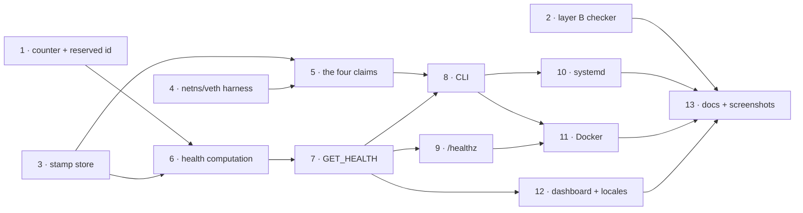

# 2.17 — It proves what it says: Implementation Plan

> **For agentic workers:** REQUIRED SUB-SKILL: Use superpowers:subagent-driven-development (recommended) or superpowers:executing-plans to implement this plan task-by-task. Steps use checkbox (`- [ ]`) syntax for tracking.

**Goal:** easywall stops asserting that it works and measures it, at three depths, and reports the result in a form Docker, systemd, a console and a monitoring system can each read.

**Architecture:** Three independent proof layers. **B** decodes every expression `Apply` builds and refuses malformed ones before netlink — it is the gate, and it is red in CI. **C** proves four behavioural claims against a real kernel inside a network namespace of its own, Go-native so no privileged process gains a subprocess, run by a `oneshot` systemd unit once per version-and-kernel. **A** watches the one kernel counter that must never be zero. A health computation reads all three plus `Enforcing()` and answers `ok` / `degraded` / `fail` over a new protocol command, a CLI subcommand and an HTTP endpoint. **No layer may refuse to filter.**

**Tech Stack:** Go 1.26 (toolchain 1.27.1) · `google/nftables` + `mdlayher/netlink` (both already in the tree) · `golang.org/x/sys/unix` · chi v5 · Tailwind v4 · Playwright for `check:ui`

**Spec:** [`2026-09-08-2.17-it-proves-what-it-says.md`](2026-09-08-2.17-it-proves-what-it-says.md) — read it first. This plan argues from it and does not restate its reasoning.

## Global Constraints

Every task's requirements implicitly include all of these.

- **No new Go dependency.** `mdlayher/netlink` is present via `google/nftables`; `golang.org/x/sys` is direct. Nothing else may be added.
- **No new subprocess in a privileged process.** The only `exec` this release may introduce is `/proc/self/exe`. Pinned by `TestSelftestUsesNoExternalBinary`.
- **No layer refuses to filter.** A failed check writes an audit entry and sets `degraded`; the table is written anyway. The reasoning is `internal/core/restore.go:218`.
- **Every guard is verified by mutation.** Break the implementation, watch the test go red, restore it. A test that was never seen red does not count. `CLAUDE.md` names the release this rule cost.
- **`locales/en.json` and `locales/de.json` stay at exact parity** — 529 keys each today. `fr.json` may lag and is counted by the coverage report.
- **A generated file is rebuilt and diffed, never assumed.** `web/static/style.css` and `docs/assets/css/style.css` are committed build output. Grep the built file for the rule you expect. This does **not** apply to `docs/assets/diagrams/` — mermaid is not byte-reproducible; use `npm run check:diagrams`.
- **UI is verified by rendering it**, in both themes at 1600 / 900 / 390 px. Reading CSS is not verification.
- **Conventional Commits**, types from `CONTRIBUTING.md:39`. Every commit ends with:
  `Co-Authored-By: Claude Opus 5 (1M context) <noreply@anthropic.com>`
- **Branch:** `feat/2.17-it-proves-what-it-says`, cut from `b723422`. Anything found and not fixed must be proven against **that commit**, not the branch head, before it may go in `carried-forward.md`.
- **Reserved rule ids begin with `_`.** `_established` is the only one this release adds.
- Integration tests need root: `sudo go test -tags integration ./internal/core/...`. On this machine, rootless podman is the route — see `docs-tech/local-review.md`.

---

## Dependency graph

Tasks in the same batch touch disjoint files and may run concurrently. **A concurrent implementer gets their own worktree**, because reviewers mutate the tree.



| Batch | Tasks | Note |
|---|---|---|
| A | 1 · 2 · 3 · 4 | four independent files, no shared symbol |
| B | 5 · 6 | 5 needs 3+4; 6 needs 1+3 |
| C | 7 | the protocol seam — everything downstream reads it |
| D | 8 · 9 · 12 | disjoint: `cmd/`, `internal/web/handler_health.go`+config, templates+locales |
| E | 10 · 11 | packaging; both need a working CLI |
| F | 13 | documentation and screenshots last, because they depend on the rendered result |

---

## File structure

| File | Responsibility |
|---|---|
| `internal/core/nftables_check.go` | **new** — layer B. Decodes a built rule's expressions and reports findings. Knows nothing about health, files or the daemon |
| `internal/core/netns.go` | **new** — layer C's plumbing only: a child in a fresh netns, a veth pair, addresses, teardown. No firewall knowledge |
| `internal/core/selftest.go` | **new** — layer C's four claims. Uses `netns.go` for the harness and `NftablesManager` for the table |
| `internal/core/selftest_stamp.go` | **new** — the stamp file. `usage.go`'s shape: atomic rename, 0600, an unreadable file heals |
| `internal/core/health.go` | **new** — the state machine of spec §2, and nothing else |
| `internal/core/sdnotify.go` | **new** — 40 lines: a datagram to `$NOTIFY_SOCKET`. No dependency |
| `internal/web/handler_health.go` | **new** — `/healthz` and its address gate |
| `systemd/easywall-selftest.service` | **new** — the only place CAP_SYS_ADMIN is granted |
| `internal/core/nftables.go` | modified — `addEstablishedAccept` gains a counter and the reserved id; `RuleCounters` skips reserved ids; `Apply` calls the checker |
| `internal/shared/models.go` | modified — `HealthResult`, `SelftestStamp`, `WebConfig.HealthAllow` |
| `internal/shared/protocol.go` | modified — `CmdGetHealth`, the 22nd |
| `internal/core/daemon.go` | modified — dispatch `GET_HEALTH`, `sd_notify(READY=1)` after listen, watchdog ticker |
| `internal/web/democlient.go` | modified — a demo answer for the new command |

`netns.go` is separate from `selftest.go` on purpose: one is namespace plumbing that a reviewer can check against `ip-link(8)`, the other is four assertions about a firewall. Mixing them would make both unreviewable.

---

### Task 1: The counter on the established rule, and reserved ids

**Files:**
- Modify: `internal/core/nftables.go:858-874` (`addEstablishedAccept`), `internal/core/nftables.go:278-341` (`RuleCounters`)
- Test: `internal/core/nftables_reserved_id_test.go` (create), `internal/core/usage_test.go` (extend)

**Interfaces:**
- Consumes: nothing
- Produces: `const ReservedIDEstablished = "_established"` and `func IsReservedRuleID(id string) bool` in package `core`. Task 6 reads the counter by this id.

- [ ] **Step 1: Write the failing tests**

Create `internal/core/nftables_reserved_id_test.go`:

```go
package core

import "testing"

// The established-accept rule is the one rule whose counter is a health signal,
// and it was invisible: it carried no counter and no comment, so RuleCounters —
// which skips every rule without an id — never saw it.
func TestEstablishedRuleIsTaggedAndCounted(t *testing.T) {
	m := &NftablesManager{}
	rec := &recordingConn{}
	m.conn = rec.asConn()

	m.addEstablishedAccept(easywallInetTableForTest(), inputChainForTest())

	if len(rec.rules) != 1 {
		t.Fatalf("addEstablishedAccept added %d rules, want 1", len(rec.rules))
	}
	r := rec.rules[0]

	id, ok := idFromUserData(r.UserData)
	if !ok || id != ReservedIDEstablished {
		t.Errorf("UserData id = %q (ok=%v), want %q", id, ok, ReservedIDEstablished)
	}

	var counters int
	for _, e := range r.Exprs {
		if _, is := e.(*expr.Counter); is {
			counters++
		}
	}
	if counters != 1 {
		t.Errorf("the rule carries %d counters, want exactly 1", counters)
	}
}

// A reserved id must never be booked into usage.json. UsageStore.Collect skips
// ids that are not live and liveRuleIDs only knows rules from the rules file, so
// the pruning already drops it — but the coupling is invisible, and a change to
// either side would make _established a phantom port in Last used.
func TestIsReservedRuleID(t *testing.T) {
	for _, id := range []string{"_established", "_anything"} {
		if !IsReservedRuleID(id) {
			t.Errorf("IsReservedRuleID(%q) = false, want true", id)
		}
	}
	for _, id := range []string{"tcp-22-a1b2", "", "established"} {
		if IsReservedRuleID(id) {
			t.Errorf("IsReservedRuleID(%q) = true, want false", id)
		}
	}
}
```

The test needs a recording connection. `internal/core` has no such helper today, so add it in the same file — the package's existing unit tests build tables through the real `nftables.Conn` against a namespace under the `integration` tag, and this test must run under plain `make test`:

```go
// recordingConn captures the rules a builder adds without a kernel. It exists so
// the expression-level guards in this package run under `make test` rather than
// only under -tags integration, where they need root.
type recordingConn struct{ rules []*nftables.Rule }
```

Consult `github.com/google/nftables` for the concrete seam: `NftablesManager.conn` is `*nftables.Conn`, a struct rather than an interface, so **introduce a narrow interface in `nftables.go`** rather than faking the struct:

```go
// ruleAdder is the one method every add* builder in this file uses. It exists so
// those builders can be tested without a kernel; NftablesManager.conn satisfies
// it, and nothing else in this package takes it.
type ruleAdder interface {
	AddRule(*nftables.Rule) *nftables.Rule
}
```

Then change every `m.conn.AddRule(` call site in the builders to go through a field of that type. **Scope warning:** there are ~30 such call sites. Do the interface extraction as its own commit before the behaviour change, so the diff of each is legible.

- [ ] **Step 2: Run the tests to verify they fail**

Run: `go test ./internal/core/ -run 'TestEstablishedRuleIsTaggedAndCounted|TestIsReservedRuleID' -v`
Expected: FAIL — `undefined: ReservedIDEstablished`, `undefined: IsReservedRuleID`, `undefined: recordingConn`.

- [ ] **Step 3: Extract the `ruleAdder` seam, and commit it alone**

Add the interface above near `NftablesManager`. Add a field:

```go
// adder is where the builders write. It is m.conn in production and a recorder
// in tests. Never nil after NewNftablesManager.
adder ruleAdder
```

Set `m.adder = m.conn` in `NewNftablesManager` (`nftables.go:83`) and wherever `m.conn` is reassigned. Replace `m.conn.AddRule(` with `m.adder.AddRule(` in every `add*` builder. `Apply`'s `conn.Flush()`, `ListTables`, `ListChains`, `GetRules` and the chain/table creation calls stay on `m.conn` — only rule *adding* moves.

Run: `go test ./internal/core/ && go build ./...`
Expected: PASS, unchanged behaviour.

```bash
git add internal/core/nftables.go
git commit -m "refactor(core): the rule builders write through a narrow interface

Thirty add* builders called m.conn.AddRule directly, so an expression-level
guard could only run under -tags integration with root and a namespace. A
one-method interface lets them be recorded in a plain unit test. Only rule
adding moves; every list, flush and chain call stays on the connection.

Co-Authored-By: Claude Opus 5 (1M context) <noreply@anthropic.com>"
```

- [ ] **Step 4: Implement the counter, the id and the skip**

In `nftables.go`, beside the ct-state constants:

```go
// Reserved rule ids name a rule easywall builds for its own accounting rather
// than one an operator wrote. They are the only ids RuleCounters reports that
// no rules file contains, and the prefix is what keeps them out of usage.json:
// UsageStore.Collect books only ids liveRuleIDs names, and liveRuleIDs reads
// the rules file. The prefix makes that separation stateable rather than
// emergent.
const ReservedIDEstablished = "_established"

// IsReservedRuleID reports whether id is one of easywall's own.
func IsReservedRuleID(id string) bool {
	return strings.HasPrefix(id, "_")
}
```

`addEstablishedAccept` gains the counter after the match and before the verdict — the same position `portAcceptRules` documents at `nftables.go:2052` — and the tag:

```go
func (m *NftablesManager) addEstablishedAccept(t *nftables.Table, c *nftables.Chain) {
	m.adder.AddRule(&nftables.Rule{
		Table: t,
		Chain: c,
		Exprs: []expr.Any{
			&expr.Ct{Register: 1, SourceRegister: false, Key: expr.CtKeySTATE},
			&expr.Bitwise{
				SourceRegister: 1,
				DestRegister:   1,
				Len:            4,
				Mask:           ctStateMask(ctStateEstablished | ctStateRelated),
				Xor:            ctStateNoMatch,
			},
			&expr.Cmp{Op: expr.CmpOpNeq, Register: 1, Data: ctStateNoMatch},
			// After the match, before the verdict. This counter is the health
			// signal in spec §5: on a host with traffic it can only be zero if
			// the stateful half of the input chain matches nothing.
			&expr.Counter{},
			&expr.Verdict{Kind: expr.VerdictAccept},
		},
		UserData: userdata.AppendString(nil, userdata.TypeComment, ReservedIDEstablished),
	})
}
```

`RuleCounters` keeps reporting reserved ids — health needs them, and spec §5 was corrected during this task to say so — but `UsageStore.Collect` must never book one.

**Corrected during Task 1:** this step first asked for the guard in *both* of `Collect`'s loops. The implementer's mutation run showed the booking-loop half is not load-bearing — the prune loop at the end of the same call deletes the id anyway, so no file the store writes changes, and no test can hold it. **One guard, in the prune loop**, which both prevents the id appearing and heals a file already holding one. A guard no test can hold is dead code that the next reader cannot tell from a real one.

Skip the booking loop and put it where liveness is finally decided:

```go
	for id, kernel := range counters {
		// A reserved id is easywall's own accounting and is not a port rule. It
		// is skipped here rather than filtered out of RuleCounters, because
		// health reads that map and needs it.
		if IsReservedRuleID(id) || !live[id] {
			continue
		}
```

and in the prune loop, so a record written by an older version is cleaned out:

```go
	for id := range res.Usage {
		if IsReservedRuleID(id) || !live[id] {
			delete(res.Usage, id)
		}
	}
```

- [ ] **Step 5: Run the tests to verify they pass**

Run: `go test ./internal/core/ -run 'Established|ReservedRuleID|Usage' -v`
Expected: PASS.

- [ ] **Step 6: Verify by mutation**

Three mutations, each restored after:

| Mutate | Expected red test |
|---|---|
| delete `&expr.Counter{},` from `addEstablishedAccept` | `TestEstablishedRuleIsTaggedAndCounted` — "carries 0 counters" |
| delete the `UserData:` line | same test — `UserData id = "" (ok=false)` |
| change `IsReservedRuleID` to `return false` | `TestIsReservedRuleID`, and add a usage test that books `_established` and asserts it is absent from `usage.json` |

The third mutation shows the second test is not yet load-bearing. Add it:

```go
func TestReservedRuleIDsNeverReachUsage(t *testing.T) {
	dir := t.TempDir()
	u := NewUsageStore(filepath.Join(dir, "usage.json"))

	counters := map[string]RuleCounter{
		ReservedIDEstablished: {Packets: 500, Bytes: 40000},
		"tcp-22-a1b2":         {Packets: 3, Bytes: 180},
	}
	// The reserved id is deliberately marked live, which is the state a future
	// liveRuleIDs bug would produce. The prefix must hold on its own.
	live := map[string]bool{ReservedIDEstablished: true, "tcp-22-a1b2": true}

	if err := u.Collect(counters, live); err != nil {
		t.Fatalf("Collect: %v", err)
	}
	res, err := u.Read()
	if err != nil {
		t.Fatalf("Read: %v", err)
	}
	if _, present := res.Usage[ReservedIDEstablished]; present {
		t.Errorf("usage.json holds %q; a reserved id is not a port rule",
			ReservedIDEstablished)
	}
	if got := res.Usage["tcp-22-a1b2"].Packets; got != 3 {
		t.Errorf("the real rule booked %d packets, want 3", got)
	}
}
```

Run the mutation again and confirm this test is the one that goes red.

- [ ] **Step 7: Commit**

```bash
git add internal/core/nftables.go internal/core/usage.go \
        internal/core/nftables_reserved_id_test.go internal/core/usage_test.go
git commit -m "feat(core): the established-accept rule carries a counter and an id

It carried neither, so RuleCounters — which skips every rule without an id
comment — never saw the one rule whose counter is a health signal. On a host
with traffic that counter can only be zero if the stateful half of the input
chain matches nothing, which is the signature of the defect 2.16.0 fixed.

Reserved ids begin with _ and are skipped by UsageStore.Collect at the point
liveness is decided, not filtered out of RuleCounters, because health reads
that map and needs them. The prune loop drops them too, so a record written
by an older version heals.

Co-Authored-By: Claude Opus 5 (1M context) <noreply@anthropic.com>"
```

---

### Task 2: Layer B — the expression checker

**Files:**
- Create: `internal/core/nftables_check.go`, `internal/core/nftables_check_test.go`
- Modify: `internal/core/nftables.go` (`Apply`, before `conn.Flush()`)

**Interfaces:**
- Consumes: `ruleAdder` and `recordingConn` from Task 1 — **Task 2 must be sequenced after Task 1's Step 3 commit**, or it duplicates the seam. If run concurrently, take the seam commit into the worktree first.
- Produces:
  ```go
  type Finding struct {
      Chain  string // the chain the rule was being added to
      Index  int    // position within that chain, 0-based
      Reason string // one fixed English sentence, no interpolated user data
  }
  func CheckRules(rules []*nftables.Rule, acceptingChains map[string]bool) []Finding
  ```
  Task 6 reads `len(findings) > 0` off the `Firewall`; nothing consumes `Finding`'s fields but the audit detail.

- [ ] **Step 1: Write the failing test**

Create `internal/core/nftables_check_test.go`:

```go
package core

import (
	"strings"
	"testing"

	"github.com/google/nftables"
	"github.com/google/nftables/binaryutil"
	"github.com/google/nftables/expr"
)

// The regression test for the defect this release exists for. All three ct-state
// masks in nftables.go were written big-endian; the kernel compares a native
// u32, so `ct state established,related accept` matched no packet for five
// releases and the rule reported itself present the whole time.
func TestCheckRejectsAByteReversedCtStateMask(t *testing.T) {
	reversed := &nftables.Rule{
		Chain: &nftables.Chain{Name: "input"},
		Exprs: []expr.Any{
			&expr.Ct{Register: 1, Key: expr.CtKeySTATE},
			&expr.Bitwise{
				SourceRegister: 1, DestRegister: 1, Len: 4,
				Mask: binaryutil.BigEndian.PutUint32(ctStateEstablished | ctStateRelated),
				Xor:  ctStateNoMatch,
			},
			&expr.Cmp{Op: expr.CmpOpNeq, Register: 1, Data: ctStateNoMatch},
			&expr.Verdict{Kind: expr.VerdictAccept},
		},
	}

	findings := CheckRules([]*nftables.Rule{reversed}, nil)
	if len(findings) != 1 {
		t.Fatalf("CheckRules returned %d findings, want 1: %+v", len(findings), findings)
	}
	if !strings.Contains(findings[0].Reason, "conntrack state") {
		t.Errorf("Reason = %q, want it to name the conntrack state", findings[0].Reason)
	}
}

// The same rule built the way nftables.go builds it now must pass, or the check
// is a permanent alarm and gets switched off by whoever meets it.
func TestCheckAcceptsTheNativeCtStateMask(t *testing.T) {
	m := &NftablesManager{}
	rec := &recordingConn{}
	m.adder = rec
	m.addEstablishedAccept(
		&nftables.Table{Name: "easywall"}, &nftables.Chain{Name: "input"})

	if findings := CheckRules(rec.rules, nil); len(findings) != 0 {
		t.Errorf("the shipped rule produced findings: %+v", findings)
	}
}

// A mask naming a bit no conntrack state uses is the same class of defect
// arriving from the other direction: a typo in the constant rather than in the
// byte order.
func TestCheckRejectsACtStateBitTheKernelDoesNotDefine(t *testing.T) {
	r := &nftables.Rule{
		Chain: &nftables.Chain{Name: "input"},
		Exprs: []expr.Any{
			&expr.Ct{Register: 1, Key: expr.CtKeySTATE},
			&expr.Bitwise{
				SourceRegister: 1, DestRegister: 1, Len: 4,
				Mask: binaryutil.NativeEndian.PutUint32(0x8000000),
				Xor:  ctStateNoMatch,
			},
			&expr.Cmp{Op: expr.CmpOpNeq, Register: 1, Data: ctStateNoMatch},
			&expr.Verdict{Kind: expr.VerdictAccept},
		},
	}
	if findings := CheckRules([]*nftables.Rule{r}, nil); len(findings) != 1 {
		t.Fatalf("findings = %d, want 1 for mask 0x8000000", len(findings))
	}
}

// The bug in reach_integration_test.go:184: the SSH brute-force chain ended in
// accept and was jumped to before the blacklist, so a blacklisted address could
// open SSH as long as it stayed under the rate limit. A jumped-to chain must
// return or drop, and the exceptions are named in one list a reviewer sees.
func TestCheckRejectsAJumpedChainThatAccepts(t *testing.T) {
	rules := []*nftables.Rule{
		{Chain: &nftables.Chain{Name: "input"}, Exprs: []expr.Any{
			&expr.Verdict{Kind: expr.VerdictJump, Chain: "sshbrute"}}},
		{Chain: &nftables.Chain{Name: "sshbrute"}, Exprs: []expr.Any{
			&expr.Verdict{Kind: expr.VerdictAccept}}},
	}
	findings := CheckRules(rules, nil)
	if len(findings) != 1 {
		t.Fatalf("findings = %d, want 1: %+v", len(findings), findings)
	}
	if !strings.Contains(findings[0].Reason, "accept") {
		t.Errorf("Reason = %q, want it to name the accept", findings[0].Reason)
	}
	// And it passes once the chain is declared accepting.
	if f := CheckRules(rules, map[string]bool{"sshbrute": true}); len(f) != 0 {
		t.Errorf("a declared accepting chain still produced findings: %+v", f)
	}
}

// A jump to a chain the same transaction does not create is a rule the kernel
// rejects at flush time with an error that names a number, not a chain.
func TestCheckRejectsAJumpToAChainNobodyCreates(t *testing.T) {
	rules := []*nftables.Rule{
		{Chain: &nftables.Chain{Name: "input"}, Exprs: []expr.Any{
			&expr.Verdict{Kind: expr.VerdictJump, Chain: "portscan"}}},
	}
	if findings := CheckRules(rules, nil); len(findings) != 1 {
		t.Fatalf("findings = %d, want 1 for a jump to an absent chain", len(findings))
	}
}
```

- [ ] **Step 2: Run the test to verify it fails**

Run: `go test ./internal/core/ -run TestCheck -v`
Expected: FAIL — `undefined: CheckRules`.

- [ ] **Step 3: Implement the checker**

Create `internal/core/nftables_check.go`:

```go
package core

import (
	"fmt"

	"github.com/google/nftables"
	"github.com/google/nftables/binaryutil"
	"github.com/google/nftables/expr"
)

// The check that runs in front of netlink.
//
// For five releases `ct state established,related accept` matched no packet.
// All three ct-state masks were written big-endian; the kernel writes the state
// into a register as a native u32 and compares it that way. The rule was
// present, reported itself present, and enforced nothing — and the unit test
// covering it had written the defect down as expected output.
//
// This decodes what the builders produced and reports what cannot be right. It
// needs no kernel, so it runs on every Apply and, more importantly, in CI on
// every build. In CI a finding is a failure; on a host it is a degraded health
// state and the table is written anyway — see spec §3 and restore.go:218.

// Finding is one thing wrong with one built rule. Reason is a fixed sentence:
// this text reaches the audit log, and the audit log takes no free text built
// from anything an operator typed.
type Finding struct {
	Chain  string
	Index  int
	Reason string
}

func (f Finding) String() string {
	return fmt.Sprintf("%s rule %d: %s", f.Chain, f.Index, f.Reason)
}

// ctStateAllBits is every bit a conntrack state can carry, as the four
// constants above name them. A mask with a bit outside this set matches nothing
// — `tcp dport 22 ct state 0x8000000` is what the reported ruleset contained.
const ctStateAllBits = ctStateInvalid | ctStateEstablished | ctStateRelated | ctStateNew

// CheckRules reports what is wrong with rules, which is one nftables
// transaction's worth in the order they were added.
//
// acceptingChains names the jumped-to chains that are allowed to end in accept.
// Passing nil means none is, which is the state easywall's own table should be
// in: every module chain either drops or returns, so under-rate traffic falls
// back into the input chain and meets the blacklist.
func CheckRules(rules []*nftables.Rule, acceptingChains map[string]bool) []Finding {
	var findings []Finding

	created := map[string]bool{}
	for _, r := range rules {
		if r.Chain != nil {
			created[r.Chain.Name] = true
		}
	}

	// Which chains end in accept, and which are jumped to. Collected in one
	// pass so the report is per-rule and the verdict is per-chain.
	endsInAccept := map[string]bool{}
	jumped := map[string]string{} // chain -> the chain that jumps to it

	perChain := map[string]int{}
	for _, r := range rules {
		chain := "?"
		if r.Chain != nil {
			chain = r.Chain.Name
		}
		idx := perChain[chain]
		perChain[chain]++

		add := func(reason string) {
			findings = append(findings, Finding{Chain: chain, Index: idx, Reason: reason})
		}

		for i, e := range r.Exprs {
			switch v := e.(type) {
			case *expr.Bitwise:
				// Only a bitwise that follows a ct-state load is a ct-state
				// mask. Any other bitwise is an address or a length and this
				// check has nothing to say about it.
				if !precededByCtState(r.Exprs, i) {
					continue
				}
				if len(v.Mask) != 4 {
					add("a conntrack state mask is not four bytes wide")
					continue
				}
				native := binaryutil.NativeEndian.Uint32(v.Mask)
				if native == 0 || native & ^uint32(ctStateAllBits) != 0 {
					add("the conntrack state mask names bits no conntrack " +
						"state carries; it is probably byte-reversed")
				}
			case *expr.Verdict:
				switch v.Kind {
				case expr.VerdictJump, expr.VerdictGoto:
					jumped[v.Chain] = chain
				case expr.VerdictAccept:
					endsInAccept[chain] = true
				case expr.VerdictDrop, expr.VerdictReturn,
					expr.VerdictContinue, expr.VerdictQueue, expr.VerdictBreak:
				default:
					add("the rule ends in a verdict this kernel does not define")
				}
			}
		}
	}

	for target, from := range jumped {
		if !created[target] {
			findings = append(findings, Finding{
				Chain:  from,
				Reason: "the rule jumps to a chain this transaction does not create",
			})
		}
		if endsInAccept[target] && !acceptingChains[target] {
			findings = append(findings, Finding{
				Chain:  target,
				Reason: "a jumped-to chain ends in accept, so it outranks every " +
					"rule after the jump; it must drop or return",
			})
		}
	}
	return findings
}

// precededByCtState reports whether the expression at i follows a load of the
// conntrack state into the same register.
func precededByCtState(exprs []expr.Any, i int) bool {
	bw, ok := exprs[i].(*expr.Bitwise)
	if !ok {
		return false
	}
	for j := i - 1; j >= 0; j-- {
		if ct, is := exprs[j].(*expr.Ct); is {
			return ct.Key == expr.CtKeySTATE && ct.Register == bw.SourceRegister
		}
	}
	return false
}
```

`findings` iterates a map, so its order is not stable. Callers must not depend on order; the tests above assert on counts and on `Contains`, never on index.

- [ ] **Step 4: Run the tests to verify they pass**

Run: `go test ./internal/core/ -run TestCheck -v`
Expected: PASS, all five.

- [ ] **Step 5: Wire it into `Apply`, and make CI the gate**

In `nftables.go`'s `Apply`, immediately before `conn.Flush()`, collect what was added and check it. `recordingConn` cannot serve here — production adds go to the real connection — so `NftablesManager` keeps a copy:

```go
// built is every rule this transaction added, kept so CheckRules can read them
// before the flush. Cleared at the top of Apply. Not a second source of truth:
// it is the same pointers the connection holds.
built []*nftables.Rule
```

Make `m.adder` a small wrapper that appends to `m.built` and forwards to `m.conn`, so no builder has to remember. Then in `Apply`:

```go
	// Spec §3. A finding never refuses the write: a check that reads false on a
	// configured host would quietly stop enforcing rules somebody wrote, which
	// is the failure everConfigured exists to avoid (restore.go:218). It is
	// recorded, it degrades health, and CI is where it is fatal.
	m.lastFindings = CheckRules(m.built, nil)
	for _, f := range m.lastFindings {
		slog.Error("a rule about to be written to the kernel cannot be right; "+
			"the firewall is being applied anyway and health will report degraded",
			"finding", f.String())
	}
```

Expose it: `func (m *NftablesManager) LastFindings() []Finding` returning a copy, under `m.mu`.

The CI gate is a test rather than a flag, because a flag can be off:

```go
//go:build integration

// The gate. A finding in the table easywall actually builds is a build failure,
// not a warning: every host would get it, and the last one shipped for five
// releases.
func TestIntegration_TheBuiltTableHasNoFindings(t *testing.T) {
	m := newIntegrationManager(t)
	state := shared.RulesState{Current: fullExampleRules(), Staged: fullExampleRules()}
	opts := allProtectionModulesOn()
	if err := m.Apply(state, opts, shared.NetworkSettings{}); err != nil {
		t.Fatalf("Apply: %v", err)
	}
	if f := m.LastFindings(); len(f) != 0 {
		for _, one := range f {
			t.Errorf("finding: %s", one)
		}
	}
}
```

`fullExampleRules()` and `allProtectionModulesOn()` must switch **every** module on — the point is coverage of the builders. Build them from `shared.FirewallOptions`'s fields reflectively if that is shorter, but assert the count so a new option added later is not silently uncovered:

```go
	// A new protection module added without a line here would leave its rules
	// unchecked, which is exactly how the reversed masks survived.
	if got := countTrueBoolFields(opts); got != 14 {
		t.Fatalf("allProtectionModulesOn set %d modules, want 14 — "+
			"a module was added; extend it", got)
	}
```

**`DESIGN.md` counts the protection modules as eleven in two places and fourteen in a third** (`carried-forward.md`, *From 2.16*). Count the struct fields, use that number, and record the true count in the test's message. Resolving `DESIGN.md`'s contradiction is **not** this task — it is carried, and this task must not silently pick a side; it asserts against the code.

- [ ] **Step 6: Verify by mutation**

| Mutate | Expected red |
|---|---|
| `ctStateMask` → `binaryutil.BigEndian.PutUint32` | `TestCheckAcceptsTheNativeCtStateMask` **and** `TestIntegration_TheBuiltTableHasNoFindings`. This is the release's central claim — do not skip it |
| in `addSSHBruteForce`, change the chain's final verdict from return to accept | `TestIntegration_TheBuiltTableHasNoFindings` |
| `CheckRules` → `return nil` | all five unit tests |

- [ ] **Step 7: Commit**

```bash
git add internal/core/nftables_check.go internal/core/nftables_check_test.go \
        internal/core/nftables.go internal/core/nftables_check_integration_test.go
git commit -m "feat(core): every built expression is checked before it reaches netlink

For five releases ct state established,related accept matched no packet. The
masks were big-endian, the kernel compares a native u32, and the unit test
covering the rule had written the defect down as expected output.

CheckRules decodes what the builders produced: a ct-state mask must name bits
a conntrack state carries, a verdict must be one the kernel defines, a jump
must name a chain the transaction creates, and a jumped-to chain must drop or
return rather than accept — the second defect the same veth test found, where
the SSH chain outranked the blacklist.

A finding never refuses the write. It logs, it degrades health, and it fails
the build: TestIntegration_TheBuiltTableHasNoFindings runs it over a table
with every protection module on, which is where the class dies.

Verified by mutation: putting ctStateMask back on BigEndian turns both the
unit test and the integration gate red.

Co-Authored-By: Claude Opus 5 (1M context) <noreply@anthropic.com>"
```

---

### Task 3: The self-test stamp

**Files:**
- Create: `internal/core/selftest_stamp.go`, `internal/core/selftest_stamp_test.go`
- Modify: `internal/shared/models.go` (add `SelftestStamp`), `internal/core/config.go` (add `SelftestStampPath`)

**Interfaces:**
- Consumes: nothing
- Produces:
  ```go
  // internal/shared
  type SelftestResult string
  const (
      SelftestPassed     SelftestResult = "passed"
      SelftestFailed     SelftestResult = "failed"
      SelftestUnprovable SelftestResult = "unprovable"
  )
  type SelftestStamp struct {
      Version string         `json:"version"`
      Kernel  string         `json:"kernel"`
      Result  SelftestResult `json:"result"`
      At      time.Time      `json:"at"`
      Detail  string         `json:"detail"`
  }
  // internal/core
  type StampStore struct{ /* … */ }
  func NewStampStore(path string) *StampStore
  func (s *StampStore) Read() shared.SelftestStamp
  func (s *StampStore) Write(shared.SelftestStamp) error
  func (s *StampStore) Stale(version, kernel string) bool
  func KernelRelease() string
  func (c *Config) SelftestStampPath() string
  ```

- [ ] **Step 1: Write the failing test**

```go
package core

import (
	"os"
	"path/filepath"
	"testing"
	"time"

	"github.com/jp1337/easywall/internal/shared"
)

// The stamp exists so the proof runs once per version and kernel rather than on
// every start. Both halves matter: the version because the class of defect being
// prevented is a build defect, and the kernel because a kernel upgrade under an
// unchanged easywall is the case that would otherwise be lost.
func TestStampSkipsOnlyWhenVersionAndKernelMatch(t *testing.T) {
	s := NewStampStore(filepath.Join(t.TempDir(), "selftest.json"))
	if err := s.Write(shared.SelftestStamp{
		Version: "2.17.0", Kernel: "6.12.4-1",
		Result: shared.SelftestPassed, At: time.Now().UTC(),
	}); err != nil {
		t.Fatalf("Write: %v", err)
	}

	cases := []struct {
		version, kernel string
		wantStale       bool
	}{
		{"2.17.0", "6.12.4-1", false},
		{"2.18.0", "6.12.4-1", true},
		{"2.17.0", "6.13.0-1", true},
		{"2.18.0", "6.13.0-1", true},
	}
	for _, tc := range cases {
		if got := s.Stale(tc.version, tc.kernel); got != tc.wantStale {
			t.Errorf("Stale(%q, %q) = %v, want %v",
				tc.version, tc.kernel, got, tc.wantStale)
		}
	}
}

// A missing stamp is stale, not an error. That is what an installation that has
// never run the proof looks like.
func TestStampIsStaleWhenAbsent(t *testing.T) {
	s := NewStampStore(filepath.Join(t.TempDir(), "selftest.json"))
	if !s.Stale("2.17.0", "6.12.4-1") {
		t.Error("Stale on a missing stamp = false, want true")
	}
	if got := s.Read().Result; got != "" {
		t.Errorf("Read on a missing stamp = %q, want the zero value", got)
	}
}

// usage.json's rule, for usage.json's reason: a truncated write on a host that
// lost power must not make the file permanently unreadable. It heals and the
// proof runs once more than it had to.
func TestStampHealsFromAnUnreadableFile(t *testing.T) {
	path := filepath.Join(t.TempDir(), "selftest.json")
	if err := os.WriteFile(path, []byte("{not json"), 0o600); err != nil {
		t.Fatal(err)
	}
	s := NewStampStore(path)
	if got := s.Read().Result; got != "" {
		t.Errorf("Read on a corrupt stamp = %q, want the zero value", got)
	}
	if !s.Stale("2.17.0", "6.12.4-1") {
		t.Error("a corrupt stamp is not stale; it must be")
	}
	if err := s.Write(shared.SelftestStamp{
		Version: "2.17.0", Kernel: "6.12.4-1", Result: shared.SelftestPassed,
	}); err != nil {
		t.Fatalf("Write over a corrupt file: %v", err)
	}
	if got := s.Read().Result; got != shared.SelftestPassed {
		t.Errorf("after the rewrite Result = %q, want passed", got)
	}
}

// The mode the sibling state files use. Only the core reads it.
func TestStampIsWrittenPrivate(t *testing.T) {
	path := filepath.Join(t.TempDir(), "selftest.json")
	if err := NewStampStore(path).Write(shared.SelftestStamp{
		Version: "2.17.0", Kernel: "x", Result: shared.SelftestPassed,
	}); err != nil {
		t.Fatal(err)
	}
	info, err := os.Stat(path)
	if err != nil {
		t.Fatal(err)
	}
	if got := info.Mode().Perm(); got != 0o600 {
		t.Errorf("mode = %o, want 600", got)
	}
}

// KernelRelease must return something, and it must not be a path or contain a
// NUL: it goes into a JSON file and into a comparison.
func TestKernelReleaseIsANonEmptyString(t *testing.T) {
	if got := KernelRelease(); got == "" {
		t.Error("KernelRelease() is empty")
	}
}
```

- [ ] **Step 2: Run to verify it fails**

Run: `go test ./internal/core/ -run 'TestStamp|TestKernelRelease' -v`
Expected: FAIL — `undefined: NewStampStore`.

- [ ] **Step 3: Implement**

In `internal/shared/models.go`, beside `UsageResult`, add the types from the Interfaces block with a doc comment naming spec §4.

Create `internal/core/selftest_stamp.go`:

```go
package core

import (
	"encoding/json"
	"fmt"
	"log/slog"
	"os"
	"path/filepath"
	"sync"

	"github.com/jp1337/easywall/internal/shared"
	"golang.org/x/sys/unix"
)

// What the self-test proved, and against what.
//
// The class of defect layer C prevents is a build defect: identical on every
// start of the same binary. Proving it once per version is therefore exactly
// enough, and this file is what makes "once" mean once. The kernel is in the
// comparison for the case that would otherwise be lost — a kernel upgrade under
// an unchanged easywall.
//
// The shape is usage.json's and appliedconfig.go's: one JSON file under DataDir,
// mode 0600, written by atomic rename, and an unreadable file heals rather than
// becoming permanent. See UsageStore.read for why that answer and not an error.

type StampStore struct {
	mu   sync.Mutex
	path string
}

func NewStampStore(path string) *StampStore { return &StampStore{path: path} }

// Read returns the stored stamp, or the zero value when there is none or it
// cannot be parsed. Never an error: a stamp that cannot be read means the proof
// has not been recorded, which is what a missing one means too.
func (s *StampStore) Read() shared.SelftestStamp {
	s.mu.Lock()
	defer s.mu.Unlock()
	return s.read()
}

func (s *StampStore) read() shared.SelftestStamp {
	data, err := os.ReadFile(s.path) // #nosec G304 -- path is built from the daemon's own config
	if err != nil {
		if !os.IsNotExist(err) {
			slog.Warn("the self-test stamp could not be read; the proof will run again",
				"path", s.path, "error", err)
		}
		return shared.SelftestStamp{}
	}
	var stamp shared.SelftestStamp
	if err := json.Unmarshal(data, &stamp); err != nil {
		slog.Warn("the self-test stamp is unreadable and is being started again",
			"path", s.path, "error", err)
		return shared.SelftestStamp{}
	}
	return stamp
}

// Stale reports whether the proof has to run for this version and kernel.
//
// A missing or unreadable stamp is stale. So is one recorded as unprovable: a
// host that could not build a namespace last time may be able to now — the
// capability set changed, or the operator ran the subcommand by hand — and the
// cost of finding out is one attempt per start on a host that stays unable.
// That is the one thing this file deliberately does not optimise, because
// caching "cannot" would hide a host becoming able.
func (s *StampStore) Stale(version, kernel string) bool {
	s.mu.Lock()
	defer s.mu.Unlock()
	stamp := s.read()
	switch stamp.Result {
	case shared.SelftestPassed, shared.SelftestFailed:
		return stamp.Version != version || stamp.Kernel != kernel
	default:
		return true
	}
}

// Write persists the stamp atomically — temporary file, chmod, rename — the
// shape UsageStore.write uses, and for the same reason.
func (s *StampStore) Write(stamp shared.SelftestStamp) error {
	s.mu.Lock()
	defer s.mu.Unlock()

	data, err := json.MarshalIndent(stamp, "", "  ")
	if err != nil {
		return fmt.Errorf("marshal the self-test stamp: %w", err)
	}
	tmp, err := os.CreateTemp(filepath.Dir(s.path), "selftest-*.json.tmp")
	if err != nil {
		return fmt.Errorf("create temp file: %w", err)
	}
	tmpPath := tmp.Name()
	if _, err := tmp.Write(data); err != nil {
		_ = tmp.Close()
		_ = os.Remove(tmpPath)
		return fmt.Errorf("write temp file: %w", err)
	}
	if err := tmp.Close(); err != nil {
		_ = os.Remove(tmpPath)
		return fmt.Errorf("close temp file: %w", err)
	}
	if err := os.Chmod(tmpPath, 0600); err != nil {
		_ = os.Remove(tmpPath)
		return fmt.Errorf("set mode: %w", err)
	}
	if err := os.Rename(tmpPath, s.path); err != nil {
		_ = os.Remove(tmpPath)
		return fmt.Errorf("atomic rename: %w", err)
	}
	return nil
}

// KernelRelease is uname -r, read through the syscall rather than a subprocess:
// this runs in the privileged process, and the release may not add one.
func KernelRelease() string {
	var u unix.Utsname
	if err := unix.Uname(&u); err != nil {
		return "unknown"
	}
	return unix.ByteSliceToString(u.Release[:])
}
```

In `internal/core/config.go`, beside `UsagePath` (`config.go:336`), add `SelftestStampPath()` returning `filepath.Join(c.DataDir, "selftest.json")` — copy the exact idiom of the neighbouring accessor, including how it handles an empty `DataDir`.

- [ ] **Step 4: Run to verify it passes**

Run: `go test ./internal/core/ -run 'TestStamp|TestKernelRelease' -v`
Expected: PASS, all five.

- [ ] **Step 5: Verify by mutation**

| Mutate | Expected red |
|---|---|
| `Stale` compares only `stamp.Version != version` | `TestStampSkipsOnlyWhenVersionAndKernelMatch`, case `{"2.17.0", "6.13.0-1"}` |
| `Stale`'s `default:` returns `false` | `TestStampIsStaleWhenAbsent` |
| `read`'s unmarshal error returns the partially filled stamp | `TestStampHealsFromAnUnreadableFile` |
| `Write`'s `os.Chmod(tmpPath, 0600)` → `0644` | `TestStampIsWrittenPrivate` |

- [ ] **Step 6: Commit**

```bash
git add internal/shared/models.go internal/core/selftest_stamp.go \
        internal/core/selftest_stamp_test.go internal/core/config.go
git commit -m "feat(core): the self-test records what it proved, and against what

The defect layer C prevents is a build defect — identical on every start of
the same binary — so proving it once per version is exactly enough. The kernel
is in the comparison for the case that would otherwise be lost: a kernel
upgrade under an unchanged easywall.

usage.json's shape and usage.json's rule: 0600, atomic rename, and an
unreadable file heals rather than becoming permanent. A stamp recorded as
unprovable is deliberately always stale — caching 'cannot' would hide a host
that has become able.

uname through the syscall, not a subprocess: this runs as root.

Co-Authored-By: Claude Opus 5 (1M context) <noreply@anthropic.com>"
```

---

### Task 4: The namespace and veth harness, Go-native

**Files:**
- Create: `internal/core/netns.go`, `internal/core/netns_test.go`, `internal/core/netns_integration_test.go`
- Modify: `cmd/easywall-core/main.go` (the peer mode hook)

**Interfaces:**
- Consumes: nothing
- Produces:
  ```go
  // Sentinel: the harness is unavailable on this host (no CAP_SYS_ADMIN, no veth).
  var ErrNamespaceUnavailable = errors.New("a network namespace cannot be created here")

  type Harness struct{ /* … */ }
  // NewHarness builds a peer in a fresh netns wired to this one by a veth pair.
  func NewHarness() (*Harness, error)
  func (h *Harness) Close()
  func (h *Harness) RouterAddr() netip.Addr // 10.77.9.1
  func (h *Harness) PeerAddr() netip.Addr   // 10.77.9.2
  // NetNSFd is /proc/<peer pid>/ns/net, opened and owned by the harness. Task 5
  // hands it to nftables.WithNetNSFd so Apply writes inside the namespace.
  func (h *Harness) NetNSFd() int
  // Dial asks the peer to open a TCP connection to addr:port and reports whether
  // it succeeded within timeout.
  func (h *Harness) Dial(addr netip.Addr, port uint16, timeout time.Duration) (bool, error)

  // PeerEnvVar is set on the re-executed child. cmd/easywall-core checks it
  // before flag parsing and runs RunPeer instead of the daemon.
  const PeerEnvVar = "EASYWALL_SELFTEST_PEER"
  func RunPeer(stdin io.Reader, stdout io.Writer) int
  ```

**Why the addresses are 10.77.9.0/24:** `nftables_forward_test.go` already owns 10.77.1.0/24 and 10.77.2.0/24. A third range keeps the harness usable inside the same namespace as those tests.

**Why no route is created:** both ends sit in one /24, so adding the address installs the connected route. The spec mentions `RTM_NEWROUTE`; it is not needed and must not be added.

- [ ] **Step 1: Write the failing test — the architecture guard first**

This one runs without root and is the constraint most worth pinning:

```go
package core

import (
	"go/ast"
	"go/parser"
	"go/token"
	"strings"
	"testing"
)

// The first line of easywall's security architecture is that no subprocess runs
// in the privileged path. The veth harness that found the conntrack defect is
// test code using unshare, nsenter, ip, ping, bash and timeout — six binaries,
// unremarkable in a test and unacceptable in the root daemon.
//
// So the shipped harness execs exactly one thing: itself. This walks the AST
// rather than grepping, because a comment naming a binary must not fail and a
// string built by concatenation must not pass.
func TestSelftestUsesNoExternalBinary(t *testing.T) {
	for _, file := range []string{"netns.go", "selftest.go"} {
		fset := token.NewFileSet()
		f, err := parser.ParseFile(fset, file, nil, 0)
		if err != nil {
			t.Fatalf("parse %s: %v", file, err)
		}
		ast.Inspect(f, func(n ast.Node) bool {
			call, ok := n.(*ast.CallExpr)
			if !ok {
				return true
			}
			sel, ok := call.Fun.(*ast.SelectorExpr)
			if !ok {
				return true
			}
			pkg, ok := sel.X.(*ast.Ident)
			if !ok || pkg.Name != "exec" {
				return true
			}
			if sel.Sel.Name != "Command" && sel.Sel.Name != "CommandContext" {
				return true
			}
			// The program argument is the first for Command, the second for
			// CommandContext.
			argIdx := 0
			if sel.Sel.Name == "CommandContext" {
				argIdx = 1
			}
			lit, ok := call.Args[argIdx].(*ast.BasicLit)
			if !ok || lit.Kind != token.STRING {
				t.Errorf("%s:%d: exec.%s with a non-literal program; the only "+
					"program this package may exec is /proc/self/exe",
					file, fset.Position(call.Pos()).Line, sel.Sel.Name)
				return true
			}
			if strings.Trim(lit.Value, `"`) != "/proc/self/exe" {
				t.Errorf("%s:%d: exec.%s(%s); the only program this package may "+
					"exec is /proc/self/exe",
					file, fset.Position(call.Pos()).Line, sel.Sel.Name, lit.Value)
			}
			return true
		})
	}
}
```

- [ ] **Step 2: Run it to verify it fails**

Run: `go test ./internal/core/ -run TestSelftestUsesNoExternalBinary -v`
Expected: FAIL — `parse netns.go: open netns.go: no such file or directory`.

- [ ] **Step 3: Implement the peer side**

Create `internal/core/netns.go`. The peer half first, because it defines the pipe protocol both sides speak:

```go
package core

// The harness layer C measures in.
//
// A second namespace is not optional. Local delivery to any of this host's own
// addresses goes out lo, and the input chain accepts iif lo immediately — a
// probe against the host's own address proves nothing, which
// reach_integration_test.go:28 already records. The packet has to arrive on a
// non-loopback interface, and a veth pair into a fresh namespace is the smallest
// thing that arranges it.
//
// Everything here is netlink and pipes. The only program this file execs is
// /proc/self/exe, pinned by TestSelftestUsesNoExternalBinary, because the
// alternative — unshare, nsenter, ip — would put six binaries in the privileged
// process to buy a check that runs once per upgrade.
//
// The pipe protocol, one line each way, so a hung peer is a read deadline
// rather than a parser:
//
//	child -> parent   "ready\n"                     once, after unshare
//	parent -> child   "dial 10.77.9.1 12227 2000\n" address, port, ms
//	child -> parent   "open\n" | "blocked\n"        the verdict
//	parent -> child   (pipe closed)                 child exits

const PeerEnvVar = "EASYWALL_SELFTEST_PEER"

// RunPeer is the child. It is already inside the new namespace when this runs —
// Cloneflags did that before exec — so it configures nothing and only dials
// what it is told to. The parent owns every netlink write, including the ones
// inside this namespace, which it reaches by /proc/<pid>/ns/net.
func RunPeer(stdin io.Reader, stdout io.Writer) int {
	if _, err := fmt.Fprintln(stdout, "ready"); err != nil {
		return 1
	}
	sc := bufio.NewScanner(stdin)
	for sc.Scan() {
		var addr string
		var port, ms int
		if n, _ := fmt.Sscanf(sc.Text(), "dial %s %d %d", &addr, &port, &ms); n != 3 {
			_, _ = fmt.Fprintln(stdout, "blocked")
			continue
		}
		d := net.Dialer{Timeout: time.Duration(ms) * time.Millisecond}
		conn, err := d.Dial("tcp", net.JoinHostPort(addr, strconv.Itoa(port)))
		if err != nil {
			_, _ = fmt.Fprintln(stdout, "blocked")
			continue
		}
		_ = conn.Close()
		_, _ = fmt.Fprintln(stdout, "open")
	}
	return 0
}
```

In `cmd/easywall-core/main.go`, before flag parsing and before anything reads config:

```go
	// The self-test's peer, re-executed into a fresh network namespace by
	// internal/core's harness. It parses no flags and reads no config: it is
	// this binary used as a process that can hold a namespace and open a
	// socket. See internal/core/netns.go for the protocol.
	if os.Getenv(core.PeerEnvVar) != "" {
		os.Exit(core.RunPeer(os.Stdin, os.Stdout))
	}
```

- [ ] **Step 4: Implement the parent side**

Still in `netns.go`. Four netlink messages; consult `mdlayher/netlink`'s `AttributeEncoder` for the nesting, and `linux/if_link.h` for the constants (`golang.org/x/sys/unix` has all of them: `unix.IFLA_IFNAME`, `unix.IFLA_LINKINFO`, `unix.IFLA_INFO_KIND`, `unix.IFLA_INFO_DATA`, `unix.VETH_INFO_PEER`, `unix.IFLA_NET_NS_PID`).

```go
var ErrNamespaceUnavailable = errors.New("a network namespace cannot be created here")

const (
	harnessRouterIf = "ewst-r"
	harnessPeerIf   = "ewst-p"
	harnessPrefix   = 24
)

var (
	harnessRouterAddr = netip.MustParseAddr("10.77.9.1")
	harnessPeerAddr   = netip.MustParseAddr("10.77.9.2")
)

type Harness struct {
	child  *exec.Cmd
	stdin  io.WriteCloser
	stdout *bufio.Scanner
	// peerConn writes netlink inside the child's namespace, opened on
	// /proc/<pid>/ns/net. Closed by Close.
	peerConn *netlink.Conn
}

// NewHarness starts a peer in a fresh network namespace and wires it to this one
// with a veth pair.
//
// ErrNamespaceUnavailable is returned when CLONE_NEWNET is refused. That is not
// a failure of the thing being tested: easywall-core.service grants CAP_NET_ADMIN
// and bounds the set to it, and CLONE_NEWNET needs CAP_SYS_ADMIN — which is why
// easywall-selftest.service exists and why the daemon never runs the proof. In a
// container the capability is normally absent altogether, and unprovable is the
// documented answer there.
func NewHarness() (h *Harness, err error) {
	// … exec /proc/self/exe with Env = append(os.Environ(), PeerEnvVar+"=1"),
	//   SysProcAttr{Cloneflags: syscall.CLONE_NEWNET}, pipes on both sides.
	// … read one line; anything but "ready" and a start error that wraps EPERM
	//   both become ErrNamespaceUnavailable.
	// … create the pair, peer end straight into the child's netns by pid.
	// … add harnessRouterAddr to harnessRouterIf in this namespace.
	// … add harnessPeerAddr to harnessPeerIf through peerConn.
	// … bring both links up.
	// Every step wraps its error; a partially built harness calls Close before
	// returning, so a caller never has to.
}
```

Write the four message builders as named functions, one per message, so each is reviewable against `ip-link(8)` and `ip-address(8)`:

```go
// createVethPair sends one RTM_NEWLINK carrying the whole pair, with the peer's
// namespace named by pid. One message rather than a create-then-move pair: a
// move is a second syscall that can fail with the peer already visible in this
// namespace, and the kernel has accepted IFLA_NET_NS_PID inside VETH_INFO_PEER
// since veth existed.
func createVethPair(c *netlink.Conn, routerIf, peerIf string, peerPID int) error

// addAddress sends RTM_NEWADDR for one interface. c decides which namespace: the
// caller passes this namespace's connection or the peer's.
func addAddress(c *netlink.Conn, ifName string, addr netip.Addr, prefix uint8) error

// setLinkUp sends RTM_NEWLINK with IFF_UP set and only IFF_UP in the change mask.
func setLinkUp(c *netlink.Conn, ifName string) error
```

`Dial` writes one line and reads one line under a deadline slightly longer than the dial timeout, so a dead peer is an error rather than a hang:

```go
func (h *Harness) Dial(addr netip.Addr, port uint16, timeout time.Duration) (bool, error)
```

`Close` kills the child and waits for it. The namespace and both veth ends go with the process — **do not delete the links explicitly.** `nftables_forward_test.go:63-68` has to, because its router-side ends live in the namespace that outlives the leaf; here the router side is this namespace and the pair is destroyed when its peer's namespace dies.

- [ ] **Step 5: Write the integration test and run it**

```go
//go:build integration

// The harness against a real kernel. If this passes, layer C has a floor: a
// packet crosses a veth into this namespace and is decided by the input chain.
func TestIntegration_HarnessCarriesAPacket(t *testing.T) {
	h, err := NewHarness()
	if errors.Is(err, ErrNamespaceUnavailable) {
		t.Skipf("skipping: %v", err)
	}
	if err != nil {
		t.Fatalf("NewHarness: %v", err)
	}
	defer h.Close()

	ln, err := net.Listen("tcp", net.JoinHostPort(h.RouterAddr().String(), "12227"))
	if err != nil {
		t.Fatalf("listen on the router side: %v", err)
	}
	defer ln.Close()
	go func() {
		for {
			conn, err := ln.Accept()
			if err != nil {
				return
			}
			_ = conn.Close()
		}
	}()

	// No easywall table in this namespace yet, so the default policy decides and
	// the connection must succeed. A harness that cannot route at all looks
	// exactly like a firewall that is dropping, which is the confusion
	// reach_integration_test.go:184's comment is about — so the open case is
	// asserted before any rule is written.
	open, err := h.Dial(h.RouterAddr(), 12227, 2*time.Second)
	if err != nil {
		t.Fatalf("Dial: %v", err)
	}
	if !open {
		t.Fatal("the peer could not reach the router with no firewall in the way; " +
			"the harness is not routing")
	}
}
```

Run: `sudo go test -tags integration ./internal/core/ -run TestIntegration_Harness -v`
Expected: PASS. If it skips, the environment lacks CAP_SYS_ADMIN — get it (rootless podman per `docs-tech/local-review.md`) rather than accepting the skip; an unrun harness test is not evidence.

- [ ] **Step 6: Verify by mutation**

| Mutate | Expected red |
|---|---|
| in `createVethPair`, drop the `IFLA_NET_NS_PID` attribute | `TestIntegration_HarnessCarriesAPacket` — the peer end stays in this namespace, so the child has no interface and the dial fails |
| in `setLinkUp`, drop the router side | same test — no carrier |
| add `exec.Command("ip", "link")` anywhere in `netns.go` | `TestSelftestUsesNoExternalBinary` |
| change the exec target to a variable holding `"/proc/self/exe"` | `TestSelftestUsesNoExternalBinary` — a non-literal is refused on purpose |

- [ ] **Step 7: Commit**

```bash
git add internal/core/netns.go internal/core/netns_test.go \
        internal/core/netns_integration_test.go cmd/easywall-core/main.go
git commit -m "feat(core): a network namespace harness that execs only itself

The veth harness that found the conntrack defect is test code using unshare,
nsenter, ip, ping, bash and timeout. Six binaries are unremarkable in a test
and unacceptable in the process that holds CAP_NET_ADMIN, so the shipped one
is netlink and pipes: one RTM_NEWLINK carrying the pair with the peer's
namespace named by pid, two RTM_NEWADDR, two link-up, and a re-exec of
/proc/self/exe as the peer.

Both ends sit in one /24, so the connected route is enough and no RTM_NEWROUTE
is sent. The namespace and both veth ends die with the peer process, so
nothing is deleted explicitly.

TestSelftestUsesNoExternalBinary walks the AST rather than grepping: a comment
naming a binary must not fail, and a program name built by concatenation must
not pass.

Co-Authored-By: Claude Opus 5 (1M context) <noreply@anthropic.com>"
```

---

### Task 5: The four claims

**Files:**
- Create: `internal/core/selftest.go`, `internal/core/selftest_integration_test.go`
- Modify: `internal/core/nftables.go` (`NewNftablesManagerInNamespace`, if the harness needs a manager bound to a namespace — see Step 3)

**Interfaces:**
- Consumes: `Harness`, `ErrNamespaceUnavailable`, `PeerEnvVar` (Task 4); `StampStore`, `KernelRelease`, `shared.SelftestStamp` (Task 3)
- Produces:
  ```go
  // RunSelftest proves the four claims and returns what to record. It never
  // returns an error for a claim being false — that is a `failed` stamp.
  func RunSelftest() shared.SelftestStamp
  ```

- [ ] **Step 1: Write the failing integration test**

```go
//go:build integration

// Layer C. Four claims about the table easywall builds, measured with a real
// packet in a namespace of C's own. The host's real table is never touched.
func TestIntegration_SelftestProvesTheFourClaims(t *testing.T) {
	stamp := RunSelftest()
	if stamp.Result == shared.SelftestUnprovable {
		t.Skipf("skipping: %s", stamp.Detail)
	}
	if stamp.Result != shared.SelftestPassed {
		t.Fatalf("RunSelftest = %s: %s", stamp.Result, stamp.Detail)
	}
	if stamp.Kernel != KernelRelease() {
		t.Errorf("Kernel = %q, want %q", stamp.Kernel, KernelRelease())
	}
	if stamp.At.IsZero() {
		t.Error("At is the zero time")
	}
}

// The regression test for the reported defect, measured rather than decoded.
// Layer B catches the reversed mask by reading the expression; this catches it
// by finding that a reply gets no answer, which is what the operator saw.
func TestIntegration_SelftestProvesEstablishedPasses(t *testing.T) {
	// The claim in isolation, so a failure names which one broke.
	res, detail := proveEstablishedPasses()
	if !res {
		t.Fatalf("a reply on an established connection did not pass: %s", detail)
	}
}
```

- [ ] **Step 2: Run to verify it fails**

Run: `sudo go test -tags integration ./internal/core/ -run TestIntegration_Selftest -v`
Expected: FAIL — `undefined: RunSelftest`, `undefined: proveEstablishedPasses`.

- [ ] **Step 3: Implement**

Create `internal/core/selftest.go`. Each claim is its own function returning `(bool, string)`, so a `failed` stamp names which one broke:

```go
package core

// Layer C: four claims about the table easywall builds, proven with a real
// packet against a real kernel, inside a namespace of this test's own.
//
// It builds its own table in its own namespace. The host's real table is never
// read and never written — a health check may not reconfigure the host it is
// checking, which is why spec §9 excludes a self-test against the live table.
//
// A false claim is a `failed` stamp, never an error and never a refusal to
// filter. Spec §7.

// RunSelftest proves the claims and returns what to record.
func RunSelftest() shared.SelftestStamp {
	stamp := shared.SelftestStamp{
		Version: shared.CurrentVersion,
		Kernel:  KernelRelease(),
		At:      time.Now().UTC(),
	}

	claims := []struct {
		name  string
		prove func() (bool, string)
	}{
		{"a reply on an established connection passes", proveEstablishedPasses},
		{"an open port accepts a connection", proveOpenPortAccepts},
		{"a closed port does not", proveClosedPortRefuses},
		{"a blacklisted address does not reach an open port", proveBlacklistWins},
	}

	for _, c := range claims {
		ok, detail := c.prove()
		if errors.Is(errFromDetail(detail), ErrNamespaceUnavailable) {
			stamp.Result = shared.SelftestUnprovable
			stamp.Detail = detail
			return stamp
		}
		if !ok {
			stamp.Result = shared.SelftestFailed
			stamp.Detail = c.name + " — " + detail
			return stamp
		}
	}
	stamp.Result = shared.SelftestPassed
	return stamp
}
```

`errFromDetail` is a smell. Replace it: each `prove` returns `(bool, string, error)` and the error is reserved for *the harness* failing, never for a claim being false. Rewrite the loop accordingly — a claim that is false and a harness that cannot start are different outcomes and must not travel in one string.

The four provers share a fixture, so write it once:

```go
// withHarness builds a namespace, applies rules and opts to a table inside it,
// listens on the router side, and hands the caller a dialer. The manager is
// bound to the harness's namespace, so Apply writes there and not to the host.
func withHarness(rules shared.Rules, opts shared.FirewallOptions,
	fn func(dial func(port uint16) (bool, error)) (bool, string)) (bool, string, error)
```

`NftablesManager` opens its netlink connection in `NewNftablesManager` (`nftables.go:83`) with no namespace option. Add a sibling that takes one, rather than changing the existing constructor:

```go
// NewNftablesManagerInNamespace is NewNftablesManager against the namespace at
// nsFD. Only the self-test uses it. A separate constructor rather than an
// option on the existing one, because every other caller in this repository
// must reach the host's namespace and a defaulted parameter is how that stops
// being true.
func NewNftablesManagerInNamespace(nsFD int) (*NftablesManager, error)
```

**Verified against the vendored version on 2026-09-08:** `nftables.WithNetNSFd(fd int) ConnOption` exists at `conn.go:95` in v0.3.0, and `conn.go:308` passes it through as `netlink.Config{NetNS: cc.NetNS}` — the same field `netns.go` uses for the peer's address. So:

```go
func NewNftablesManagerInNamespace(nsFD int) (*NftablesManager, error) {
	conn, err := nftables.New(nftables.WithNetNSFd(nsFD))
	if err != nil {
		return nil, fmt.Errorf("reach nftables in the self-test namespace: %w", err)
	}
	m := &NftablesManager{conn: conn}
	m.adder = m // the recording wrapper from Task 2's Step 5
	return m, nil
}
```

The fd is `/proc/<peer pid>/ns/net`, opened by the harness and owned by it — `Harness` must expose it, so add `func (h *Harness) NetNSFd() int` to Task 4's Interfaces block.

The claim that carries the release:

```go
// proveEstablishedPasses is the reported defect, measured.
//
// A connection is opened from the peer to a port the table accepts, and the
// router then writes to it. The write's reply crosses the input chain as an
// established packet — the only thing that lets it through is the
// established,related accept, because the port rule matched the SYN and this is
// not a SYN. With the mask byte-reversed the reply has no rule and the read
// times out, which is what an operator sees as "the machine went away".
func proveEstablishedPasses() (bool, string, error)
```

Write the other three the same way, each with a comment saying which rule is the only thing that can produce the outcome. A claim whose outcome has two possible causes proves nothing — that is the trap `reach_integration_test.go:184`'s comment names, and each prover must rule it out the way that test does: run the control case first.

- [ ] **Step 4: Run to verify it passes**

Run: `sudo go test -tags integration ./internal/core/ -run TestIntegration_Selftest -v`
Expected: PASS.

- [ ] **Step 5: Verify by mutation — the release's central claim**

| Mutate | Expected red |
|---|---|
| `ctStateMask` → `binaryutil.BigEndian.PutUint32` | `TestIntegration_SelftestProvesEstablishedPasses`. **This is the whole release. If this mutation does not turn this test red, layer C does not work and the task is not done.** |
| in `addPortAccept`, change the verdict to drop | `proveOpenPortAccepts` |
| in `addBlacklistRule`, change the verdict to accept | `proveBlacklistWins` |
| make `NewHarness` return `ErrNamespaceUnavailable` unconditionally | both tests **skip** — confirm they skip rather than pass, or an unprovable host reads as a proven one |

The last row is the one most easily got wrong. A `t.Skipf` that is never seen is indistinguishable from a pass in CI output; run it and read the output.

- [ ] **Step 6: Commit**

```bash
git add internal/core/selftest.go internal/core/selftest_integration_test.go \
        internal/core/nftables.go
git commit -m "feat(core): four claims about the table, proven with a real packet

Layer C. In a namespace of its own, with its own table: a reply on an
established connection passes, an open port accepts, a closed port does not,
and a blacklisted address does not reach an open port. The host's real table
is never read or written — a health check may not reconfigure the host it is
checking.

Each prover runs its control case first. A dropped connection is also what a
harness that is not routing looks like, and what a match condition that never
fires looks like; reach_integration_test.go:184's comment is about exactly
that confusion.

A false claim is a `failed` stamp. The error return is reserved for the
harness failing to start, because a claim being false and a namespace being
unavailable are different outcomes and must not travel in one string.

Verified by mutation: putting ctStateMask back on BigEndian turns
TestIntegration_SelftestProvesEstablishedPasses red.

Co-Authored-By: Claude Opus 5 (1M context) <noreply@anthropic.com>"
```

---

### Task 6: The health computation

**Files:**
- Create: `internal/core/health.go`, `internal/core/health_test.go`
- Modify: `internal/shared/models.go` (`HealthResult`), `internal/core/firewall.go` (wire the stamp store into `NewFirewall`)

**Interfaces:**
- Consumes: `ReservedIDEstablished`, `IsReservedRuleID` (Task 1); `StampStore`, `KernelRelease` (Task 3); `NftablesManager.LastFindings` (Task 2)
- Produces:
  ```go
  // internal/shared
  type HealthState string
  const (
      HealthOK       HealthState = "ok"
      HealthDegraded HealthState = "degraded"
      HealthFail     HealthState = "fail"
  )
  // HealthReason is a closed enum, never free text: it reaches a page and two
  // locale files, and a sentence assembled in Go cannot be translated. The same
  // rule ReachReason runs on.
  type HealthReason string
  const (
      HealthReasonNotEnforcing    HealthReason = "not_enforcing"
      HealthReasonPanic           HealthReason = "panic"
      HealthReasonStatefulDead    HealthReason = "stateful_dead"
      HealthReasonSelftestFailed  HealthReason = "selftest_failed"
      HealthReasonBuildFindings   HealthReason = "build_findings"
      HealthReasonHealthy         HealthReason = "healthy"
  )
  var AllHealthReasons = []HealthReason{ /* all six */ }
  type HealthResult struct {
      State    HealthState    `json:"state"`
      Reason   HealthReason   `json:"reason"`
      Selftest SelftestStamp  `json:"selftest"`
  }
  // internal/core
  func (f *Firewall) Health() shared.HealthResult
  ```

`HealthResult` carries **no rule detail, no counter values and no finding text.** It is rendered by an unauthenticated endpoint. The audit log carries the detail; the health reply carries the state and a translatable reason.

- [ ] **Step 1: Write the failing test**

```go
package core

import (
	"testing"

	"github.com/jp1337/easywall/internal/shared"
)

// The state machine of spec §2, as a table. Order matters: not-enforcing beats
// everything, panic beats the counter, and the stamp is read last.
func TestHealthStateMachine(t *testing.T) {
	cases := []struct {
		name        string
		enforcing   bool
		panicOn     bool
		established uint64
		ports       uint64
		stamp       shared.SelftestResult
		findings    int
		wantState   shared.HealthState
		wantReason  shared.HealthReason
	}{
		{name: "no table", enforcing: false,
			wantState: shared.HealthFail, wantReason: shared.HealthReasonNotEnforcing},
		{name: "panic beats a healthy table", enforcing: true, panicOn: true,
			established: 10, ports: 10, stamp: shared.SelftestPassed,
			wantState: shared.HealthDegraded, wantReason: shared.HealthReasonPanic},
		{name: "the stateful half matches nothing", enforcing: true,
			established: 0, ports: 40, stamp: shared.SelftestPassed,
			wantState: shared.HealthDegraded, wantReason: shared.HealthReasonStatefulDead},
		{name: "a silent host is healthy", enforcing: true,
			established: 0, ports: 0, stamp: shared.SelftestPassed,
			wantState: shared.HealthOK, wantReason: shared.HealthReasonHealthy},
		{name: "outbound-only traffic is healthy", enforcing: true,
			established: 900, ports: 0, stamp: shared.SelftestPassed,
			wantState: shared.HealthOK, wantReason: shared.HealthReasonHealthy},
		{name: "a failed proof degrades", enforcing: true,
			established: 5, ports: 5, stamp: shared.SelftestFailed,
			wantState: shared.HealthDegraded, wantReason: shared.HealthReasonSelftestFailed},
		{name: "unprovable is not degraded", enforcing: true,
			established: 5, ports: 5, stamp: shared.SelftestUnprovable,
			wantState: shared.HealthOK, wantReason: shared.HealthReasonHealthy},
		{name: "no stamp at all is not degraded", enforcing: true,
			established: 5, ports: 5, stamp: "",
			wantState: shared.HealthOK, wantReason: shared.HealthReasonHealthy},
		{name: "a build finding degrades", enforcing: true,
			established: 5, ports: 5, stamp: shared.SelftestPassed, findings: 1,
			wantState: shared.HealthDegraded, wantReason: shared.HealthReasonBuildFindings},
	}

	for _, tc := range cases {
		t.Run(tc.name, func(t *testing.T) {
			got := computeHealth(healthInputs{
				enforcing:        tc.enforcing,
				panicEngaged:     tc.panicOn,
				establishedPkts:  tc.established,
				portPkts:         tc.ports,
				stamp:            shared.SelftestStamp{Result: tc.stamp},
				buildFindings:    tc.findings,
			})
			if got.State != tc.wantState || got.Reason != tc.wantReason {
				t.Errorf("= %s/%s, want %s/%s",
					got.State, got.Reason, tc.wantState, tc.wantReason)
			}
		})
	}
}

// Named separately because it is the one false positive that would get the
// alarm switched off: a host with no traffic at all.
func TestHealthIsOkOnASilentHost(t *testing.T) {
	got := computeHealth(healthInputs{enforcing: true,
		establishedPkts: 0, portPkts: 0, stamp: shared.SelftestStamp{Result: shared.SelftestPassed}})
	if got.State != shared.HealthOK {
		t.Errorf("a host with no traffic reads %s; established == 0 is honest there",
			got.State)
	}
}

// The reply reaches an unauthenticated endpoint. It must carry no rule detail.
func TestHealthResultCarriesNoRuleDetail(t *testing.T) {
	got := computeHealth(healthInputs{enforcing: true, buildFindings: 3,
		stamp: shared.SelftestStamp{Result: shared.SelftestFailed,
			Detail: "an open port accepts a connection — port 12227 was dropped"}})
	blob, err := json.Marshal(got)
	if err != nil {
		t.Fatal(err)
	}
	for _, leak := range []string{"12227", "port"} {
		if strings.Contains(string(blob), leak) {
			t.Errorf("the health reply contains %q: %s", leak, blob)
		}
	}
}
```

`TestHealthResultCarriesNoRuleDetail` will fail against the Interfaces block as written, because `HealthResult` embeds the whole `SelftestStamp` including `Detail`. **That is the point of the test.** Resolve it by giving `HealthResult` a reduced stamp view — version, kernel, result, at — and leaving `Detail` to the audit log and the CLI, which are both authenticated or local. Update the Interfaces block in this task when you do.

- [ ] **Step 2: Run to verify it fails**

Run: `go test ./internal/core/ -run TestHealth -v`
Expected: FAIL — `undefined: computeHealth`.

- [ ] **Step 3: Implement**

`computeHealth` takes a plain struct so the state machine is testable without a kernel, a file or a daemon. `Firewall.Health()` is the thin part that gathers:

```go
// Health is what GET_HEALTH answers with.
//
// Two netlink reads and one file read. Not cached: statusForRender's ~2 s TTL
// exists because the topbar countdown put a clock on every page, and nothing
// polls this on a page render — Docker asks every ten seconds and a monitoring
// system less often than that.
func (f *Firewall) Health() shared.HealthResult {
	counters, err := f.nft.RuleCounters()
	if err != nil {
		slog.Warn("could not read the kernel counters for the health check; "+
			"the stateful-half signal is unavailable this time", "error", err)
	}
	var established, ports uint64
	for id, c := range counters {
		if id == ReservedIDEstablished {
			established = c.Packets
			continue
		}
		if IsReservedRuleID(id) {
			continue
		}
		ports += c.Packets
	}
	return computeHealth(healthInputs{
		enforcing:       f.nft.Enforcing(),
		panicEngaged:    f.PanicEngaged(),
		establishedPkts: established,
		portPkts:        ports,
		stamp:           f.stamp.Read(),
		buildFindings:   len(f.nft.LastFindings()),
	})
}
```

A counter read that failed leaves both at zero, which reads as a silent host and therefore `ok` — the honest answer, since the signal is unavailable rather than negative. Say so in the comment; a reader will otherwise assume the failure was swallowed.

Wire `f.stamp = NewStampStore(cfg.SelftestStampPath())` into `NewFirewall` (`firewall.go:166`).

- [ ] **Step 4: Run to verify it passes**

Run: `go test ./internal/core/ -run TestHealth -v`
Expected: PASS, all eleven subtests plus the two named tests.

- [ ] **Step 5: Verify by mutation**

| Mutate | Expected red |
|---|---|
| drop `&& in.portPkts > 0` from the stateful-dead condition | `TestHealthIsOkOnASilentHost` |
| treat `SelftestUnprovable` as degraded | the `unprovable is not degraded` subtest |
| check the stamp before panic | the `panic beats a healthy table` subtest |
| put `Detail` back into the reply | `TestHealthResultCarriesNoRuleDetail` |

- [ ] **Step 6: Commit**

```bash
git add internal/shared/models.go internal/core/health.go \
        internal/core/health_test.go internal/core/firewall.go
git commit -m "feat(core): the health state machine, and what it refuses to say

Spec §2, as a table-driven test over a plain input struct: not-enforcing beats
everything, panic beats the counter, and the stamp is read last.

The counter alarm needs both halves. established == 0 on a machine with no
traffic is honest; the signature of the defect 2.16.0 fixed is established == 0
while the port counters have moved — a port took a SYN and no reply found a
rule. A one-sided condition would fire on every idle host and be switched off
within a week.

unprovable is not degraded: being unable to prove something is not the same as
it being broken.

The reply carries the state, a closed translatable reason and the stamp's
identity — no rule detail, no counter values, no finding text. It is rendered
by an unauthenticated endpoint, and TestHealthResultCarriesNoRuleDetail is
what keeps that true.

Co-Authored-By: Claude Opus 5 (1M context) <noreply@anthropic.com>"
```

---

### Task 7: `GET_HEALTH`, the 22nd command

**Files:**
- Modify: `internal/shared/protocol.go`, `internal/core/daemon.go` (dispatch), `internal/web/democlient.go`, `internal/web/coreclient.go` (or wherever `GET_USAGE`'s client wrapper lives — find it by `grep -rn CmdGetUsage internal/web/`)
- Test: `internal/shared/protocol_test.go`, `internal/core/daemon_dispatch_test.go`, `internal/web/democlient_test.go` (extend each)

**Interfaces:**
- Consumes: `Firewall.Health()` (Task 6)
- Produces: `shared.CmdGetHealth`, present in `shared.AllCommandTypes`; a web-side client method returning `(shared.HealthResult, error)`.

- [ ] **Step 1: Write the failing tests**

The repository already guards the protocol's completeness. Find the existing guards first — `grep -rn 'AllCommandTypes' internal/ docs-tech/` — and extend them rather than adding parallel ones. At minimum:

```go
// Every declared command is dispatched. daemon_dispatch_test.go's assertion is
// deliberately loose — at least fifteen, not exactly seventeen — because the
// bidirectional source checks are the real guard. Do not tighten it to a count;
// add the bidirectional case.
func TestGetHealthIsDispatchedAndAnswered(t *testing.T) { /* … */ }

// The demo has to answer it, or /healthz in demo mode reports a dead core and
// the public demo shows a red badge.
func TestDemoAnswersGetHealth(t *testing.T) { /* … */ }
```

- [ ] **Step 2: Run to verify they fail**

Run: `go test ./internal/shared/ ./internal/core/ ./internal/web/ -run 'Health|CommandTypes' -v`
Expected: FAIL.

- [ ] **Step 3: Implement**

In `protocol.go`, after `CmdGetUsage`, with a doc comment in the file's established voice — say why it keeps the short deadline and why it writes no audit entry:

```go
	// CmdGetHealth returns whether this firewall is doing what it says: three
	// facts, evaluated in order, plus the identity of the last self-test.
	//
	// Read-only — two netlink reads and one file read — so it keeps the short
	// deadline. No audit entry: reading a counter is not an event, which is
	// CmdGetStatus's and CmdGetUsage's reasoning already.
	//
	// The reply carries no rule detail and no counter values. It is rendered by
	// /healthz, which is unauthenticated so that an orchestrator holding no
	// session can ask.
	CmdGetHealth CommandType = "GET_HEALTH"
```

Add it to `AllCommandTypes`. Dispatch it in `daemon.go` beside `CmdGetUsage`. Add the demo answer in `democlient.go` beside `case shared.CmdGetUsage:` (`democlient.go:357`) — a healthy result with an `unprovable` stamp, because the demo has no namespace and claiming a proof it never ran would be a false statement in the shipped demo.

- [ ] **Step 4: Run to verify they pass, and check the whole suite**

Run: `go test ./internal/...`
Expected: PASS. `CommandTimeout`'s `default:` branch already gives the short deadline, so no change there — confirm by reading `protocol.go:44`, do not add a case.

- [ ] **Step 5: Verify by mutation**

| Mutate | Expected red |
|---|---|
| remove `CmdGetHealth` from `AllCommandTypes` | the existing bidirectional guard |
| remove the `case` from `daemon.go`'s dispatch | `TestGetHealthIsDispatchedAndAnswered` |
| remove the demo case | `TestDemoAnswersGetHealth` |
| add `CmdGetHealth` to `CommandTimeout`'s long branch | no test — **so add one** asserting `CommandTimeout(CmdGetHealth) == 5*time.Second`, or the deadline can drift silently |

- [ ] **Step 6: Commit**

```bash
git add internal/shared/protocol.go internal/core/daemon.go \
        internal/web/democlient.go internal/shared/protocol_test.go \
        internal/core/daemon_dispatch_test.go internal/web/democlient_test.go
git commit -m "feat(shared): GET_HEALTH, the protocol's twenty-second command

Read-only, so it keeps the short deadline; no audit entry, because reading a
counter is not an event — CmdGetStatus's reasoning. The reply carries no rule
detail and no counter values, because /healthz renders it and /healthz is
unauthenticated so an orchestrator holding no session can ask.

The demo answers with an unprovable stamp. It has no namespace, and claiming a
proof it never ran would be a false statement in the shipped demo.

Co-Authored-By: Claude Opus 5 (1M context) <noreply@anthropic.com>"
```

---

### Task 8: The console — `health` and `selftest`

**Files:**
- Modify: `cmd/easywall-core/subcommands.go`, `cmd/easywall-core/subcommands_test.go`

**Interfaces:**
- Consumes: `shared.CmdGetHealth` (Task 7), `RunSelftest` (Task 5), `StampStore` (Task 3)
- Produces: exit codes `0` / `1` / `2` for `ok` / `degraded` / `fail`; the `--if-stale` flag on `selftest`.

- [ ] **Step 1: Write the failing tests**

Follow `subcommands_test.go`'s existing shape — it runs `runSubcommand` with captured writers, which is how an operator's output is asserted.

```go
// The exit codes are the contract a monitoring check and a Docker HEALTHCHECK
// both depend on. They are not the same as `status`'s: status exits 0 under
// panic deliberately, because a machine somebody chose to unfilter is in a
// state somebody chose. Health answers a different question and reads degraded.
func TestHealthExitCodes(t *testing.T) {
	cases := []struct {
		state shared.HealthState
		want  int
	}{
		{shared.HealthOK, exitOK},
		{shared.HealthDegraded, exitFailed},
		{shared.HealthFail, exitNotFiltered},
	}
	// … stand up a fake socket answering GET_HEALTH with each state, assert the
	// code and that the one line of output names the state.
}

// Panic mode: status says 0, health says 1. The divergence is deliberate and it
// closes carried-forward's 2.7 entry, so it is pinned rather than left to be
// rediscovered as a bug.
func TestHealthAndStatusDisagreeUnderPanic(t *testing.T) { /* … */ }

// --if-stale is what the systemd unit runs. It must not run the proof when the
// stamp already matches this version and kernel.
func TestSelftestIfStaleSkipsAFreshStamp(t *testing.T) { /* … */ }

// And the bare subcommand must always run, because that is the maintainer's
// invocation after changing a builder.
func TestSelftestWithoutIfStaleAlwaysRuns(t *testing.T) { /* … */ }
```

`TestSelftestIfStaleSkipsAFreshStamp` must not actually build a namespace. Inject the prover:

```go
// selftestRunner is RunSelftest in production and a counter in tests. The
// subcommand's job is the stamp comparison and the exit code, and neither needs
// a kernel to be tested.
var selftestRunner = RunSelftest
```

- [ ] **Step 2: Run to verify they fail**

Run: `go test ./cmd/easywall-core/ -run 'TestHealth|TestSelftest' -v`
Expected: FAIL — unknown command.

- [ ] **Step 3: Implement**

Extend `subcommandUsage` (`subcommands.go:30`) — it is the operator-facing help and a new command that is not in it is undiscoverable:

```
  status   report whether the firewall is enforcing, and since when
  health   report whether the firewall is doing what it says
  selftest prove the rule builder against this kernel
  panic    take the firewall down and record that it was deliberate
  resume   end panic mode and put the stored rules back
```

Add both to the two `switch name` blocks (`:59` and `:71`). `selftest` needs its own flag, registered on the same `FlagSet`:

```go
	ifStale := flags.Bool("if-stale", false,
		"run only when the recorded version or kernel differs from this one")
```

`runHealth` sends `CmdGetHealth`, maps the state to an exit code, and prints one line. A daemon that does not answer is `exitNotFiltered` — the same code `status` uses for the same situation, and for the same reason: being unable to confirm a firewall is up is not the same as it being up.

`runSelftest` reads the stamp, consults `--if-stale`, runs `selftestRunner()`, writes the stamp, prints one line, and exits `0` for `passed` and `unprovable`, `1` for `failed`. **`unprovable` exits 0**: the systemd unit lists `SuccessExitStatus=0 1 2` so it cannot fail the boot either way, but a non-zero code for "this kernel cannot be asked" would show up red in `systemctl status` on every container and every hardened host, and a red that means nothing gets ignored.

- [ ] **Step 4: Run to verify they pass**

Run: `go test ./cmd/easywall-core/ -v`
Expected: PASS.

- [ ] **Step 5: Verify by mutation**

| Mutate | Expected red |
|---|---|
| map `HealthDegraded` to `exitOK` | `TestHealthExitCodes` |
| make `--if-stale` always run | `TestSelftestIfStaleSkipsAFreshStamp` |
| make the bare subcommand consult the stamp | `TestSelftestWithoutIfStaleAlwaysRuns` |
| remove `health` from `subcommandUsage` | no test — **add one.** `subcommands_test.go:144` already asserts the usage text names `status`; extend it to every command in the two switches, driven off a list, so a sixth command cannot be added without appearing in the help |

- [ ] **Step 6: Commit**

```bash
git add cmd/easywall-core/subcommands.go cmd/easywall-core/subcommands_test.go
git commit -m "feat(cli): easywall-core health and easywall-core selftest

health is the single source of truth every other surface renders: exit 0/1/2
for ok/degraded/fail, one line of text. Its codes deliberately diverge from
status under panic mode — status exits 0 because a machine somebody chose to
unfilter is in a state somebody chose, and health answers a different
question. That divergence closes carried-forward's 2.7 entry and is pinned by
a test rather than left to be rediscovered as a bug.

selftest --if-stale is what the systemd unit runs; the bare subcommand always
runs and always rewrites the stamp, which is the maintainer's invocation after
changing a builder. unprovable exits 0: a red that means 'this kernel cannot
be asked' would appear on every container and be ignored within a week.

The usage text is now driven off the command list, so a sixth subcommand
cannot be added without becoming discoverable.

Co-Authored-By: Claude Opus 5 (1M context) <noreply@anthropic.com>"
```

---

### Task 9: `/healthz` and `health_allow`

**Files:**
- Create: `internal/web/handler_health.go`, `internal/web/handler_health_test.go`
- Modify: `internal/shared/models.go` (`WebConfig.HealthAllow`), `internal/shared/env.go` (the overlay entry), `internal/shared/validate.go` (validation), `internal/web/config.go` (accessor + `Validate`), `internal/web/server.go` (the route), `config/web.toml`, `docs/schemas/`

**Interfaces:**
- Consumes: the web-side client method from Task 7
- Produces: `func (c *Config) HealthAllow() []string`; the route `GET /healthz`.

- [ ] **Step 1: Write the failing tests**

```go
// The default. An unauthenticated endpoint on a firewall's administration
// interface starts closed to everything but the loopback the container and the
// local monitoring check both come from.
func TestHealthzIsLoopbackOnlyByDefault(t *testing.T) {
	if got := shared.WebDefault().HealthAllow; len(got) != 2 {
		t.Fatalf("config/web.toml ships health_allow = %v, want two loopback entries", got)
	}
	for _, want := range []string{"127.0.0.1/8", "::1/128"} {
		if !slices.Contains(shared.WebDefault().HealthAllow, want) {
			t.Errorf("health_allow does not carry %q", want)
		}
	}
}

// 404 rather than 403. Not confirming that an endpoint exists is the better
// default here, and it costs nothing: whoever is allowed gets the real answer.
func TestHealthzAnswers404FromAnAddressNotOnTheList(t *testing.T) { /* … */ }

func TestHealthzAnswers200AndOkFromLoopback(t *testing.T) { /* … */ }

// The case the endpoint exists for. docker/entrypoint.sh:12-18 records it: the
// core was alive and the web process was dead, and a check that only looked at
// the socket reported the container Up.
func TestHealthzAnswers503WhenTheCoreDoesNotAnswer(t *testing.T) { /* … */ }

// It must not be behind the session middleware, and it must not create one.
func TestHealthzNeedsNoSessionAndSetsNoCookie(t *testing.T) { /* … */ }

// The gate reads the peer address, never a forwarding header. threat-model.md
// refuses X-Forwarded-For for the routes that matter, and an address that
// decides whether an unauthenticated endpoint answers is one of them.
func TestHealthzIgnoresForwardingHeaders(t *testing.T) {
	// X-Forwarded-For: 127.0.0.1 from a non-loopback peer must still be 404,
	// even when trusted_proxies names that peer. The trusted-proxy walk exists
	// so the audit log records who logged in; it is not an authorisation
	// mechanism and must not become one here.
}
```

`TestHealthzIgnoresForwardingHeaders` is the one to write first and the one most likely to be got wrong, because 2.13's resolved-client helper is sitting right there and looks like the obvious thing to reuse. It is not: reusing it would let anyone behind a trusted proxy claim to be loopback.

- [ ] **Step 2: Run to verify they fail**

Run: `go test ./internal/shared/ ./internal/web/ -run Healthz -v`
Expected: FAIL.

- [ ] **Step 3: Implement**

`WebConfig.HealthAllow []string \`toml:"health_allow"\`` with a doc comment in `models.go`'s voice, next to `TrustedProxies` (`models.go:444`), saying what it is and what it is not.

Validation reuses the existing parser but not the existing message:

```go
// ValidateHealthAllow is ValidateProxyList's shape with its own key in the
// error, because a message naming trusted_proxies for a health_allow entry
// sends an operator to the wrong line of web.toml.
func ValidateHealthAllow(entries []string) error
```

Consider instead generalising `ValidateProxyList` to take the key name and having both call it — one function, two messages. That is the smaller change and removes a copy; do that unless the existing signature is load-bearing somewhere (`grep -rn ValidateProxyList`).

The env overlay entry goes in `env.go`'s table (`:171`'s shape), `EnvList`:

```go
	{"EASYWALL_WEB_HEALTH_ALLOW", "health_allow", EnvList,
		func(c *WebConfig) string { return strings.Join(c.HealthAllow, ",") },
		func(c *WebConfig, v string) error {
			list := splitList(v)
			if err := ValidateHealthAllow(list); err != nil {
				return err
			}
			c.HealthAllow = list
			return nil
		}},
```

`config/web.toml` gets the key with the commented default the file's style uses — read its `trusted_proxies` block (`:27`) and match it, including the worked example.

`handler_health.go`:

```go
// GET /healthz — the one route on this process that answers without a session.
//
// It exists because docker/entrypoint.sh:12-18 records a container that stayed
// Up with a live core and a dead web process: a check on the core's socket
// cannot see this half. An orchestrator holds no session, so this holds no
// session — and it therefore starts closed to everything but loopback.
//
// The gate reads the peer address and never a forwarding header. 2.13's
// resolved-client walk exists so the audit log can record who logged in; it is
// not an authorisation mechanism, and behind a trusted proxy anyone could
// claim to be loopback. See docs-tech/threat-model.md.
func (s *Server) handleHealthz(w http.ResponseWriter, r *http.Request) {
	if !addrAllowed(r.RemoteAddr, s.cfg.HealthAllow()) {
		http.NotFound(w, r)
		return
	}
	res, err := s.core.Health()
	if err != nil {
		writeHealth(w, http.StatusServiceUnavailable,
			shared.HealthResult{State: shared.HealthFail,
				Reason: shared.HealthReasonNotEnforcing})
		return
	}
	code := http.StatusOK
	if res.State == shared.HealthFail {
		code = http.StatusServiceUnavailable
	}
	writeHealth(w, code, res)
}
```

`degraded` answers **200**. A degraded firewall is filtering; a Docker `HEALTHCHECK` that marks the container unhealthy for it would restart a working firewall. The state is in the body for whoever wants to alert on it. Write that sentence into the handler — it is the decision most likely to be "fixed" by a later reader.

Register it in `server.go` **outside** the authenticated group and outside the session middleware. Read `:386`-`:426` to find the right seam: `/static/*` is already outside, and `/healthz` belongs beside it. `CrossOriginProtection` exempts `GET`, so no interaction there.

- [ ] **Step 4: Run to verify they pass**

Run: `go test ./internal/shared/ ./internal/web/ -run Healthz -v && go test ./internal/...`
Expected: PASS.

- [ ] **Step 5: Verify by mutation**

| Mutate | Expected red |
|---|---|
| `health_allow` default → `[]string{}` or `["0.0.0.0/0"]` | `TestHealthzIsLoopbackOnlyByDefault` |
| the gate uses the resolved-client helper instead of `r.RemoteAddr` | `TestHealthzIgnoresForwardingHeaders` |
| `http.NotFound` → `http.Error(w, …, 403)` | `TestHealthzAnswers404FromAnAddressNotOnTheList` |
| register the route inside the authenticated group | `TestHealthzNeedsNoSessionAndSetsNoCookie` |
| `degraded` → 503 | **no test — add one**, asserting 200 with `"state":"degraded"` in the body |

- [ ] **Step 6: Commit**

```bash
git add internal/shared/models.go internal/shared/env.go internal/shared/validate.go \
        internal/web/config.go internal/web/handler_health.go \
        internal/web/handler_health_test.go internal/web/server.go \
        config/web.toml docs/schemas/
git commit -m "feat(web): /healthz, loopback only until an operator says otherwise

docker/entrypoint.sh:12-18 records a container that stayed Up with a live core
and a dead web process. A check on the core's socket cannot see that half, and
an orchestrator holds no session, so this route holds none either — and
therefore starts closed to everything but loopback, widened by health_allow,
which is trusted_proxies' pattern and parser.

The gate reads the peer address and never a forwarding header. 2.13's
resolved-client walk exists so the audit log can record who logged in; behind
a trusted proxy anyone could claim to be loopback, and this is not an
authorisation mechanism.

404 rather than 403: not confirming the endpoint exists costs nothing, because
whoever is allowed gets the real answer. degraded answers 200 — a degraded
firewall is filtering, and a HEALTHCHECK that restarted the container for it
would restart a working firewall.

Co-Authored-By: Claude Opus 5 (1M context) <noreply@anthropic.com>"
```

---

### Task 10: systemd — `Type=notify`, and the unit that holds CAP_SYS_ADMIN

**Files:**
- Create: `internal/core/sdnotify.go`, `internal/core/sdnotify_test.go`, `systemd/easywall-selftest.service`
- Modify: `systemd/easywall-core.service`, `internal/core/daemon.go`, `debian/easywall.install`, `debian/postinst` (find the exact filenames: `ls debian/`)
- Test: `internal/core/sdnotify_test.go`, and the systemd install-verify job in `.github/workflows/build.yml`

**Interfaces:**
- Consumes: the CLI from Task 8
- Produces: `func NotifyReady()`, `func NotifyWatchdog()`, `func WatchdogInterval() time.Duration`

- [ ] **Step 1: Write the failing test**

`sd_notify` is a datagram to a Unix socket named by an environment variable, so it is testable without systemd:

```go
// Type=simple made the core `active (running)` the instant exec succeeded —
// before the socket existed that easywall-web.service's After= is waiting for.
// Type=notify fixes it, and this is the datagram that does the fixing.
func TestNotifyReadySendsReadyOneToTheNotifySocket(t *testing.T) {
	dir := t.TempDir()
	sock := filepath.Join(dir, "notify")
	ln, err := net.ListenUnixgram("unixgram",
		&net.UnixAddr{Name: sock, Net: "unixgram"})
	if err != nil {
		t.Fatal(err)
	}
	defer ln.Close()
	t.Setenv("NOTIFY_SOCKET", sock)

	NotifyReady()

	buf := make([]byte, 64)
	_ = ln.SetReadDeadline(time.Now().Add(2 * time.Second))
	n, _, err := ln.ReadFrom(buf)
	if err != nil {
		t.Fatalf("nothing arrived on the notify socket: %v", err)
	}
	if got := string(buf[:n]); got != "READY=1" {
		t.Errorf("datagram = %q, want READY=1", got)
	}
}

// No NOTIFY_SOCKET means nobody is listening — a Docker container, a developer
// running the binary by hand. It must be a no-op and must not log.
func TestNotifyIsSilentWithNoSocket(t *testing.T) {
	t.Setenv("NOTIFY_SOCKET", "")
	NotifyReady()
	NotifyWatchdog()
}

// WATCHDOG_USEC is what systemd sets from WatchdogSec. The ping interval is
// half of it, which is what systemd's own documentation recommends.
func TestWatchdogIntervalIsHalfOfWhatSystemdAsksFor(t *testing.T) {
	t.Setenv("WATCHDOG_USEC", "30000000")
	if got, want := WatchdogInterval(), 15*time.Second; got != want {
		t.Errorf("WatchdogInterval() = %s, want %s", got, want)
	}
	t.Setenv("WATCHDOG_USEC", "")
	if got := WatchdogInterval(); got != 0 {
		t.Errorf("with no WATCHDOG_USEC, WatchdogInterval() = %s, want 0", got)
	}
}
```

- [ ] **Step 2: Run to verify it fails**

Run: `go test ./internal/core/ -run 'TestNotify|TestWatchdog' -v`
Expected: FAIL — `undefined: NotifyReady`.

- [ ] **Step 3: Implement `sdnotify.go`**

About forty lines. `net.Dial("unixgram", …)`, one `Write`, close. An abstract socket — `NOTIFY_SOCKET` starting with `@` — needs the `@` replaced by `\0`; handle it, because systemd uses abstract sockets in some configurations and the failure is silent.

Errors are swallowed and not logged. Nothing depends on the notification arriving; a log line per failed watchdog ping would be one line per interval for the life of a misconfigured installation, which is the failure mode `UsageStore.read`'s comment is about.

- [ ] **Step 4: Wire it into the daemon**

In `daemon.go`'s `Start`, **after** `net.Listen` succeeds and the socket has its final ownership — that is the fact `Type=notify` is asserting:

```go
	// Type=notify. Under Type=simple the unit was active the instant exec
	// succeeded, which is before this line — so easywall-web.service's After=
	// was satisfied by a core whose socket did not exist yet.
	NotifyReady()
```

The watchdog ping goes in its own goroutine, tracked in `d.wg` through `d.track()` like every other one (`daemon.go:126`'s comment says why a bare `Add` is wrong). Ping only while the daemon is answering — a wedged daemon that keeps pinging is a watchdog that does nothing:

```go
	// The ping is what makes WatchdogSec mean anything. It is sent from the
	// accept loop's own health rather than from a bare ticker: a daemon wedged
	// with a live ticker would keep systemd satisfied for ever, which is the
	// one failure a watchdog exists to catch.
```

Decide how "answering" is established and write it down. The cheapest honest signal: the ticker takes `d.mu` — the lock `Stop` holds and every dispatch touches — with a timeout, and skips the ping if it cannot get it.

- [ ] **Step 5: Write the two units**

`systemd/easywall-core.service`: `Type=simple` → `Type=notify`, add `NotifyAccess=main` and `WatchdogSec=60s`. **Do not touch `AmbientCapabilities` or `CapabilityBoundingSet`** — a comment saying so belongs there, because the next reader will wonder why the self-test unit exists.

`systemd/easywall-selftest.service`: copy it verbatim from spec §4. It is the only place CAP_SYS_ADMIN appears in this repository.

`debian/`: install and enable the new unit. Read `docs-tech/packaging.md` first — it records the trap that shipped a package with no binaries, and a new unit file is exactly the class of thing that trap is about. Whatever lists the installed files must gain the unit, and whatever enables units must gain it too.

- [ ] **Step 6: Run everything, including the install verification**

Run: `go test ./internal/core/ -run 'TestNotify|TestWatchdog' -v`
Then: `systemd-analyze verify systemd/easywall-core.service systemd/easywall-selftest.service`
Then the packaging path per `docs-tech/packaging.md` — on this machine that means podman (`docs-tech/local-review.md`).

Expected: PASS; `systemd-analyze verify` silent. It reports unknown directives, which is how the `RuntimeDirectoryGroup=` mistake recorded in the core unit's comments was found — do not skip it.

- [ ] **Step 7: Verify by mutation**

| Mutate | Expected red |
|---|---|
| `NotifyReady` writes `READY=0` | `TestNotifyReadySendsReadyOneToTheNotifySocket` |
| `WatchdogInterval` returns the full `WATCHDOG_USEC` | `TestWatchdogIntervalIsHalfOfWhatSystemdAsksFor` |
| add `CAP_SYS_ADMIN` to `easywall-core.service` | **no test — add one.** A guard reading the two unit files and asserting that CAP_SYS_ADMIN appears in exactly one of them, named. The whole shape of Task 4 and this task rests on it |
| remove the unit from `debian/` | the install-verify job — confirm it does; if it does not, that is a real gap in the packaging verification and it belongs in `carried-forward.md` with the proof |

- [ ] **Step 8: Commit**

```bash
git add internal/core/sdnotify.go internal/core/sdnotify_test.go \
        internal/core/daemon.go systemd/ debian/
git commit -m "feat(systemd): Type=notify, a watchdog, and one unit for CAP_SYS_ADMIN

Under Type=simple the core was active (running) the instant exec succeeded —
before the socket existed that easywall-web.service's After= waits for.
sd_notify(READY=1) is sent after net.Listen and after the socket has its final
ownership, which is the fact Type=notify asserts.

The watchdog ping is taken from the daemon's own lock rather than a bare
ticker. A wedged daemon with a live ticker would satisfy systemd for ever,
which is the one failure a watchdog exists to catch.

easywall-selftest.service is new and is the only place CAP_SYS_ADMIN appears
in this repository: Type=oneshot, Before=easywall-core.service, alive for
milliseconds, holding no socket and listening on nothing. Before= rather than
Requires=, and SuccessExitStatus=0 1 2, so a failed proof cannot stop the
firewall coming up. The core unit's capability set is unchanged, and now says
so in a comment.

Co-Authored-By: Claude Opus 5 (1M context) <noreply@anthropic.com>"
```

---

### Task 11: Docker — the first `HEALTHCHECK`

**Files:**
- Modify: `Dockerfile`, `docker-compose.yml`, `docker/entrypoint.sh`
- Test: the Docker job in `.github/workflows/build.yml`

**Interfaces:**
- Consumes: `easywall-core health` (Task 8), `/healthz` (Task 9)
- Produces: nothing consumed by later tasks except Task 13's documentation

- [ ] **Step 1: Add the `HEALTHCHECK` and replace the compose check**

`Dockerfile`, beside `EXPOSE 12227`:

```dockerfile
# Both halves, because the recorded incident was one of them.
# docker/entrypoint.sh's header describes a container that stayed Up with a live
# core and a dead web process, under a check that looked only at the core's
# socket. `easywall-core health` asks the core; /healthz asks the process that
# serves the interface. A container passing one and failing the other is exactly
# the state that went unseen.
#
# There is no CAP_SYS_ADMIN here, so the self-test records `unprovable` and
# health stays ok on that account — see docs/_docs/features/health.md.
HEALTHCHECK --interval=10s --timeout=5s --start-period=15s --retries=3 \
  CMD easywall-core health --config /etc/easywall/easywall.toml \
   && wget -q --no-check-certificate -O /dev/null https://127.0.0.1:12227/healthz
```

`start-period` is 15s, not the compose file's 5s: the entrypoint does its ownership work before supervisord starts anything, and a first-run container generates a certificate.

`docker-compose.yml:58-63`: replace `test:` with the same command. Keep the `interval`/`timeout`/`retries` keys — compose overriding the image is fine, but the two must not disagree on what they run.

`docker/entrypoint.sh`: one line logging that the self-test is unprovable in a container, once, so an operator reading `docker logs` is not left to wonder. Its header comment style is the model.

- [ ] **Step 2: Build and verify against a running container**

```bash
docker build -t easywall:2.17-test .
docker compose up -d
```

Then, and this is the step that matters:

```bash
# The check must go healthy.
docker inspect --format '{{.State.Health.Status}}' <container>

# And it must go unhealthy when the web process dies — the recorded incident.
docker compose exec easywall supervisorctl stop easywall-web
sleep 40
docker inspect --format '{{.State.Health.Status}}' <container>
```

Expected: `healthy`, then `unhealthy`. **The second measurement is the whole point of this task.** Record both in the commit message. If the second still reads `healthy`, the check is the same defect in a new spelling and the task is not done.

- [ ] **Step 3: Verify the reverse half too**

```bash
docker compose exec easywall supervisorctl start easywall-web
docker compose exec easywall nft delete table inet easywall
sleep 40
docker inspect --format '{{.State.Health.Status}}' <container>
```

Expected: `unhealthy` — `Enforcing()` is false, health is `fail`, `/healthz` answers 503. This is the case `Enforcing()`'s own comment at `nftables.go:200` describes as having shown green on the dashboard.

- [ ] **Step 4: Commit**

```bash
git add Dockerfile docker-compose.yml docker/entrypoint.sh
git commit -m "feat(docker): the image gets its first HEALTHCHECK, and it asks both halves

docker run had no health check at all; only docker-compose.yml had one, and it
tested the core's socket and fetched /login. entrypoint.sh's header records
what that missed: the web process exited 1, supervisord restarted it for ever,
and the container stayed Up.

So the check asks the core and the interface. Measured on a running container:
healthy; then supervisorctl stop easywall-web -> unhealthy after 40s; then
nft delete table inet easywall -> unhealthy. The middle measurement is the
recorded incident, and it is the reason this check is two commands.

start-period is 15s rather than the compose file's 5s, because the entrypoint
does its ownership work before supervisord starts anything and a first-run
container generates a certificate.

Co-Authored-By: Claude Opus 5 (1M context) <noreply@anthropic.com>"
```

---

### Task 12: The dashboard, the audit log, and both locales

**Files:**
- Modify: `web/templates/dashboard.html`, `internal/web/server.go` (`auditActionLabels` `:774`, `auditActionTones` `:835`, the render data), `internal/core/loginevents.go` or wherever `WriteAuditLog`'s callers name actions, `locales/en.json`, `locales/de.json`, `locales/fr.json`, `web/src/app.css`
- Test: `internal/web/server_test.go`, `internal/web/i18n_test.go` (extend the existing parity guards)

**Interfaces:**
- Consumes: `shared.HealthResult`, `shared.AllHealthReasons` (Task 6), the client method (Task 7)
- Produces: nothing consumed by later tasks except Task 13's screenshots

- [ ] **Step 1: Write the failing tests**

The repository already guards locale parity and audit-label completeness — find them (`grep -rn 'AllReachReasons\|auditActionLabels' internal/web/*_test.go`) and extend those, since `AllReachReasons` established this exact pattern:

```go
// Six reasons, two locales, and the same guard AllReachReasons already hangs
// off. A reason with no label renders its identifier to an operator.
func TestEveryHealthReasonHasBothLocales(t *testing.T) {
	for _, r := range shared.AllHealthReasons {
		for _, loc := range []string{"en", "de"} {
			// … assert the catalogue holds a label for it
		}
	}
}

// The three new audit actions, in both locales and in the tone table, or the
// filter cannot find them and the colour is wrong.
func TestTheNewAuditActionsAreLabelledAndToned(t *testing.T) {
	for _, action := range []string{"selftest_passed", "selftest_failed", "health_degraded"} {
		// … auditActionLabels, both locales, and auditActionTones
	}
}
```

`auditActionTones` maps an action to a **firewall state, and only to a firewall state** (`server.go:826`). Read that comment before adding entries: `server.go:900` already records the ruling that *"a notification on repeated login_failed is not a contradiction — a notification is not a colour."* Decide deliberately whether `selftest_failed` is a firewall state. It is not: the firewall is filtering. **`selftest_failed` and `selftest_passed` get labels and no tone; `health_degraded` gets a tone**, because that one is a statement about what the firewall is doing. Write the reasoning into the commit, not just the code.

- [ ] **Step 2: Run to verify they fail**

Run: `go test ./internal/web/ -run 'HealthReason|AuditActions' -v`
Expected: FAIL.

- [ ] **Step 3: Implement**

Locale keys follow the file's existing naming — read neighbouring reach-reason keys and match. Six reason labels plus three audit labels plus whatever the dashboard needs, in `en` and `de` at **exact parity** (529 → 529 + n on both). `fr` gets them too where the phrasing is clear; a gap there is counted by the coverage report and is not a failure.

The dashboard's status card gains the health state. `degraded` shows a reason in words — never an icon alone. Colour is `state-ok` / `state-warn` / `state-crit` and nothing else: 2.16 removed the accent, and *colour means state* is the rule the release established.

Read `DESIGN.md` for the status card's tokens before writing CSS. **`DESIGN.md` has been wrong three times** — if the token it names does not match what `app.css` does, amend `DESIGN.md` openly in this commit rather than deviating quietly. `carried-forward.md` already holds one such disagreement (`module-active` modelled as a border while the code paints a shadow); do not create a second.

- [ ] **Step 4: Rebuild the stylesheet and diff it**

```bash
npm run build:css
git diff --stat web/static/style.css
grep -c 'state-warn' web/static/style.css
```

A green build is not proof the rule shipped. Grep the built file for every class you added. If a class is missing, the cause is usually Tailwind's source scanning — and note that prose in a template comment is emitted as a utility, so avoid Tailwind-shaped words in the comments you write.

- [ ] **Step 5: Render it and look**

Start the demo server and drive it:

```bash
scripts/demo-server.sh &
npm run check:ui
```

Then, per `feedback_verify_ui_by_rendering`, look at `/dashboard` through the **Chrome extension** in both themes at **1600 / 900 / 390** px, in `ok` and in `degraded`. Playwright is not a substitute. If the extension call fails, stop and ask — do not fall back.

The demo answers `GET_HEALTH` with an `unprovable` stamp (Task 7), so producing a `degraded` render needs the demo's answer varied. Add that to `democlient.go` as a demo-only rotation if the mock already rotates other state, or drive it from the local review setup in `docs-tech/local-review.md`.

- [ ] **Step 6: Verify by mutation**

| Mutate | Expected red |
|---|---|
| remove one reason from `locales/de.json` | `TestEveryHealthReasonHasBothLocales` |
| add `selftest_failed` to `auditActionTones` | **no test — add one** asserting the tone table holds exactly the actions that are firewall states, with the list in the test |
| render `degraded` as a coloured dot with no words | no test — this one is caught by looking, which is why Step 5 is not optional |

- [ ] **Step 7: Commit**

```bash
git add web/templates/dashboard.html internal/web/server.go locales/ \
        web/src/app.css web/static/style.css internal/web/server_test.go
git commit -m "feat(web): the dashboard says whether the firewall is doing what it says

Six reasons as a closed enum, the shape AllReachReasons established: a
sentence assembled in Go cannot be translated, and both locales are guarded at
parity.

selftest_passed and selftest_failed get labels and no tone. auditActionTones
maps an action to a firewall state and only to a firewall state, and a failed
proof is not one — the firewall is filtering. health_degraded gets a tone,
because that one is a statement about what the firewall is doing. Same
distinction server.go:900 already draws for notifications.

degraded shows a reason in words, never an icon alone. Colour is state-ok,
state-warn and state-crit and nothing else, which is the rule 2.16 established
when it removed the accent.

Rendered in both themes at 1600/900/390 and in both states before this
commit; the built stylesheet was rebuilt and grepped for every class added.

Co-Authored-By: Claude Opus 5 (1M context) <noreply@anthropic.com>"
```

---

### Task 13: Documentation, screenshots, and the carried-forward closure

**Files:**
- Create: `docs/_docs/features/health.md`, `docs/features/health.md` (redirect stub)
- Modify: `docs/_docs/configuration.md`, `docs/_docs/installation/docker.md`, `docs/_docs/index.md` (the features list), `docs-tech/protocol.md`, `docs-tech/invariants.md`, `docs-tech/packaging.md`, `docs-tech/carried-forward.md`, `docs/schemas/`, `CHANGELOG.md`, `docs/assets/img/screens/dashboard-{light,dark}.png`

- [ ] **Step 1: Write the operator page**

`docs/_docs/features/health.md` is a **how-to**: the reader has a task, which is wiring up monitoring. Not a tutorial, not an explanation. Name the type before writing, per the documentation rules.

Copy the frontmatter and structure from a neighbouring feature page. It must answer, in this order and no longer than it takes:

| | |
|---|---|
| The three surfaces | `easywall-core health` with its exit codes, `/healthz`, and what Docker and systemd already do without configuration |
| `health_allow` | what to set for a monitoring host, and why it is not open by default |
| The three states | with the reason each can carry, in a table |
| `unprovable` | that it is normal in a container and is not a fault. This is the line that stops the support question |
| The self-test | what it proves, that it runs once per version and kernel, and how to force it |

Reach for a diagram before a paragraph: the state machine from spec §2 is a mermaid flowchart and renders natively. Do not describe it in prose as well.

The redirect stub `docs/features/health.md` is four lines — copy `docs/features/ports.md` exactly and change the two values.

- [ ] **Step 2: Fix the Docker page's `localhost` instruction while you are in it**

`carried-forward.md` holds this from 2.15.1: `docs/_docs/installation/docker.md` tells a remote operator to open `https://localhost:12227`, which works only on the machine easywall is developed on, and it is why both of 2.15.1's defects went unseen. This task is already editing that page for the health check.

The entry says the fix wants the first-run flow rewritten around a remote host rather than one sentence changed. **Do that, or leave the entry standing with a note that this release edited the page and deliberately did not close it.** Do not half-fix it — and do not close the entry without having made the change it describes.

- [ ] **Step 3: Update the technical documentation**

| File | Change |
|---|---|
| `docs-tech/protocol.md:9` | *Twenty-one command types* → twenty-two; add `GET_HEALTH` to the list and to the demo table at `:110` |
| `docs-tech/invariants.md` | every guard this release added, each with what it protects and the incident that produced it — that is the file's format, and the incident here is one Discord report |
| `docs-tech/packaging.md` | `easywall-selftest.service`, and that it is the only place CAP_SYS_ADMIN appears. The nine-paths table gains a tenth row if the unit is a new installed path |
| `docs-tech/carried-forward.md` | strike through and close the 2.7 entry *A forgotten panic mode is invisible to monitoring*. Add whatever this branch found and did not fix — **each proven against `b723422`**, not against the branch head |
| `docs/_docs/configuration.md` | `health_allow`, in the table's existing shape |
| `docs/schemas/` | the `web.toml` schema gains the key |

- [ ] **Step 4: Re-take the screenshots**

`docs/assets/img/screens/dashboard-{light,dark}.png` — the status line changed, and a stale screenshot describes an interface that no longer exists.

**Check the version chip while you are there.** Every one of the 36 committed screenshots reads `v2.15.1` although they were re-taken in 2.16 (`c496769` touches 36 PNGs): they were taken against a demo server built from an older tag. `reference_easywall_local_review` records the version chip as a known trap. Take the new ones against a binary built from this branch so the chip reads the truth. **The other 34 are out of scope for this task** — a full re-take belongs in its own change, and it goes in `carried-forward.md` with the measurement above as its proof.

- [ ] **Step 5: The changelog**

`CHANGELOG.md` is the source for `docs/_docs/changelog.md`, which is generated. Write the entry, then:

```bash
npm run build:changelog
npm run check:changelog
```

- [ ] **Step 6: Run every check**

```bash
make test lint
sudo go test -tags integration ./internal/core/...
npm run check:prose
npm run check:docs
npm run check:diagrams
npm run check:ui
codespell docs/ docs-tech/ CHANGELOG.md
go test ./internal/web/ -run TestTheTechnicalDocsAreNotPublished
```

Expected: all pass. `check:prose` gates sentences over 30 words — the new page and the changelog entry both go through it.

- [ ] **Step 7: Commit**

```bash
git add docs/ docs-tech/ CHANGELOG.md
git commit -m "docs: the health check, and the entry it closes

features/health.md as a how-to: three surfaces, health_allow, the three states
with their reasons, and the line that stops the support question — unprovable
is normal in a container and is not a fault. The state machine is a mermaid
diagram rather than a paragraph describing one.

protocol.md counts twenty-two commands. invariants.md carries every guard this
release added with the incident behind it, which is one Discord report.
packaging.md records that easywall-selftest.service is the only place
CAP_SYS_ADMIN appears.

carried-forward.md closes the 2.7 entry that a forgotten panic mode never
pages anyone: health reads degraded under panic, where status keeps its exit
code 0 deliberately.

The dashboard screenshots are re-taken against a binary built from this
branch, so the version chip reads the truth. The other 34 still read v2.15.1
although 2.16 re-took them — measured, and carried with the measurement.

Co-Authored-By: Claude Opus 5 (1M context) <noreply@anthropic.com>"
```

---

## Self-review of this plan

**Spec coverage.** Every section maps to a task: §2 → 6, §3 → 2, §4 → 3+4+5+10, §5 → 1, §6 → 7+8+9+10+11+12, §7 → spread across the task that owns each failure, §8 → the mutation step of every task, §9 → nothing, correctly, §10 → 13.

**Three things this plan discovered that the spec does not say, and which the implementer must not treat as optional:**

| | |
|---|---|
| **Task 1 needs a seam that does not exist.** Thirty `add*` builders call `m.conn.AddRule` directly, so no expression-level guard can run under `make test`. The `ruleAdder` extraction is its own commit before any behaviour change, or the diff of both is unreadable | it is the largest mechanical change in the release and it is invisible in the spec |
| **Task 5's namespace fd — resolved before this plan was committed.** `nftables.WithNetNSFd` exists at `conn.go:95` in the vendored v0.3.0 and reaches `netlink.Config{NetNS:}` at `conn.go:308`. Task 5 carries the constructor; `Harness` gains `NetNSFd()`. The pipe protocol is unaffected | it was the plan's one unverified assumption, and it held |
| **`DESIGN.md` counts the protection modules as eleven in two places and fourteen in a third.** Task 2's integration gate needs a real number. It counts the struct fields and asserts against the code; resolving `DESIGN.md`'s contradiction is carried and is not this release's work | a task that silently picked a side would make the file agree with itself by accident |

**Placeholder scan.** Two groups of functions are specified by signature and doc comment rather than by body: `NewHarness`, the three netlink message builders, and the four provers in Task 5. Each carries its behaviour, its error contract, its constants and its mutation test. Both groups are code that must be written against something outside this repository — `linux/if_link.h` for the message layout, a real kernel for the provers' control cases — and a body transcribed from here would be a body written blind. Every other step carries runnable content.

**Type consistency.** `Finding`, `HealthState`, `HealthReason`, `SelftestResult`, `SelftestStamp`, `Harness`, `StampStore`, `ReservedIDEstablished` and `PeerEnvVar` are each defined in exactly one task and referenced by the same name afterwards. `HealthResult` is defined in Task 6's Interfaces block and **deliberately fails Task 6's own Step 1 test**, which is what forces the reduced stamp view; Task 6 updates its own block when it resolves that.
