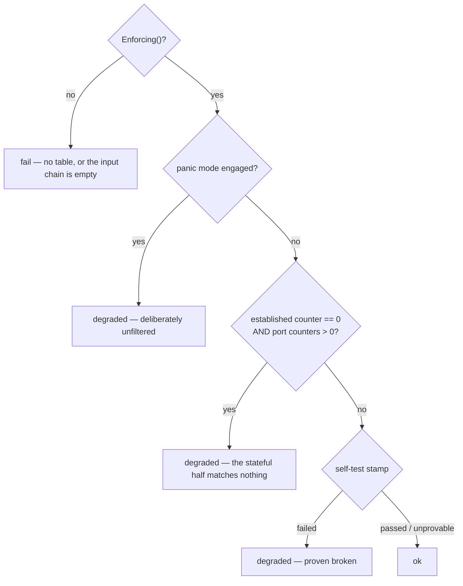

# 2.17 — It proves what it says

For five releases `ct state established,related accept` matched no packet. The
invalid-packet drop and the SSH brute-force meter reported themselves enabled and
enforced nothing. Every surface easywall has said the firewall was active, and it
was — enforcing a table whose stateful half was addressing conntrack bits no
packet ever carries.

Nothing in this repository could see it. The unit test that covered the rule had
written the defect down as expected output. It was found because an operator's VPS
went unreachable after `docker compose up -d` and they pasted the ruleset into
Discord.

This release is the machinery that would have caught it, at three depths, plus the
health check the project has never had. After it, easywall does not assert that it
is working — it measures it, and says so in a form Docker, systemd and a
monitoring system can each read.

Agreed with the maintainer on 2026-09-08: all three proof layers rather than the
cheap two, the self-test run once per version-and-kernel rather than every start,
`/healthz` on loopback by default rather than open, and **no layer may ever refuse
to filter**.

## 0 · The base this starts from

`main` is green. `go test ./internal/... ./cmd/...` passes at 84.4 % of statements
— web 92.0 %, shared 87.4 %, core 70.0 % — and there are no open pull requests.
The branch is cut from `b723422`.

Anything this branch finds and does not fix must be proven against that commit,
not against the branch head. `carried-forward.md` opens by naming the release that
got this wrong.

## 1 · What exists today, measured

| | |
|---|---|
| Health endpoints on the web process | **none.** 47 routes registered in `server.go`; no `/healthz`, `/livez` or `/readyz` |
| `HEALTHCHECK` in `Dockerfile` | **none.** A `docker run` has no health check at all |
| `docker-compose.yml:59` | `test -S /run/easywall/core.sock && wget -q … /login` |
| `docker/entrypoint.sh:12-18` | records why that line is the shape it is: the web process exited 1, supervisord restarted it for ever, and the container stayed *Up* because the check only looked at the core's socket |
| `systemd/easywall-core.service:19` | `Type=simple`, no `WatchdogSec`, no `NotifyAccess`. The unit is `active (running)` the instant `exec` succeeds — before the socket the web unit's `After=` waits for exists |
| `easywall-core` subcommands | `status`, `panic`, `resume`. No health, no self-test |
| `addEstablishedAccept` (`nftables.go:858`) | four expressions, **no `expr.Counter`** and **no UserData**. `RuleCounters()` skips every rule without an id comment, so this rule is invisible to every counter easywall reads |
| `Enforcing()` (`nftables.go:209`) | already distinguishes *the daemon is running* from *rules are live*, under a comment about the dashboard having shown green on the first claim alone |
| `shared.Reachable()` | 310 lines that duplicate `Apply`'s chain order by construction, coupled to the kernel by `reach_integration_test.go` |
| The veth harness | exists, as test code: `integration_test.go:32` re-execs `/proc/self/exe` under `CLONE_NEWNET`; `nftables_forward_test.go:37` builds the pair and two namespaces — using `unshare`, `nsenter`, `ip`, `ping`, `bash` and `timeout` |

The last row is the reason layer C is affordable and the reason it cannot be lifted
as it stands. Six external binaries are unremarkable in a test. In the root daemon
they contradict the first line of the security architecture: *no subprocess in the
apply path*.

## 2 · What "healthy" means

Three facts, evaluated in order. Not a composite boolean.



Two decisions inside it earn a paragraph each.

**The counter alarm cannot fire on a silent host.** `established == 0` on a machine
with no traffic is honest. The signature of the reversed-mask class is
`established == 0` *while* `sum(port counters) > 0`: a port accepted a SYN and no
reply found a rule. On a genuinely idle host both are zero and the state stays
`ok`.

**Panic mode reads `degraded`, and that deliberately diverges from `easywall-core
status`, which exits 0 under panic.** That exit code was ruled on and is not being
reopened: a machine somebody chose to unfilter is in a state somebody chose.
`carried-forward.md` has carried the consequence since 2.7 — *"a panic nobody
remembers never pages anyone"* — as operator-visible and unfixed. A monitoring
system asking after health is asking a different question from a console asking
after intent, and this is where the two are allowed to differ. **The entry is
closed by this release.**

## 3 · Layer B — the gate in front of netlink

`internal/core/nftables_check.go`, new. Every expression `Apply` builds passes
through it before `conn.Flush()`. It needs no kernel.

| Check | What it would have caught |
|---|---|
| A `Bitwise` behind `Ct{Key: CtKeySTATE}` masks a subset of `{invalid, established, related, new}` in **native** byte order | the three reversed masks, deterministically, with no namespace |
| Every `Verdict` names a kind the kernel knows; every `Jump` names a chain the same transaction creates | a jump into a chain an options switch did not create |
| Every chain jumped to from `input` ends in `drop` or `return`, never `accept`. The exceptions are an explicit list of chain names inside the checker, so adding one is a deliberate edit a reviewer sees | `reach_integration_test.go:184` — the SSH brute-force chain ended in `accept` and outranked the blacklist, so a blacklisted address could open SSH as long as it stayed under the rate limit |

`nftables_semantics_test.go` checks the *rendered* text for hex-formatted ct states
today. B moves that forward: the check runs in the production path, and the test's
job becomes proving the check fires.

**B never refuses.** A finding is written to the audit log, sets the state to
`degraded`, and the table is written anyway. The reasoning is `everConfigured`'s,
quoted from `restore.go:218`: *"the failure mode to avoid is the second one reading
false on a configured host: that would quietly stop enforcing rules somebody
wrote."* Red belongs in CI, where a finding breaks the build — that is where B is a
gate.

## 4 · Layer C — the proof, Go-native, once per version and kernel

`internal/core/selftest.go`, new. The privileged process gains no subprocess
surface.

| Step | Mechanism |
|---|---|
| The second namespace | re-exec `/proc/self/exe` with `Cloneflags: CLONE_NEWNET` — `integration_test.go:32`'s pattern, with easywall's own binary as the peer instead of `sleep` |
| The veth pair, peer end into the namespace | `RTM_NEWLINK` over `mdlayher/netlink`, already in the tree via `google/nftables`. **No new dependency** |
| Addresses and the route | `RTM_NEWADDR`, `RTM_NEWROUTE`, same path |
| The probe | `net.Listen` on the router side, `net.Dialer` inside the peer. Go, not `/dev/tcp` |
| Teardown | the peer process is killed; the namespace and both veth ends go with it |

A second namespace is not optional. Local delivery to any of the host's own
addresses goes out `lo`, and the input chain accepts `iif lo` immediately — a probe
against the host's own address proves nothing, which is what
`reach_integration_test.go:28` already records.

Four claims are proven, in a table of C's own inside C's own namespace. **The
host's real table is never touched.**

1. `established,related` lets a reply through — the defect this release exists for
2. An open port accepts a connection
3. A closed port does not
4. A blacklisted address does not get through an open port

### The stamp

`DataDir/selftest.json`, mode 0600, atomic rename — `usage.json`'s shape, for
`usage.json`'s reason.

```json
{"version":"2.17.0","kernel":"6.12.4-1","result":"passed","at":"2026-09-08T…Z","detail":""}
```

### Who runs it, and why not the daemon

**Corrected on 2026-09-08, while planning.** The spec first had `Daemon.Start`
run the proof. It cannot.

`systemd/easywall-core.service` sets `AmbientCapabilities=CAP_NET_ADMIN` and
`CapabilityBoundingSet=CAP_NET_ADMIN`, and nothing else — the unit's own comment
says *"nothing else is needed"* and is right about nftables. `CLONE_NEWNET`
requires **CAP_SYS_ADMIN**, which `integration_test.go:38` already records. Under
the shipped unit the daemon would fail to unshare and record `unprovable` on
every Debian-package installation, which is the primary install target. The proof
would never run where it matters, and the stamp would say so honestly for ever.

Widening the long-lived root daemon to CAP_SYS_ADMIN to buy a once-per-upgrade
check is the wrong trade, and it would contradict the sentence the unit is built
around.

So the proof gets its own unit:

```ini
# systemd/easywall-selftest.service
[Unit]
Description=easywall self-test (proves the rule builder against this kernel)
Before=easywall-core.service
After=network.target

[Service]
Type=oneshot
User=root
Group=easywall
ExecStart=/usr/sbin/easywall-core selftest --if-stale
AmbientCapabilities=CAP_NET_ADMIN CAP_SYS_ADMIN
CapabilityBoundingSet=CAP_NET_ADMIN CAP_SYS_ADMIN
# A failed proof must not stop the firewall from coming up. The exit code is
# recorded in the stamp and read by the health check; it is not a start
# condition. This is section 7's rule at the unit level.
SuccessExitStatus=0 1 2
ReadWritePaths=/var/lib/easywall /var/log/easywall
NoNewPrivileges=yes
PrivateTmp=yes
ProtectHome=yes
ProtectSystem=full

[Install]
WantedBy=multi-user.target
```

The wide capability now lives in a process that exists for milliseconds, holds no
socket, listens on nothing, and exits. `Before=` and not `Requires=`: the core
starts whether or not the proof ran, which is section 7's rule expressed in unit
ordering.

`--if-stale` reads the stamp and runs the proof when the version **or** the kernel
differs from the record, and skips otherwise. `easywall-core selftest` without the
flag always runs and always rewrites the stamp — that is the maintainer's
invocation. **The daemon itself never runs the proof**; it only reads the stamp
when answering `GET_HEALTH`.

In a container there is no systemd, the capability set is `NET_ADMIN` only
(`docker-compose.yml:32`), and `network_mode: host` is in force. The stamp is
therefore `unprovable` there, logged once by the entrypoint, and that is the
documented answer rather than a fault. The class of defect being prevented is a *build*
defect: identical on every start of the same binary, so proving it once is exactly
enough. The kernel is in the stamp for the case that would otherwise be lost — a
kernel upgrade under an unchanged easywall.

Three results:

| | |
|---|---|
| `passed` | audit entry `selftest_passed`, state unaffected |
| `failed` | audit entry `selftest_failed`, state `degraded`, **and the rules are written** |
| `unprovable` | no `CLONE_NEWNET`, no veth — the normal case in a container without `CAP_SYS_ADMIN`. Logged **once**, not per start. **Not `degraded`:** being unable to prove something is not the same as it being broken |

The proof runs in a unit ordered `Before=` the daemon, so it cannot delay or
prevent `RestoreCurrent` — it is not in the same process.

## 5 · Layer A — the counter that must never be zero

One expression and one field in `nftables.go`, and a rule about them.
`addEstablishedAccept` gains an `expr.Counter` and a `UserData` comment carrying
the reserved id `_established`.

Reserved ids begin with `_`. **Corrected on 2026-09-08, during Task 1:** this
paragraph first said `RuleCounters()` skips them, which contradicts section 2 —
the state machine reads the established counter, and `RuleCounters` is where it
comes from. `RuleCounters` therefore keeps reporting reserved ids, and the guard
sits one layer up, in `UsageStore.Collect`'s prune loop: an id beginning with `_`
is deleted from the record rather than never entering it, because that answer
both prevents the id appearing and heals a file already holding one.

The coupling being guarded is real but indirect. `liveRuleIDs()` reads the rules
file, so it never names `_established`, and the prune loop would drop it on that
ground alone; the explicit prefix check is what makes the separation stateable
rather than emergent. A guard pins that a reserved id never reaches `usage.json`
even when it is wrongly reported as live.

Health reads the counter through its own accessor, never through `UsageStore`.
That file's doc comment states that liveness comes from the rules and never from
the kernel, and it stays true.

## 6 · Surfaces

| Surface | What |
|---|---|
| `CmdGetHealth` | the protocol's **22nd** command. Read-only — one file and two netlink reads — so it keeps the short deadline. **No audit entry:** reading a counter is not an event, which is `GET_STATUS`'s and `GET_USAGE`'s reasoning already |
| `easywall-core health` | exits 0 / 1 / 2 for `ok` / `degraded` / `fail`, one line of text. The single source of truth |
| `easywall-core selftest` | runs C on demand, ignores the stamp, rewrites it |
| `/healthz` on the web process | **loopback only by default** — `health_allow` in `web.toml` is a list of addresses or CIDRs, defaulting to `["127.0.0.1/8", "::1/128"]`, the trusted-proxy list's pattern and parser from 2.13. `200` with `{"status":"ok"}`, or `503`. Coarse, no rule detail. Unauthenticated, because an orchestrator holds no session |
| `Dockerfile` | gains its first `HEALTHCHECK`. It calls `easywall-core health` **and** `/healthz`, because the recorded incident was a live core with a dead web process. `HEALTHCHECK` runs as the image's user, which `entrypoint.sh` leaves as root, so the CLI reaches the socket |
| `docker-compose.yml` | the ad-hoc `test -S … && wget /login` is replaced by the same check |
| `systemd/easywall-selftest.service` | new, `Type=oneshot`, `Before=easywall-core.service`, the only place CAP_SYS_ADMIN is granted. See section 4 |
| `systemd/easywall-core.service` | becomes `Type=notify` with `WatchdogSec`, and its capability set is **not** widened. `sd_notify` is a write to `$NOTIFY_SOCKET` — about 40 lines, no dependency. It closes a real ordering weakness: under `Type=simple` the core is `active` before its socket exists, which is what `easywall-web.service`'s `After=` is waiting for |
| Dashboard | the status line carries the health state. `degraded` gets a reason in words, never an icon alone |
| Audit | three actions — `selftest_passed`, `selftest_failed`, `health_degraded`. `de` and `en` at exact parity; `fr` where possible |

## 7 · Failure behaviour, in one place

| What goes wrong | What happens |
|---|---|
| The self-test cannot build a namespace | `unprovable`, logged once, state stays `ok` |
| The self-test disproves one of the four claims | `failed`, audit entry, state `degraded`. **The rules are written anyway** |
| Layer B finds an expression | audit entry, state `degraded`, table written. In CI: build red |
| The stamp file is unreadable | `usage.json`'s answer — warned, rewritten, never returned as an error. The proof runs once more than it had to |
| `/healthz` from an address not on the list | `404`, not `403`. Not confirming that an endpoint exists is the better default on an administration interface |
| The core does not answer | `/healthz` → `503` `{"status":"fail"}`. This is the case the endpoint exists for |

## 8 · How it is proven

Every guard is verified **by mutation**, never by reading. 2.12 found seven tests
that were green for the wrong reason; all seven were found by breaking the
implementation.

| Test | Goes red when |
|---|---|
| `TestCheckRejectsAByteReversedCtStateMask` | `ctStateMask` is put back on `BigEndian`. **The regression test for the reported defect** |
| `TestSelftestProvesEstablishedPasses` (integration) | the same mutation, against a real kernel |
| `TestSelftestUsesNoExternalBinary` | an `exec.Command` naming anything but `/proc/self/exe` appears in `selftest.go`. Pins the security architecture, not just the behaviour |
| `TestHealthIsOkOnASilentHost` | the counter alarm loses its `sum(port counters) > 0` condition |
| `TestReservedRuleIDsNeverReachUsage` | the `_` prefix is dropped from `RuleCounters` |
| `TestStampSkipsOnlyWhenVersionAndKernelMatch` | the kernel falls out of the stamp comparison |
| `TestHealthzIsLoopbackOnlyByDefault` | `health_allow`'s default opens up |
| `TestEveryHealthStateHasBothLocales` | a state or an audit action is left without a `de`/`en` label |

## 9 · Out of scope, deliberately

| | |
|---|---|
| The metrics endpoint | 2.19. A scrape format is a second public interface with a compatibility promise — the reasoning that makes 3.0 a major |
| Outbound traffic | 2.27 |
| A self-test against the host's **real** table | it would reconfigure the host for the duration of the test. A health check may not do that |
| Ending panic mode from the interface | ruled on in 2.7 and not reopened: the network-facing process may not re-arm a firewall a human disarmed at the console |

## 10 · Documentation this release carries

A fix carries its documentation, or the next audit finds the mismatch it created.

- `docs/_docs/features/health.md` — new; a **how-to**, for an operator wiring up
  monitoring. Plus `docs/features/health.md`, the four-line redirect stub every
  page under `_docs/features/` has at the top level
- `docs/_docs/configuration.md` — `health_allow`
- `docs/_docs/installation/docker.md` — the health check, and the `localhost`
  instruction `carried-forward.md` holds against this page from 2.15.1
- `docs-tech/protocol.md:9` — *Twenty-one command types* becomes twenty-two, and
  the demo table at `:110` gains a row
- `docs-tech/invariants.md` — the eight guards above
- `docs/schemas/` — the `web.toml` schema
- `docs/assets/img/screens/dashboard-{light,dark}.png` — re-taken; the status line
  changes. Both themes, 1600 / 900 / 390
- `docs-tech/packaging.md` — the second unit, and why it is the one place
  CAP_SYS_ADMIN appears. `debian/` installs and enables it
- `docs-tech/carried-forward.md` — the 2.7 panic-monitoring entry struck through
  and closed
