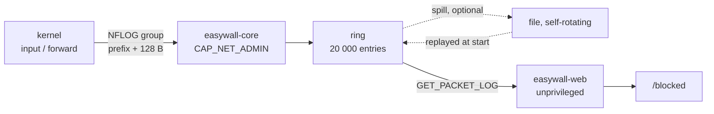

# 2.21 — You can see what it refuses

Blocked traffic becomes a page in the interface, filterable by source,
destination and port, with the three rules an operator would write next
reachable from the row that prompted them.

## 0 · What is actually broken, measured rather than read

`docs/_docs/features/filters.md` documents **ten** logging switches. Every one
of them works, and has since 2.5.0 fixed the bitmask that made the whole
feature inert. `internal/core/nftables.go:928` builds the expression; the ten
prefixes are real, rate-limited, and land in the kernel ring buffer.

The page then tells the operator what to do with them:

```bash
journalctl -k -f | grep easywall
```

That is the entire answer easywall has to *what is my firewall refusing*. It
requires leaving the product, holding a shell on the box, and reading a text
stream with no filter beyond `grep`. pfSense has had a filter log since it had
a web interface. FortiGate's is the reason people buy the appliance.

Three consequences, each checked in the tree rather than assumed:

| Fact | Consequence |
|---|---|
| All ten `*_log` keys default to `false` in `config/easywall.toml` | The feature is opt-in and nothing in the interface ever mentions it exists |
| `GET_LOG` is the **audit** log — administrative changes | There is no protocol command that carries a packet, and no type that could |
| The kernel log is text | Anything reading it is a text parser, which is what the 2.23 row rejects in as many words |

An operator cannot see what is being refused, cannot tell a port scan from a
misconfigured client, and cannot find out that the rule they wrote last week
is dropping their own monitoring. The firewall knows all three.

## 1 · The mechanism is already there

`addFiltered` installs every filtered module as up to two rules sharing one
match: a rate-limited log rule that falls through, then the rule that acts.
Both carry the same match, so what is logged is exactly what is dropped. That
property is the reason this release is small: **the log already says the truth,
it just says it into a text buffer nobody in the product can read.**

Everything routes through one function:

```go
func logExprs(prefix string, perMinute int) []expr.Any
```

Ten prefixes, one call site. Whatever that function emits, all ten follow.

## 2 · Why the kernel log cannot be the source

Two routes were considered. The first — the core reads journald or `/dev/kmsg`
and parses the lines — was rejected on three grounds:

1. It puts a **text parser in the root process**. The 2.23 row rejects exactly
   that, on the record, and building one here to delete it there is not a
   position this project can hold.
2. journald is not present in the Docker image.
3. A parsed line is a string. Filtering by source, destination and port means
   re-deriving structure that the kernel already had and threw away.

The second route is taken: **NFLOG**. `expr.Log` carries `Group uint16`,
`Snaplen uint32` and `LogFlagsNFLog`; setting the group bit routes the same
matched packet to `nfnetlink_log` instead of the ring buffer, and the prefix
survives as `NFULA_PREFIX`. The core already speaks netlink — that is what it
is for — and it already holds `CAP_NET_ADMIN`, which is exactly the privilege a
`NETLINK_NETFILTER` socket requires.

What arrives is a binary header of fixed structure, not a line of text. That
distinction carries the 2.23 argument and must be written down where the
decision is visible, or the next reader records it as a broken promise.

| Field | Source |
|---|---|
| Time, prefix, input interface, mark, conntrack state | NFLOG attributes |
| Source, destination, protocol, ports, TCP flags, TTL | first 128 bytes of payload |
| **Not available** | bytes per session (NFLOG is per-packet), geolocation, reverse DNS |

## 3 · The shape



The web process opens nothing. It asks, the way it asks for the audit log. The
separation this project is built on is untouched, and that is the only reason
this feature is affordable at all.

| File | Change |
|---|---|
| `internal/core/nftables.go` | `logExprs` sets the group bit, `Group`, `Snaplen: 128`. **One call site** |
| `internal/core/packetlog.go` *(new)* | NFLOG socket, header decode, ring, spill |
| `internal/shared/packetlog.go` *(new)* | `PacketLogEntry`, `PacketLogFilter` |
| `internal/shared/protocol.go` | `CmdGetPacketLog` |
| `internal/web/handler_blocked.go` *(new)* | page, htmx filter endpoint, row actions |
| `web/templates/blocked.html` *(new)* | |
| `locales/en.json`, `locales/de.json` | exact parity, ~40 keys |
| `internal/web/democlient.go` | a mock stream, so the demo has something to show |

`systemd/easywall-core.service` does **not** change: no
`RestrictAddressFamilies`, no `SystemCallFilter`, `CAP_NET_ADMIN` already
granted, and `/var/log/easywall` already in `ReadWritePaths`.

## 4 · Storage: one read path, not two

The ring is the **only** read path. The file is **optional**, and exists for
exactly one purpose — to let the ring survive a restart — by being replayed into
the ring at startup. With it switched off the page still works and simply starts
empty after a restart.

This matters because the alternative was two read paths, two test matrices, and
two answers to *why is my log empty*. There is one of each.

| | |
|---|---|
| Ring | 20 000 entries, configurable. ≈ 4 MB. ≈ 5.5 h at 60/min, ≈ 33 min at the 600/min ceiling |
| File | Append on write; compacted in place once it holds more than **twice the ring's entry count**, by rewriting it from the ring. **Self-rotating** — never depends on `logrotate` |
| Why self-rotating | `daemon.go:760` says of the audit log that `logrotate` is configured by the Debian package "but a manual install may not". At 150 B per administrative change that is a slow leak. At 100× the volume it is a full disk on the one machine that must not fall over |

## 5 · The page

Route `/blocked`. Columns:

```
Time · Interface · Source → Destination:Port · Proto · Rule
```

Monospace with tabular figures per `DESIGN.md`, `table-reflow` at 390px,
`toolbar` / `search` / `empty-state` reused rather than reinvented — the audit
log page already has all three.

- **Field filters** for source, destination, port, protocol, rule and
  interface, combinable, **reflected in the URL** so a view is shareable and
  bookmarkable. Clicking an address filters to it.
- **Drill-down** on a row: TCP flags, conntrack state, full timestamp.
- **Live tail** via `hx-trigger="every 5s"`. htmx is already shipped; this costs
  one attribute and no JavaScript.
- **Empty state.** All ten switches default to `false`, so a fresh install opens
  this page on nothing. The page says why and offers the switch. An empty screen
  is an invitation to act, not a blank table.

## 6 · The row actions, and the guard that makes them safe

Three actions per row: **whitelist the source · blacklist the source · open the
port**.

**They stage. They do not apply.** Every other page saves rules and applies them
on the apply screen inside the 120-second window; the ports page says so in
those words. A log page that armed a rollback timer on a single click would be
the one surprise in a product whose entire argument is that it cannot surprise
you. A counter reads *3 staged changes → Apply*.

**They ask the existing lockout predictor first.** `shared.Reachable` walks the
input chain in the order `nft.Apply` writes it, but it takes `proxied` and
`local` — which it deliberately cannot compute itself. `Server.reachVerdict`
in `handler_apply.go` is what assembles those, and it is **that** function the
three actions call, not `Reachable` directly. Calling the lower one would drop
the proxy case, where the address in the log is the proxy's and not the
operator's, and would hand back a confident verdict about the wrong host.

Each action computes the staged result, asks for the verdict, and refuses with a
named reason if it flips to blocked.

That trap is real and not theoretical: an operator whose own address appears in
the log because the SSH module rate-limited them is one click from blacklisting
themselves out of their own firewall. The guard exists; this release wires it to
three new callers rather than inventing a fourth.

Every action writes an audit entry through the existing machinery.

## 7 · What it costs

| | |
|---|---|
| **Break** | `journalctl -k \| grep easywall` returns nothing. `filters.md` is rewritten in the same change and the command is **replaced**, not deleted — a removed instruction with no successor is worse than a wrong one |
| **Break** | With `easywall-core` stopped, the kernel discards NFLOG packets. Today the ring buffer is written whether the core runs or not, so an external collector loses its feed when the daemon is down |
| **Collision** | An NFLOG group binds once per network namespace. A host already running ulogd2 on the chosen group fails to bind — so `nflog_group` is configurable and the failure is **loud**, never silent |
| **Dependency** | `florianl/go-nflog/v2`, MIT, v2.3.0. Its only dependency is `mdlayher/netlink`, which is already direct. No new transitive tree |
| **Not built** | Rollups, geolocation, reverse DNS, accepted traffic. The rollup in particular needs the data-visualisation language `DESIGN.md` lists under Known Gaps, and that decision belongs to the metrics release, not to this one arriving mid-build |

## 8 · Acceptance

`internal/core/netns.go` already builds network namespaces for the integration
suite, and `go-nflog`'s `Config` carries a `NetNS` field. The acceptance proof is
therefore not a mock:

**A real packet, dropped by a real rule in a real namespace, appears as a typed
event carrying the right prefix, source and port.**

Around it:

- unit tests decoding recorded NFLOG headers, IPv4 and IPv6, TCP/UDP/ICMP
- a truncated payload shorter than its own header, which must be discarded and
  counted, never rendered half-decoded
- ring wrap-around, and the spill file replayed into a ring of a different size
- a `Reachable` mutation test per action: break the guard, watch the
  self-lockout case go red
- `check:ui` at five widths in both themes, and `docs/assets/img/screens/`
  re-taken in this change

Every guard is verified by mutating the implementation, not by reading it.

## 9 · Roadmap amendment

The roadmap does not contain this release. It is being inserted rather than
substituted, and the amendment is written into `docs/_docs/roadmap.md` in the
same change, in the form the page already uses.

It takes **2.21**, and everything from the old 2.21 down moves one place. The
ordering principle is exposure, and it sits in *Understand what you do*
directly after 2.20: a notification tells you that something happened, and this
is the only surface that can tell you **what**. Push and pull again, the same
argument that keeps the metrics endpoint out of the notification release —
except that here the pull side is the one an operator reaches for first.

## 10 · Open questions for the plan

1. The default NFLOG group number. It must not collide with ulogd2's
   conventional 0/1/2, and the chosen value belongs in `filters.md` so a
   collision is diagnosable rather than mysterious.
2. Whether the spill file is on or off by default. Off is the safer default for
   a firewall; on is the one that answers *what happened last night*.
3. Whether IP addresses in a persisted file need a retention statement in
   `docs/security.md`. They are personal data, the file is new, and this project
   documents rather than discovers such things.
