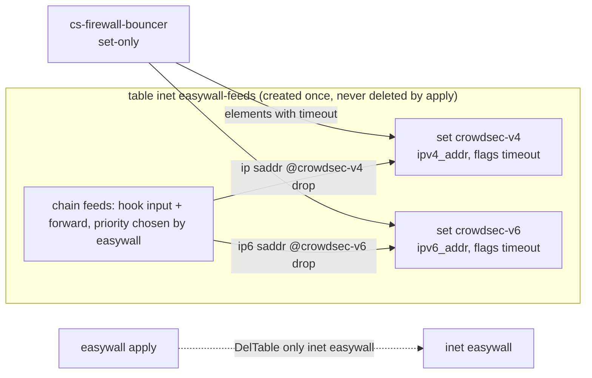

# 2.23 — research

Five reports, written 2026-09-24 from primary sources. Feed sizes were measured by downloading, not read off a web page. Kept as written; the spec cites them by section.


---

<!-- feeds-report -->

# Free IP blocklists for a small nftables host — measured 2026-09-24

All counts are from feeds downloaded with curl on 2026-09-24 (~13:50 UTC) into `scratchpad/feeds/` and counted with grep/Python `ipaddress`. Bogon check = overlap with 0/8, 10/8, 100.64/10, 127/8, 169.254/16, 172.16/12, 192.168/16, 192.0.2/24, 198.18/15, 224/4, 240/4, fc00::/7, fe80::/10. Cloud check = overlap with AWS `ip-ranges.json` + GCP `cloud.json` + Cloudflare `ips-v4`.

## Top findings

| # | Finding |
|---|---|
| 1 | **FireHOL level1 contains 10/8, 172.16/12, 192.168/16, 100.64/10, 127/8, 169.254/16, 224/3.** 97.6 % of its 611 M addresses are Team Cymru fullbogons. Applied to all input it locks out a LAN, Docker (172.17/16) and Tailscale (100.64/10). The non-bogon rest is Spamhaus DROP + DShield: only one /24 was left unexplained. |
| 2 | **Feodo Tracker is empty on purpose.** It holds 5 IPs, and "recommended" holds 1. The file was last updated 2026-03-04. abuse.ch says the families were taken down by law enforcement. |
| 3 | **SSLBL is deprecated** (2025-01-03), and **Spamhaus EDROP merged into DROP on 2024-04-10**. `edrop.txt` still returns HTTP 200 with zero entries, and pfBlockerNG still lists it. |
| 4 | **GreenSnow and FireHOL level2 list `172.18.0.2`**, a Docker bridge address. FireHOL level4 lists `10.0.0.163`, `10.0.22.229`, `127.0.0.1` and `192.0.2.2`. |
| 5 | **dan.me.uk's Tor list returns HTTP 200 with an error sentence** when you poll it more often than every 30 min. A naive parser gets an empty or garbage list. IPFire uses this URL. |
| 6 | **ThreatView "High-Confidence" contains `0.0.0.2`, `0.0.7.4`, `0.1.0.0`, `0.6.3.0`**, which look like version strings parsed as IPs. IPFire added this feed in 2025/26. |
| 7 | Talos `ip-blacklist` returns **403 behind a Cloudflare challenge**, so a script cannot fetch it. pfBlockerNG PRI1 still lists it. |
| 8 | IPFire's blocklist feature arrived in **Core Update 170**, not 2.29. |

## Candidate table

Legend: Cnt = data lines; /32 vs CIDR; v6 = IPv6 entries; Bog = bogon or private hits; Cloud = AWS/GCP/Cloudflare hits.

| List | URL | Contains | Format | Cnt | /32 · CIDR | v6 | Bog | Cloud | Updated (measured) | Poll limit (maintainer) | Terms (decisive) |
|---|---|---|---|---|---|---|---|---|---|---|---|
| Spamhaus DROP v4 | spamhaus.org/drop/drop_v4.json (txt: drop.txt) | hijacked / criminal netblocks | NDJSON; txt `cidr ; SBL` | 1713 | 0 · 1713 | – | 0 | 0 | 2026-09-24 09:56 | **≥1 h**, daily enough | free; no "Spamhaus" name in marketing |
| Spamhaus DROPv6 | …/drop_v6.json (dropv6.txt) | same, v6 | same | 91 | – | 91 | 0 | 0 | 2026-09-04 (Expires today) | ≥1 h | same |
| Spamhaus ASN-DROP | …/asndrop.json | 436 ASNs | NDJSON | 436 | ASN, not IP | – | – | – | today | ≥1 h | BGP use; needs ASN→prefix mapping |
| Spamhaus EDROP | …/edrop.txt | **empty, merged** | txt | 0 | – | – | – | – | – | – | – |
| FireHOL level1 | iplists.firehol.org/files/firehol_level1.netset | DROP+DShield+Feodo+**fullbogons** | CIDR, `#` | 4677 | 1 · 4676 | 0 | **10 (RFC1918 etc.)** | 1 | 2026-09-24 | none stated | no repo licence; upstream licences apply |
| FireHOL level2 | …/firehol_level2.netset | blocklist.de + DShield 1d + GreenSnow, 48 h | CIDR/IP | 25282 | 24599 · 683 | 0 | 1 (172.18.0.2) | 1245 | today | none stated | inherits GreenSnow's "no republication" |
| FireHOL level3 | …/firehol_level3.netset | bruteforceblocker, CINS, DShield 30d, myip, vxvault | CIDR/IP | 12720 | 11752 · 968 | 0 | 0 | 1478 | today | none stated | inherits upstream licences |
| FireHOL level4 | …/firehol_level4.netset | "large number of false positives" | CIDR/IP | 163436 | 154001 · 9435 | 0 | **6 (10.x, 127.0.0.1)** | 10592 | today | – | – |
| FireHOL webclient | …/firehol_webclient.netset | outbound only (cybercrime) | IP | 466 | 465 · 1 | 0 | 0 | 46 | 2026-09-22 | – | – |
| Feodo Tracker | feodotracker.abuse.ch/downloads/ipblocklist.txt | botnet C2 | IP, `#` | **5** | 5 · 0 | 0 | 0 | 2 | **2026-03-04** | every 5–15 min | page: CC0; abuse.ch ToS: commercial "may require a paid subscription" |
| SSLBL IP | sslbl.abuse.ch/blacklist/sslipblacklist.txt | **deprecated 2025-01-03** | – | 0 | – | – | – | – | 2025-01-02 | – | – |
| ThreatFox | threatfox.abuse.ch/export/csv/ip-port/recent/ | C2 `ip:port`, confidence field | CSV | ~726 KB | ip:port | ? | n/m | n/m | today | fair use | commercial may need paid plan |
| URLhaus | urlhaus.abuse.ch/downloads/text_online/ | **URLs**, not IPs | URL list | 16502 URLs | – | – | – | – | today | – | not an IP feed |
| ET compromised | rules.emergingthreats.net/blockrules/compromised-ips.txt | compromised hosts | IP, no header | 686 | 686 · 0 | 0 | 0 | **177 (26 %)** | 2026-09-23 | **≤1/h**; 30-min cool-down | ET Open BSD (sid ranges); file has no header |
| ET Block-IPs | rules.emergingthreats.net/fwrules/emerging-Block-IPs.txt | DROP + DShield + Feodo | CIDR/IP, BSD header | 1737 | 5 · 1732 | 0 | 0 | 3 | 2026-09-23 | ≤1/h | BSD-style in file |
| DShield block | feeds.dshield.org/block.txt (= isc.sans.edu/block.txt, www.dshield.org/block.txt) | top 20 scanning /24s, 3 days | TSV: start, end, prefix, … | 20 /24s | 0 · 20 | 0 | 0 | 0 | 2026-09-24 13:16 | no hard limit; back off 5 min on 429; **custom UA with contact** | commercial self-protection OK; "Do not resell the data." CC BY-NC-SA 4.0 |
| blocklist.de all | lists.blocklist.de/lists/all.txt | fail2ban reports, 48 h | IP | 32005 | 31552 · 0 | **454** | 0 | 1031 | every 30 min | none stated | none stated; "at your own risk" |
| blocklist.de ssh / mail / apache / bruteforcelogin | …/ssh.txt etc. | per service | IP | 11706 / 13598 / 10164 / 1551 | – | 7 / 34 / 132 / 108 | 0 | – | 30 min | – | same |
| CINS Army | cinsscore.com/list/ci-badguys.txt (cinsarmy.com also works) | Sentinel IPS attackers | IP | **15000 (cap)** | 15000 · 0 | 0 | 0 | 1287 | today 13:04 | none stated | "parse and use in any way you see fit" |
| GreenSnow | blocklist.greensnow.co/greensnow.txt | brute force, scans (cPanel hosts) | IP | 4574 | 4574 · 0 | 0 | **1 (172.18.0.2)** | 79 | today | none stated | site: "Reproduction or republication strictly prohibited." |
| IPsum ≥3 | raw.githubusercontent.com/stamparm/ipsum/master/levels/3.txt | IPs on ≥3 of 30+ lists | IP | 19549 | 19549 · 0 | 0 | 0 | 1362 | daily (commit 2026-09-24 01:09Z) | daily | Unlicense (but aggregates NC-licensed inputs) |
| IPsum ≥1 (full) | …/ipsum.txt | IP + list count | TSV | 130055 | – | 0 | 0 | 8863 | daily | – | same; 99 % of Tor exits |
| Tor exits | check.torproject.org/torbulkexitlist | Tor exit relays | IP | 1370 | 1370 · 0 | 0 | 0 | 0 | ~hourly (observed) | UNVERIFIED | CC0 (Tor Metrics data) |
| AbuseIPDB blacklist | api.abuseipdb.com/api/v2/blacklist | reported IPs | JSON / plaintext | ≤10,000 | – | ? | – | – | – | **5 requests per day** (free) | **free plans non-commercial**; API key needed |
| borestad AbuseIPDB mirror | raw.githubusercontent.com/borestad/blocklist-abuseipdb/main/abuseipdb-s100-30d.ipv4 | AbuseIPDB ~100 % confidence | IP `# CC AS name` | 152542 (1d: 51277, 7d: 74927) | – | 0 in this file | 0 | **28715 (19 %)** | several times a day | "maximum 30 days" | **no licence**; "with permission" of AbuseIPDB |
| Binary Defense Artillery | www.binarydefense.com/banlist.txt | honeypot attackers | IP | 5789 | – | 0 | 0 | 665 | 2026-09-23 | none stated | "public use only"; no commercial resale |
| BruteForceBlocker | danger.rulez.sk/projects/bruteforceblocker/blist.php | SSH brute force | `IP # date count id` | 677 | – | 0 | n/m | n/m | today (cache 300 s) | UNVERIFIED | UNVERIFIED |
| Dataplane sshpwauth | dataplane.org/sshpwauth.txt | SSH password-auth sources | pipe-delimited | 19324 | – | – | – | – | hourly | – | "non-commercial use ONLY"; no redistribution; "This is not a block list." |
| ThreatView IP | threatview.io/Downloads/IP-High-Confidence-Feed.txt | "high confidence" | IP | 23084 | – | – | **0.0.0.2, 0.1.0.0 …** | – | 2026-09-22 | – | UNVERIFIED |
| darklist.de | www.darklist.de/raw.php | SSH / spam sensors | IP | **0** | – | – | – | – | generated today, empty | – | – |
| botvrij.eu | www.botvrij.eu/data/ioclist.ip-dst.raw | OSINT IOC destinations | IP | **4** | – | – | – | – | **2026-02-03** | – | – |
| Talos | talosintelligence.com/documents/ip-blacklist | – | – | **403** | – | – | – | – | – | – | – |
| Blocklist Project | github.com/blocklistproject/Lists | **domains** (hosts format) | hosts | 435,119 domains | – | – | – | – | 2026-07-06 | – | not an IP feed |

n/m = not measured. All URLs are HTTPS except BruteForceBlocker, which also serves over HTTPS; pfBlockerNG and trick77 use `http://`.

## Sources for the table

- Spamhaus terms: https://www.spamhaus.org/drop/terms/ — 1713/91 records match the JSON metadata `"records":1713` / `91`. The hourly limit and the 2024-04-10 EDROP merge are stated at https://www.spamhaus.org/blocklists/do-not-route-or-peer/ ("Automated downloads must be at least one hour apart"). Terms §4.2 warns that stale copies block reassigned space.
- FireHOL: file headers (`includes: dshield feodo fullbogons spamhaus_drop`) and https://github.com/firehol/blocklist-ipsets. The README says the bogon lists "contain private, unrouteable IPs… you will be blocked out of your firewall" if applied LAN-side, and that "a few of these lists may have special licences". The repo has licence `null` (GitHub API). The raw GitHub copy was byte-identical today, but issue #366 ("No updates in 2 months", open since 2026-05-07) and trick77's config say to use iplists.firehol.org directly.
- abuse.ch: https://feodotracker.abuse.ch/blocklist/ (CC0; poll every 5–15 min), https://feodotracker.abuse.ch/faq/ (the datasets are empty after the Emotet takedown in 2021 and Operation Endgame in 2024), https://sslbl.abuse.ch/blacklist/ (5-min minimum; deprecation in the file header), https://abuse.ch/terms-of-use/ §4 (commercial use "may require a paid subscription"), https://threatfox.abuse.ch/faq/.
- ET: https://rules.emergingthreats.net/OPEN_download_instructions.html ("not recommend downloading… more frequently than once per hour"; 30-minute cool-down), https://rules.emergingthreats.net/open/suricata-7.0.3/LICENSE (ET sids are BSD). The Block-IPs header lists Spamhaus, DShield and abuse.ch as sources.
- DShield/ISC: https://isc.sans.edu/api/ ("It is ok to use this data for commercial purposes… to protect your own company's network"; "Do not resell"; CC BY-NC-SA 4.0 "if your lawyers ask"; custom User-Agent with contact; 429 means back off 5 min). The file header says "top 20 attacking class C (/24) subnets over the last three days".
- blocklist.de: https://www.blocklist.de/en/export.html ("generated every 30 minutes"; 48 h window; "to be used at your own risk").
- CINS: https://cinsscore.com/ (15,000 cap since 2017-09-25; "use in any way you see fit").
- GreenSnow: https://greensnow.co/ (footer). The FAQ at https://greensnow.co/faq says users are listed for wrong cPanel, mail or FTP passwords, which means real customers get listed.
- IPsum: https://github.com/stamparm/ipsum (30+ public lists, daily; the Unlicense).
- Tor: https://check.torproject.org/torbulkexitlist; CC0 per https://metrics.torproject.org/collector.html (footer "Data on this site is freely available under a CC0").
- AbuseIPDB: https://www.abuseipdb.com/pricing (free tier "Basic Blacklist up to 10,000 IPs", "5" blacklist requests per day), https://www.abuseipdb.com/legal ("You may not use Free plans for commercial purposes"; ToS forbids "republishing"), https://docs.abuseipdb.com/.
- borestad: https://github.com/borestad/blocklist-abuseipdb (licence `null` via API; "Recommended usage is the maximum 30 days").
- Artillery: header of https://www.binarydefense.com/banlist.txt.
- Dataplane: header of https://dataplane.org/sshpwauth.txt.
- darklist: https://www.darklist.de/raw.php (header only). botvrij: https://www.botvrij.eu/ plus the Last-Modified header. Talos: HTTP 403 "Attention Required! | Cloudflare". Blocklist Project: https://raw.githubusercontent.com/blocklistproject/Lists/master/abuse.txt header ("Format: hosts").

## (1) Overlap, measured

| A | ⊂ B | Share of A in B |
|---|---|---|
| Spamhaus DROP | FireHOL level1 | 100 % |
| Spamhaus DROP | ET Block-IPs | 100 % |
| DShield | FireHOL level1 | 100 % |
| DShield | ET Block-IPs | 60 % (different day) |
| blocklist.de all | FireHOL level2 | 97 % |
| GreenSnow | FireHOL level2 | 96 % |
| GreenSnow | blocklist.de all | 50 % |
| CINS | FireHOL level3 | 78 % |
| CINS | borestad 30d | 80 % |
| CINS | blocklist.de | 2 % (independent sensors) |
| ET compromised | CINS | 1 % (independent) |
| ET compromised | IPsum ≥3 | 63 % |
| Tor exits | IPsum ≥1 | 99 % (IPsum ≥3: 183 exits; borestad 30d: 911) |

Consequences:

- FireHOL level1 = DROP + DShield + fullbogons (+ the empty Feodo).
- ET Block-IPs = DROP + DShield + Feodo.
- IPsum and borestad silently block Tor exits.

## (2) Lists that can lock out a LAN

| List | What it contains |
|---|---|
| **FireHOL level1** | 0/8, 10/8, 100.64/10, 127/8, 169.254/16, 172.16/12, 192.0.2/24, 192.168/16, 198.18/15, 224/3 |
| **FireHOL level4** | 10.0.0.163, 10.0.22.229, 127.0.0.1, 172.18.0.2/31, 192.0.2.2, 238.209.5.182 |
| **FireHOL level2** and **GreenSnow** | 172.18.0.2 (Docker's second bridge) |
| **ThreatView IP** | 0.0.0.2 and three more addresses in 0/8 |
| Team Cymru fullbogons / bogons | by definition; IPFire warns it "can completely block access to the internet" if the uplink uses RFC1918 (https://www.ipfire.org/docs/configuration/firewall/ipblocklist) |

Every other list measured had 0 hits. What peers do about it:

- trick77/nftables-blacklist strips 0/8, 10/8, 100.64/10, 127/8, 169.254/16, 172.16/12, 192.0.0/24, TEST-NETs, 192.168/16, 198.18/15 and 224/3 from every feed before loading (`filter_private_ipv4` in `update-blacklist.sh`).
- OPNsense's docs pair FireHOL level1 with explicit exclusion aliases (https://docs.opnsense.org/manual/aliases.html).

**Recommendation: strip reserved and private ranges from every feed unconditionally, whatever the list.**

## (3) What other tools ship

| Tool | Default set | Source |
|---|---|---|
| **IPFire** (Core Update 170+) | 13 lists, each enabled individually: ET Block-IPs (1 h), ET compromised (1 h), Spamhaus DROP (12 h), DShield (1 h), Feodo recommended (5 m), CINS (15 m), Tor all / Tor exit via dan.me.uk (1 h), Team Cymru bogons (1 d) and fullbogons (4 h), ISC Shodan scanners (1 d), blocklist.de all (30 m), ThreatView (1 d). Uses a `disable` field so a composite switches off its subsets: ET Block-IPs disables Feodo, DROP and DShield. Applied on RED only. | https://git.ipfire.org/?p=ipfire-2.x.git;a=blob_plain;f=config/ipblocklist/sources (last change 2026-05-08); wiki above |
| **IPFire's reasoning** | "Some may find certain blocklists to be too aggressive"; "Don't enable all the lists - some of them are included in others"; categories weigh reputation (fewer false positives, slower) against attacker lists | wiki above |
| **pfBlockerNG** | Tiered catalogue, not a curated default. PRI1 "most reputable": Feodo ×3, (dead) ransomwaretracker, SSLBL, CINS, ET Block, ET compromised, ISC block, Pulsedive (key), Spamhaus DROP + **EDROP (empty)**, **Talos (403)**. PRI2–PRI5 go down to "may contain some false positives". Several entries are dead (badips, malwaredomainlist, ransomwaretracker). Hourly cron. | https://github.com/pfsense/FreeBSD-ports/blob/devel/net/pfSense-pkg-pfBlockerNG-devel/files/usr/local/www/pfblockerng/pfblockerng_feeds.json (last commit 2026-02-05) |
| **OPNsense** | No blocklist enabled by default. The "Block bogon networks" interface option is on WAN. Docs give Spamhaus DROP / DROPv6 as the canonical URL-table example and FireHOL level1 with exclusions. | https://docs.opnsense.org/manual/how-tos/drop.html, https://docs.opnsense.org/manual/interfaces.html |
| **trick77/nftables-blacklist** (renamed from ipset-blacklist) | "examples… not endorsements": Project Honey Pot, BruteForceBlocker, Spamhaus DROP v4/v6 JSON, CINS, blocklist.de all, GreenSnow, FireHOL level1 (from iplists.firehol.org), StopForumSpam 7d, ET compromised. Strips private ranges; optional auto-whitelist of the host's own IPs. | https://github.com/trick77/nftables-blacklist/blob/master/nftables-blacklist.conf |
| **UniFi CyberSecure** | Paid Proofpoint ET Pro plus Cloudflare; no free feed set | https://help.ui.com/hc/en-us/articles/25930305913751 |
| **Firewalla** | Closed source | UNVERIFIED |

Consensus across IPFire, pfBlockerNG PRI1, trick77 and OPNsense:

- all four: **Spamhaus DROP**
- three of four: **CINS**, **ET compromised**, **DShield**
- two to three: **blocklist.de**
- IPFire and pfBlockerNG: **Tor**, as a separate category

## Recommended default offer: each list opt-in, all off

| # | List | Why | Poll | Notes for the implementer |
|---|---|---|---|---|
| 1 | **Spamhaus DROP v4 + DROPv6** (JSON) | curated netblocks; 0 bogons, 0 cloud; in every peer's set | 12–24 h (hard minimum 1 h) | The UI may name it; do not use "Spamhaus" in marketing (§3.2). Treat the list as stale after Expires (§4.2). Parse NDJSON and skip the `type: metadata` line. |
| 2 | **DShield Recommended Block List** | 20 /24s, tiny, zero false positives measured; commercial self-protection explicitly allowed | 1 h | Send a User-Agent with contact info. The format is TSV: build `col1/col3`. Do not mirror or redistribute. |
| 3 | **blocklist.de all** (optionally ssh-only) | fail2ban community, 48 h window, the only list here with meaningful IPv6 (454) | 30 min–1 h | ~1000 cloud IPs; dynamic-IP false positives |
| 4 | **CINS Army** | independent sensors (2 % overlap with blocklist.de); permissive terms | 1 h | Capped at 15,000; 8.6 % are cloud IPs |
| 5 | **ET compromised-ips** | independent (1 % overlap with CINS); small; ET Open | ≥1 h | 26 % AWS/GCP IPs, recycled cloud addresses. Say so in the UI. |
| 6 | **Tor exit nodes** (torproject bulk list) | blocks users, not attackers; its own category, as IPFire and pfBlockerNG do | 1 h | CC0. Use torproject, **not** dan.me.uk (a 200 with an error body). UI copy must warn that it blocks Tor users. |
| 7 | **IPsum level ≥3** (optional "aggregate" choice) | broad, one daily file, Unlicense | 24 h | Overlaps 1, 3, 4 and 5; contains 183 Tor exits. Its sources include NC and "no republication" lists, so licence laundering is a risk. Mark it "aggregate, more false positives". |

In the implementation:

- Strip reserved and private space from every list.
- Never flush a set on an empty or unparsable download: keep the last good copy, and let it age out only past the list's Expires.
- Log per-list counts, so a feed that turns out empty (like Feodo or EDROP) is visible.

## Rejected

| List | Reason |
|---|---|
| FireHOL level1 | 97.6 % bogons incl. RFC1918/CGNAT, a LAN lockout; the rest is items 1 + 2 |
| FireHOL level2/3/4 | re-aggregation of 3/4 plus GreenSnow; level2/4 contain private IPs; level4 says it has "a large number of false positives"; no licence of its own |
| FireHOL webclient | outbound-only; 466 IPs |
| Spamhaus EDROP | merged into DROP 2024-04-10; empty file |
| Spamhaus ASN-DROP | ASNs, not prefixes; needs a BGP/ASN mapping source |
| Feodo Tracker | 5 IPs, not updated since 2026-03-04, empty by design; abuse.ch ToS now reserves commercial use |
| SSLBL | deprecated 2025-01-03 |
| ThreatFox | `ip:port` C2 IOCs, confidence-graded; SIEM/IDS material; commercial use may need a paid plan |
| URLhaus, Blocklist Project | URLs / domains, not IPs |
| ET Block-IPs | = DROP + DShield + Feodo; redundant with 1 + 2 |
| GreenSnow | "Reproduction or republication strictly prohibited"; lists a Docker IP; lists real customers who typed a wrong password |
| AbuseIPDB (API) | API key, 5 downloads per day, free plan non-commercial |
| borestad mirror | no licence; republishes AbuseIPDB data whose ToS forbids republishing; 19 % cloud IPs; 911 Tor exits |
| Binary Defense Artillery | "public use only" and a commercial-service prohibition; unclear for SMB operators |
| Dataplane.org | non-commercial only, no redistribution, "This is not a block list" |
| ThreatView IP | contains 0/8 garbage (0.0.0.2 …); terms UNVERIFIED |
| BruteForceBlocker | 677 IPs; terms UNVERIFIED; FireHOL level3 already carries it |
| darklist.de | raw list empty (0 IPs) |
| botvrij.eu | 4 IPs, last modified 2026-02-03 |
| Talos | 403 behind a Cloudflare challenge; cannot be fetched by a script |
| dan.me.uk Tor list | returns 200 with an error body when polled under 30 min; use torproject |

## UNVERIFIED

- Tor bulk exit list: no polling guidance from the maintainer was found.
- FireHOL / iplists.firehol.org: no rate limit found.
- blocklist.de, CINS, GreenSnow: no explicit polling limit.
- BruteForceBlocker and ThreatView: terms.
- Firewalla: default feeds.
- ThreatFox: IPv6 share and bogon hits not counted (CSV of ip:port).


---

<!-- crowdsec-report -->

# CrowdSec for easywall's curated blocklists (researched 2026-09-24)

Sources: crowdsec-docs `main` @ `c7a9e1e` (2026-09-24), cs-firewall-bouncer **v0.0.36** (2026-08-04), cs-blocklist-mirror v0.0.6, CrowdSec EULA v2.0.1 (2024-02-29), AbuseIPDB API docs and legal page (last updated 2023-03-15), Spamhaus DROP terms. Links are in the Sources section at the end.

## Summary

| Question | Answer |
|---|---|
| Community Blocklist without a Security Engine? | **No.** Docs say it is "**only** available when using the Security Engine" [D1] |
| Plain URL without an engine? | **Yes.** Blocklist-as-a-Service "Raw IP List" endpoint, HTTPS with Basic Auth, one IP per line [D2][D3] |
| Free plan limits on that URL | **1 pull per 24 h** (429 if you pull more often), **3 blocklists** in total across integrations and engines, third-party lists and free lists only [D2][D4][D5] |
| Does each user need a CrowdSec account? | **Yes.** Credentials are created per integration in the user's own Console [D2] |
| Can the bouncer write into an easywall set? | **Yes.** `set-only: true` looks up an existing table by name and fills a named set in it. **But** easywall's apply runs `DelTable(inet easywall)`, which would delete that set on every apply (see §3) |
| Can the data be redistributed? | **No.** EULA forbids distributing "IP addresses or attack scenarios", whether free or for a fee [E1] |
| Recommendation | Release 1: **BYOK Raw IP List** (the web process fetches it, 24 h floor), plus a **documented bouncer recipe that uses a separate easywall-owned table**. Do not ship the Community Blocklist itself: it needs an engine |

---

## 1. What the free tier gets you

### Community Blocklist (what an engine receives from CAPI)

| Tier | Who gets it | Size |
|---|---|---|
| Lite | free user who does **not** contribute regularly, or is flagged for abuse | "capped at 3 thousand IPs" [D1] |
| Community | free user who **does** contribute signals regularly | "15 thousand malicious IPs based on your reported scenarios" [D1] |
| Premium | paying user; contributing is not required | "up to 60 thousand" [D1]. **The docs disagree:** another page says "up to 50k" [D6] |

- **Only signals from unmodified Hub scenarios count.** Custom or edited scenarios do not count toward contributing (hash check) [D1].
- **The content is tailored to each engine,** based on the scenarios it has installed [D1]. A self-hosted box that sees little traffic, or one behind geoblocking or a VPN, may drop to Lite [D1].
- **"fire" is the CTI name for the full CrowdSec intelligence blocklist** [D7]. `total_fire` is described as the number of IPs in the Community Blocklist [D8]. The offline "fire" replica is a paid CTI product [D7][P1]. **UNVERIFIED:** whether any free route exposes it.

### Blocklist catalogue

| Tier | Contents | Limit |
|---|---|---|
| Community (free) | "Limited number of Blocklists (Third-party and Free)" | "limited to 3 Blocklists across Integrations and Security Engines" [D4]. Also: "On the community plan you can subscribe to 3 blocklists" [D5] |
| Premium (paid) | adds CrowdSec Premium lists and removes the limit | [D4] |
| Platinum (additional paid tier) | Platinum lists, "Starting at $1900 /month for SMB" | [D4][P1] |

- **Third-party lists** are "freely available on the internet" and go through CrowdSec curation [D9]. CrowdSec says it aggregates them from "providers with permissive licenses" [B2].
- **Third-party lists are not covered by the zero-false-positive promise** [D4].
- **Free third-party lists that are named in sources:** Firehol greensnow.co, Free Proxies, tor-exit-nodes [D10]; Firehol voipbl.org and Tor [B1]; Firehol cybercrime tracker [B3].
- **UNVERIFIED: the full free catalogue.** app.crowdsec.net/blocklists/search renders nothing without a login, and the catalogue API returns `401 Unauthorized` without a key.

**What this means for easywall:** the lists a free account can subscribe to are mostly public FireHOL-style feeds. easywall can fetch those from upstream with no account. What CrowdSec adds is its curation pass and one deduplicated URL.

## 2. Plain URL without an engine: Blocklist as a Service

| Aspect | Fact (source) |
|---|---|
| What it is | "a secure, hosted HTTPS endpoint serving live blocklists" [D2]. A firewall integration can "consume blocklists without installing any CrowdSec Security Engine" [D3] |
| Endpoint | `GET https://admin.api.crowdsec.net/v1/integrations/<integID>/content` [D2][D11] |
| Auth | HTTP Basic Auth. The username and password are shown **once**, when the integration is created, and can be regenerated later [D2][D11] |
| Format | `plain_text`: one IP per line. Vendor formats also exist (`fortigate`, `paloalto`, `checkpoint`, `cisco`, `f5`, `sophos`, and MikroTik) [D2][D11] |
| Optional aggregation | "Enable IP aggregation": IPs are aggregated into CIDR blocks [D2]. easywall's parser must accept CIDR lines as well as single IPs |
| Size | Default "Pull limit" is 10,000 IPs per pull [D2]. Pagination uses `?page=N&page_size=M` [D3][D11] |
| Response limit | Uncompressed responses above ~5 MB are **truncated silently**. Keep plain text at ≤300,000 per page, or send `Accept-Encoding: gzip` [D2] |
| Rate limit | Community plan: minimum interval 24 h. Enterprise: 1 h. Pulling more often returns **HTTP 429** [D2] |
| Contents | The deduplicated union of the lists subscribed to the integration. An integration with no subscriptions returns an **empty list** (CrowdSec's troubleshooting docs cover this case) [D12] |
| Free plan? | Yes, within the 3-list cap and the 24 h floor above |
| Per-user account? | **Yes.** Each user creates the integration in their own Console [D2] |

### Terms: may easywall document and offer this?

- **The EULA covers the Console and all data accessible through it.** "Assets" are defined as "all data transmitted to or accessible by the Crowdsec Console" [E1 §1], which includes BLaaS output.
- **§6.2 forbids distributing or marketing the Assets.** In particular: "distributing or marketing IP addresses or attack scenarios" [E1].
  - **Consequence:** easywall must never ship, mirror, cache for others, or proxy CrowdSec data. A per-user, user-supplied credential that pulls into that user's own firewall is the user's own use, which is the use the product is sold for. Documenting how to configure that is not distribution.
- **§6.2 also forbids using the Assets "to provide services on behalf of third parties"** [E1]. This is the user's constraint, not easywall's. It matters for a hoster who runs easywall for customers, and is worth one line in the docs.
- **§2: "This EULA will not grant any rights whatsoever for purely domestic use"** [E1]. Read literally, a home user gets no licence. How CrowdSec applies this in practice is **UNVERIFIED**, and they offer a free Community plan anyway. easywall's docs should link the EULA and leave the reading to the user; easywall should not paraphrase it as permission.
- **§13.1.2 is a GDPR clause:** the user "will not systematically block the connections" from the Assets, but "will rather adapt its security processes" [E1]. It sits oddly next to a blocklist product. Surface it by linking the EULA; do not interpret it.
- **Security hygiene:** the Basic Auth credential must live in the web process's config or secret store, never in logs, and must never be sent to the core.

## 3. The bouncer route: cs-firewall-bouncer v0.0.36, nftables mode

### Config keys (`pkg/cfg/config.go`)

```go
type nftablesFamilyConfig struct {
	Enabled  *bool  `yaml:"enabled"`
	SetOnly  bool   `yaml:"set-only"`
	Table    string `yaml:"table"`
	Chain    string `yaml:"chain"`
	Priority int    `yaml:"priority"`
}
```

- **Top-level keys:** `blacklists_ipv4` (default `crowdsec-blacklists`), `blacklists_ipv6` (`crowdsec6-blacklists`), `nftables_hooks` (default `[input]`; the shipped yaml sets `input, forward`), `deny_action` (DROP or REJECT), `deny_log`.
- **Shipped defaults:** `table: crowdsec` / `crowdsec6`, `chain: crowdsec-chain`, `priority: -10`, `set-only: false`.

### Mode A: own table (default, `initOwnTable`)

- **Creates `ip crowdsec` and `ip6 crowdsec6`.** These are separate families, not `inet`.
- **One base chain per hook,** named `<chain>-<hook>`, `type filter`, `priority -10` (it runs **before** easywall's filter-priority chains).
- **One set per origin** (`crowdsec-blacklists-<origin>`) with `HasTimeout: true`, and a rule `saddr @set counter drop` per set.
- **On shutdown it runs `DelTable`.**
- **It coexists with easywall without any easywall code.** A drop in any base chain is final. easywall's `DelTable(inet easywall)` never touches the `ip crowdsec` table.
- **Cost:** the bouncer's chain runs before easywall's chain, so easywall's allow rules and "cannot lock you out" guarantee do not apply to it. A CrowdSec ban on the admin's IP drops them regardless of easywall. easywall's panic, acceptance and rollback mechanisms do not see this table.

### Mode B: `set-only: true` (`initSetOnly`)

```go
c.table, err = c.lookupTable()               // ListTables(), match by Name only
set, err := c.conn.GetSetByName(c.table, c.blacklists)
// if missing: AddSet{KeyType: ipv4_addr|ipv6_addr, HasTimeout: true}
```

**Facts from the source:**

- **Table lookup ignores family** (`if t.Name == c.tableName`). An `inet` table works, and both the v4 and v6 contexts can point at the same `inet` table with different set names.
- **The table must already exist.** Otherwise init fails with "could not find table", so the bouncer's unit needs `After=easywall-core`.
- **The set is created if it is missing.** If easywall pre-creates it, it needs `flags timeout`, because elements are added with `Timeout: t` from the decision duration.
- **It adds no chain and no rule.** The docs confirm the drop rule is "the user's responsibility" [D13].
- **On shutdown it flushes the set** (`FlushSet`); it does not delete it.
- **CIDR decisions are truncated to a single address:** `*d.Value = strings.Split(*d.Value, "/")[0]`. The set has no `interval` flag, so a range decision bans only its network address.
  - **Inference: easywall should not count on ranges from the bouncer.**
- **State is streamed** (`csbouncer.StreamBouncer`): a full list at startup, then deltas. A failed commit is only logged (`unable to commit add decisions`), and the process keeps running.

### Why Mode B into `inet easywall` would fight

`NftablesManager.reset()` (internal/core/nftables.go:554) runs `DelTable(inet easywall)` and then `AddTable` on **every apply**. The fight plays out in four steps:

1. **The set disappears** along with every element in it.
2. **The bouncer does not refill it.** It only receives deltas from the stream after startup.
3. **Missing-set errors are only logged.** The bouncer keeps running.
4. **Result: the list is silently empty until the bouncer restarts.**

An nftables rule cannot reference a set in another table, so easywall cannot point a rule in its own table at the bouncer's set in `ip crowdsec` either.

### What easywall would have to provide (Mode B, safely)



1. **A second table, `inet easywall-feeds`,** that apply and reset never delete. It holds the feed sets for easywall's own curated lists and for the bouncer's sets. The table name must be short: the bouncer warns about "32 or 15 character limits".
2. **Sets pre-created by easywall** with `flags timeout`, named for example `crowdsec-v4` and `crowdsec-v6` (short names).
3. **The drop rule, in a chain easywall owns inside that table.** easywall must pick its priority relative to its own chain (priority `filter`, 0):
   - **Negative priority:** the drop runs first, as it does in the bouncer's own-table mode. The lockout risk above applies.
   - **Positive priority, after easywall's chain:** an easywall `accept` does not stop a later base chain, so this changes nothing for trusted IPs.
   - **Either way, the lockout guard needs one more step:** easywall excludes its own management sources from the set lookup, for example with an `ip saddr != @trusted` element in the feeds chain.
4. **Documented bouncer config:**

```yaml
mode: nftables
blacklists_ipv4: crowdsec-v4
blacklists_ipv6: crowdsec-v6
nftables:
  ipv4: { enabled: true, set-only: true, table: easywall-feeds }
  ipv6: { enabled: true, set-only: true, table: easywall-feeds }
```

5. **systemd ordering** (`After=` / `PartOf=` against easywall-core), so the table exists before the bouncer starts.
6. **UNVERIFIED:** whether `nft flush table` keeps set elements. The local man page says only "Flush all chains and rules of the specified table". Using a separate table avoids depending on the answer.

This matches the roadmap row for 2.25 ("A named set that fail2ban or CrowdSec can write into", docs/_docs/roadmap.md:287).

### Related: cs-blocklist-mirror (v0.0.6)

- **It turns a local engine's decisions into a plain-text HTTP endpoint** (`/security/blocklist`, default listen `127.0.0.1:41412`).
- **Auth options:** `none`, `ip_based` or `basic`.
- **This is the zero-code "engine" route for easywall:** a user who already runs an engine can hand easywall's web process a local URL, and easywall treats it like any other plain-text feed. No 24 h floor applies, because it is local.

## 4. Licence and privacy

| | Fact |
|---|---|
| Ownership | "The IP blocklists and global database belong to us, but a full, unlimited right to use is granted to the user, as long as they share the IP they block" [F1] |
| Software vs. data | The software is MIT. **Data is excluded** and falls under the EULA, which "prohibits to distribute or market the data" [F1][E1 §6.2] |
| Commercial use | The EULA's End User is someone "acting for business purposes" [E1 §1], which the domestic-use clause reinforces [E1 §2]. Embedding or reselling the data needs the Partnership programme (search-result summary of the FAQ, **UNVERIFIED** verbatim) |
| easywall bundling CrowdSec data | **Not allowed** (§6.2) |
| Signals the engine sends | scenario name, scenario hash and version, timestamp, machine_id, the offending IP and its geolocation. Also the list of enabled scenarios at login, and component versions [D14] |
| When signals are sent | only for unmodified Hub scenarios. Custom or tainted scenarios and manual decisions are sent only when the engine is enrolled in the Console [D14] |
| GDPR | The user is a data controller for the IPs they send and for the IPs they use [E1 §13] |

- **Privacy matters only if easywall recommends running an engine.** Contributing is what lifts a user from 3k to 15k IPs [D1], which means the lists are bought with the offending IPs you share.
- **BLaaS sends nothing** apart from the pull itself.

## 5. Other bring-your-own-key feeds

| Feed | Free-tier mechanism | Limits | Terms that matter | Fit for easywall |
|---|---|---|---|---|
| **AbuseIPDB `/api/v2/blacklist`** | `GET` with header `Key: …`, plus `Accept: text/plain` (or `plaintext`) to get one IP per line. Freshness is in the `X-Generated-At` header [A1] | **5 calls/day** on Standard (free) [A1]; **10,000 IPs** hard cap on free (Basic 100k, Premium 500k) [A1]; `confidenceMinimum` (25–100) is a **subscriber feature**, so free users get 100 [A1] | Free plans are for "non-commercial personal projects", and "may not use Free plans for commercial purposes" [A2]; one account per person [A2]; "No Resale of The Website or Data" [A2] | **Good.** Per-user key, plain text, pull every 6–24 h. The docs must state that the free tier is non-commercial only |
| **Spamhaus DROP / DROPv6** | **Keyless:** `https://www.spamhaus.org/drop/drop_v4.json` returns NDJSON of CIDRs plus a metadata line with `terms` [S1] | ~1,713 records at fetch time [S1] | "provided to you free of charge subject to these Terms" [S2]; no licence of IP rights is granted [S2]; the "Spamhaus" name may not appear in commercial or marketing material [S2] | Belongs in the **keyless** curated set, not BYOK. The docs should name it neutrally |
| **Spamhaus DQS** | Free account for DNSBL **queries** [S3] | "For non-commercial users only", with low query volumes [S3] | — | **Unsuitable:** it is a per-lookup DNS service, not a list a firewall can load into a set |
| **GreyNoise Block** | Per-list URL, either with an embedded token or with the API key in a request header; plain-text download; hourly refresh; up to 10 enabled lists [G1] | — | The product pages offer a "Free 14-day Trial" and "Request a quote" [G2][G3] | **Not free.** Skip it. A search snippet claimed a free tier with no card required; **UNVERIFIED**, and the pricing page contradicts it |

## Recommendation for the first release

1. **Ship: "CrowdSec Blocklist (your integration)"**, as one entry in the curated-lists UI, off by default.
   - **User input:** the integration URL plus the Basic Auth user and password.
   - **Fetched by `easywall-web`,** which already makes outbound requests. The core only receives parsed, validated addresses and CIDRs over the socket.
   - **Scheduling:** every 24 h at most, with jitter. Treat a 429 as "keep the last good set" (never "clear the set"), and send `Accept-Encoding: gzip` so the list is not truncated at 5 MB.
   - **Parsing:** accept both IPs and CIDRs, because aggregation is optional.
   - **Why:** no engine, no signal sharing, one credential, a format easywall has to parse anyway, and it is free.
   - **Honest caveats for the page:** at most 3 lists; mostly third-party lists; not the Community Blocklist; EULA linked, not interpreted.
2. **Ship alongside it: AbuseIPDB**, built with the same BYOK shape (key in a header, plain text, 5 calls/day so pull every 6 h or less often). Label it non-commercial only on the free tier.
3. **Document, not code: the bouncer and the mirror** for users who already run an engine.
   - **This release:** the simplest honest option is the bouncer's own-table mode, which coexists as-is. Name the lockout caveat plainly, or point easywall's plain-text feed at cs-blocklist-mirror on localhost.
   - **The roadmap's 2.25 named-set work:** build the `inet easywall-feeds` table described in §3, so `set-only` can write into an easywall-owned set that survives an apply. Until that table exists, **never document `set-only` against `inet easywall`**: every apply deletes the set, and the bouncer does not notice.
4. **Do not:** bundle, cache or mirror CrowdSec data for other users (§6.2); present the Community Blocklist as available without an engine; or pull more often than every 24 h on a free credential.

## Sources

- **D1** Community Blocklist — https://docs.crowdsec.net/docs/next/central_api/community_blocklist/ (repo `crowdsec-docs/docs/central_api/blocklist.md`)
- **D2** Integrations intro — https://docs.crowdsec.net/u/integrations/intro (`unversioned/integrations/intro.mdx`); Raw IP List — `unversioned/integrations/rawiplist.mdx`
- **D3** Firewall integrations — `unversioned/console/blocklists/integrations/firewall.md`
- **D4** Blocklists intro, tiers — https://docs.crowdsec.net/u/blocklists/intro/
- **D5** Subscription — `unversioned/console/blocklists/subscription.md`
- **D6** Premium features overview — `unversioned/console/premium_upgrade/features_overview.mdx`
- **D7** CTI offline replicas — `unversioned/cti_api/offline_replicas.md`
- **D8** Service API blocklists — `unversioned/console/service_api/blocklists.mdx`
- **D9** Blocklists overview — https://docs.crowdsec.net/u/console/blocklists/overview/
- **D10** Post-install blocklists — https://docs.crowdsec.net/u/getting_started/post_installation/console_blocklists/
- **D11** Service API integrations — `unversioned/console/service_api/integrations.mdx`
- **D12** Zero IPs troubleshooting — `unversioned/troubleshooting/issue_integration_fw_zero_ips.md`
- **D13** Firewall bouncer docs, set-only — `unversioned/bouncers/firewall.mdx`
- **D14** Central API data exchanged — `crowdsec-docs/docs/central_api/intro.md`
- **Bouncer source** — https://github.com/crowdsecurity/cs-firewall-bouncer/tree/v0.0.36 : `pkg/nftables/nftables_context.go`, `pkg/nftables/nftables.go`, `pkg/cfg/config.go`, `config/crowdsec-firewall-bouncer.yaml`, `cmd/root.go`
- **Mirror** — https://github.com/crowdsecurity/cs-blocklist-mirror/blob/v0.0.6/config/crowdsec-blocklist-mirror.yaml
- **E1** CrowdSec EULA v2.0.1 — https://booking.crowdsec.net/hubfs/EULA%20Crowdsec%20v2%20.pdf (linked from https://booking.crowdsec.net/crowdsec-eula)
- **F1** CrowdSec FAQ — https://www.crowdsec.net/faq
- **P1** Pricing — https://www.crowdsec.net/pricing
- **B1** https://www.crowdsec.net/blog/discover-crowdsecs-free-third-party-blocklists · **B2** https://www.crowdsec.net/blog/new-blocklist-catalog · **B3** https://app.crowdsec.net/blocklists/65a55718ff8363f6556e9d4b (search result title only)
- **A1** AbuseIPDB API docs — https://docs.abuseipdb.com/ · **A2** AbuseIPDB legal — https://www.abuseipdb.com/legal · pricing — https://www.abuseipdb.com/pricing
- **S1** https://www.spamhaus.org/drop/drop_v4.json · **S2** https://www.spamhaus.org/drop/terms/ · **S3** https://www.spamhaus.com/data-access/free-data-query-service/
- **G1** https://block.greynoise.io/docs · **G2** https://www.greynoise.io/products/block-pricing · **G3** https://www.greynoise.io/products/greynoise-block


---

<!-- code-report -->

# Curated IP blocklist feeds: what the code does today

Read in full: `internal/core/{nftables,firewall,daemon,rules,restore,panicmode,acceptance,health,nftables_check}.go`, `nftables_semantics_test.go`, `internal/shared/{models,protocol,validate,reach,packetlog,socketclient,telemetry}.go`, `version.go` (the request half), `internal/web/{notify,statedir,handler_blacklist}.go`, `blacklist.html`, `docs-tech/{protocol,invariants,threat-model,carried-forward}.md`, and `security.md` §"Every request that goes out". I also read the library code where it matters: `google/nftables@v0.3.0/set.go` and `mdlayher/netlink@v1.11.2/attribute.go`.

## Four findings that change the design

| # | Finding | Evidence |
|---|---|---|
| A | **There is no static nftables set anywhere today.** Each blacklist and whitelist entry becomes its own rule, compared inline. The only sets are dynamic per-source meters. A feed would be the first `Interval` set in the codebase. | `nftables.go:826-833`, `:2534-2685`, `:1875-1883`, `:1947-1953` |
| B | **Every kernel write deletes and rebuilds the whole table.** That covers apply, rollback, boot/resume restore and the Docker-bridge reconcile. A 50k-element feed set would be re-sent on every one of them. The core therefore needs its own stored copy of the feed data. | `nftables.go:667`, `:554-572`; callers at `firewall.go:445`, `:729`, `restore.go:137` |
| C | **The rebuild is not atomic.** `reset()` runs `DelTable`+`Flush` and then `AddTable`+`Flush`. The rules follow in a third `Flush`. Until that third flush lands, `table inet easywall` has no chains, so easywall filters nothing. A large set in the third flush widens that window (not measured). | `nftables.go:558-571`, `:866` |
| D | **`SetAddElements` puts every element into one nested netlink attribute, and its `uint16` length silently wraps above 64 KiB.** `MarshalAttributes` sets `a.Length = uint16(nlaHeaderLen + len(a.Data))` without checking the size. The elements must be sent in chunks of about 1–2k (an estimate), all inside one batch. | `nftables@v0.3.0/set.go:374-391`; `mdlayher/netlink@v1.11.2/attribute.go:92` |

Two further constraints:

- **Socket messages are capped at 1 MiB in each direction.** On the core side, `io.LimitReader` truncates silently and the result surfaces as "invalid JSON command".
- **`Status()` re-reads and re-marshals `rules.json` on every `GET_STATUS`**, which the web process sends roughly every 2 s via `statusTTL`.

Together these rule out carrying feed data inside `shared.Rules` or `rules.json`: that file holds three copies (Current, Staged, Backup).

---

## 1. How the blacklist and whitelist are modelled

### Model and storage

| | |
|---|---|
| Struct | `shared.Rules{ Blacklist []string; Whitelist []string }` (`models.go:62-69`), inside `RulesState{Current, Staged, Backup}` (`models.go:94-98`) |
| TOML | **None.** These are not config keys. They live in `<data_dir>/rules.json` (`config.go:434-436`, `RulesPath`), written atomically by tmp file and rename (`rules.go:317-344`) |
| Written by | `SAVE_RULES` with `rule_type:"blacklist"`, which lands in `SaveStaged` (`rules.go:148-159`). `ValidateRules(state.Staged)` runs before the save (`rules.go:191`) |
| Entry grammar | A bare IP or a CIDR, in either family. `#` comments and blank lines are kept (`IsListComment`, `validate.go:236-239`). Checked by `ValidateIPOrCIDR` (`validate.go:241-249`, using `net.ParseIP` and `net.ParseCIDR`). Builders parse with `ParseNetwork` (`validate.go:264-277`), which unmaps `::ffff:` networks |
| Guards | `Rules.IsEmpty` counts every field by reflection (`models.go:83-90`, `TestRulesIsEmptyCountsEveryField`). `TestDiffRulesReachesEveryRuleSet` requires `DiffRules` to reach every field. **Adding a feed field to `Rules` trips both guards and triples its size on disk** |

### How they become nftables objects

| | |
|---|---|
| Table | `table inet easywall`, the only table easywall touches (`nftables.go:40`, `:671-674`) |
| Chain | `input`: base, `filter`, hook `input`, priority `0` (`prioFilter`), policy **drop** (`nftables.go:677-684`) |
| Blacklist | One rule per entry. `addBlacklistRule` (`:2534-2583`) builds `meta nfproto`, a payload load of saddr (v4 offset 12 / len 4; v6 offset 8 / len 16), and a `cmp`. For a CIDR it adds a `bitwise` mask first (`cidrDropMatch`, `:2593-2636`). Then comes `drop`, via `addFiltered`, which inserts an optional rate-limited log rule ahead of it (`:1034-1045`). **No `expr.Counter` and no id comment** |
| Whitelist | One rule per entry. `addWhitelistRule` / `addCIDRAccept` (`:2638-2685`, `:2470-2532`) build the same match followed by `accept`. No counter |
| Sets | **None for these lists.** The only `AddSet` calls are dynamic meters |

The two meter set definitions, verbatim:

```go
// nftables.go:1875-1883  addPerSourceRateLimit (synflood/icmpflood/tcprst/sshbrute)
set := &nftables.Set{
    Table:      t,
    Name:       fmt.Sprintf("%s-%s", r.setPrefix, familySuffix(f)),
    KeyType:    f.keyType,          // TypeIPAddr / TypeIP6Addr (addrFamilies, :1802-1805)
    Dynamic:    true,
    HasTimeout: true,
    Timeout:    r.timeout,
}
// nftables.go:1947-1953  addConnectionLimit
set := &nftables.Set{ Table: t, Name: "connlimit-" + familySuffix(f), KeyType: f.keyType, Dynamic: true }
```

Families are handled by keeping one set per family, since the key width differs. That is the pattern a feed would copy: `feed-<id>-v4` with `TypeIPAddr` and `feed-<id>-v6` with `TypeIP6Addr`, both `Interval: true`. The library supports `Interval`, `AutoMerge`, per-element `Counter`, `FlushSet` and `SetAddElements` (`set.go:251-268`, `:374`, `:724`).

### Order of the input chain (`Apply`, `nftables.go:718-896`)

```
lo accept → ipv6 passthrough/block → icmp-flood / tcp-rst meters → ct established,related counter accept "_established"
→ icmp accepts → [forward chain built] → portscan, synflood, invalid, (fragments: own prerouting chain @-450), bogon (jumps; exempts whitelist+docker),
sshbrute (returns), connlimit, broadcast/multicast/anycast drops
→ docker CIDR accepts (:821) → BLACKLIST drops (:826) → WHITELIST accepts (:831) → TCP/UDP port accepts (:847)
→ [flush] → custom rules via `nft -f -` (:870) → final log (own flush, :884) → policy drop
```

- **A feed placed "after the whitelist"** would sit between `:833` and `:847`.
- **The established accept precedes everything.** A feed, like the manual blacklist, only blocks *new* connections; an open session survives.
- **Docker CIDR accepts precede the blacklist** (and would precede a feed too).

### Tests that pin the order and semantics (`nftables_semantics_test.go`, integration tag)

| Test | Line | Pins |
|---|---|---|
| `TestIntegration_BlacklistIsEvaluatedBeforeWhitelist` | 245-264 | The blacklist entry's text appears before the whitelist entry's in `nft list table` |
| `TestIntegration_Blacklist_DropsTheSourceAddress` | 187-206 | `ip saddr`, not `daddr`; the verdict is `drop` |
| `TestIntegration_Blacklist_IPv6UsesTheSourceOffset` | 208-220 | `ip6 saddr` |
| `TestIntegration_Whitelist_AcceptsRatherThanDrops` | 222-240 | |
| `TestIntegration_Apply_RefusesAnUnparseableEntry` / `…RefusalLeavesThePreviousRulesInPlace` | 366-405 | `ValidateRules` runs **before** `reset()` (`nftables.go:641`) |
| `TestIntegration_LogBlacklist_LabelsHitsBeforeDropping` | 439-459 | The log rule comes before the drop |
| `TestIntegration_IPv6Mode/passthrough` | 538-559 | The family verdict comes before any blacklist entry |
| `TestIntegration_ListComments_*` | 724-766 | |

The order is also duplicated in Go in two places. Both need a feed step:

- **`shared.Reachable`**, the lockout check (`reach.go:198-207`, steps 7 and 8). It is held to the kernel by `TestIntegration_ReachableAgreesWithTheKernel`.
- **`PacketLogEntry.DropReasonParsed` / `Remedies`** (`packetlog.go:80-103`, `:270-390`).

---

## 2. What an apply does, end to end

```mermaid
sequenceDiagram
  web->>core: APPLY_RULES (socket)
  core->>core: PanicEngaged? beginApply() slot (daemon.go:626-638)
  core-->>web: {"status":"started"}  (apply runs in goroutine, daemon.go:647-659)
  core->>core: collectUsageBeforeWrite; GetState; BackupCurrent; nft.Snapshot→log_dir; PromoteStaged (firewall.go:336-384)
  core->>core: acceptance.Start(duration) — window opens BEFORE kernel write (firewall.go:414-442)
  core->>kernel: nft.Apply(state, opts, nets) — ValidateRules, reset() [2 flushes], build, Flush, custom rules (nft -f), final-log Flush
  core->>core: resetUsageBaselines; panicLandedDuringWrite; auditBuildFindings; recordAppliedConfig
  core->>core: acceptance.Wait() — ACCEPT / CANCEL_ACCEPTANCE / timer
  alt not accepted
    core->>kernel: rollback → rules.Rollback() + nft.Apply(previous) (full rebuild again)
  end
```

| Question | Answer |
|---|---|
| Transport to the kernel | `google/nftables` v0.3.0 over netlink (`nftables.go:18`). Custom rules are the one exception: they go through the `nft -f -` subprocess (`:903-937`, 30 s bound `NftTimeout`) |
| Lock | `m.mu` is held for the whole `Apply`, subprocess included (`:626-627`). `Enforcing`, `RuleCounters` and `Snapshot` queue behind it |
| Acceptance window | `AcceptanceConfig{enabled, duration}`, 10–3600 s, default 120 (`models.go:249-270`). Opened before the kernel write (`firewall.go:414`). `Wait` times from `deadline` (`acceptance.go:145-180`). Off means applied without a window (`firewall.go:549-557`) |
| What happens to the table | **Delete and rebuild** on every write: `reset()` does `DelTable`→`Flush`→`AddTable`→`Flush` (`nftables.go:554-572`), then everything is re-added. The same happens in `rollback` (`firewall.go:729`), `RestoreCurrent` (`restore.go:137`: boot, resume, Docker bridge appearing) and the self-test (`selftest.go:263`) |
| **Would a 50k-CIDR set be rebuilt every apply?** | **Yes, and on every rollback, restore and reconcile too.** Nothing is incremental. `Apply` receives only `RulesState`, options and network settings, so a feed set has to come from something the core stores itself. The alternative is a separate "replace set contents" writer (`FlushSet` plus chunked `SetAddElements` in one batch) that runs outside apply. That would be a new kernel writer; see §8 |
| Existing size limits | Socket request 1 MiB, silently truncated (`daemon.go:566`). Socket response 1 MiB (`socketclient.go:17`, `:49`). No count limit on blacklist or whitelist. Custom rules capped at 256 (`daemon.go:957`). `/import` body 512 KiB (`handler_export.go:33`, per `packetlog.go:167`). Netlink nested attribute ≤ 65535 bytes, **silently wrapped** (finding D) |
| Cost already paid per status poll | `Status()` calls `HasPendingChanges()`, which reads `rules.json` and marshals both `Current` and `Staged` (`rules.go:199-216`, `firewall.go:868`). The dashboard and the notifier poll this (`statusTTL` 2 s, `server.go:226`; notifier 15 s) |

---

## 3. The socket protocol

- **Framing:** one JSON `Command{type, payload}` per connection, then `CloseWrite`, then one JSON `Response{success, data, error}` (`protocol.go:274-285`, `socketclient.go:24-59`). Socket mode is `root:easywall 0660` (`daemon.go:299-317`).
- **23 commands** (`protocol.go:70-188`, `AllCommandTypes`): `GET_RULES`, `SAVE_RULES`, `APPLY_RULES`, `ACCEPT`, `CANCEL_ACCEPTANCE`, `GET_STATUS`, `GET_OPTIONS`, `SAVE_OPTIONS`, `GET_SETTINGS`, `SAVE_SETTINGS`, `GET_SYSTEM`, `SAVE_SYSTEM`, `GET_LOG`, `EXPORT_RULES`, `IMPORT_RULES`, `VALIDATE_CUSTOM`, `GET_APPLIED_CONFIG`, `GET_USAGE`, `GET_HEALTH`, `PANIC`, `RESUME`, `LOG_EVENT`, `GET_PACKET_LOG`.
- **Timeouts** (`CommandTimeout`, `protocol.go:58-65`): 5 s by default. `IMPORT_RULES`, `VALIDATE_CUSTOM`, `PANIC` and `RESUME` get 35 s. A feed-push command that does netlink work behind `m.mu` would need the long deadline; there is a guard pattern for this (`TestTheClientOutwaitsWhatTheCoreMaySpendOnNft`).
- **Size caps:** 1 MiB each way, as in §2. Neither side can raise the cap per command today; it is a constant.

### Adding a command (`docs-tech/protocol.md:137-146`)

1. Add the constant and its payload struct in `protocol.go`, and append it to `AllCommandTypes`. The guards compare that list against the docs.
2. Add a `dispatch` case in `daemon.go:583-845`, with an audit entry if it changes state.
3. Add the `CoreClient` method (`internal/web/client.go`) and **the demo client beside it** (`democlient.go`).
4. If it touches the firewall, add an integration test in `internal/core`.
5. Update the command count in `docs-tech/protocol.md`, which currently says "Twenty-three".

---

## 4. Every outbound request the web process makes (the pattern a fetcher would follow)

|   | Update check | Telemetry | Notifications | ACME |
|---|---|---|---|---|
| Code | `shared/version.go:196-231` | `shared/telemetry.go:160-187` | `web/notify.go:69-138` | `web/acme.go`, `tlscert.go` (autocert) |
| Client | `&http.Client{Timeout: 5s}` | `Timeout: 10s` (`telemetryTimeout`), **CheckRedirect refuses** | `Timeout: 10s` (`notifyTimeout`), **CheckRedirect refuses** | the library's own |
| Transport / TLS / proxy | Zero `Transport`, so `http.DefaultTransport`: system roots, **`ProxyFromEnvironment`** (`HTTPS_PROXY` honoured) | same | same | — |
| Redirects | **followed (default ≤10)**, the only one that follows | refused | refused | — |
| Body cap | `io.LimitReader(…, 64*1024)` (`version.go:215`) | body not read | body not read | — |
| Scheduling | Lazy: `Checker.Info()` on a dashboard render starts `go c.refresh()` when the cache is stale. 24 h after a success, 1 h after a failure (`version.go:33-41`, `:110-140`) | goroutine: random ≤1 h spread, then `time.NewTicker(1h)`, sending when 24 h have elapsed (`telemetry.go:94-113`) | goroutine: `time.NewTicker(15s)` polls `statusForRender`, with **one retry** (`notify.go:207-265`) | autocert |
| Switch | `update_check *bool`, unset means **on** (`models.go:545`, `web/config.go:325-327`) | `telemetry *bool`, unset means **off**, re-read every attempt (`models.go:554`, `config.go:331-335`) | `notify_kind`/`notify_url` plus 4 trigger bools, all off (`models.go:556-571`) | `tls.acme` |
| Demo mode | **not disabled** (`server.go:318`) | not constructed (`server.go:335-338`) | `nil` (`notify.go:187-196`) | — |
| State | `<data_dir>/web/version_cache.json` 0600 (`web/config.go:375-380`) | `<data_dir>/web/telemetry.json` 0600 (`config.go:384-389`) | in memory (`notifyLastErr`) | `<ssl_dir>/acme` |

- **Web state directory:** `<data_dir>/web`, `easywall:easywall 0700`. It is created by `prepareStateDir` (`statedir.go:20-79`). Every file name must be on `stateFiles`: `TestEveryWebStatePathIsInTheStateDir` walks the `*Path` methods by reflection.
- **Core data directory:** `root:easywall 0750`. Every core `*Path` must sit **directly** in `data_dir` (`TestEveryCoreDataPathIsDirectlyInDataDir`), so a `feeds/` subdirectory would trip it.
- **The docs sentence:** `docs/_docs/security.md:274-276` reads "### Every request that goes out / Four, and this is the whole list." It is followed by a four-row table (`:278-283`). `docs/_docs/configuration.md:420-431` has the same sentence and a table. `TestBothPagesCountTheSameOutboundRequests` (`internal/shared/docs_outbound_test.go`) walks `internal/` and `cmd/` for `http.NewRequest(`, `http.Get(` and similar. Its `outbound` map names every file allowed to make a request. **A feed fetcher must add a map entry, a row in both tables, and change "Four" to "Five".** (`docs/security.md` itself is only a `redirect_to` stub.)

---

## 5. The blacklist page

| | |
|---|---|
| Routes | `GET /blacklist`, `POST /blacklist` (`server.go:580-581`); `POST /iplist/validate` (htmx) (`:587`) |
| Handler | `handler_blacklist.go:47-82`: renders `state.Staged.Blacklist` into `ipListData{Title, Entries, Validation}`. The POST validates, then calls `SaveRules("blacklist", parseIPList(raw))` |
| Template | `web/templates/blacklist.html`: one `<form>`, then a `.page-grid` with a textarea card (`:20-44`), a save bar, and an `.aside-stack` holding two aside cards: "what" (`:56-63`) and "order matters" (`:65-71`, key `blacklist_order_body`, `locales/en.json:385`: "This list is evaluated *before* the {}…") |
| Where feeds fold in | A second card inside the left column, below `#iplist-errors` or the save bar, in its own `<form>` (a separate POST, e.g. `/blacklist/feeds`). One toggle per feed. It adds no sidebar entry (sidebar at `base.html:116-119`). The "order matters" aside needs a sentence saying **feeds run after the whitelist**, which the roadmap requires the interface to show (`specs/2026-08-16-roadmap-2.7-to-3.0.md:527-530`) |
| Guards it touches | `TestTemplatesOnlyUseTranslatedKeys`, `TestLocaleFilesAreAtParity` (en and de exact), `TestEveryPageIsDocumented` (GET routes only), `TestTemplateClassesExistInStylesheet`, `TestDemoMode…`. Screenshots `docs/assets/img/screens/blacklist-*` must be re-taken |
| Roadmap overlap | **2.24** turns the blacklist textarea into a table with comment and expiry (`roadmap.md:286`), before **2.26** feeds (`:288`). The page's layout may change under this feature |

---

## 6. /blocked and NFLOG: attribution

| | |
|---|---|
| Log rule | `logExprs(prefix, perMinute, sink)` (`nftables.go:990-1020`): `limit` (per minute), then `log` with `NFTA_LOG_PREFIX`, and under NFLOG also `group` and `snaplen 128` (`packetlog.go:32`). Placed **before** the drop, carrying the same match (`addFiltered`, `:1034-1045`) |
| Prefixes | 10 constants, each `"easywall <name>: "` (`nftables.go:951-962`), e.g. `logPrefixBlacklist = "easywall blacklist: "`. The blacklist uses `log_blacklist_connections` and `…_limit` (`models.go:154-155`) |
| Decode | `entryFromAttribute` sets `e.Rule = shared.RuleFromPrefix(*a.Prefix)` (`core/packetlog.go:41-44`) |
| `RuleFromPrefix` | `shared/packetlog.go:411-422`: strip `"easywall "`, trim NUL/space and `:`, replace `-` with `_`, then **accept only names in `PacketLogRules`** (closed list of 10, `:394-397`). Anything else becomes `"other"` |
| **Can a feed drop be attributed to its feed?** | **Yes via the prefix, but not without code changes.** A prefix `"easywall feed-<id>: "` would decode to `feed_<id>`, which is not in the list, so today it shows as `other`. Options: add one `"feed"` rule name and carry the feed id in a new `PacketLogEntry` field parsed from the prefix; or grow `PacketLogRules` per feed. The second breaks the closed-enum and locale guards |
| Guards that fire | `TestEveryPacketLogRuleIsLabelled` (`blocked_rule_*` in en and de), `TestEveryBlockedRuleLeadsToItsOption` (an `/options` anchor or an explicit `""`), `TestLogsAnythingCountsEverySwitch` (reflection over `*_log` / `log_*` toml fields), `TestEveryLogRuleUsesTheManagersSink`, `PacketLogFilter.Validate` rule check (`:459`) |
| Row actions | `Remedies()` (`:80-103`) currently offers a whitelist remedy only for `drop`, `other` and `bogon`. **A feed row should offer "whitelist"**, because the whitelist precedes the feed. `DropReasonParsed` only explains `rule=="drop"` rows. A feed drop ends the packet before the final log, so no `drop` row comes from a feed; that function needs no feed step |
| Prefix length | The kernel caps the log prefix at 127 bytes (`NF_LOG_PREFIXLEN` 128, from memory, not verified). The feed id must be bounded |

---

## 7. Counters

| | |
|---|---|
| Existing | `expr.Counter` placed after the match and before the verdict, with the id in `UserData` as `TypeComment`. Used on port rules (`portAcceptRules`, `nftables.go:2734-2802`), the established accept with reserved id `_established` (`:1170-1198`), and the forward deny, which has a counter but no id (`:2351`). **The blacklist and whitelist carry none** |
| Reader | `RuleCounters()` sums `expr.Counter` by comment id across the `input` and `forward` chains (`:457-512`) |
| **Can a feed rule carry one?** | **Yes, with no reader changes.** Give the lookup rule an `expr.Counter` and a reserved id such as `_feed-<id>`. `IsReservedRuleID` means prefix `_` (`:1131-1133`). `Health()` skips reserved ids from the port sum (`health.go:263-272`) and `UsageStore.Collect` skips them (`usage.go:176`, `TestReservedRuleIDsNeverReachUsage`). GET_USAGE would then **not** carry the feed counter, so exposing it needs a new reply field or command |
| Per-element | `nftables.Set.Counter` (per-element counters) is supported by the library (`set.go:255`, `:645`). It costs memory per element across 50k elements; the per-rule counter is the cheap version |
| Id length | `userdata.Append` writes the length as `byte(len)` and wraps at 255 (`validate.go:47-68`). `ValidRuleID` checks port ids only, so a feed id needs its own bound |
| Lifetime | Every rebuild zeroes the counters. Every writer must call `collectUsageBeforeWrite` first (`TestEveryKernelWriteBooksTheCountersFirst`) |

---

## 8. Constraints from docs-tech and the specs

| Source | Constraint |
|---|---|
| Roadmap spec `specs/2026-08-16-roadmap-2.7-to-3.0.md` | :114 **Principle 4** — nothing produces outbound traffic unless switched on; feeds one at a time, never by default.<br>:117-122 **Principle 5** — feeds fold into the blacklist page; no new sidebar entry.<br>:125 **Principle 7** — "The privileged process never opens a connection to the internet… written into `docs-tech/threat-model.md`".<br>:502-545 — the web process fetches, validates and bounds; feeds come after the whitelist; the difference must appear in the UI; a size and count ceiling; refuse a new version that differs by >30 %; **only block, never permit**; a failed fetch keeps the previous version; rewrite `security.md`.<br>:565-567 (2.31 egress) — feed refresh must be auto-permitted once egress is allowlisted |
| `threat-model.md` | **Principle 7's sentence is not actually in `threat-model.md`** (read in full; only the spec and the 2.20 notes say it). The core must not trust the web process: `SaveStaged` validates in the core "because the whole design rests on the privileged side not trusting the unprivileged one" (`rules.go:182-192`). The core must re-parse every prefix, cap the count, and build the verdict itself |
| Lockout | "After the whitelist" only protects **whitelisted** sources. A feed containing `0.0.0.0/0`, `::/0` or a very short prefix drops every non-whitelisted new connection, including the operator's, unless the operator is whitelisted. The core should refuse over-broad prefixes. **`shared.Reachable` needs a feed step between steps 8 and 9** (`reach.go:204-209`), or `/apply`'s lockout verdict and the `/blocked` staging guard (`TestStageRefusesWhenTheVerdictFlips`) will say "open" while the kernel drops. `TestIntegration_ReachableAgreesWithTheKernel` enforces agreement |
| Whitelist-first ordering | `TestIntegration_BlacklistIsEvaluatedBeforeWhitelist` must stay green (the manual blacklist keeps its position). A new test must pin **whitelist before feed**, by the kernel's rendering and by name |
| New kernel writer | If feeds are refreshed outside `Apply`, the source-order guards are blind to it. They match only the literals `"f.nft.Apply("` and `"f.nft.Reset("` (`daemon_source_order_test.go:140`, `usage_collect_test.go:108`). A new writer needs the panic re-check (`panicLandedDuringWrite`), the counter booking and the apply slot (`beginApply`) or `m.mu`, and the guards must be widened |
| Builder rules | Rules go through `m.adder.AddRule` (`TestEveryRuleIsAddedThroughTheRecordingAdder`); `AddSet` on `m.conn` is fine. `CheckRules` reads top-level exprs only (`nftables_check.go:125-130`); a `Lookup` is harmless |
| Config and env | Feed switches in `FirewallOptions` or `NetworkSettings` would enter `DiffConfig` (`TestDiffConfigReachesEveryOption`), `TestEveryConfigKeyIsDocumented` / `…InTheSchema`, and `TestNoEnvVarTargetsARuleField` |
| `carried-forward.md` | No open entry about feeds. Its rule: anything this feature causes ships fixed, not carried |
| Outbound docs | `TestBothPagesCountTheSameOutboundRequests`, see §4 |

---

## 9. Health, selftest, panic and resume with feed sets

| Command | Behaviour today | With feed sets in `table inet easywall` |
|---|---|---|
| `panic` | Writes the marker, then `nft.Reset()`, which deletes and re-adds an **empty** table (`restore.go:350-392`, `nftables.go:554-572`). Without a daemon: `tearDownDirectly` calls `Reset()` (`subcommands.go:185-191`, `:627-669`) | **Feed sets go with the table. No extra work** as long as they live in that table. A feed refresher must refuse while `PanicEngaged()`, as `apply` does (`firewall.go:324`), or it would re-create state on an unfiltered machine |
| `resume` | Clears the marker, then `RestoreCurrent` does a full `nft.Apply` of stored `Current`, with no window (`restore.go:399-423`, `:52-209`) | Feeds come back only if `Apply` rebuilds them from core-stored data. **The web process cannot be asked at resume time**: the path is console to core |
| boot | `RestoreCurrent(RestoreReasonBoot)` runs before `net.Listen` (`daemon.go:227-237`) | Same as resume. The core must hold the last validated feed version locally (0600 file directly in `data_dir`) |
| `health` | `computeHealth`: not enforcing, then panic, then `established==0 && ports>0`, then build findings, then self-test (`health.go:70-232`) | Unaffected when feed counters use a reserved `_` id (skipped at `health.go:268`). `Enforcing()` needs only a non-empty input chain |
| `selftest` | Builds rules in its own namespace via `p.m.Apply(shared.RulesState{Current: rules}, …)` (`selftest.go:263`) | A new `Apply` parameter or state has to be passed here too. Five claims; none is about the blacklist |
| `status` | Reads `GET_STATUS` | — |


---

<!-- pihole-report -->

# Pi-hole & ecosystem: how lists are curated, updated, and fail (for easywall IP feeds)

Sources fetched 2026-09-24: `pi-hole/pi-hole@v6.4.3` (`gravity.sh`, `advanced/Templates/pihole.cron`, `automated install/basic-install.sh`), `pi-hole/FTL@v6.7.1` (`src/tools/gravity-parseList.c`, `src/database/gravity-db.c`), `pi-hole/web@v6.6` (`scripts/js/groups-lists.js`), `pi-hole/docs` (`docs/database/domain-database/index.md`), firebog.net HTML, `hagezi/dns-blocklists@main` (README, FAQ, sources.md, `ips/`), oisd.nl + oisd.nl/faq. Live HTTP header probes with curl.

## 1. Gravity update mechanics (gravity.sh v6.4.3 + FTL v6.7.1)

| Aspect | What the code does | Where |
|---|---|---|
| Schedule | Weekly, Sunday. Template `59 1 * * 7`; installer rewrites to minute `1+RANDOM%58`, hour `3+RANDOM%2` → random time 03:01–04:58 Sunday, fixed per install | `pihole.cron`; `basic-install.sh` L1522-1523 |
| Conditional GET | ETag: `--etag-save <file>.etag`, plus `--etag-compare` once an etag file exists (sends `If-None-Match`). Fallback `-z <cached file>` = `If-Modified-Since` from the cached file's mtime | `gravity.sh` L628-655 |
| Why both | Comment: IMS "not supported by raw.githubusercontent.com URLs", ETag is. **Confirmed live:** raw.githubusercontent.com returns 304 to `If-None-Match`, 200 to `If-Modified-Since` | L650-653; curl probe |
| Compression | `--compressed` if curl has libz | L515-521 |
| User agent | **None set** — curl's default UA. No `-A`/User-Agent anywhere in gravity.sh | grep |
| Timeouts | `--connect-timeout 10` only. **No `--max-time`, no `--max-filesize`** | L48, L798 |
| Error detection | `curl --fail -L`, exit code decides success; HTTP code only picks the message (403/404/408/451/500/504/521/522 mapped) | L794-838 |
| Allowed schemes | http, https, file, ftp, ftps, sftp; URL char whitelist regex `[^a-zA-Z0-9:/?&%=~._()-;]` → "Invalid Target" | L570-578, L762 |
| Self-block workaround | If the list's own host is blocked by Pi-hole, resolves it via the first upstream and passes `--resolve host:port:ip` | L660-715 |
| Change detection | After a 200: sha1 of the file vs stored `.sha1` → status 1 (updated) or 2 (unchanged). 304 → status 2 | `compareLists` L588-610, L846 |
| Failure fallback | Download failed **or 0-byte body** → if cached copy readable: *"using previously cached list"*, status 3, parse the cache. Else status 4, `number=0, invalid=0` | L867-888 |
| Whole-run safety | Builds a new `gravity_temp.db`, swaps at the end; old DB kept as backup (rotating, max 10) if disk ≥ 2× size; restore-from-backup tried 1..10 if copy step fails | L108-160, L383-420, L455-480 |
| Stale cache cleanup | Deletes `.domains/.etag/.sha1` of lists no longer active | L943-950 |
| FTL alert | `check_inaccessible_adlists()` selects `status IN (3,4) AND enabled=1` and logs a message per list (shown in the UI's diagnosis) | `gravity-db.c` L3143-3175 |

**Not done (gaps to note):** no minimum-size / shrink-ratio sanity check — a 200 with 10 valid lines replaces a 1 M-line cache; only a 0-byte body falls back. No max download size. No per-list age alarm ("unchanged for 6 months").

### Parsing / validation (FTL `gravity-parseList.c`)

| Rule | Detail |
|---|---|
| Comment lines skipped | first char `!` `#` `;` `[` (ABP, bash, PHP, ABP header) |
| ABP cosmetic rules dropped | `##`, `#$#`, `#@#`, `#?#`, `#%#` |
| Inline comments | everything from `#` stripped |
| Tokenising | split on space/tab; **IPv4/IPv6 tokens skipped** (hosts-file `0.0.0.0 domain`) via `inet_pton` |
| Normalise | trailing dot removed, lowercased |
| Valid chars | `[a-zA-Z0-9.-_]` + UTF-8 sequences |
| Hosts boilerplate | `localhost`, `broadcasthost`, `ip6-*` etc. are "false positives" — skipped, **not counted as invalid** |
| Invalid entries | counted (`invalid_domains`), first `MAX_INVALID_DOMAINS 5` distinct ones printed |
| Output per list | `number` (exact + ABP), `invalid_domains`, `abp_entries`, `date_updated` (only set when status = 1) |

### Dedup and counts
- Rows are `(domain, adlist_id)`; index "intentionally not UNIQUE as poor quality adlists may contain domains more than once" (`gravity.sh` L96). Cross-list duplicates are kept (provenance per list).
- Run summary prints total and `SELECT DISTINCT` count: "Number of gravity domains: N (M unique domains)" (L893-904). So the UI can say *which* list contributed an entry.

### Per-list status codes (docs + web UI)

| Code | UI text (web v6.6) | Icon | Badge |
|---|---|---|---|
| 0 | "List was not downloaded so far" / "List is disabled and not checked" | question | — |
| 1 | "List download was successful" | check | OK |
| 2 | "List unchanged upstream, Pi-hole used a local copy" | history | OK |
| 3 | "List unavailable, Pi-hole used a local copy" | exclamation | "check list" |
| 4 | "List unavailable, there is no local copy of this list available on your Pi-hole" | times | "replace list" |

For status 0 and 4 the UI shows counts as N/A (`groups-lists.js` L29-32).

## 2. Default list set and presentation

| | Finding |
|---|---|
| Default | Exactly one: `https://raw.githubusercontent.com/StevenBlack/hosts/master/hosts` (repo licence MIT) |
| Interactive install | A yes/no dialog: "Pi-hole relies on third party lists…", "Select 'Yes' to include: StevenBlack's Unified Hosts List" — it is **offered, pre-selected as the question**, user can decline | `basic-install.sh` L1085-1115 |
| Unattended install | Adds StevenBlack only if no adlist file exists | L1126-1134 |
| Why only one | No stated rationale in the source. **UNVERIFIED** (inference: one list with low breakage, the rest left to the user/firebog) |
| Lists UI columns | status icon (click → details), address, enabled toggle ("Enabled"/"Disabled"), comment (inline editable), groups (multi-select) | `groups-lists.js` L185-270 |
| Details row | Type (block/allow), Health status, Added, DB entry last modified, **Content last updated on** (relative + absolute), Number of entries (+ ABP share), **Number of non-domains**, DB ID | L26-86 |
| Groups | Each list assigned to groups; clients assigned to groups → per-client list sets | docs `group_management` |
| Apply | Adding a list does nothing until "Update Gravity" is run (Hagezi FAQ calls this "the one people forget") |

## 3. Community curation

### Firebog (WaLLy3K) — three tiers, not two
Page markup: 26 `bdTick`, 24 `bdCross`, rest unmarked.

| Mark | Stated criterion (quoted) |
|---|---|
| Tick (green) | "least likely to interfere with browsing" |
| Unmarked | no stated criterion — use at own judgement |
| Strike-through | "not recommended for use (E.G: Many false postives, deprecated, biased)" [sic] |

Other stated rules: contact list maintainers first about false positives; "Avoid using mirrored consolidated lists" (deprives maintainer); lists hosted on `v.firebog.net` give WaLLy3K aggregate stats via Cloudflare; a "Whitelisting Suggestions" section warns the more lists you add, the more false positives. **No quantitative FP threshold is published.**

### Hagezi — cumulative tiers with a breakage column

| Tier | Blocking type | Risk of breakage | Entries (today) |
|---|---|---|---|
| Light | Relaxed | Minimal | 43,700 |
| Normal | Relaxed/Balanced | Low | 164,176 |
| Pro (recommended) | Balanced | Low to moderate | 228,409 |
| Pro++ | Balanced/Aggressive | Moderate | 255,616 |
| Ultimate | Aggressive | High | 284,640 |
| TIF (add-on) | Threats only | Low | 2,249,543 |

- Tiers "build on each other, so pick exactly one"; TIF is an add-on to any tier; mini/medium variants are alternatives, never additive.
- Tier choice is framed by **who can unblock**: Normal = "unattended setups with no admin around"; Pro = "an admin nearby who can unblock things".
- Ratings are "a general guide, not exact error rates" (FAQ).
- FP handling: GitHub issues or support@hagezi.org, best-effort, "no guaranteed response time"; a public **Blocklist Lookup** (domains and IPv4) tells users which list/rule blocks an entry; one-off benchmark against 10,000 Umbrella Top-1M sites.
- Dead entries: "Dead entries get pruned regularly" (no interval stated).
- Build cadence: rebuilt several times a day; GitHub/jsDelivr publish **once a day, 11:00 UTC**; build mirror every build (~4–8 h).
- Legal: "A domain showing up on a list is a technical filtering decision, not a legal finding".

### OISD — functionality first, inclusion test
- Positioning: "prioritizes functionality over blocking"; goal "ZERO breakage".
- Upstream list is excluded if (quoted list, abbreviated): combination of other lists; too old / unmaintained; duplicate or mirror; malformed; too many FPs; contains a "should never be blocked" domain (apple.com, microsoft.com, google.com…); unsupported syntax. Most common reason: the never-block domain.
- The never-block list is **deliberately secret** (a list fixed to pass the test then produced a wave of FPs). Excluded lists are "re-checked daily".
- FPs are not reported upstream; per-list FPs and dead domains are public on the "included lists" page.
- Dead-domain pruning "Every 5 days". Updates "at least once every 24 hours".
- Tiers: big / small (+ NSFW / NSFW small, filtered to Tranco top 1M).

## 4. IP lists in this ecosystem — directly usable candidates

| List | URL | Format | Size (fetched) | Update | Licence | FP stance |
|---|---|---|---|---|---|---|
| Hagezi TIF IPs | `…/ips/tif.txt` (GitHub raw or jsDelivr) | plain IPv4, one per line, **no header, no comments, no CIDR, no IPv6** | 79,175 lines, 1,128,661 B | daily 11:00 UTC | repo GPL-3.0; sources have own licences ("check the source file") | Tier "Low"; general disclaimer; FP via issues |
| Hagezi DoH IPs | `…/ips/doh.txt` | plain IPv4 | 20,310 B | daily | GPL-3.0 | companion to DoH-only list; needs 53/853 block too |
| Hagezi nameserver | `…/ips/nameserver.txt` | plain (not inspected) | 1,384,425 B | — | GPL-3.0 | **UNVERIFIED** purpose, not in README tables |
| Spamhaus DROP v4 | `https://www.spamhaus.org/drop/drop_v4.json` | NDJSON `{"cidr","sblid","rir"}` + trailing metadata record (`records`, `copyright`, `terms`) | 1,713 CIDRs | `Last-Modified` + `max-age=3600` | Spamhaus terms at `/drop/terms/` — **UNVERIFIED** content | — (also a Hagezi TIF source, via `drop.txt`) |

**Validation findings on TIF IPs (run today):**
- 4 non-global addresses present: `100.83.3.144` (**100.64.0.0/10 CGNAT — also Tailscale's range**), `245.185.47.110`, `247.16.181.135`, `249.223.175.5` (240/4 reserved). A feed must be filtered for non-global addresses before loading.
- 0 hits in sampled CDN/resolver ranges (Cloudflare 104.16/13, 172.64/13, 1.1.1.0/24; 8.8.8.0/24; 9.9.9.0/24; Fastly 151.101/16; Akamai 23.0/12; CloudFront 13.32/15; GitHub 140.82.112/20). Not a proof of no shared-hosting IPs.
- Hagezi's own IP-list advice is for AdGuard Home (blocks domains resolving to listed IPs); nothing about firewall FP handling specifically. IP-level shared-hosting FP risk is **not addressed** in their docs.

**HTTP politeness facts (probed):**

| Host | ETag | 304 on If-None-Match | IMS honoured | Cache-Control |
|---|---|---|---|---|
| raw.githubusercontent.com | strong | yes | **no (200)** | max-age=300 |
| cdn.jsdelivr.net `@latest` | weak `W/` | not tested | not tested | max-age=604800, s-maxage=43200 (up to 12 h stale at edge) |
| spamhaus.org | — | — | Last-Modified present | max-age=3600 |

## 5. Lessons for easywall

| Pi-hole / ecosystem practice | easywall consequence |
|---|---|
| One default, offered at install, user can decline (StevenBlack) | Ship one suggested feed (e.g. Spamhaus DROP — small, CIDR, low FP) **visible but off**; one click to enable |
| Hagezi frames tiers by "who can unblock" | Label feeds by risk of breakage (Low / Moderate / High) + one line on who should use it; do not invent light/normal/aggressive unless feeds nest |
| Status 0–4 per list, icon + text + badge "check list"/"replace list" | Copy the 5-state model almost verbatim: never fetched / updated / unchanged / failed-using-cache / failed-no-cache |
| Details: entries, invalid count, "content last updated" (only on real change), added | Show entries, rejected-entry count (+ first 5 samples), last changed, last checked — keep "changed" and "checked" separate like `date_updated` |
| ETag + IMS fallback | Send both; ETag matters for GitHub raw (IMS ignored there) |
| No UA set | Do better: descriptive UA `easywall/<ver> (+https://easywall-project.org)` — **UNVERIFIED** whether any feed requires it |
| Weekly, randomised minute/hour per install | Randomise per install to spread load; daily is appropriate for threat feeds (Hagezi publishes daily, Spamhaus hourly headers); weekly is Pi-hole's choice for ad lists |
| Failure → keep cached copy, 0-byte body → cache | Same, and add what Pi-hole lacks: **shrink guard** (reject a new copy that drops >X% vs cache), max body size, total timeout |
| No dead-list detection beyond status 3/4 | Add age alarm: "unchanged for N days" and "failing for N runs" (FTL only surfaces current 3/4) |
| Self-block workaround (`--resolve`) | Equivalent risk: a feed could list the feed host's own IP → next fetch fails. Exempt feed source IPs, or at least detect and report it |
| Parser counts but tolerates junk; hosts boilerplate not "invalid" | Validate with `netip.ParsePrefix`/`ParseAddr`; drop and count non-global (TIF contains CGNAT and 240/4 today); never let `0.0.0.0/0`-like entries through |
| Provenance kept per list, dedup only for the count | Keep per-feed sets (one nft set per feed) so the UI can answer "which feed blocks this IP" — the Hagezi Lookup pattern |
| OISD never-block list | Maintain a built-in never-block set (own management IP, gateway, configured DNS resolvers, feed hosts) applied after every fetch |
| Firebog: prefer original over mirror | Point at the maintainer's canonical URL (GitHub raw for Hagezi — daily, strong ETag, 304) rather than jsDelivr `@latest` (edge may serve up to 12 h old) |


---

<!-- root01xvp-report -->

# root01xvp as a blocklist sensor: what the repo shows

Read-only study of `~/projects/wdk-ansible` @ `030727e`. No host contacted, no ansible run. Paths are relative to that repo unless marked `easywall:`.

## Verdict

**Today, root01xvp detects attackers in one place only: fail2ban inside the mailserver container. It publishes nothing and exports nothing.** Every other source is either switched off, removed, or a raw log that nothing turns into decisions. Building a feed means **writing a new detector** (for example sshd failures from `auth.log`). It does not mean exporting one that already exists.

## 1. What detects or records malicious actors

| Source | State | Evidence | Usable as a feed signal? |
|---|---|---|---|
| **Host fail2ban** | **Not running, not managed.** The playbook was deleted 2026-08-20; `fail2ban is inactive` measured | `playbooks/linux/host_specific/CLAUDE.md` §"fail2ban on the host is not managed"; `docs/disaster-recovery.md:83-87` | No |
| **Mailserver fail2ban** (docker-mailserver 16.0.1) | **On** (`ENABLE_FAIL2BAN: "1"`). No jail override in the repo, so upstream defaults apply | `playbooks/linux/host_specific/tasks/mail.yml` (container env); `docker_images.yml:44` | **Yes, the only live one.** SMTP/IMAP/Sieve brute force |
| — upstream defaults (read from DMS `target/fail2ban/jail.local`, master; not re-checked at the 16.0.1 tag) | `bantime=1w`, `findtime=1w`, `maxretry=6`, `ignoreip=127.0.0.1/8`, `banaction=nftables-allports`. Jails: `dovecot`, `postfix` (mode extra), `custom` (bantime 180d) | upstream file | Bans live in the container's own nftables, invisible to easywall |
| **CrowdSec** | **Removed 2026-08-18** from both hosts. It had locked out "the operator, his parents and customer users". It held 2955 bans against 0 LAPI decisions, and those bans could never expire | `docs/superpowers/specs/2026-08-18-cluster-check-skill-design.md:33-41`; `…/2026-08-20-hetzner-firewall-iac-design.md:246-250`; `files/scripts/backup-docker-databases.sh:159-162` | No. It is also the precedent for what false positives cost here |
| **easywall** (`easywall-fw`, pinned `v2.22.0`) | **Enforcing since 2026-09-15.** Seed has `ssh_brute_force`, `icmp_flood`, `syn_flood`, `port_scan`, `drop_invalid` **on**, and every `*_log` **off**. There is no `[packet_log]` section, so `persist=false` (easywall default; `packets.log` "holds IP addresses") | `playbooks/linux/security/easywall.yml`; `files/templates/easywall-fw.toml.j2` `[firewall]`; `easywall: internal/shared/models.go:316` | **Not today.** It drops, but records nothing. The interface can turn logging on, but the repo does not show that anyone did |
| **nginx** | JSON access log **with `remote_addr`** for every vhost. `limit_req` `wp_login` 20r/m (→429) on the two WordPress sites, `easywall_telemetry` 6r/m. `xmlrpc.php` `deny all` + `access_log off`. `limit_conn default 100` | `playbooks/linux/host_specific/tasks/nginx.yml:97-154, 319-333, 740-741` | Raw material only; nothing classifies it |
| **Wordfence** (WordPress plugin, mpinet / ihremoderatorin) | Answers 503. Alloy relabels `"status":503` lines as `job=wordfence` | `files/templates/logging/alloy-config.alloy.j2` (stage.match) | Plausible WAF signal, but it lives in a third-party plugin |
| **telemetry vhost** | **Deliberately logs no client address.** Format is `$time_iso8601 $arg_id $arg_v`, vhost `access_log off` | `nginx.yml:135-140, 612-627`; `tasks/easywall-telemetry.yml` header | No, by design |
| **sshd** (devsec `ssh_hardening`) | Listens on `0.0.0.0`/`::` port 22. Key-only, root login off, `AllowUsers jpylypiw svc-semaphore svc-backup`, `AllowTcpForwarding no`. Hetzner allows 22 from `0.0.0.0/0, ::/0`, and an assert **forbids narrowing it** | `playbooks/linux/security/ssh-hardening.yml`; `group_vars/all/firewall.yml`; `security/hetzner-firewall.yml` (assert) | `auth.log` is the best raw signal (see §6) |
| **rspamd + Abusix + postscreen** | Consumes reputation (Abusix Mail Intelligence RBLs, `abusix_api_key` in vault) and does not produce any. postscreen cache was broken until 2026-09-15 | `files/templates/abusix/rbl.conf.j2`; `docs/runbook.md:617-655` | No (inbound lists only) |
| **Log shipping** | Alloy → Loki over WireGuard. `tier=forensics` (nginx-access, auth, audit, wordfence, postfix transactions) is kept **365 days**; `tier=ops` 90 days | `tasks/logging.yml`; `docs/superpowers/specs/2026-08-30-logging-pipeline-design.md:116-146, 237-239` | **The practical data source.** A year of IPs, queryable off-host |
| Honeypot | **None** | no match in the repo | — |
| Blocklist export / publishing job | **None** | no match | — |
| GeoIP | **None** | no match | — |

## 2. What the public can reach, and so which attacks the host sees

The Hetzner Cloud Firewall sits **in front** (`group_vars/all/firewall.yml`, authoritative, 14 rules). Anything aimed at a closed port is dropped before it reaches the host. **So easywall's `port_scan` sees almost nothing, and a scan-based feed from this host is not possible.**

| Exposed | Service | Attacks it would see |
|---|---|---|
| tcp/22 | sshd (host) | SSH credential brute force, invalid-user sweeps |
| tcp/25, 465, 587 | postfix (container, DNAT) | SMTP AUTH brute force, spam sources, open-relay probes |
| tcp/143, 993, 4190 | dovecot / ManageSieve | IMAP/Sieve credential stuffing |
| tcp/80, 443 | nginx, about 20 vhosts incl. 2× WordPress, Matomo, rspamd UI, demos, reverse proxies into the home cluster | WordPress `wp-login` / xmlrpc stuffing, vulnerability scanners (for example CVE-2026-63030 "wp2shell", named in the logging spec) |
| udp/9731, 8888, tcp/30033 | TeamSpeak | little brute force; mostly floods |
| udp/51820 | WireGuard | silent to unauthenticated peers, so no signal |

**Volume figures the repo actually states:**
- nginx access log: about 9–10 MB/day.
- `auth.log`: 2.5 MB/day. This is the logging spec's measurement from 2026-08-30. No attempt count is stated.
- postscreen: 744 warnings on 2026-09-15, one per inbound SMTP connection. That puts inbound connections at 744 or more on that day.
- WordPress: "distributed low-and-slow credential stuffing … August 2026, one attempt per IP per ~10 minutes" (`nginx.yml:324-326`).
- Nothing in the repo counts SSH attempts or fail2ban bans.

## 3. Where a daily feed could be served, and the pattern to copy

| Option | Fit |
|---|---|
| **`telemetry.wdkro.de`** (root01xvp, wildcard `wdkro.de`, `location / { return 404; }`) | Technically trivial, but **wrong host**: the runbook defines it as "an identifier, a version, and nothing else" (`docs/runbook.md:764-823`). Putting an attacker list next to that muddies the privacy promise |
| **A new vhost on root01xvp** (for example `feeds.easywall-project.org`, cert already issued for `easywall-project.org`) | Best fit. It is a copy of the telemetry vhost shape: static `root`, `access_log off`, `limit_req`. **It needs `access_log off`**, because the global `access.json.log` records `remote_addr` and Alloy ships that to Loki for 365 days. Without it, every easywall installation that fetches the feed ends up in a year-long list of "who runs easywall", which is exactly what the telemetry design refuses (`runbook.md` "Publishing a count must not turn into keeping a list of who runs a firewall") |
| **easywall-project.org = GitHub Pages** (`easywall: docs/CNAME`, `docs.yml`) | Good uptime and free. But the list would sit **in git history forever**, so erasure and delisting cannot be complete (see §4). Not recommended for personal data |

**Pattern to mirror**, all in `playbooks/linux/host_specific/tasks/easywall-telemetry.yml` + `files/scripts/easywall-telemetry-rollup.sh`:
- POSIX `sh` script, `set -eu`, `mktemp` + atomic `mv`.
- Exits non-zero and **leaves the last good output in place** when its input is missing, because an empty list would read as "all clear".
- systemd oneshot + timer (`OnCalendar=*-*-* 04:10`, `RandomizedDelaySec=300`, `Persistent=true`).
- Sandboxing: `ProtectSystem=strict`, `ReadWritePaths`, `PrivateTmp=true` (load-bearing: without it `mktemp` failed nightly), `IPAddressDeny=any` with an allowlist.
- Uptime Kuma push heartbeat as a dead-man switch; the token lives in a 0600 `EnvironmentFile`, vault var `vault_kuma_push_*`.

A blocklist job would run as that same shape. It would read `auth.log` (and the mail fail2ban log from `/var/log/mail/`), or query Loki.

## 4. Privacy and GDPR

**What the repo already says:**
- Telemetry: the client IP "is the only part of this that would turn a count into personal data", so it never reaches disk (`nginx.yml:135-138`, `easywall-telemetry.yml`, `runbook.md:801-803`).
- easywall itself: `packets.log` is 0600 and off by default because "the file holds IP addresses" (`easywall: internal/shared/models.go:316-318`, `internal/core/packetlog_test.go:269`).
- **Nothing** in the repo names a legal basis, a retention justification, or a GDPR assessment. That includes the existing **365-day Loki retention of IPs** (nginx-access, auth), whose only stated purpose is forensics after the wp2shell investigation. Search for `dsgvo|gdpr|datenschutz|personal data|legitimate interest` returned only the telemetry comment and one unrelated CHANGELOG line.
- The roadmap already plans third-party feeds for easywall 2.26: web process downloads, whitelist wins, off by default (`easywall: docs/_docs/roadmap.md:288`).

**Primary sources** (fetched from gdpr-info.eu; eur-lex returned an empty page):
- **Art. 6(1)(f):** processing is lawful where "necessary for the purposes of the legitimate interests pursued by the controller or by a third party", unless the data subject's rights override those interests.
- **Recital 49** calls processing "strictly necessary and proportionate" for network and information security a legitimate interest. It names "providers of security technologies and services" and gives "preventing unauthorised access" as an example.
- **Art. 14(5)(b)** exempts from the duty to inform where informing "would involve a disproportionate effort".
- Not fetched, cited from knowledge and verify before relying on them:
  - CJEU C-582/14 *Breyer* (2016): dynamic IPs can be personal data, and a site operator can have a legitimate interest in defending against attacks.
  - C-101/01 *Lindqvist*: publishing on the internet is not household use.

**What a legitimate-interest basis would require here** (an assessment, not legal advice):

| Requirement | Concrete consequence |
|---|---|
| Purpose + **necessity** | Recital 49 covers *securing one's own network*. **Publishing to third parties** is a separate step that needs its own justification. "Strictly necessary" argues for the smallest list that does the job |
| **Balancing test**, documented (a legitimate-interests assessment) | Written down before launch. Factors: shared, CGNAT and mobile addresses (innocent co-users), reassigned cloud IPs, public exposure versus internal use |
| Data minimisation, Art. 5(1)(c) | IP or prefix, category, last-seen date. **No** usernames tried, no log lines, no timestamps finer than a day |
| Storage limitation, Art. 5(1)(e) | Automatic expiry (for example 7–30 days since last seen). No permanent entries, and no git history (see §3) |
| Transparency, Art. 14 | A public page: what is listed, why, for how long, who the controller is, how to object. Art. 14(5)(b) plausibly covers not notifying each IP holder individually |
| Objection and erasure, Art. 21 / 17 | A **working delisting channel** with a response deadline. Art. 12(3) gives one month |
| Records, Art. 30 | An entry for this processing. The controller is jp1337, and if the feed is part of a product the household exemption does not apply |

## 5. Vault structure (names only; no values were printed)

- `inventories/predefined/group_vars/all/vault.yml`: **56 per-variable `!vault` strings** (AES256). Variable names are plaintext, with values encrypted one by one. The `vault_` prefix is used throughout, except `abusix_api_key`.
- Groups:
  - Semaphore / Ansible / svc accounts
  - relay
  - momo (×13)
  - MariaDB (×4)
  - rspamd UI
  - Hetzner API token
  - openwhistle (×3)
  - demo easywall (×3)
  - WireGuard key
  - Nicmanager (×7)
  - TeamSpeak query
  - Kuma push tokens (×3: health-check, db-backup, telemetry-rollup)
  - Loki push password
  - `vault_easywall_fw_*` (×6)
- A second place holds secrets: `host_vars/root01xvp.wdkro.de.yml` has an inline `!vault` root password and its hash.
- Password file: `.vault-pass.txt` sits in the repo directory and is listed in `.gitignore:14`, so it is not tracked. Helpers are `scripts/{encrypt,decrypt}-value.sh`, `set-vault-pass.sh`, `vault-pass-from-env.sh`. Usage is in `docs/runbook.md` §"Vault Operations".
- A feed job needs **no new secret**, apart from one Kuma push token (`vault_kuma_push_blocklist`).

## 6. Assessment

**Signal root01xvp could produce today**, all of which needs new code:

| Signal | Precision | Why |
|---|---|---|
| **SSH password or invalid-user attempts** (`auth.log` / Loki `job=auth`) | **High** | Password auth is off and only three users are allowed, so no legitimate client ever tries a password. The false-positive risk is narrow: the operator's own or Semaphore's addresses on a key misconfiguration. Needs an allowlist (`10.200.0.0/24`, `10.133.222.0/24`, operator IPs) |
| **Mail AUTH brute force** (fail2ban in the mailserver) | **Medium** | Real users with stale passwords, such as family members' phones on `pylypiw.com` forwards, can trip `maxretry=6`, and the `custom` jail lasts 180 days. **This is the same false-positive population CrowdSec locked out** |
| **WordPress `wp-login` 429 / Wordfence 503** | Low–medium | Customers of mpinet / ihremoderatorin share offices and CGNAT. Low-and-slow stuffing uses one attempt per IP, so a threshold either misses it or lists residential bystanders |
| Port scans / floods | **None usable** | The Hetzner firewall drops closed-port traffic upstream, and easywall logging is off |

**Quality:**
- **One host is a small sample.** SSH sweepers hit every IPv4 address, so this list would mostly duplicate blocklist.de, DShield and AbuseIPDB at lower coverage. Its value is precision and freshness, not reach.
- IPv6 attempts will be sparse; they are listed per /128 unless aggregated.
- It would be easy to overstate "malicious actors observed on root01xvp". Honestly it is a **single-sensor SSH brute-force list**.

**Maintenance cost of publishing:**

| Cost | Size | Note |
|---|---|---|
| False-positive and delisting requests | **The main one** | Needs a contact address, a response deadline, and a delisting that takes effect before the next export. The CrowdSec history (2955 un-removable bans, family and customers locked out) is exactly this failure. Expiry-by-default is what makes it survivable |
| Legal page + LIA + Art. 30 entry | One-off, then yearly | Nothing exists today to build on |
| Uptime | Coupled | root01xvp is a single VPS that also carries mail, TeamSpeak and customer sites. A feed consumer needs "stale is fine, missing is not an empty list": easywall 2.26 must keep the last good copy, mirroring the rollup's own rule |
| Consumer IP privacy | Design constraint | The feed vhost must not log `remote_addr`, or it builds the list of easywall installations that the telemetry deliberately avoids |
| Detector upkeep | Low | One timer, one script, one Kuma heartbeat, on an established pattern |

**Uncertain:** whether the live easywall interface has since turned on `*_log` or `[packet_log] persist`. The seed is `force: false`, so the repo cannot show the live state.


---

<!-- churn measurement -->

## Churn, measured

Two downloads of each recommended feed, 15:52 and 17:00 on 2026-09-24
(68 minutes), parsed with Python `ipaddress`.

| Feed | Entries | Added / removed | Symmetric churn | Shrink | Widest prefix |
|---|---|---|---|---|---|
| Spamhaus DROP v4 | 1712 → 1710 | 0 / 2 | 0.1 % | 0.1 % | /12 |
| Spamhaus DROP v6 | 91 → 91 | 0 / 0 | 0 % | 0 % | /29 |
| DShield | 20 → 20 | 0 / 0 | 0 % | 0 % | /24 |
| blocklist.de all | 32006 → 32002 | 295 / 299 | 1.9 % | 0 % | /32, /128 |
| CINS Army | 15000 → 15000 | 1039 / 1039 | **13.9 %** | 0 % | /32 |
| ET compromised | 686 → 686 | 0 / 0 | 0 % | 0 % | /32 |
| Tor exits | 1370 → 1370 | 1 / 1 | 0.1 % | 0 % | /32 |
| IPsum level 3 | 19549 → 19549 | 0 / 0 | 0 % | 0 % | /32 |
| Hagezi TIF IPs | 79175 (one sample) | — | — | — | /32 |

CINS is capped at 15 000 and rotates: a guard on symmetric difference would
refuse it at any polling interval above about three hours. A guard on shrink
never fires on any of them.

## Prior art: `dannysheehan/nft-blocklist`

MIT, Go, pushed 2026-08-16. The same feature as a standalone tool: ETag-cached
fetch, bogon and "absurdly broad prefix" rejection, a shrink guard, HTML error
pages refused as lists, an `allowlist_collision` alert, aggressive feeds behind
`acknowledge_risk: true`, its own `table inet blocklist` at priority -150. Ships
FireHOL level1 as a default, which this research measured as 97.6 % bogons.
`hslatman/awesome-threat-intelligence` (10.7k stars) lists no IP feed not
already covered above.

## Cloud and Tor share, measured

Second sample (17:00), IPv4 entries against AWS `ip-ranges.json`, GCP
`cloud.json` and Cloudflare `ips-v4`, collapsed; Tor against the torproject
bulk exit list of the same hour.

| Feed | Entries | In cloud ranges | Tor exits |
|---|---|---|---|
| blocklist.de all | 32 002 | 1033 (3.3 %) | 95 |
| CINS Army | 15 000 | 1299 (8.7 %) | 0 |
| ET compromised | 686 | 177 (25.8 %) | 0 |
| IPsum level 3 | 19 549 | 1362 (7.0 %) | 183 |
| Hagezi TIF IPs | 79 175 | 1341 (1.7 %) | 587 |
| Tor exits | 1370 | 0 | 1370 |
